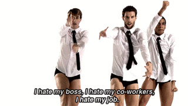

Was browsing HWZ EDMW today and saw a video that got us thinking about why we shouldn't overpay for an HDB flat.

<iframe
    width="560"
    height="315"
    src="https://www.youtube.com/embed/szf0aIXLkc4?si=CZJ_EM547I7r7SLf"
    title="YouTube video player"
    frameborder="0"
    allow="accelerometer; autoplay; clipboard-write; encrypted-media; gyroscope; picture-in-picture; web-share"
    referrerpolicy="strict-origin-when-cross-origin"
    allowfullscreen
></iframe>

We must caveat that there's probably nothing ground breaking in this video. The insights are just a compilation of advice floating around. Most of it is quite 'duh', very intuitive. The video concludes that you should buy HDBs for as long a lease as there is, or at the minimum try to buy something that lasts your lifetime. It's true, but I think you can buy cheap flats and move whenever you outgrow your existing flat.

## It was perhaps the correct move to buy a cheaper 4-room HDB

Sometimes we feel like we should've bought a 5-room flat. But things like this remind us that it was a good move to get a smaller flat first. I feel that the more important lesson is to not rely on your HDB flat to get rich. Make a financial commitment within your means. For young folks like us, a small one should do. Buy a HDB flat to live in, at a price you can afford comfortably. If you overpay, it should not be with the intention to sell at a higher price in future. It has to be for some aspect of the flat that you really (over)value.

[In a market where resale HDB houses can go for a million dollars](http://www.straitstimes.com/singapore/housing/three-hdb-resale-flats-breach-1-million-mark), perhaps not many feel this way. There's always this belief that Singapore's housing market can only go up. I disagree with this eternally optimistic view. However, my view is that BTOs do not have intrinsic value once the Government stops guaranteeing the purchase of flats under SERS. [And given the recent trend of falling prices for older flats](http://www.straitstimes.com/singapore/housing/owners-worry-older-hdb-flats-a-depreciating-asset), I'm not sure anyone should pay a huge sum of money for a HDB flat, because you're likely not getting much back. Indeed, there have been signs that [you might lose out if you see HDB homes as investment vehicles](https://www.channelnewsasia.com/news/singapore/big-read-hdb-lease-decay-public-mindset-change-homeownership-10361572).

## Control your spending for renovation as well

And of course, that also extends to renovation. I've seen people putting 70k, 80k into achieving their vision of a dream home. How much more satisfaction do they get out of pumping in all that money and sacrificing liquidity or investment opportunities? Would that Caesarstone countertop or the fully tiled bathroom really put you from the 70% satisfaction level zone to 100%? Probably not.

I guess people can get excited to own new homes and end up forgetting that they have other financial goals. For us, we try to live simply, to do without a large house, car, and other luxuries. That's why we try to build our home in the most cost effective way possible. At the end of the day, there is nothing worse than being stuck in jobs that we absolutely hate just because we need to service the down payment or mortgage. I'd hate that.

_Sad to have to stay in a shitty job just to pay your bills_
