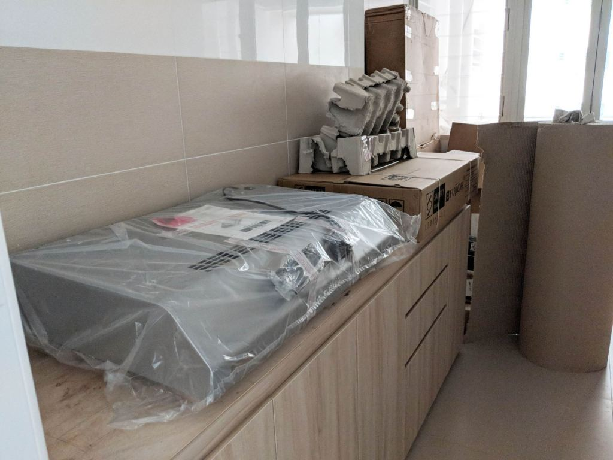
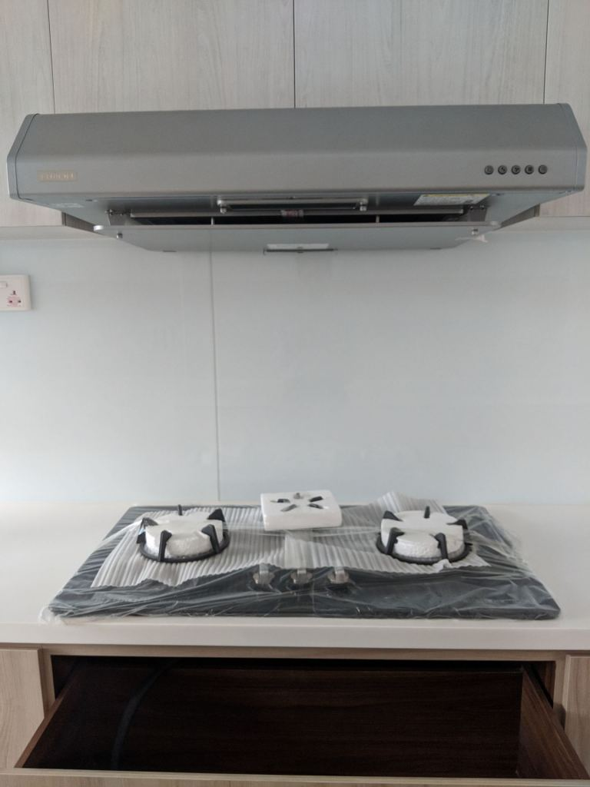
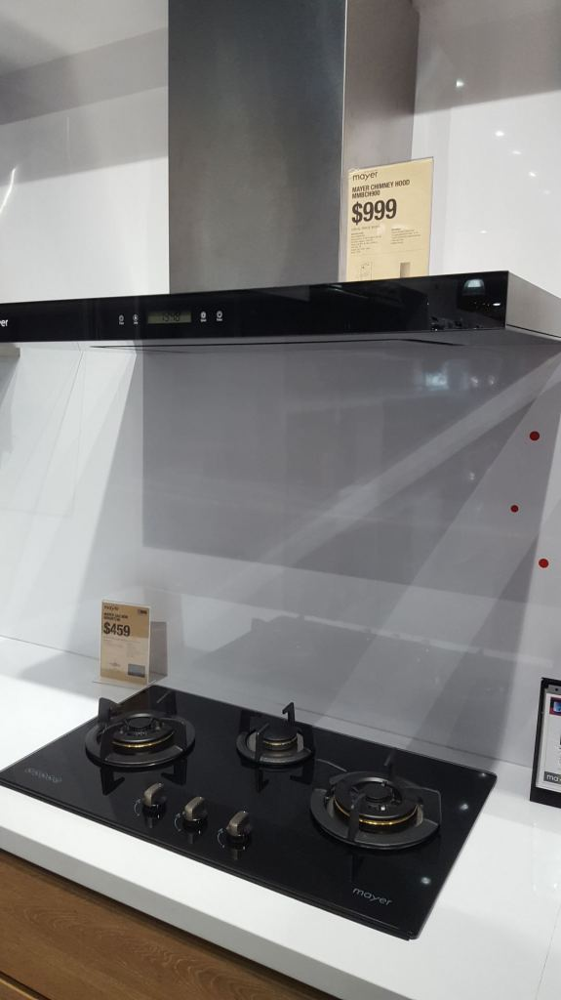

One of the things we always buy but seldom think too much about is the kitchen hood. If you're looking for a kitchen hood review, you're probably shopping for one and have encountered brands like Mayer, Bosch, Candy, Rinnai, Electrolux, Fujioh, and Tecno. Drop by an electronics or plumbing store and amaze yourself with the options on offer. There're so many brands and models that look like one another. The technical specifications are also very confusing, because they don't seem very different.

We bought a Fujioh 3773SVGL glass hob paired with a Fujioh FS890R slim hood for SGD 819 from Hoe Kee. It's not a new model. We went for it because it received good reviews online. It supposedly has good absorption capabilities, is easy to clean, and is made in Japan. That's important because it'd be a hassle to have to change the hood. Japanese quality is definitely better than the China made ones. We originally targeted the FJS900R chimney hood, but [we couldn't go for a chimney hood](https://btonomics.com/renovation/our-hdb-cabinet-design-kitchen-cabinets-wardrobe-storage-settee/) because of the way HDB designed those gas pipes. We needed top kitchen cabinets, so the chimney hood was a no-go.

## Problems with recirculating hoods

On hindsight, however, the most fundamental problem is whether anyone needs a kitchen hood in an HDB flat. There are two main types of hoods:

-   Recirculating hoods - those that filter the smell/grease and recirculate the air
-   Extractor/exhaust hoods - those that expel air out of the building

HDB only allows you to install recirculating hoods in HDB flats. This is for good reason. HDB units are too near to one another. If everyone channels their cooking fumes out of the building, the smoke will just travel into each other's homes and just mix together. Not good. It'll be worse if the fumes affect your laundry, since there are usually large windows at service yards, or bedrooms. There're some people who have asked about installing an extractor hood and putting the exhaust in the service yard. As far as we know it's not allowed. In any case, why'd you want to dirty your laundry with cooking fumes?

But the biggest issue with a majority of recirculating hoods is poor performance.

### Lousy suction

A recirculating hood works by using metal filters to absorb grease and charcoal filters to absorb odour. The air is then recirculated into the kitchen. However, charcoal filters reduce airflow by almost half. And then you realise that there's no room to put a large blower into the slim hood design. The result is weak suction power. This is typically calculated in cubic feet per minute (CFM) or cubic meter per minute (CBM).

### No air pressure difference

Because recirculating hoods don't suck air outside, they cannot create an air pressure difference. Without the air pressure difference, you cannot avoid having cooking smells and steam travelling to other parts of the home. And that's why there's still the problem of smells invading the living room even with a super good recirculating hood.

### Moisture, waste heat, and chemicals still there

A hood still recirculates steam, humidity, waste heat, carbon monoxide, and formaldehyde. So recirculating hoods can't solve bad, damp smells and health problems from chemical exposure. Indoor air quality will still be poorer than without the cooking fumes. Of course, the health risks probably aren't that big a deal. People have been cooking like that for ages, especially if you open the windows. But it's still a worthy point to note and not be under illusions. One article calls this a [recirculating toilet problem](https://www.energyvanguard.com/blog/56716/Recirculating-Range-Hoods-As-Effective-As-Recirculating-Toilets). It makes a lot of sense actually.

### Salesmen ignoring the issues

You'd probably have enough experience to know that salesmen aren't there to help you out of goodwill. They're there to sell you something so they can commission. Looking back, we're disappointed the salesmen we met didn't mention the disadvantages of recirculating hoods. Then again, of course they wouldn't! How else would they earn anything?

Unsurprisingly, we actually experienced the disadvantages above in the many shopping trips we made:

-   The salesman said the _insert branded slim hood from Mayer/Bosch/Candy/Rinnai/Electrolux/Fujioh/Tecno_ was a very powerful hood with an _insert number_ suction power.
-   We found it weak and didn't suck anything.
-   Then we realised that the suction was better when we removed the charcoal filters.
-   But the salesman would say you can't remove the charcoal filters. This made us puzzled. The hood didn't suck anything with the filters on.

This process repeated itself many times, and at times seemed like we were going through a loop, just that the shops and salesmen were different.

## Our Fujioh FS890R kitchen hood review

Since we didn't buy the FS890R for its looks, it needed to perform. It's supposed to, according to the Hoe Kee uncle. Performance-wise it's alright if you're not fussy. The correct description would be that it's quite lacklustre. It's 545 CFM at the maximum speed but that really isn't much. Having used it, we can definitely say that it doesn't help if we cook deep frying or food that is really strong in grease or smell. There's truth when Mum said a hood is pretty much useless and why it was never on at home in the past. If you're cooking seafood and expect the house to smell anything but seafood then you'll be very disappointed. You'd also get grease on the wall, counter top, and kitchen cabinet. It's inevitable when oil splatters. Sadly even a super atas hood can solve this.

_An honestly odd slab of metal._

The FS890R is far from being the prettiest. If you need pretty hoods, don't buy this. Avoid this at all costs. The slim hood is a misnomer, because it is quite thick and has a weird angular shape at the front. We chose the nicest colour available, which was the metallic gray, but none of the colours on offer really appealed to us. The dark gray version was particularly bad because it doesn't look sleek at all and looked more like an oddly shaped slab of stone. There's no big problem for the miscellaneous stuff. We don't have an issue with cleaning. When installed you do have to clean a small gap between the top of the hood and the top cabinet, but that should be standard for most hoods. The light is also useful and is standard across most modern hoods.

_This picture doesn't show it but there's a gap above, most likely to allow it to vent._

## We'd still buy a kitchen hood if we had to do it again, but...

All things considered, we don't really regret buying our FS890R. A hood is still a useful piece of kitchen equipment, provided it doesn't break the bank. It is still useful for the lighting even if it can't capture any fumes. Some efficacy is better than none. However, if we could do everything again it'd have been better if we bought a hood that's more chic. Without having done enough research, we were expecting more performance out of the FS890R. But it turns out that it's not much of an improvement over the average hood. If either way recirculating hoods don't really work well, then we should have bought something prettier instead of something that's average in performance but not ugly.

_Buying something like this, but in the built-in form, would be super good. Minus the atas price of course. This will likely be a $999 white elephant that can't do it's job that well if you bought it._

**The most important thing though, is never to spend a lot on a kitchen hood. It's never ever worth it.** Don't let the salesmen psycho and up-sell you otherwise. Not for performance. Not for a pretty design. If you're tempted to shell out top dollar, just do yourself the favour and spend the money on a nice rainshower set or an atas kitchen counter-top. Far more value for money that way.

### Our advice - get a cheap and pretty one, then think about performance

For what it's worth, an online post in the US said that it'd be good if you can buy a recirculating hood that's around 800-1000 CFM, because after you add the filter it'll drop to about 400+. This might be an American standard especially since they cook a lot of steak. But that's not very practical advice. It'll be super costly, for not much of a benefit as covered above.

Since most people nowadays either don't cook or only do light frying at best or use an airfryer/microwave/oven, it'll be best to just buy a) a cheap hood, b) a pretty hood, and c) a hood that's at least decent in performance. If you can, fulfil all 3 conditions. If not, then prioritise from a, then b, then c. Or if you really want to save the money, just ditch the hood. You don't need to feel bad about it. Our mums cooked without hoods (or refused to use it to save electricity) anyway. You still have to clean up after cooking. A little more wouldn't hurt!

