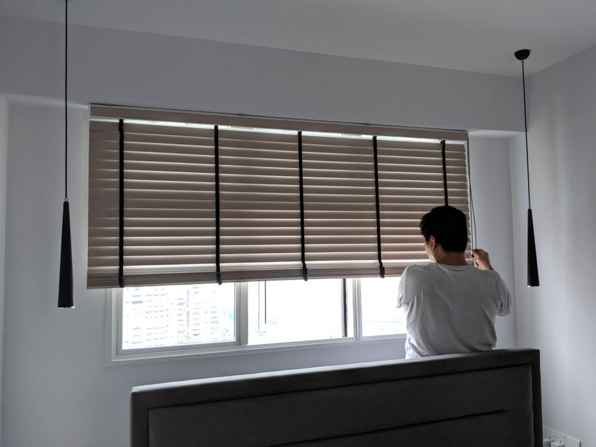

Our home is on the 19th storey. It doesn't really face any other flats directly. At least not where others can peer directly. It also doesn't get direct sunlight because it's south facing. There was no real need to get curtains or blinds to cover up the windows. But we still got one because it's prettier and we still want the option to cover up. The windows look nicer with this additional layer. Here we do our Korean venetian blinds review, which we got from [365 Furnishing Pte Ltd](https://www.facebook.com/365furnishingpteltd/) (not affiliate link).

---

## Blinds vs curtains

There're a few main options in the market when it comes to covering up your windows: roller blinds, venetian blinds, and combination rainbow blinds. The common choice is between venetian blinds and curtains.

### Roller blinds

We initially wanted to go for roller blinds, because they're cheap and seem easy to clean. But it was a bad option:

-   The mechanism can be problematic. You often have to pull the blinds several times in order to get the correct length.
-   Light comes in based on the amount of blinds you let up, and it's often all light or no light.
-   The mechanism spoils easily, especially if you're not careful and end up using too much force.
-   It doesn't look good at all. You can think of it as using a stiff table cloth to cover your windows.

 _Ikea has pretty nice roller blinds actually ([source](https://www.ikea.com/gb/en/products/textiles-rugs/curtains-blinds/tupplur-block-out-roller-blind-white-art-60349115/))._

### Venetian blinds

We decided to opt for venetian blinds:

-   They're pretty durable.
-   They can let light in selectively, adjusted to the exact amount you want.
-   They're very nice, especially when you pair them well with other wood pieces.
-   You can reach out through the blinds without having to draw it up.
-   While there might be more dust, this could be solved with a duster and vacuum cleaner.

More specifically, we opted for Korean venetian blinds rather than the traditional ones (where you pull 2 pull cords, one to control up-down and the other to control the angle of opening). The Korean ones are significantly more convenient, but more expensive. There is only one pull cord. You pull in one direction and the blinds lower > open > lower > open, and so on. You pull in the other direction the blinds retract > close > retract > close, and so on.

### Curtains

We were briefly tempted by curtains, because they're cheaper. But we found that:

-   The curtain rod is pretty ugly and it's an waste of money to install curtain pelmets just to hide them.
-   They'd be hard to wash and dry especially since we aren't going for a dryer.
-   Dust on the fabric could trigger allergies and sensitive noses.
-   The fabric just becomes dirty in general.
-   They're not really pretty to us. Looks quite opiang.

 _Ikea's blackout curtains actually look pretty good ([source](https://www.ikea.com/sg/en/catalog/categories/departments/living_room/10700/))._

### Rainbow blinds

Finally, there're also combination rainbow blinds, which seem to be good at blocking out dirt and insects. But:

-   They are ugly.
-   They will restrict the airflow, as they are similar to the mesh design in mosquito nets.
-   It'll be quite troublesome to clean them when they get dirty.

<iframe
    src="https://www.youtube.com/embed/SddPHOrSBTc"
    width="560"
    height="315"
    frameborder="0"
    allowfullscreen="allowfullscreen"
></iframe>

---

## Who we bought from

There're quite a few sources locally. You can get your stuff from Ikea. They've roller blinds and curtains. We wanted to get our venetian blinds from them. But there have been some reviews online suggesting that their stuff don't last. We can't confirm it. But we found that the prices weren't that cheap and therefore looked elsewhere.

### Taobao

If you're tempted to buy them from Taobao, our advice is: don't. Their blinds aren't very cheap. We went to get a quote from a seller, all-in the quote for the living room and 3 bedrooms would've cost around SGD 700+. This was excluding shipping. It doesn't include warranty, so it will be super problematic if we needed a replacement (e.g. blinds damaged during shipping). That's not very cheap especially considering that you've to drill holes and install it yourself, or engage someone else to do it for you for a fee.

Which brings us to our second point. It's damn hard to drill accurately and properly. You can easily estimate and drill wrongly, which will be super ugly when the blinds are not level. For BTOs, the wall you'll be drilling on is also damn hard, so you'll need specialised equipment (powerful drill). In short, unlike [lights from Taobao](https://btonomics.com/shopping/how-to-buy-lights-from-taobao/), it's a big hassle for little savings.

 _That's how you'll feel when you drill the holes wrongly._

### JB shops

If you're tempted to buy from JB shops: better not. JB shops are liable to [change their prices and quote you more](https://dayre.me/yianchyi/DSqgZMu3Ih). They're not that much cheaper and not worth it if you factor the risk involved, especially since curtains are a bigger ticket purchase relative to other smaller stuff you can buy in JB. If there are any problems you have to reach out to them, and it's way more inconvenient if you need to repair more complicated stuff like venetian blinds. If you really must buy from JB, make sure you do your homework and get a trustworthy shop.

### Garvin Marting Services

So we had to go for a local shop. We found several options online, like Curtain Boutique. One guy we kept seeing pop up on Renotalk was Vincent from Garvin Marting Services. People don't even bother to pass his contacts anymore. They just say google this guy. He seemed to have competitive prices and very good after-sales service. However, we were quite disappointed when we contacted him when we were about to get our keys. Vincent said to contact him after we had the keys and he will do the measurements thereafter. He didn't appear interested because typically companies would try to keep the relationship warm in anticipation of a sale in future. He didn't want to commit to a rough pricing. That didn't start right. We didn't think that was suitable for us, because BTO pricings should be pretty straightforward and we weren't looking for anything special, just a ballpark figure. In addition, as someone on Renotalk [pointed out](https://www.renotalk.com/forum/topic/77349-vincent-lim-garvin-martin-services-for-curtains/), there were many posts sharing the contact but no reviews, which casts in doubt the authenticity of those sharing the contact. He was an easy choice to eliminate.

---

## Choosing 365 Furnishing

### Getting recommended

We turned to a recommendation, which was 365 Furnishing. They apparently offered good prices, had very good reviews, and had good service. We went to check out their Facebook page and initially thought they must be a scam. They only had 5-star and 4-star reviews. Many companies nowadays buy "likes" on Facebook to appear more legitimate, but you usually can tell that the 5-star reviews are those from far-flung countries that have no relation to the company. But 365 Furnishing's Facebook page surprised us, as the reviews mostly looked genuine and from local names.

 _This is a screenshot we just took. 118 5-star and 6 4-star reviews. You'd think that they'd at least have 1 disgruntled customer, but they don't. It's really quite unbelievable._

We decided to check the store at the Primz Bizhub in Woodlands. It's quite an ulu place, but we cycled there on oBikes (yes back then we were still avid oBike fans). We spoke to Danny, who was pretty good. The prices he gave were competitive, especially after their Chinese New Year SGD 88 off promotion. But where he was among the better people we've liaised with was his "no agenda" attitude. He gave many recommendations, each of them frank in his opinions. For instance, we asked him about VOC levels if we were to get PVC blinds after indicating that we were considering PVC blinds for the lower prices. He was very frank to say most PVC blinds would emit some kind of VOCs, even though doing so risked me just leaving without a sale. We thought that was the way to do sales, to be frank and put the customer first. No sugar coating, just the truth.

### Signing up

We opted for the Korean venetian blinds rather than the PVC ones. The price difference wasn't much. We signed up and paid a SGD 300 deposit. They only have cash or NETs though, so we couldn't accumulate cashback with our OCBC 365 card (no pun intended lol). That's probably how they keep prices low.

This process of choosing happened while renovation works were ongoing. The next step to do site measurements would only take place much later, when renovation is almost done. People usually do up their blinds thereafter so your blinds don't get super dusty and dirty.

### Site measurements

We scheduled site measurements right after our house was ready. It was a little too late in hindsight. The measurements should've been taken midway through, so the blinds would be ready once Rooot Studio handed the keys to us.

Aaron from 365 Furnishing came to do the measurements. We got Shao Jie to select the colours. It was a really easy process! Just sit back, he chose the colours, and then we said ok. Because they were really great choices. Another reason why you should go for an ID, just in case you have bad taste for colours haha.

We took up light beige blinds to match areas where the wall was white, and for the dresser area and the spare room we took dark brown.

After selecting, it was around a 2-week wait for the factory to manufacture the blinds (it's custom made) and shipped to Singapore for installation.

### Installation

Installation was straightforward. The guys took 20 mins from start to finish.

 _The blinds which were packed in bubble wrap and transported._

 _The drilling of holes to install brackets._

 _The guys then test it. After that it's all done._

The quality of the Korean venetian blinds is good. They're made of real wood. They're very lightweight. Water doesn't damage them either, as long as you let them dry. This is a big plus for us because our home is always very cooling, and we hardly turn the aircon on. It sometimes rains at night while the window is on, so the blinds sometimes get splashed with water. Compared to PVC blinds, the price is not rock bottom cheap. But the quality is definitely up several notches. So we definitely recommend it. The mechanism is also really easy to use. We don't have to pull two pull cords to raise/lower the blinds.

### Slight problems

The true test of customer service is whether the shop is responsive after you have paid up. Too often, sellers go missing after their customers have paid up fully.

We realised that there was a slight tear in a few pieces of the blinds in the MBR. We were not careful enough to find that after the blinds were installed. It was more of a cosmetic rather than a functional problem, because the slight tears didn't affect the handling and operation of the blinds. But it was not very nice.

### Rectification

So we texted Danny. We feared that there might be problems since we already paid up. However, he quickly said they'd do a replacement, i.e. get the factory to manufacture new pieces and arrange another appointment to come down to replace it. That was impressive after-sales service. It's unrealistic to expect that you'll catch every single defect before you pay up, because oftentimes you wouldn't know what to look out for - sometimes it might be a loose handle, other times it might be chipped blinds. It's therefore super good to buy from sellers who give good after-sales service, so you wouldn't worry about getting stuck with a lemon.

Aaron came over to replace the blinds on a weekday evening. He also taught us how we could change it ourselves in future as well. In addition, he was very helpful in explaining to us how we could rectify some minor issues (e.g. natural scratches in the blinds since they were real wood). Because we were just hovering around, we could tell that he was meticulous in handling the blinds. He took care to make sure the blinds didn't scratch the walls.

---

## Overall verdict

In short, 365 Furnishing is a really great place to get your blinds from. We have been very happy with them. They really are as good as it gets. You may get some stuff marginally cheaper from Taobao, but the quality and warranty they offer is much better. Top notch.

