Here's our Taobao bomb shelter racks review. The bomb shelter is probably good for hiding when it's wartime and there's shrapnel flying all over the place.

But if you've a bomb shelter, you'd know the bomb shelter is good for everything but being a bomb shelter. In peacetime, it's useful for very mundane storage reasons.

Store food. Put a vacuum cleaner. Stash random crap inside. For those purposes, you'd need a rack.

Maximise the storage space in that small, cramped room. That's why everyone needs a bomb shelter rack.

## People generally buy expensive boltless racks locally

Something we don't understand is why people pay a premium to buy boltless racks. The advantage of boltless racks are usually that:

-   They're configurable, with the shelve height easily adjustable
-   They're easy to assemble

But most people don't even adjust the height of their shelves because it's just used as storage space. Imagine having to move everything out just to adjust the height and then move everything in again. Your ah ma or mother will scold you for making the whole place dusty. Tsk.

And no one assembles the racks yourselves if you're buying boltless racks locally. So it's pointless if it's easy to assemble.

### Boltless racks are expensive

No kidding, boltless racks are quite expensive. They're around $200 plus. That's fair, because the design is more complex and retailers do have to earn. They use plywood or particle boards for the shelves, which are fairly durable. But expensive nonetheless. And wood materials can rot when there's moisture in the air. So we weren't too keen on that.

### Neighbourhood spam

If you're in neighbourhood Whatsapp or Facebook chats ([like how some often like to spam referral reviews/links](https://btonomics.com/general/15-types-neighbours-hdb-whatsapp-facebook/)), then many companies would sound familiar to you because people share them so much. Boltless Racks, Racks.sg, Yee Sin, etc. Free delivery and assembly, but those racks are like $200 for 1 set. We found them so familiar because the promotions kept popping up. Super spammy.

Don't get influenced.

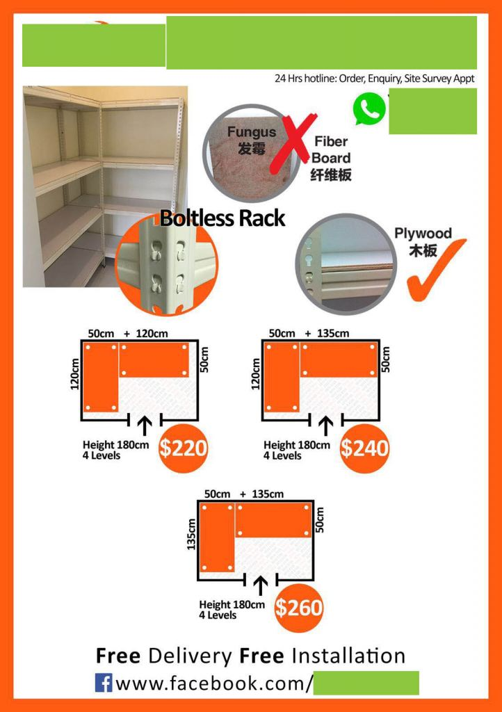 _Censored the company's contact details, but this is an example of the racks. Quite expensive we must add._

## Buying bomb shelter racks from Taobao

We wanted to save money, so we bought our bomb shelter racks from Taobao via sea shipping.

The purchase was simple.

We found the racks via a simple search. The [top selling rack](https://item.taobao.com/item.htm?spm=a1z09.2.0.0.49962e8dfdfAXm&id=523758752061&_u=q2m1h1uh48d2) was around $36, excluding shipping. if you include it it'd be around $46 per rack, with 5 shelves. 5 frigging shelves! That's like half the price of a local one, with the shelves all metal! But we'd advise you not to click though unless you're sure you can handle crappy items - read till the end of our review.

We measured our bomb shelter, placed the order for 2 racks, and that was it. The whole process was kind of how we described in our [budget Taobao shipping guide](https://btonomics.com/shopping/how-to-buy-and-ship-from-taobao-to-singapore/). Simple.

Anyway, the seller's pictures looked pretty good. The reviews seemed real and good.

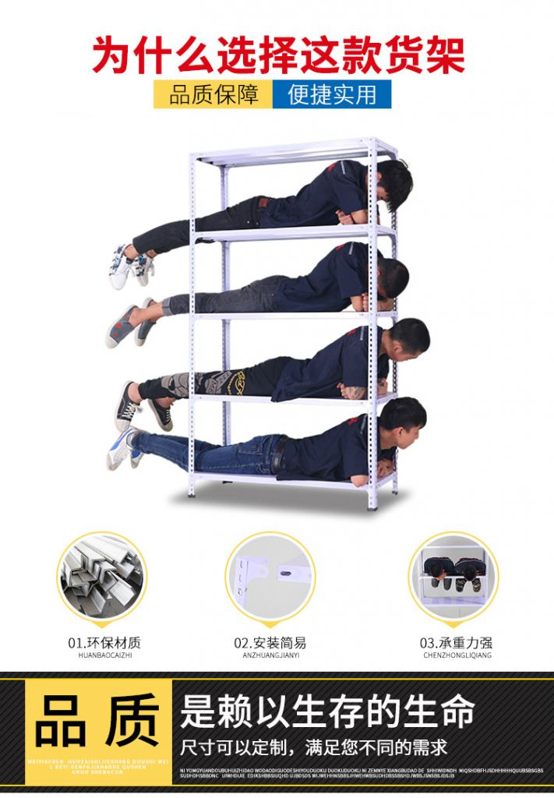 _Pretty cool marketing in a way only China and the Chinese can do - throw people at an item. Holy shit this could take 4 people's weight! Full grown men some more._

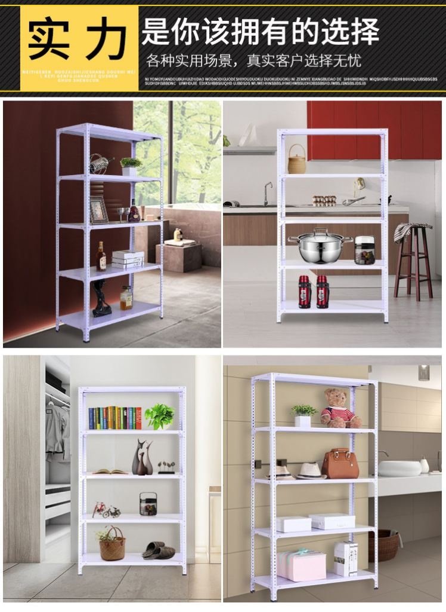 _The rack didn't look half bad to be honest. Anyway it's in the bomb shelter, no way that anyone would go inside and scorn at you even if they found it ugly._

The bomb shelter racks were very heavy, so you definitely should ship them only via sea shipping.

## Getting the racks

The packages should have been like that:

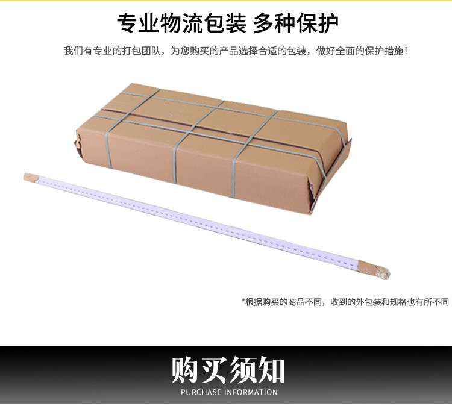 _How the package should've looked like._

In the end what we received was very similar:

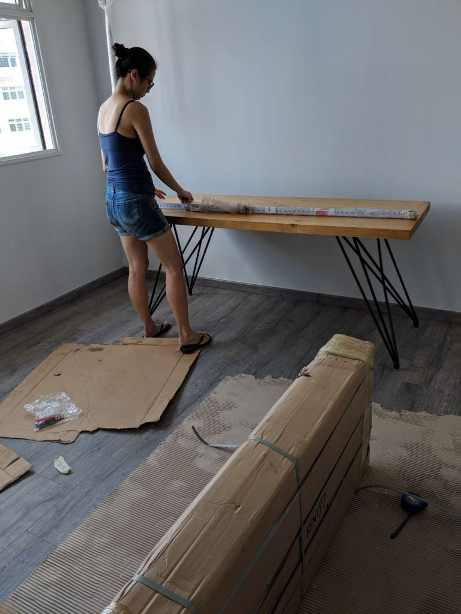 _Wrapped tightly in cardboard. There was a lot of bubble wrap for the legs as you can see in the upper half of the picture._

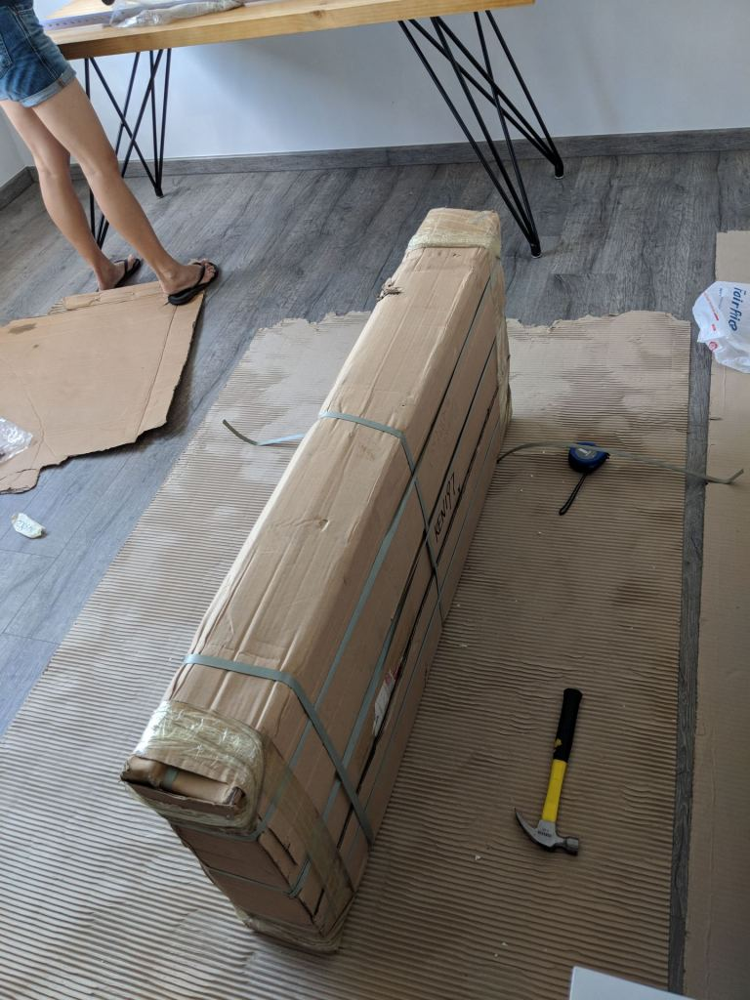 _The strings were damn hard to remove because we didn't have a pair of scissors on hand. Protip - remember that pair of scissors._

We peeled away the packaging and the result shocked us. It was bad. Really bad.

We bought 2 racks. Both were rusty, dented at many places, bent, and full of scratches. It was a fricking nightmare.

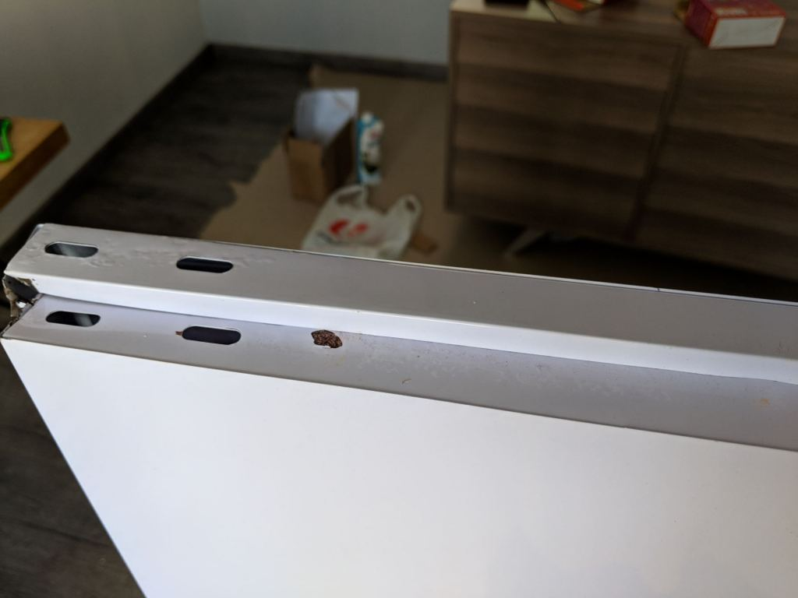 _Check out the peeling paint and the rusty part where the metal was exposed._

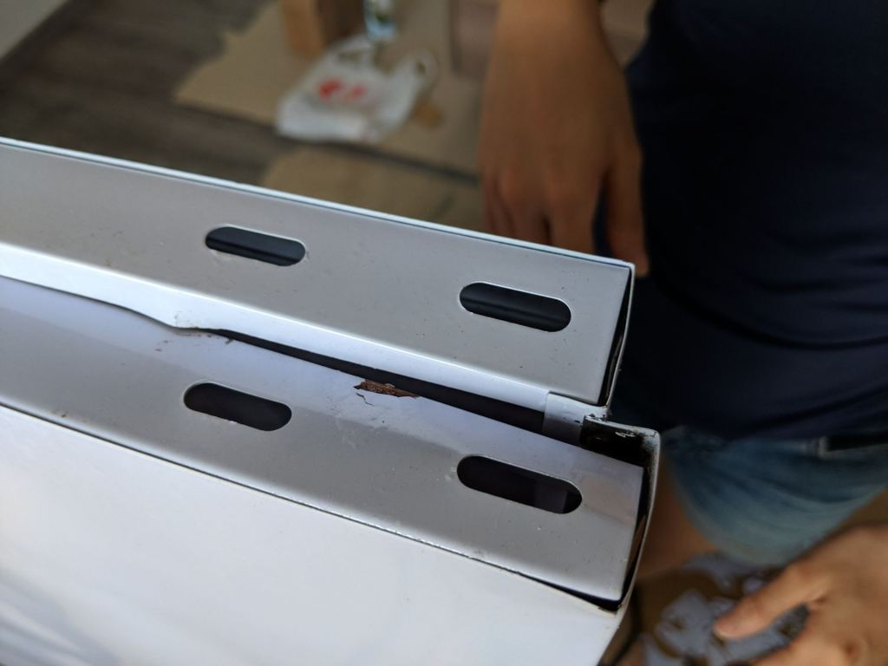 _It was the same for the other one. The rack was badly bent out of shape and where the metal was exposed, it was super rusty._

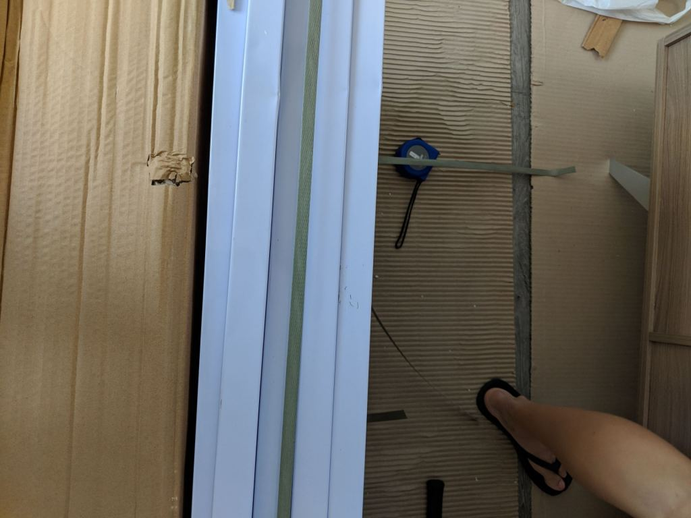 _The shelves on the racks were also bent at multiple places, truly the shittiest product you can imagine._

### Those damn racks!

We complained to the seller, who very generously refunded us RMB 2 for each rack. Just in case that wasn't obvious, the previous sentence was a sarcastic one. The seller said it might've been the weather, that's why the racks rusted so badly. Also, he said the racks were bent because of shipping. At this stage, we were like \*\*\*\* it, whatever. Obviously he was lying and the racks were just a giant pile of crap shipped over the oceans and seas to reach our suburb home in Bukit Batok.

But we weren't going to ship those lemon racks back. We were going to make it work and use it, however shitty of a product it was.

### Assembling the bomb shelter racks

So we started to assemble the bomb shelter racks.

Protip - get an electric drill with a screwdriver head attached, it makes your life much easier when you screw or unscrew the bolts that lock the shelves and structure into place.

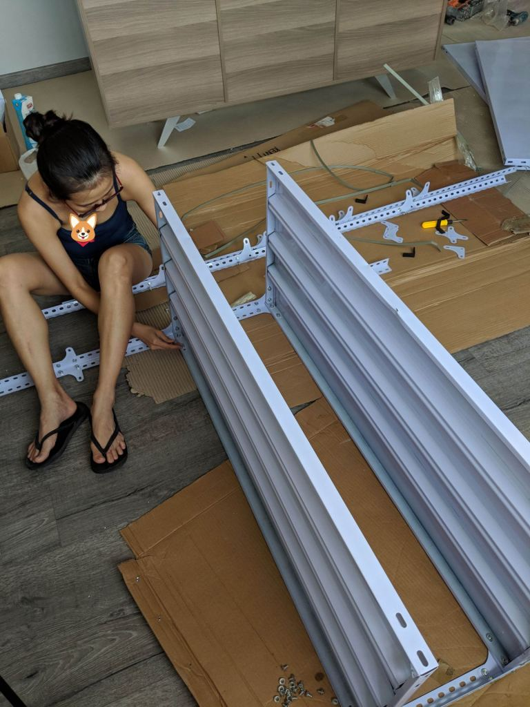 _Assembling the racks wasn't hard at all, just manual work that was very time consuming. The L shape pieces were the links between the shelves and the stands, and they were held together by bolts._

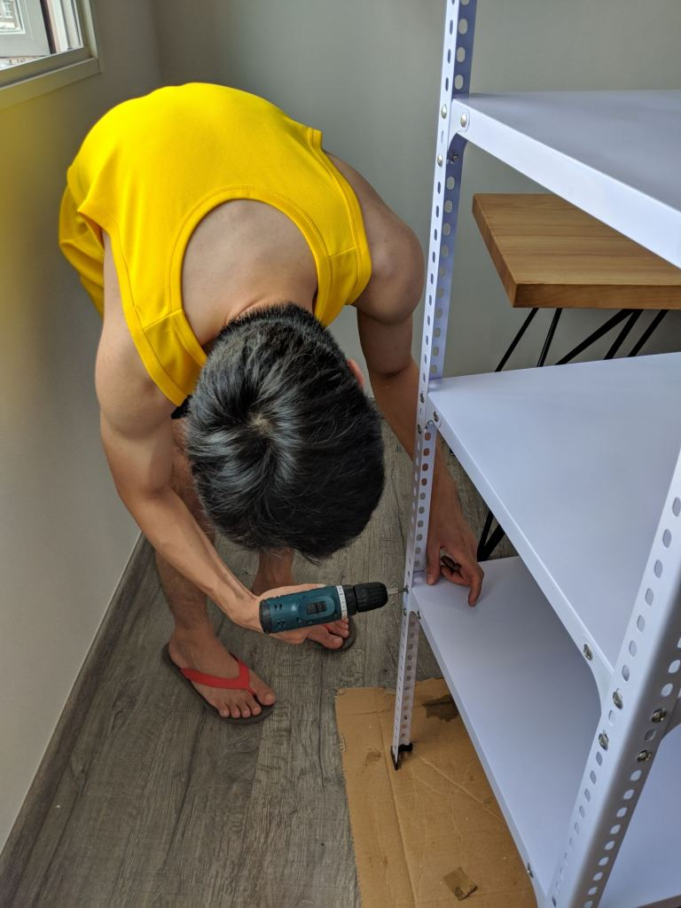 _The electric screwdriver was a godsend._

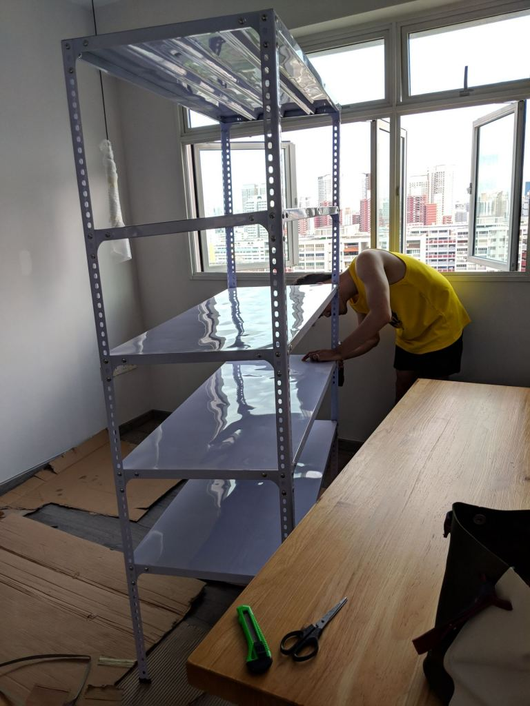 _More screwing. You can tell that the top is wider than the bottom and the overall structure is kind of imbalanced._

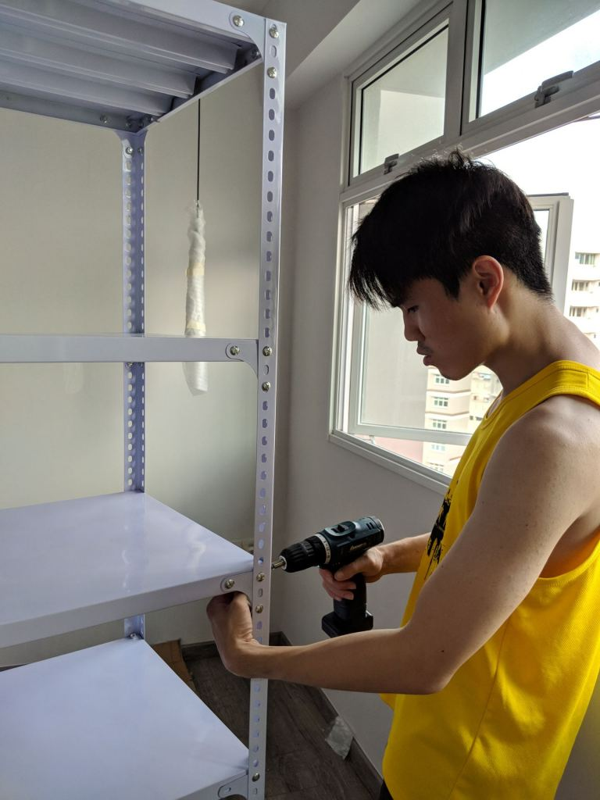 _Never ending screwing. At this point we felt like maybe boltless racks were the better idea._

## End result

The end result wasn't that bad. It was a bit slanted for whatever reason, but they have held up even when placed into the bomb shelter. They also fit well on both sides of the shelter.

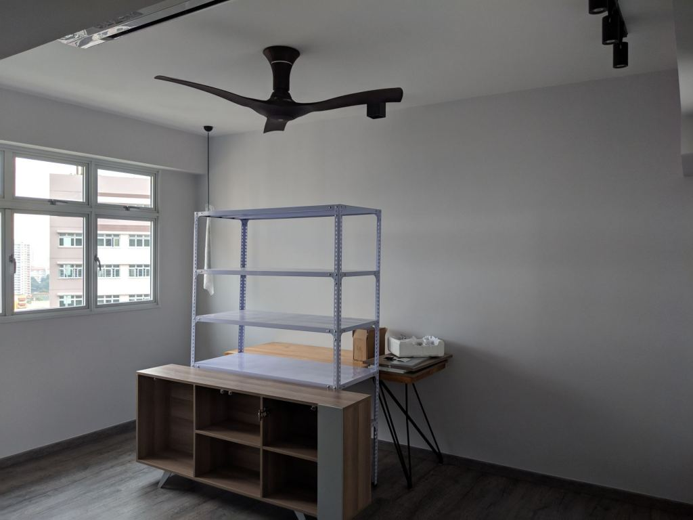 _Pretty normal looking, that's if you don't look closely._

On hindsight, it's serviceable. No one really goes looking for bomb shelter racks that's super pretty or has many features. A lot of times the claims to be boltless or super sturdy are just marketing gimmicks.

You don't need the best bomb shelter racks. You need the cheapest. Something that withstands the weight of the stuff placed on it. You need something that doesn't crash. That's all you need.

Anyway, it's up to you whether to buy bomb shelter racks from Taobao. The quality is obviously suspect, but the price is so cheap. You could buy several bomb shelter racks from Taobao for the price it costs from a Singaporean supplier. Ours is still holding up after 4 months of use, which has been a bonus.

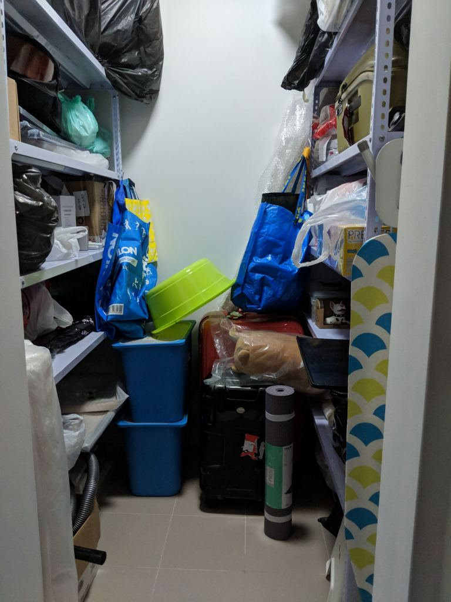 _They fit very well in the bomb shelter. From the amount of stuff we throw onto the racks, they do hold up quite well. Despite being dented, bent, and scratched._

We'll use it until the damn thing rusts all over, then chuck it... and probably buy another one from Taobao. Call us suckers for a good bargain.
