## Intro

Next up is really to explain the process for getting ceiling fans for a BTO. When it comes to ceiling fans, there seems to be two camps. One says that ceiling fans are hard to maintain or they're not very nice. The other can't live without ceiling fans. PQ doesn't really mind either way, whereas I am more of the second. We opted for ceiling fans eventually because we weren't getting an aircon unit in the living room and ceiling fans are way prettier than the standing fans or wall mounted fans that some like.

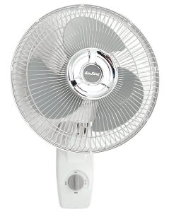  
_This is a no-go. Kind of reminds you of those fans in public toilets ([source](https://www.amazon.ca/Air-King-9012-Commercial-Oscillating/dp/B000CQTG98)). Get a ceiling fan instead._

## Brands

If you're low SES like us, you'll tend to be getting ceiling fans for a BTO among popular brands like KDK, Fanco, Elmark, Crestar, and Amasco. If you're high SES like Crazy Rich Asians, then you're looking more at atas brands like Big Ass Fans' Haiku and Aeratron's Aerohaus.

KDK used to be Japanese owned until they got bought over by Panasonic. The rest seem to be local companies. To us, we really wanted KDK fans for their reliability. If you look around, most places with heavy ceiling fan usage use KDK. We didn't realise it until we really started to look, that red logo probably was hard to notice when the fans are always spinning!

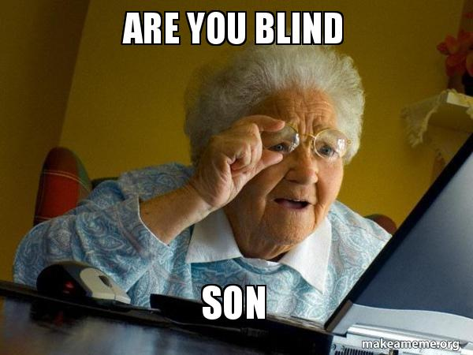

Although some have been complaining about KDK fans not being as reliable as before, they still seem like the most reliable around. Elmark and Fanco seem quite hit or miss based on online reviews. [People have complained about Fanco's questionable sales practice when LED lights spoil](https://forums.hardwarezone.com.sg/eat-drink-man-woman-16/%5Brant%5D-beware-fanco-ceiling-fan-5994034.html) - very expensive and you must pay them to come down to fix it for you.

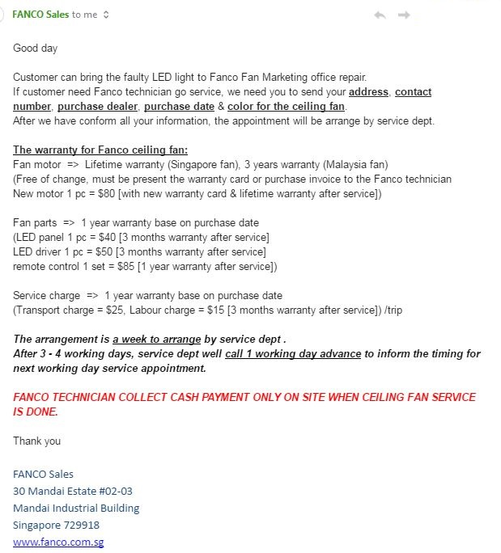  
_Someone's LED light spoilt and Fanco told him that they must go down to replace it, and the guy had to pay for many additional costs ([source](https://forums.hardwarezone.com.sg/eat-drink-man-woman-16/%5Brant%5D-beware-fanco-ceiling-fan-5994034.html))._

Crestar is something we're using in our current home and it works very well, but the trade-off is on design.

There're guides that say you should buy original and buy expensive. It's the easiest advice, it's often sponsored, but it's not the one that'll save you unnecessary money. Although "high quality products aren’t afraid to show what they are made of", [there're unhappy customers who bought expensive Aerohaus fans and regretted their huge purchases](https://www.renotalk.com/forum/topic/73453-avoid-aeratron-ae3-fans-at-all-cost/). If you ask us whether a $600 fan is worth the money, you'll get a straight NO from us. It's just not worth it to spend a bomb for a designer fan, but end up having to admire a circle formed by 3 rapidly spinning blades. Worse still if the price tag isn't justified by the superior quality or customer service they usually claim. At the end of the day, companies outsource much of their manufacturing. Appliances are often hit-and-miss affairs. There's no guarantee your items will be in perfect condition.

## Design

When you talk purely about design, nothing beats the Haiku. It looks like something a designer drew up - something outlandish - and made it into a fan, rather than a fan that was drawn up and adjusted by a designer. The Aerahaus is not too far behind. If you've the cash to burn, these are totally the fans you'd want to buy.

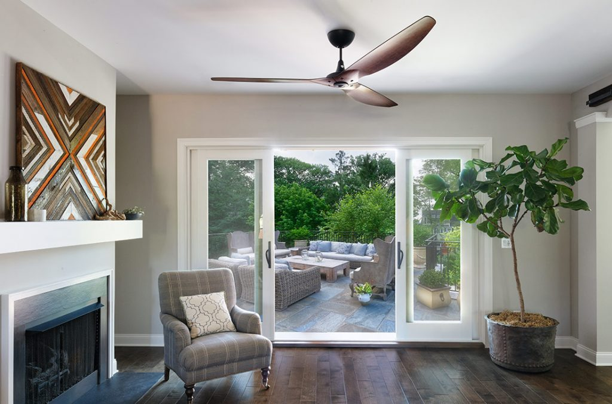  
_The Haiku is a thing of beauty, but probably not when your wallets are empty ([source](https://www.haikuhome.com/fans/haiku))._

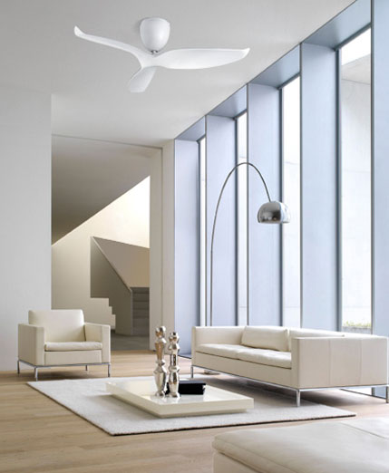  
_The Aerahaus is not too shabby either ([source](https://aeratronaustralia.com.au/))._

But we don't have unlimited money, so we didn't even consider those two options. KDK has had pretty bad designs over the years, it's not surprising that they haven't been a favourite among designers.

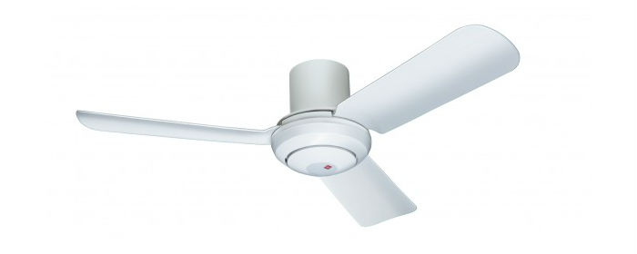  
_This KDK fan won't win any awards for design ([source](https://www.lazada.sg/products/kdk-r48sp-ceiling-fan-with-remote-control-white-i6099084-s7677305.html))._

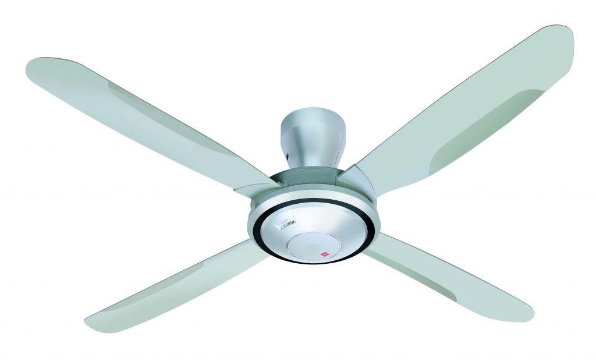  
_This V56VK looks better, but still lacks compatibility with the typical modern- or Scandinavian-themed home ([source](https://www.lazada.sg/products/kdk-v56vk-super-deluxe-remote-ceiling-fan-i6167741-s7772371.html))._

Still, KDK's recent designs have seemingly been quite alright. On the Singapore and Malaysian markets, one model in each has stood out.

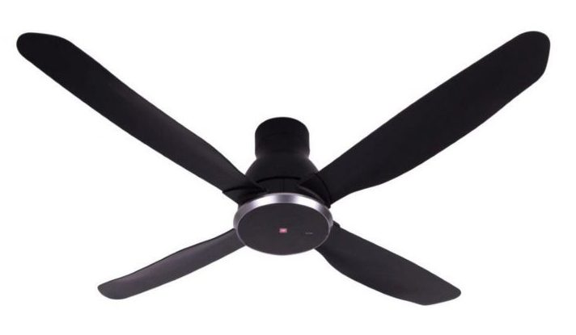  
_The W56WV looks great for KDK standards on our side of the Causeway ([source](https://www.courts.com.sg/kdk-w56wv-bk-140cm-ceiling-fan-4-blades-dc-motor-w-remote-ctrl-ip123840))._

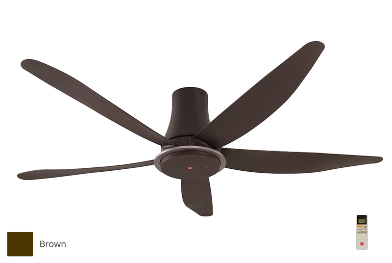  
_On the Malaysian range of KDK fans, the K15YX-QBR looks the best ([source](https://www.kdk.com.my/product/k15yx-qbr/))._

In short, KDK fans can be at least serviceable in their looks, if you choose the right one. Or if you're not picky, then just get any model. People don't usually nitpick fans, which is why you got so many monstrosities with hardly any negative comments.

### Retractable fans?

In the last few years there also has been a craze with some Taobao fans that can fully retract their blades when not in use. It's quite gimmicky and ugly when you look at it after some time. But if it works for you just get it, especially if you want to save ceiling space and hardly use the fan. An example of a retractable fan from an Australian company, which you can also get from Taobao:

<iframe
    src="https://www.youtube.com/embed/bah6DVNxGyQ"
    width="560"
    height="315"
    frameborder="0"
    allowfullscreen="allowfullscreen"
></iframe>

### Lights or no lights?

Another choice to make is whether to go for a fan that comes with a light source in the middle. We agreed with Shao Jie when we were discussing the design of the home. No offence, but such a look to us is opiang and ugly. If you get it, it's purely for functional rather than aesthetic reasons. To be honest, there's no need for a light on the fan, because you can replicate the light source elsewhere in the form of down and track lights.

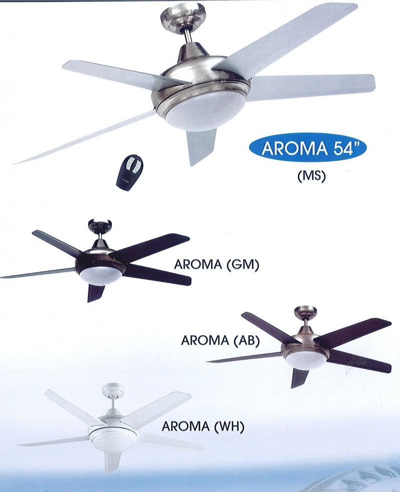  
_These Fanco ceiling fans with lights are already the better ones, there're worse ([source](http://www.tlcled.com.sg/product-catalog/ceiling-fan-light-kit.html))._

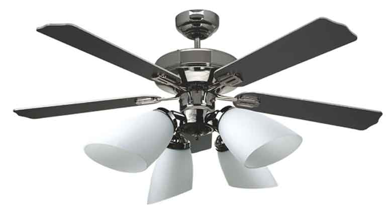  
_Where possible just avoid these, there's just no scenario where you need these lights that aren't even very useful in the first place ([source](https://www.fortytwo.sg/household-appliances/fans/ceiling-fans/fanco-2000-52-fan-ffm2000.html))._

## Specifications

### Size and positioning of fans

In general, the size of the fan depends on the size of the room it will be in and personal preferences. Ceiling fans typically require at least 2.3m from the floor to the blade, which means ceiling fans are quite situational in an HDB BTO (roughly 2.6m from floor to ceiling) if you've tall occupants.

-   Walls/cabinets to fan blades should be at least 60cm, although some recommend 1m or half the total width of the fan.
-   Ceiling to fan blades should be around 20 to 30cm.
-   Lights to fan blades should be at least 1m.

It's a pity that we couldn't install a fan in the dresser area, because our casement wardrobes would block the operation of the fan. We even considered the Fanco mini-bee, which was ugly but still cute in its own way. But we eventually heeded the advice not to have a fan there. We'd just use a short standing fan when needed.

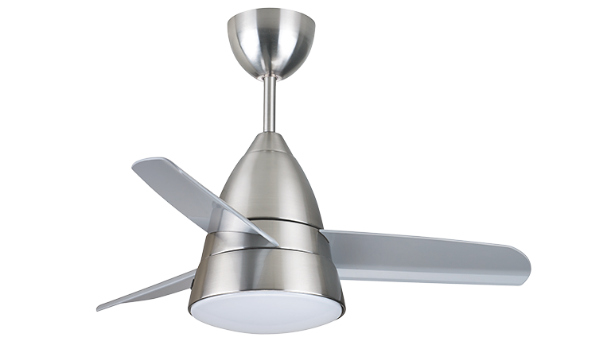  
_The Fanco mini-bee, which is the only fan with light that we'd consider because its really cute in an ugly way ([source](https://www.fanco.com.sg/mini-bee-36/))._

For HDB homes, you _must_ get the short pipe version of ceiling fans. Short pipe just refers to the part of your fan that extends from your ceiling being the shorter variant. Long pipe versions are what you typically see in canteens and coffee shops.

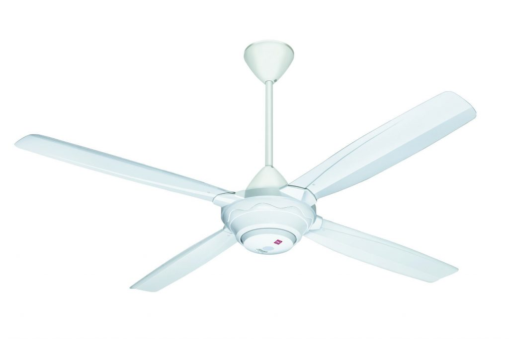  
_This is a long pipe fan. Not what you want for an HDB home ([source](https://superstore.com.sg/collections/ceiling-fan/products/kdk-m56sr-ceiling-fan-with-wireless-remote-control))._

### AC vs DC motor

Another choice is to determine whether you want a fan with an AC or DC motor ceiling fan.

#### Pros of getting a DC motor ceiling fan

-   Lower energy consumption, some sources say up to 70% less than an AC motor fan.
-   Quieter, and in most cases really quiet.
-   More options for speed and usually has the ability to reverse direction. Reversing direction is really good to circulate the air when you've the aircon on.
-   Faster to start, stop, and change speed.
-   Motor is smaller and lighter, which makes a slimmer design for the motor possible.

#### Pros of getting an AC motor ceiling fan

-   Cheaper than DC motor fans, which is unlikely to be recouped because these fans don't use much electricity anyway.
-   Can be controlled by controller on wall, the old school chord mechanism, or remote, as opposed to DC fans usually offering you the remote option.

## Places to buy ceiling fans

Like with most stuff that you see on this space, there're three options. Local stores, JB, and Taobao. The key choice to make in my opinion is between buying local or buying foreign (JB or Taobao). Installers or shops usually charge a separate fee for installation, so that's a job for your ID, contractor, or installer to handle regardless.

### Buying local

There's probably no real need to cover the different shops carrying KDK fans, these are everywhere. We'd just say that it seems cheaper to buy fans from electrical shops (not lighting shops). That said, we thought Hoe Kee's prices were also quite reasonable and it'd probably be better to buy from a reliable shop rather than lighting shops.

When you buy fans locally, you get warranty for the parts and motor. The motor is typically at least several years of warranty, and in the case of KDK and Fanco it's for lifetime (usually means product lifespan, not your lifespan). Most of the time you'd still need to pay for the transport when the technicians come over to help you troubleshoot and fix the fan. But it beats having to pay people to disassemble the fan for you to bring to Malaysia, and then you've to pay again to install the new fan.

### Buying from JB

Buying from JB saves you around half the price, based on online comments. It's not directly converted from RM to SGD, but savings can still be hefty if you buy multiple pieces. For example, the W56WV in Singapore can retail for about SGD 320 at Hoe Kee, while its equivalent K14ZW is sold for about RM 500. With the recent weakening of the SGD versus the RM, it's around half the price.

Models that're available in Singapore might be different from those available in Malaysia. Interestingly, Panasonic models in Malaysia are the same as KDK. They share the same parent company and therefore the same technology.

#### Warranty

Warranty is quite tricky for fans bought in Malaysia. We did research on KDK and some said the Malaysian-made fans are lousier in quality. If anything happens, you need to bring it back to the shop to see if they can help with warranty claims. It also seems like KDK Malaysia is quite strict on claims for the short pipe version (which they probably take to imply that the buyer brought it to Singapore). [They generally don't honour](https://forums.hardwarezone.com.sg/111197196-post2821.html) warranty if you don't have a Malaysian address to file your claim and they will say that any fan brought out of Malaysia automatically voids the warranty. It's probably best to assume that there's no warranty and when the fan breaks down, you change a new one.

#### Shops

There're 3 shops in JB that people typically go to to get fans:

-   Yes Electrical
-   Tampoi Lighting
-   Starworld Lighting

It's best to check with the shops before you head down. Prior to heading down I tried to Facebook message them, but only Yes Electrical replied. We eventually Whatsapped him and he gave me suggestions and replied with prices. He was super friendly. Yes Electrical is also most accessible if you don't drive, because it's at Jalan Serampang and opposite Dgio Bridal Cafe (which was the shop we engaged for our pre-wedding photoshoot). It's about 5 to 10 mins by Grab or taxi from the customs. After shopping you can head to Dgio for an awesome breakfast set, their eggs wrapped in bacon is to die for! Just remember not to walk on the streets, even during the day. We heard from our makeup artiste 1.5 years ago that there were robberies in the vicinity and in daylight.

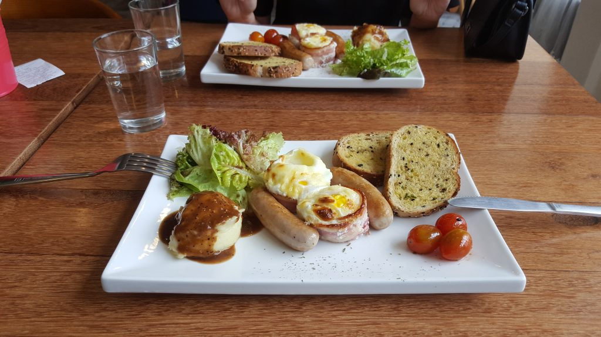  
_An early reward for having to lug the heavy fan back across the Causeway._

Do remember to get the ceiling brackets and hooks from the shops, they often give it free of charge out of goodwill but sometimes you must pay. See face la, it's roughly RM 3 if you do have to pay.

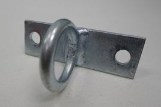  
_Remember to get this ceiling hook if you buy KDK fans in JB._

#### Paying GST

When you come back, it's time to be taxed for GST. Keep the invoice that the shop issues to you handy. Our experience may be different because we came back via bus and hand carried the damn fan up the KSL shuttle bus and 170. The booth to pay GST is right beside the x-ray machine for bags. The magical number is SGD 150. If you exceed more than that when you divide the total value of the items by the number of people, then you've to pay GST on the amount you exceeded. For example, if you buy 2 fans worth SGD 300 and it's just you, you need to pay 7% GST on the SGD 150 excess. If there're 2 of you, you don't need to.

Avoid cheating the customs people. It's just not worth it just to save several dollars.

### Buying from Taobao

The last option is really to buy from Taobao. [You can only buy fans via third party forwarders](https://btonomics.com/shopping/how-to-buy-and-ship-from-taobao-to-singapore/), and you'd want to use sea shipping because these boxes are heavy and large. Like buying from JB, you don't get warranty easily. If you want to claim warranty for more expensive parts, you'll need to send it back to them, e.g. the motor has to be shipped back. Not worth the money and effort. For stuff like remote control or blades, if there's an issue they'd ship it to your third party forwarder's address without question and you'd just have to pay for shipping back to Singapore. It's relatively more troublesome than buying locally and slightly so than JB.

The advantage is that you get stuff that's drastically cheaper across all price ranges. For a simple fan that seems to have been inspired by the Haiku, the going rate is about RMB 400, or slightly more than SGD 80. If you add shipping of around SGD 10, it's still only SGD 90 for the fan.

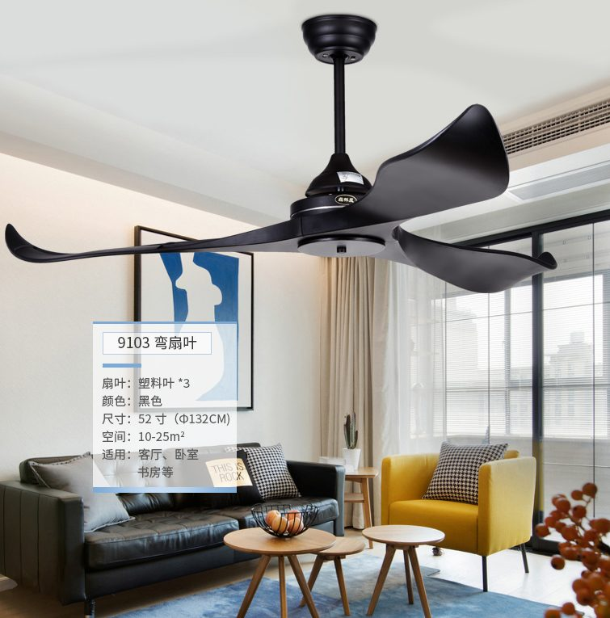  
_A fan like this at SGD 80, excluding shipping which will probably be around SGD 10, is an absolute steal._

A more expensive fan would set you back by more. There're high end ones that cost around RMB 700, which is almost SGD 150, but these are typically better designed ones that are gunning for overseas customers. These are still very cheap though. Although it's true that at this price point you could pay more and get a Fanco or Elmark fan for their local warranty and similar designs, it's still more worth it to buy it over Taobao and change it completely when it spoils.

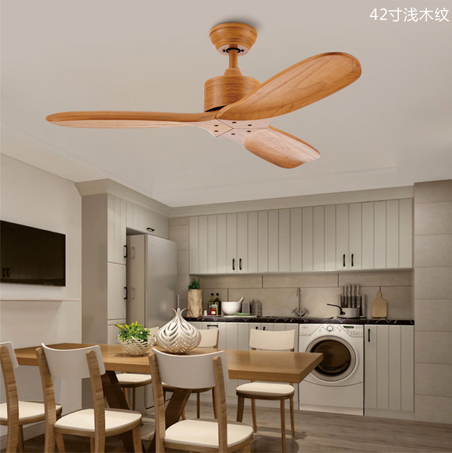  
_Example of a higher end fan from Taobao, which costs RMB 700_

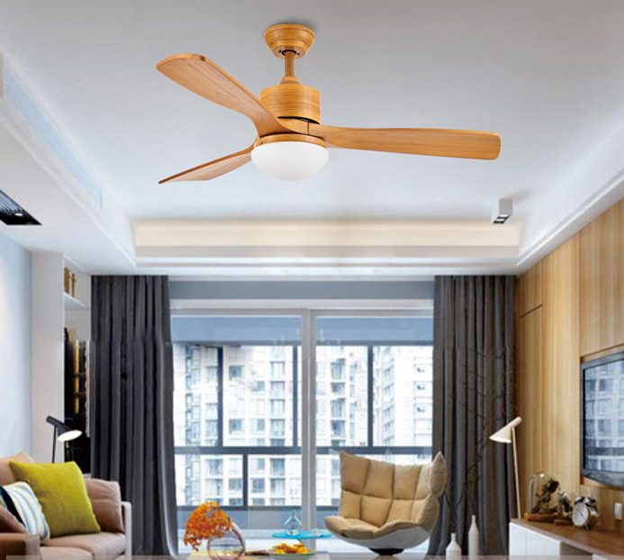  
_This comes with light and costs around RMB 780, or around SGD 160._

Another advantage is that you get the fans delivered to you to your doorstep, whereas if you bought from local stores or JB you'd have to carry it yourself.

To add, you'd also need to check with the seller on the voltage specifications. Singapore uses 220V to 240V, so your fan must be compliant. If you get the wrong specification, the appliance is unlikely to work, and worse, you could have a fire risk on your hands. But in general if you tell the seller you need 220V to 240V the seller should have the appropriate fans for sale.

## End result

We decided to buy a KDK fan from Yes Electrical (in JB) for the living room and buy 2 Taobao fans for the bedrooms. It was really tiring to carry the fan all the way from JB and back to Singapore. We took it up our Grab ride, we took it to breakfast, we took it to our haircut session, we took it up multiple buses at KSL, the Malaysian customs, and Singapore customs, we took it up the MRT.

Looking back, buying from JB probably wasn't worth it for the savings. The fan cost us RM 590, which was around SGD 200. It's still quite a significant saving, because a 56-inch KDK from Hoe Kee was around SGD 320. But that extra SGD 120 doesn't seem very worth the effort to lug it back when we reflected. There's no warranty too. But if you drive it's quite worth it, unless you end up losing your car or getting it scratched!

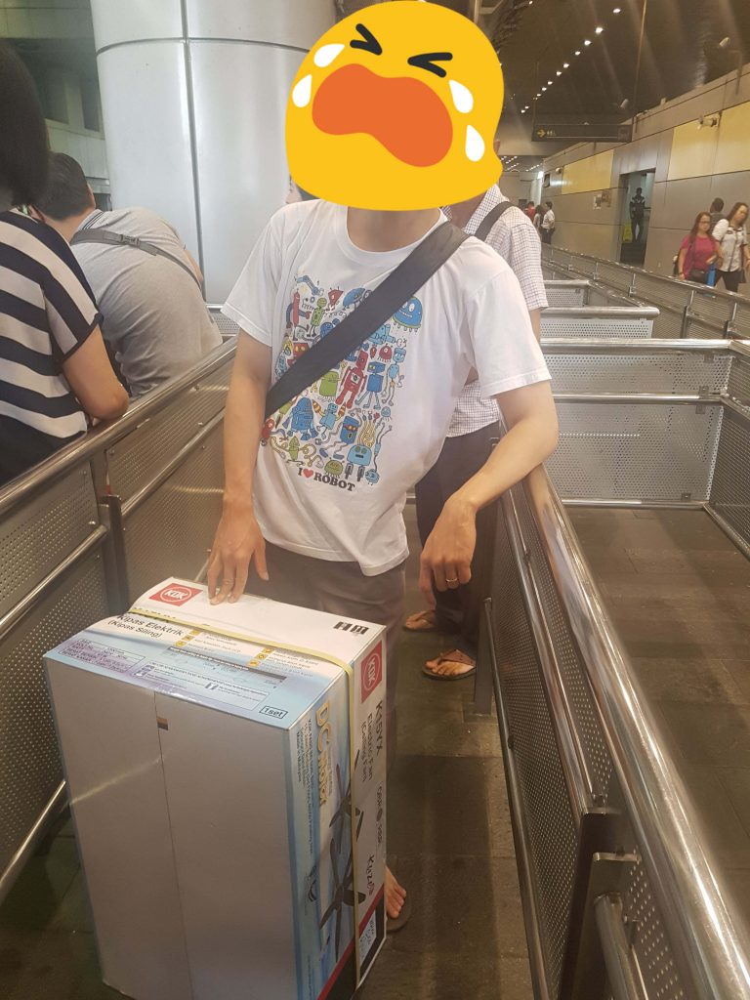  
_We didn't drive, so we had to hand carry the KDK fan throughout our journey. Pardon the uncle pose, it was a tiring journey._

As for the Taobao fans, we eventually got these from a seller that didn't have many sales. The two fans cost around RMB 700. But we went ahead anyway because it was a risk worth taking.

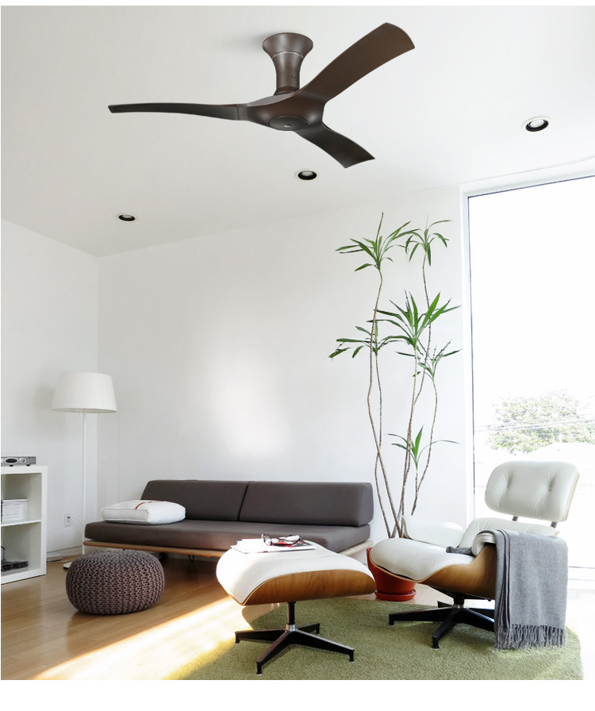  
_We bought this for the bedrooms_

When the Taobao fans arrived it was initially quite confusing. They were packed in Elmark boxes. There is nothing wrong with Elmark fans and they have great designs, but there seems to be a few complaints about their quality. We texted the seller and it turns out they used the export version of the boxes to store the fans. The story checks out because the instruction manual said it was Piaoyu brand, so it seems we bought the seller is a supplier for Elmark. For the price we got it, seems like we could've bought it from JB for roughly the same price, although transporting it back would be an issue. Let's hope they last longer than the normal branded Elmark fans.

### Installing the fan

On the sidelines of the paint job there was also the installation of fans. It went well. There was some confusion at the start when we haven't bought the KDK fan yet and the Taobao fan was installed wrongly in the living room. But it was easily rectified subsequently.

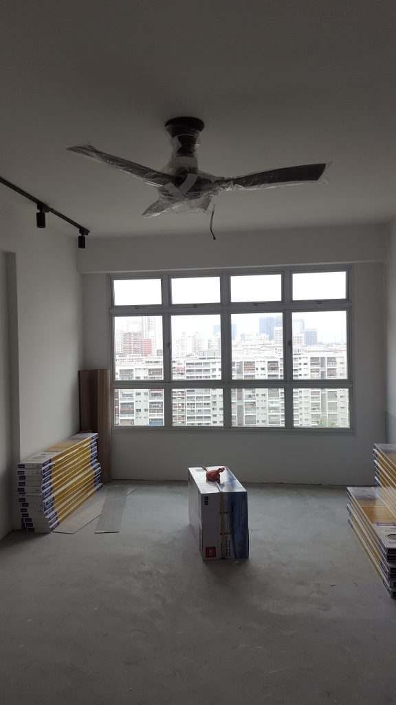  
_The Taobao fan didn't look half bad actually in the living room_

The end result looked pretty good. Even though some say you really only need to leave a gap at the sides that's equal to half the width of the fan, a 60-inch ceiling fan seems like the maximum you can go without it being overly large. For our case there was around 1m each side. We were lucky we didn't do as what [a HWZ post had said previously, that it was ok to get a 60-inch fan for the bedroom](https://forums.hardwarezone.com.sg/home-decor-furnishings-188/all-about-ceiling-fans-4684906.html). Definitely not enough clearance if we did.

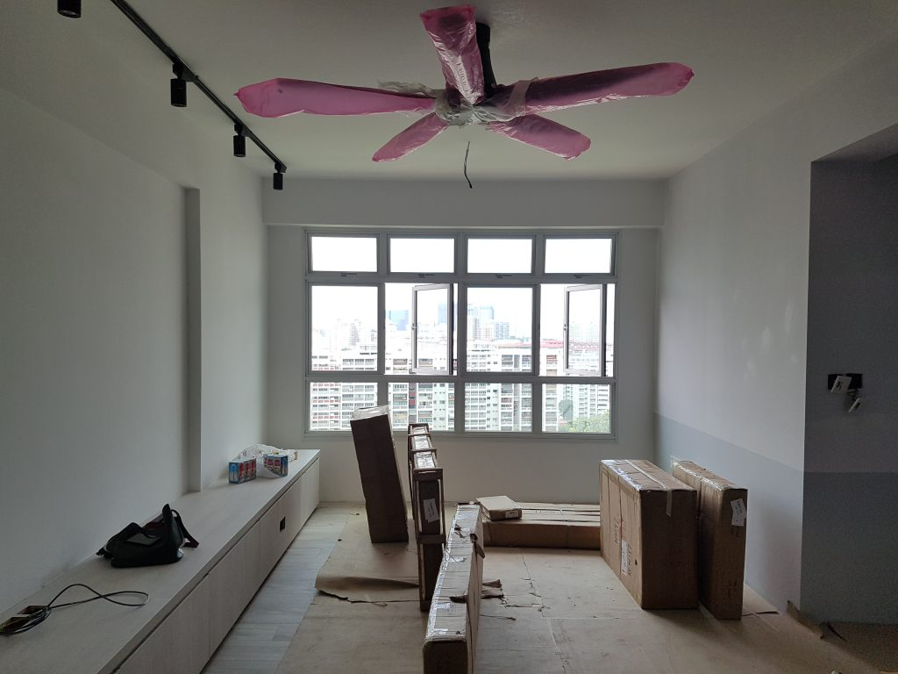  
_Our KDK fan installed at the living room after the initial confusion._

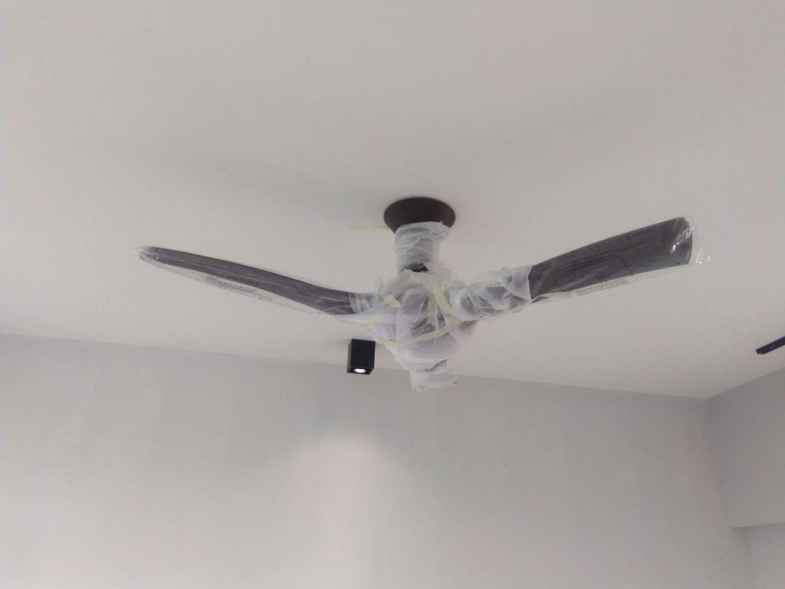  
_Our Taobao fan installed as well in the MBR._

The 54-inch fans in the bedrooms looked good. For some reason it didn't look that good when it was in the packaging.

## Basic troubleshooting

We came across this [informative post](https://forums.hardwarezone.com.sg/107679971-post358.html) on HWZ that briefly touched on the basic troubleshooting symptoms:

### Printed circuit board (PCB) capacitor failure

Fan turns off by itself once it is turned on or certain buttons are pressed.

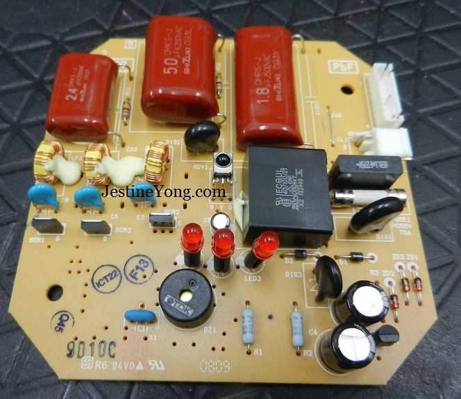  
_An example of a Panasonic ceiling fan PCB ([source](http://jestineyong.com/panasonic-ceiling-fan-repaired-part-2/))._

### Motor capacitor failure

Fan spins slowly or struggles to start. You should still hear motor humming or feel vibrations.

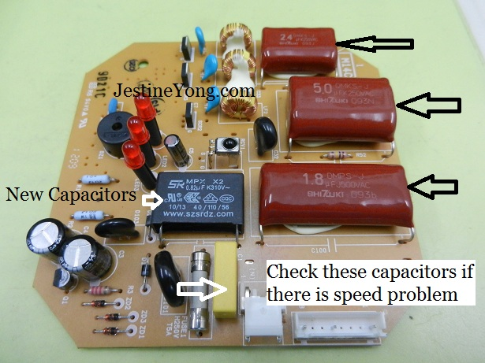  
_Panasonic ceiling fan capacitors ([source](http://jestineyong.com/panasonic-ceiling-fan-repaired-part-2/)). The black one is for the motor._

### If the motor is totally silent but the switches work properly

It's usually due to a blown thermal fuse, which prevents overheating or a power surge.

<iframe
    src="https://www.youtube.com/embed/xg7QorNySUI?start=659"
    width="560"
    height="315"
    frameborder="0"
    allowfullscreen="allowfullscreen"
></iframe>

## Conclusion

To end off this guide on getting ceiling fans for a BTO, perhaps it'd be good to note that the only thing left is to test the fans through daily usage. Things can look great on paper. But once you work them hard you can tell whether the appliances are of cui quality. But we sure hope they last!
