## Intro

This guide tells you how to buy lights in general, and more specifically how to buy lights from Taobao. We haven't gotten around to showing the stuff we actually bought, but we plan to in a subsequent post.

## Why we didn't buy from local or JB shops

As always, there're 3 places to buy from: local shops, JB, or Taobao. From the start, we read many reviews that said Taobao lights were very cheap. We decided from day one then that there was nowhere else to buy lights but Taobao.

It's not that it's bad to buy from local or JB shops. Local shops (both the normal shops along Jalan Besar or Northstar studio) provide warranty, especially if the lights break. We're also not against buying stuff from JB - [we bought a KDK fan there](https://btonomics.com/renovation/getting-ceiling-fans-for-a-bto/). Local and JB shops also let you see the lights in action before you purchase it.

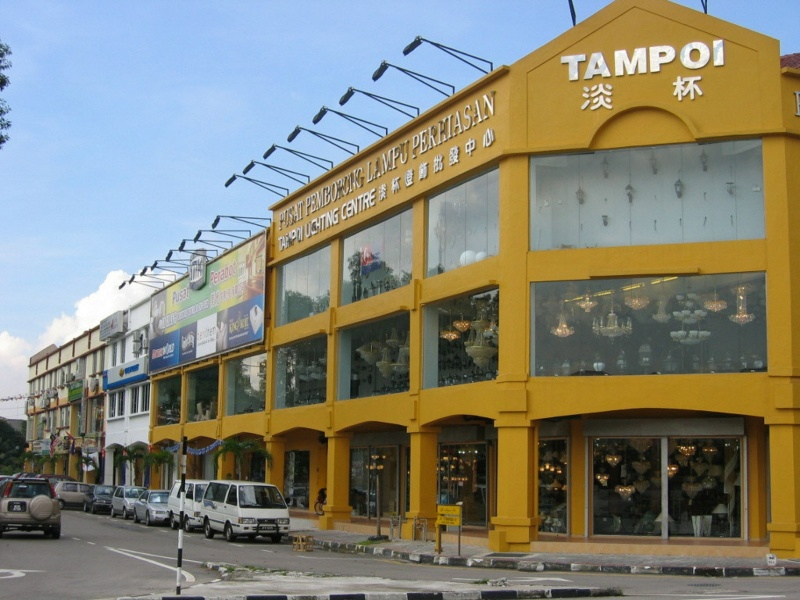

_Look at this mega store, you can browse lights and see how they look like until your mustache grows out._

But local shops sell lights at very expensive prices. Rent and worker costs in Singapore are super high. JB shops are still alright in this regard. However, their designs aren't the best sometimes (especially if you go to the smaller shops). And you really need to drive so you can bring your stuff back. We don't drive so it's not possible to just lug the cartons of lights back like [we did for our KDK fan](https://btonomics.com/renovation/getting-ceiling-fans-for-a-bto/).

_Carrying the fan still can la, but that in itself was already very tiring. If it's multiple boxes I definitely couldn't carry it. Even if I gym more often it's not possible._

If you don't mind the higher price, then just buy your lights locally and save yourself the headache.

There's also one more reason specific to us and Shao Jie or Rooot. Perhaps the reason why we were able to pull off buying from Taobao is because we were able to depend on Shao Jie and his opinions. We gave him options and he chose whatever we needed. So we didn't need to see the lights in action to make sure we didn't buy crappy lights. He was too pro already.

## Buying from Taobao

As with all things there, buying lights from Taobao requires research. Do [check out our Taobao guide first](https://btonomics.com/shopping/how-to-buy-and-ship-from-taobao-to-singapore/). Make sure you buy from reputable sellers, ideally from Tmall. And make sure you read the reviews. There're many sellers who offer varying prices. Just because something is cheaper than others doesn't mean it's good. There's usually a minimum cost and anything lower than that means that the quality can be rubbish.

The most important thing you'd need to take note when trying to buy from Taobao is to make sure you use sea shipping. If you try to use the official forwarder to do air shipping you'd encounter an error message saying it can't be shipped. Change it to a third-party sea forwarder and you'll be fine. Lights are pretty good for sea shipping, it's not overly big. You just need to order extra pieces, like 20-30% more, because during sea shipping they may break. You can think of shipping as stacking a huge load of boxes, one on top of another. If it's fragile, it will likely break.

Make sure you tell the seller to pack the lights well. 包的厚一点，扎实一点，海绵用多一点呀！Even so, it's always a risk to ship delicate lights like chandeliers because those are really fragile and you might not be able to find insurers for your shipment. Our advice is just to order extras and hope for the best. No point worrying about something you can't control. The savings are already a lot.

## Types of lights

For noobs like us, we weren't really sure what all the different lights were. And Taobao is just so huge with so many options. To us, when we were starting out lights were just lights. We'd think "so mafan just get some lights that can shine lor." But it turned out that it wasn't so simple. There were many different types of lights and light fixtures to consider mixing and matching. So before you start searching on Taobao, you'd need to understand some basics about choosing lights for your home.

### Ambient lights

They are general lighting. Usually a main source of light without being glaring or too dim. In other words - comfortable. They generally distribute light evenly rather than one particular spot.

Examples: ceiling lights, chandeliers, cove lights, wall-mounted lights.

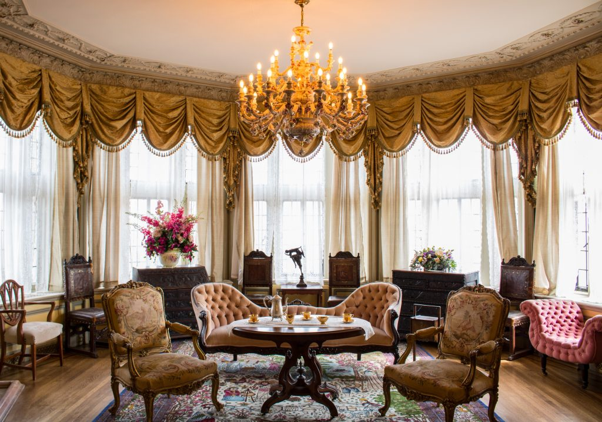

_A Chandelier light. ([source](http://www.hamstech.com/blog/interior-design-guide-to-different-furniture-styles/))_

### Task lights

They are designed for providing light for your task, like doing reading, your make-up, or using your computer. It usually complements your other light sources and is seldom the only one around. Try to go for something that's comfortable as well.

Examples: desk lamps, bedside LED lights.

_Example of a task light._

### Accent lights

They are meant to emphasize a particular area, like an art piece, display cabinet, or a coffee table. Or even to highlight a design/architectural standout. They aren't very practical, but usually can add make your area lit very 'drama'. The ratio is usually [having the lit area 3 times brighter than the surroundings](http://www.kirklands.com/blog/ambient-task-accent-3-types-of-lighting-need-know/).

Examples: recessed lights, track lights, spotlights.

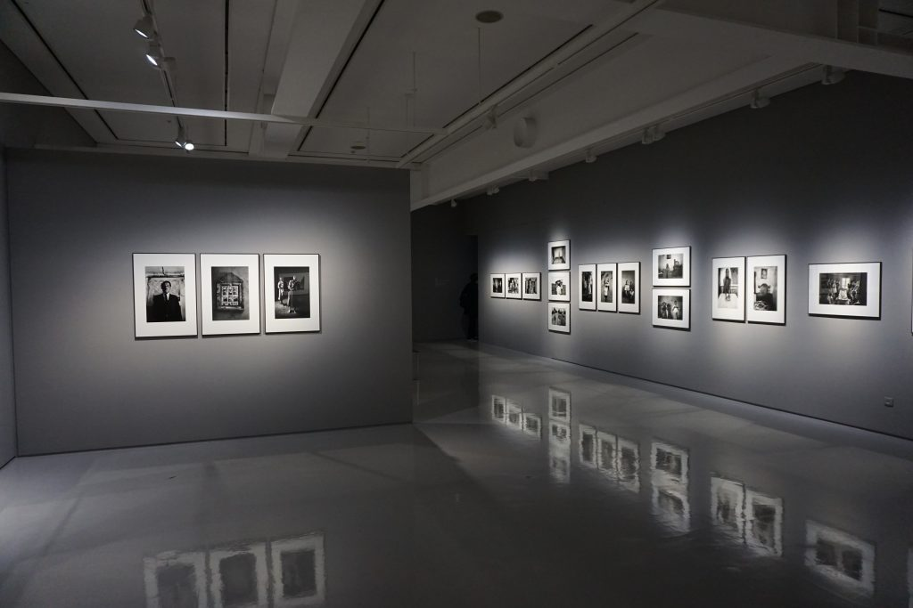

_Accent lighting._

## Light Fixtures

Once you figure out the types of lights you want/need, it's perhaps important to figure out how you want it done. There're usually only that many kinds of lights, although this is by no means exhaustive and I'm sure your lighting guy or ID will tell you that. The ones listed below with Chinese words are the keywords to search for on Taobao and those that we think are more popular. We searched for a lot of stuff and these light fixtures kept popping up.

### Recessed downlights and spotlights (嵌入式 / 筒灯 / 射灯)

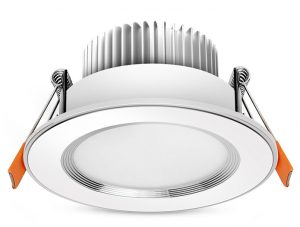

-   Lights which are recessed are installed into a surface (commonly the ceiling) so they don't pop out at all.
-   It's fantastic for rooms with low ceilings, and for BTOs with low ceilings, it's probably a godsend.
-   These lights shine only on a small area so if you only have one for a huge room it's not going to work.
-   They require quite a bit of ceiling wiring, although that isn't too big of a problem with BTOs, e.g. toilets.
-   There'll come a time when you're confused about downlights and spotlights because Taobao sellers often confuse people with their listing titles and descriptions. Just persevere and use 阿里旺旺 to confirm with the sellers.

## Track lights (轨道 / 射灯 / 轨道条)

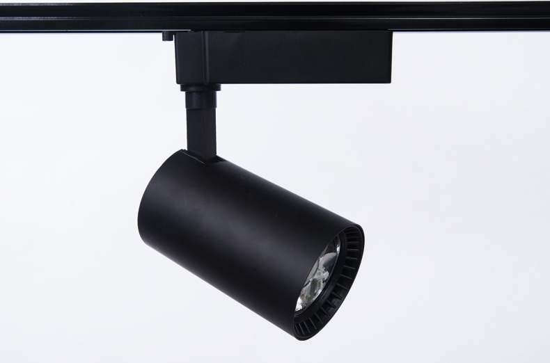

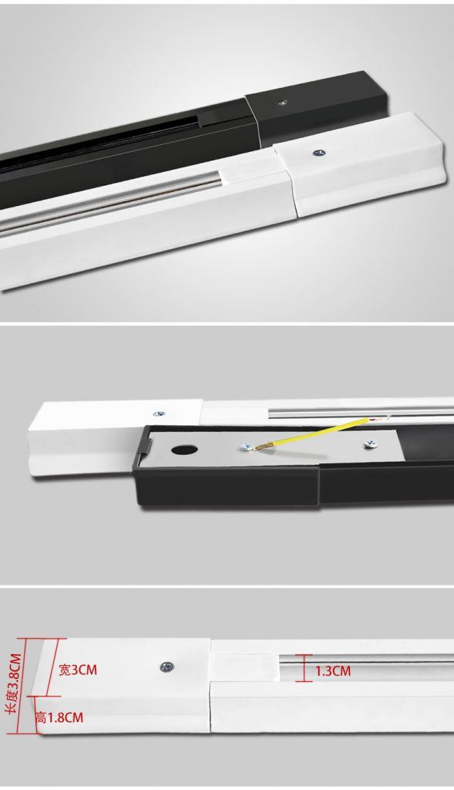

_This is how a track typically looks like._

-   Track lights are lights placed along a continuous strip.
-   Usually used with spotlights (if you're buying from Taobao), so they pop out from the tracks and shine on desired areas.
-   For BTOs track lights are actually really good, especially for the living room to light up your console area. They also coexist well with ceiling fans whereas chandeliers and pendant lights may not.
-   They're easy to maintain because you can place them anywhere along the strip and it still works, and you can also easily clip on or remove lights you don't need.
-   You can adjust the angles of the lights, like if you need to adjust the glare on a mirror or do accent lighting for an art piece you are putting on the wall for a short while.
-   They're super versatile - good to light up weird corners and narrow aisles, or to do specific task lighting.
-   If you're buying from Taobao, it's very safe to get track lights because even if one downlight/spotlight comes broken you can just replace it with more. So far for our case, we haven't encountered any of our spotlights broken yet.
-   But track lights are not for everyone, it looks like a showroom when you've a lot of them and not everyone likes the tracks. It'll be strange if you go for a design like the one below and go for track lights. The look just doesn't gel.
-   Many people get track lights nowadays so it's a pretty common look, perhaps too common.

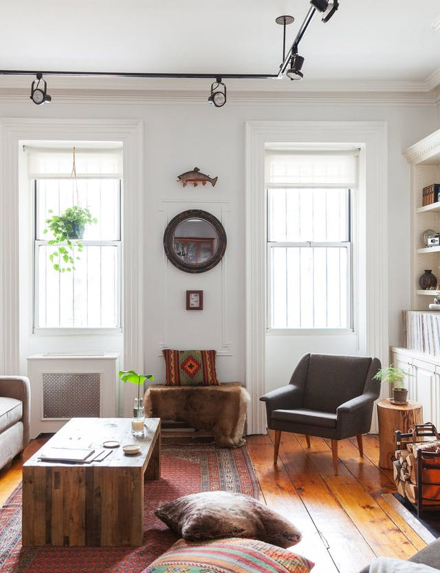

_We'd get pretty depressed if we used track lighting at this home. ([source](https://www.apartmenttherapy.com/authors/laurenk))_

### Chandelier / Hanging / Pendant lights (吊灯)

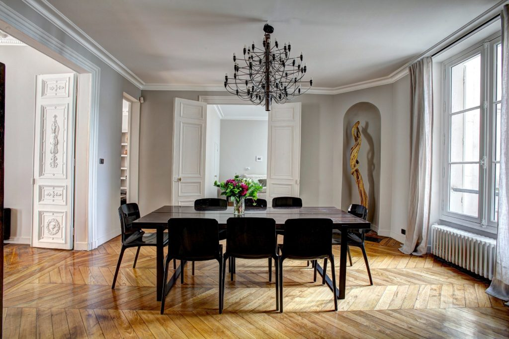

_([source](https://www.sheknows.com/home-and-gardening/slideshow/8797/modern-victorian-design))_

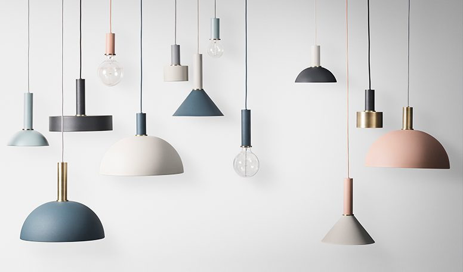

-   These are hanging lights that can be _the_ statement light piece (especially chandeliers) for your room.
-   Most people put their hanging lights around the suggested dining area for BTO dwellers.
-   Chandeliers give a very atas look and is an essential piece to recreating certain designs, so if that's what you're going for then go all in on this. Taobao has a lot of designs that'll blow your mind so that's the advantage of shopping for a chandelier there.
-   But chandeliers can be expensive and very fragile to ship. It's much better to buy locally so you can replace small pieces that get chipped off.
-   With so much surface area for chandeliers, cleaning is a pain in the ass, you need to clean every single part that pops out. We used to have one of this but my mum said never again after she had to clean it.
-   Pendant lights, on the other hand, look much more modest and are very common nowadays (throw a stone and you'll hit an owner with the typical 3-4 pendant light that looks like metal bowls configuration - see the picture above. "Scandinavian style" hurhurhur.)

### Fluorescent/LED tube lights (荧光灯 / LED)

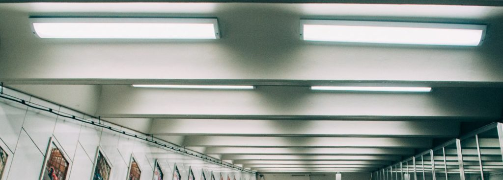

-   This is the standard strip of light that's present in so many offices. Although this might be a deal breaker, we'd hate to come back home only to be reminded of the office. (Then again, it's all about work life integration so perhaps that makes sense. Making your life all about your work...)
-   It used to be very common in old HDB flats.
-   Nothing spectacular, plain old long strip shape that lights everything up.
-   Personally, I hate it when the fluorescent ones always flicker when it's spoilt, but they're very easy to maintain because you just need to buy a new tube.
-   It might be difficult to buy fluorescent lights from Taobao though, it seems the sellers mostly sell LED lights. Fluorescent lights will break anyway, so it's better not to get those.

### Ceiling lights / box lights (吸顶灯 / 射灯方形明装)

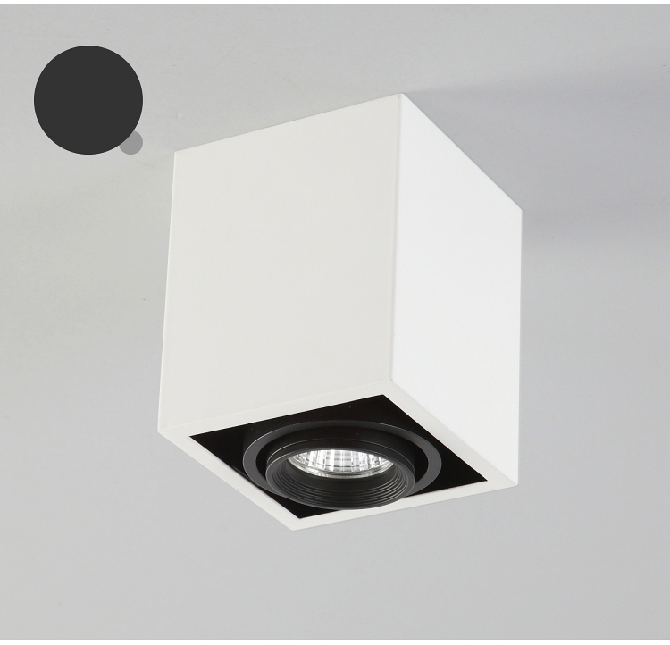

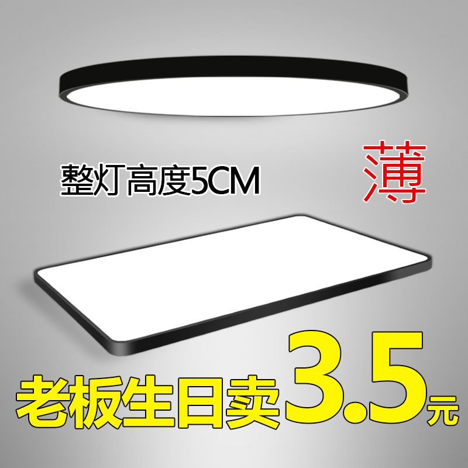

-   Technically these are like your fluorescent lights, but they're probably a little different visually and can be powered by LED lights. There're a few main types, the 'pancake', the 'tablet', and the box. There's also the old school one that looks like a mochi or a boob (below) but I don't think many people buy those nowadays.
-   Pancakes and tablets are there to offer general lighting. Box lights, on the other hand, usually do spot lighting. In terms of aesthetic value, the box lights are probably the nicest to us.
-   They're also very easy to maintain.
-   Functionally the pancake and tablets are very good if you don't care about the aesthetics. They're large so they're very suitable for the bomb shelter and service yard.
-   Taobao is currently having a craze of trying to compete with one another on being the thinnest ceiling lights. So you'll find tons of sellers advertising their slim offerings. Our suggestion is just to go for something that's cheap and good, it doesn't matter if it pops out 1-2cm more.

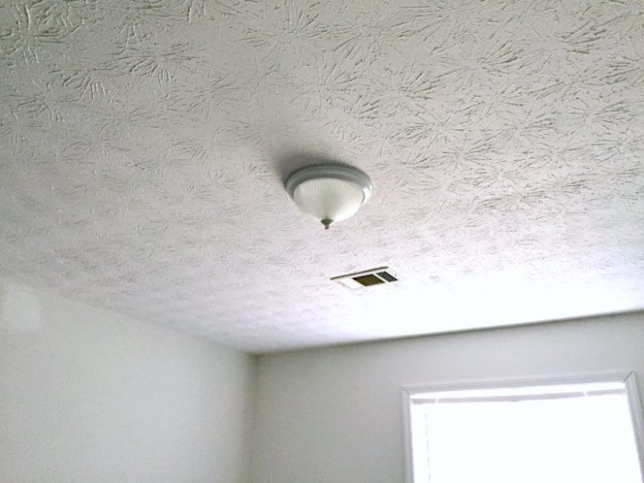

_This is a no go. ([source](https://www.uglyducklinghouse.com/dueling-diy-guest-room-gauntlet/))_

### Table/standing lamps (台灯 / 落地灯)

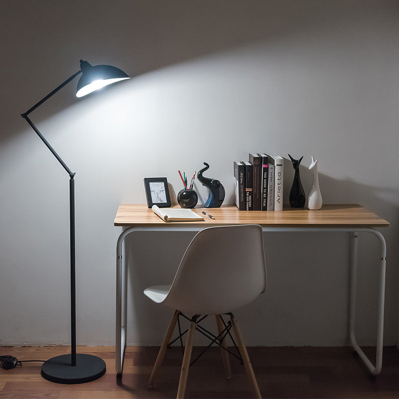

_Example of a standing lamp, this is actually a very cute lamp from AliExpress that's nicer than the standard Ikea ones._

-   These are very classic, and help more with task lighting rather than ambient lighting.
-   We Singaporeans study and work a lot, especially to upgrade your BTO to a condo and then to a landed property, so this is a good-to-get item.
-   Maintenance is easy and it's very versatile because you can bring this out or into the rooms where necessary.
-   Some designs are really cool like the one above, but not the old school opiang types.
-   These lamps can often get quite hot so please don't touch them.
-   The cabling is a problem though because you might accidentally kick and yank the wires from the main switch.
-   That said, because these lamps from Taobao come with 2-pin plugs and their fire safety protection might not be good, it might be a better option to buy this locally (e.g. from Ikea).

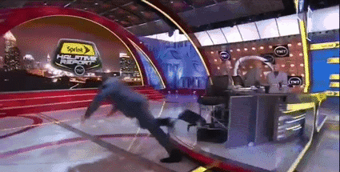

### Cove lights

_Example of Cove light. ([source](https://www.houzz.com.sg/photo/633960-asymmetrical-cove-light-modern-hallway-and-landing-denver))_

-   Cove lights are indirect lights that shoot into the ceiling for more diffused lighting, e.g. from within a false ceiling or above a cabinet.
-   There're many different types (rope, fluorescent, LED, and low voltage linear lighting), it's a bit leh cheh and beyond our knowledge to explain, so you can [check them out here](http://www.lighting-singapore.com/articles/pros-and-cons-of-cove-lighting.html).
-   To us these lights look nice and easy on the eyes. Soft light is great light, and your skin looks chioer like it's been filtered gao gao.
-   But this was a no-no for us because it's an ideal graveyard for insects, dust, lizard shit, and it would also be much more expensive.
-   Maintenance isn't very easy either, it takes a lot of climbing to get a light fixture fixed or changed.
-   For BTOs we'd suggest not to go for cove lights, the ceiling is already low enough as it is without installing false ceilings for this.
-   But anyway you won't be getting cove lights from Taobao, if you do we'd be most interested to hear how you did it!

### Fan-attached lights

-   [No. Please, no.](https://btonomics.com/renovation/getting-ceiling-fans-for-a-bto/)
-   Some people may say "no leh, mini bee is very cute...", to which I'll say:

### LED strips (LED灯条)

<iframe
    src="https://www.youtube.com/embed/_NoeszOunbw"
    width="560"
    height="315"
    frameborder="0"
    allowfullscreen="allowfullscreen"
></iframe>

-   These are just LED lights placed on a strip so you can use them anywhere, e.g. under vanity mirrors, inside cabinet doors, or on hanging lights with weird twisted shapes.
-   They are very versatile and relatively cheap.
-   But the downside is that you need some expertise in installing such lights.
-   For BTOs, just spam this!

## Types of bulbs

Before you choose your light fixtures, you need to know what types of bulbs you want. Sometimes what you want is totally not available on Taobao. Most of the stuff that we have seen are LED lights, which seems to be the trending lights now on the platform.

### Incandescent

These are your typical light bulbs when you draw or think of 'light bulbs'. They generate light by having electric current run through a filament (think back to your primary school science classes). They're uncommon in Singapore nowadays because they're not energy efficient and don't last long. As a kid I always remembered that these kinds of bulbs sucked big time. They last about 1,000 hours.

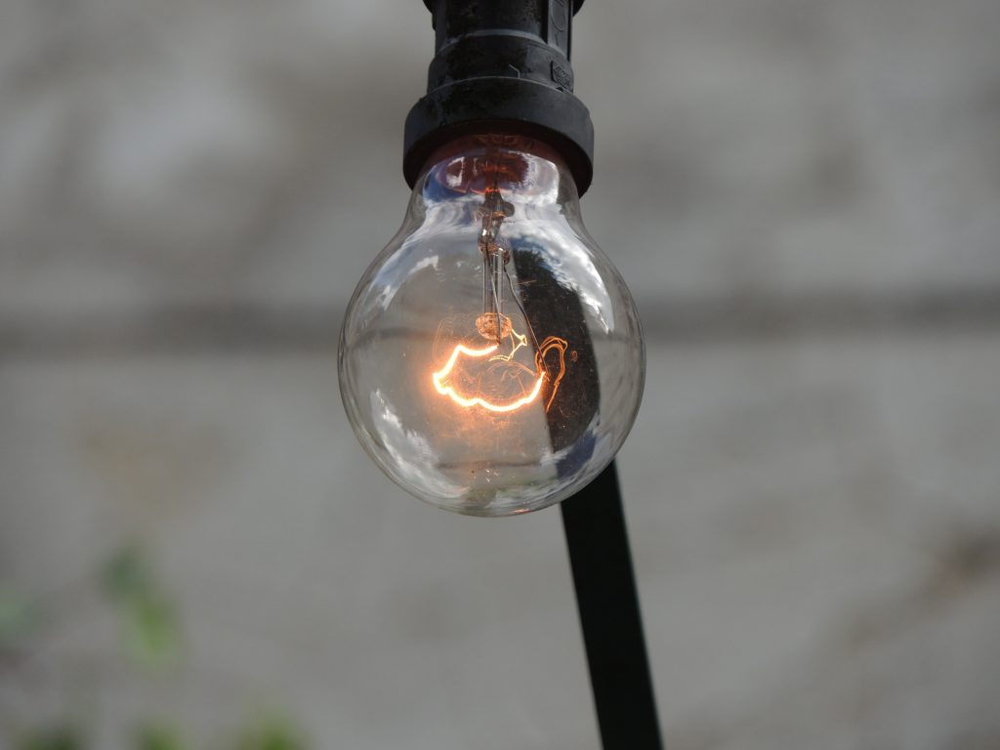

### Fluorescent

They use much less energy and last up to 20 times longer than incandescent bulbs. But they might be quite toxic because they contain mercury, so they should never be exposed and inhaled. They also emit some UV light - apparently, some study concluded that UV exposure under fluorescent lights for eight hours is around 1 minute under the sun. They last about 8,000 hours.

### LED

LED lights are very energy efficient but super popular. They cost slightly more but they last the most, and are very small and flat. They last a whopping 25,000 hours (3 times that of fluorescent and 25 times that of the incandescent). But the increase in cost can be offset by the low Taobao prices and the savings you get from your SP bill every month.

## Temperature of lights

Before you buy your lights, you need to decide what light colors they're going to produce. There are 3 main temperatures (colors) for your lights - warm (yellowish), cool white (slight bluish), and white (bluish). If you're familiar with cameras, this is your white balance over here.

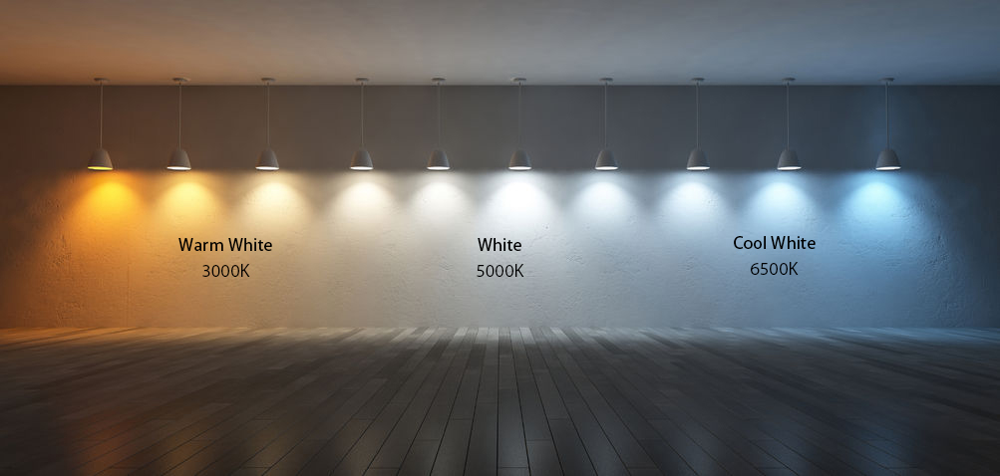

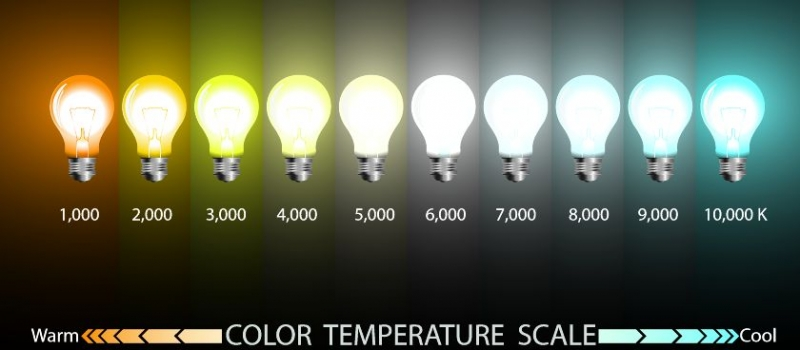

-   2700K – 3000K – This is warm to soft white range. It's very comfortable on the eyes and very relaxing. Makes you feel cozy. Personally, if I had my way the whole house would be warm lights. Useful for bedrooms and toilet shower areas for that cozy feeling.
-   3500K – 4500K – This is more neutral and somewhat in the white light range. It's a little bluish but nothing too hardcore on your eyes. It's quite ok for use at night. Quite good to have in the living room, kitchen, and toilet vanity area.
-   5000K-6500K and beyond – It feels more like daylight, quite bluish if you look at it suddenly. It's most suitable if you really need to do work, especially if it's color sensitivity. But it'll make sure [you don't fall asleep easily](https://www.scientificamerican.com/article/q-a-why-is-blue-light-before-bedtime-bad-for-sleep/). Some people also [believe that it's bad for your eyes](https://www.allaboutvision.com/cvs/blue-light.htm), others say [there's no such thing](https://www.aao.org/eye-health/tips-prevention/should-you-be-worried-about-blue-light). But in any case, it's a good idea to have this where you really need to concentrate or you need white light, like in your bomb shelter or service yard.

You can generally do only 1 temperature throughout the house (why would you though?) or a mix of the 3. Although I thought it was cool, Shao Jie also advised that it's best not to have a mixture within close proximity (i.e. within the same track try not to put cool white and warm white together).

Do note that cool white doesn't really seem very popular. Not many sellers sell cool white lights. Because you should try to buy from the same seller to reduce the number of boxes to ship over, try to find sellers who sell cool and warm lights, even if they might have fewer reviews or sales. But of course, try not to go for sellers with very few reviews for their most popular products. This might hint at sellers who might not be tried and tested. You don't want that.

## How powerful should your lights be?

The rule of thumb is to go for bulbs that are just right for your purpose. There is nothing worse than getting a really powerful bulb that just blinds your eyes every time you stare at something near. Most people go for something that's brighter where they need to do work, like the living room, and go for something warmer in their rest areas, such as bedrooms. Taobao sellers can also advise you if you can tell them your floor area and the types of rooms you're installing the lights in.

For areas where you have multiple functions, you can play around with different power. Personally, I hate everything bright lights and favor warm lights, whereas PQ is fine with any type.

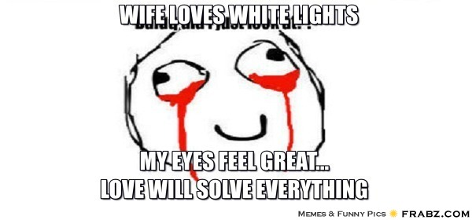

_Luckily that's not me..._

You'll need to adjust the wattage of your LED or fluorescent bulbs based on what you need. The higher the watts, the brighter your light source. Getting the appropriate watts is very subjective. For us, we found the following configurations very comfortable:

-   Living room and bedroom ceiling track lights - 7W
-   Bedroom pendant lights - 5W
-   Bedroom ceiling box light - 5W
-   Bomb shelter and service yard ceiling pancake light - 24W/18W
-   Corridor wall-mounted light - 7W
-   Toilet recessed downlight - 5W
-   Toilet recessed spotlight - 5W

Some of them required topping up some money to the Taobao sellers. As you can tell most of the lights are rather under-powered and dim. But to us, it seemed appropriate. It makes for a more cozy and comfortable environment rather than looking like a lab where everything is super bright, cold, and merciless.

_Nope, this definitely shouldn't be how our home is going to be lit. ([source](https://www.facebook.com/ChannelNewsAsia/photos/a.106297597933.96699.93889432933/10153511967747934/?type=3))_

## Half-time

At this point, this guide has become super long, so we will just stop here for now. We still want to continue this guide in another post which will focus on Shao Jie's proposals, what we bought, and what we ended up with. Basically what we did.
