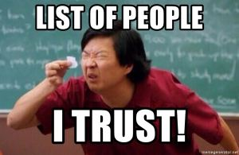
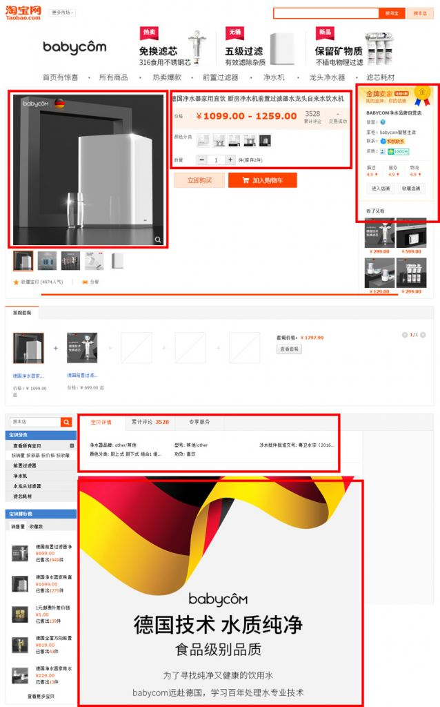
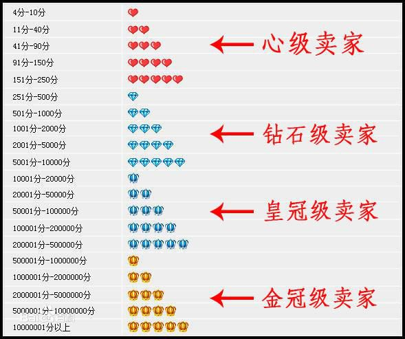
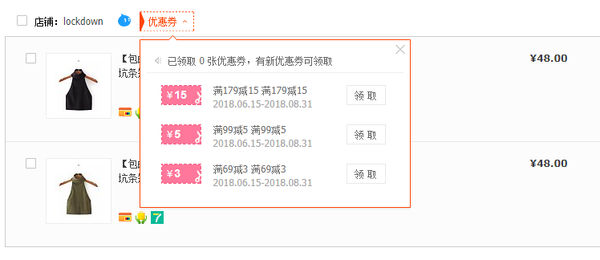
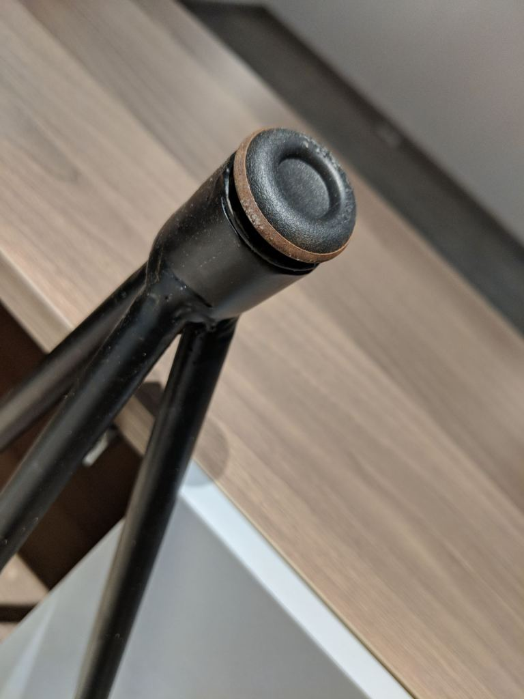
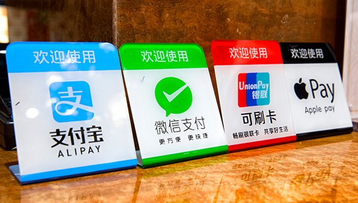
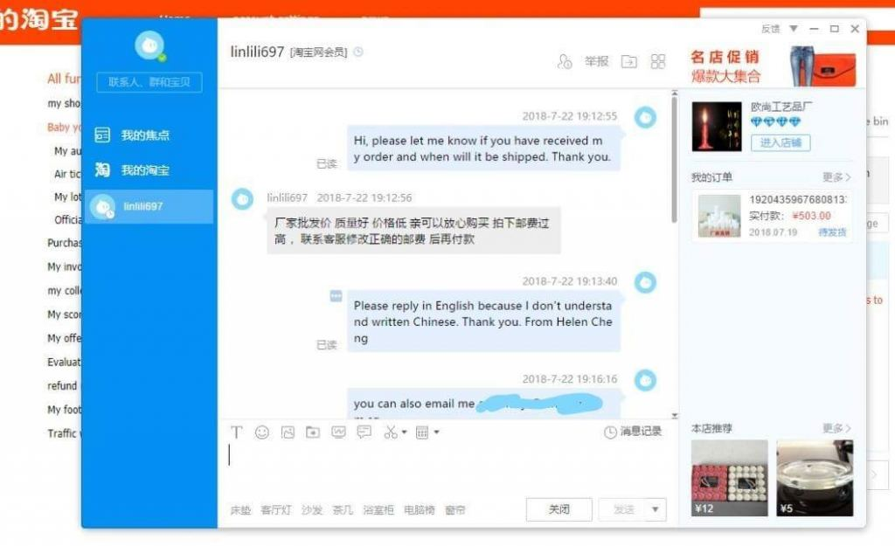
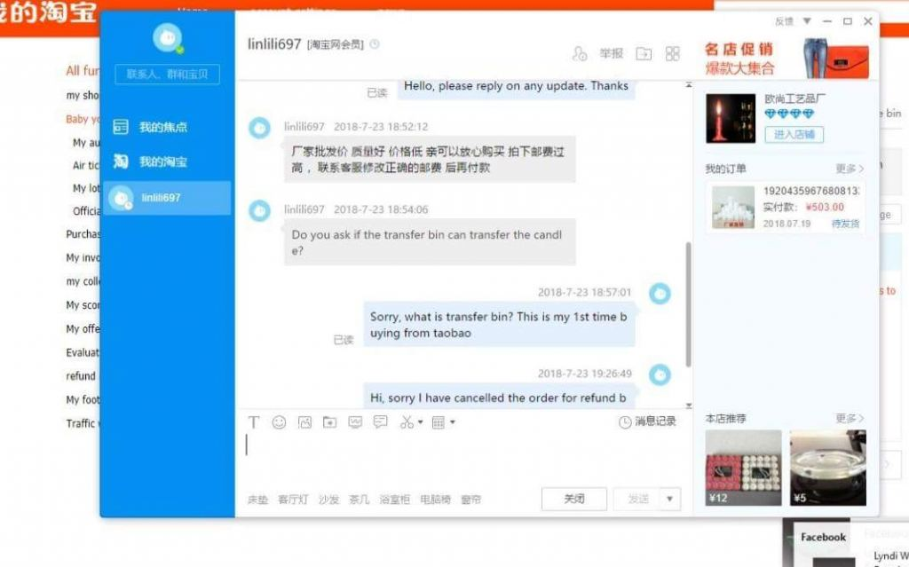
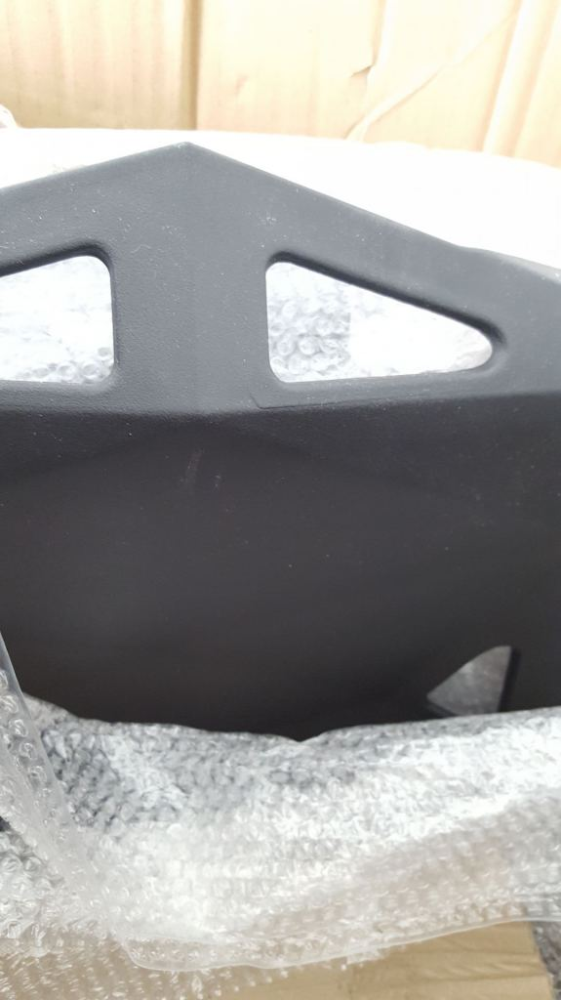
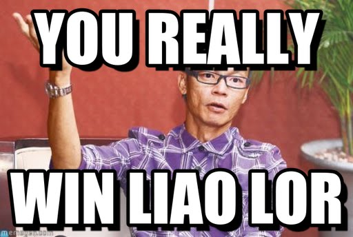

**(UPDATE: We ended up [losing a couple of boxes and incurring a cost of SGD 100 after factoring in the compensation](https://btonomics.com/shopping/taobao-missing-item-how-shipper-lost-parcels/). As such, we decided to stop using MRC and change shippers. So this post really has been one written from experience.)**

Buying furniture from Taobao is trendy. It isn't easy, but it's the most likely to net you big savings. You'd recall we wrote [a guide on deciding whether to buy from Taobao or Ikea](https://btonomics.com/shopping/should-you-buy-furniture-from-taobao-or-ikea/). We also went through [how anyone can buy and ship from Taobao](https://btonomics.com/shopping/how-to-buy-and-ship-from-taobao-to-singapore/). Both of us have become hardcore Taobao shoppers. We've probably bought close to a thousand items. Safe to say we've encountered many different things that we could've handled better and different types of fail. If something could fail, then something will fail. Here's our ten-year series guide on our Taobao tips and FAQs for shopping and shipping to help you out.

 _Never trust Taobao sellers - NEVER! Always assume that if they can give you shitty products for a low price, they'd!_

---

## Taobao tips: shopping

### Not checking the product description

**Problem: You can't find the product specifications in the table of details**

Like Amazon, Taobao items usually show a table with details about the products (宝贝详情). But it's usually a joke. Unlike Amazon, much of the useful details (e.g. dimensions and material) are usually scattered further down. They're mostly in picture form and you've to scroll several screen lengths to view it all. It can also be in the main thumbnails, or mouseover description on thumbnails, or videos. Watch out for them all! When all else fails, just contact the seller.

 _The parts you should watch out for are those in red._

### Not specifying the desired option in the comments

**Problem: The seller asked you to indicate an option in the comments page, but you didn't**

This is a small problem where sometimes the seller says the customer has to specify the colour or design, or else they'd send the default (usually ugly) option. This usually applies to items that're just listed as a generic option, maybe because there're too many options to list. But sometimes the seller wants this even though you selected an option. This happened to us for the solar film. We just went to chat with the seller and accidentally got him to explain that "没有备注颜色，默认冰晶银的". Meaning we didn't specify a colour in the comment box, so it's the standard crystal colour, even though we selected and paid for the blackout option! Thankfully we resolved it when we contacted the seller.

 _Sorry la didn't know must put comments, chill leh._

### Buying from sellers without reviews or transactions

**Problem: You buy from sellers without reviews or transactions, and the stuff is either more expensive than normal or is of terrible quality**

This happens when you buy from lousy sellers. Where possible, buy from sellers that have good reviews, have a long transaction history, and are from Tmall. The better ranking sellers are shown in the picture below.

 _The ranking for seller ratings. The better sellers are the ones further down (i.e. more ranking points)._

It can be ok to relax 1 or 2 conditions, e.g. seller might not be Tmall accredited but might have very good reviews and many transactions completed. Tmall sellers are accredited, so they're safer that way. It might be tempting to buy from another seller without any transactions or reviews. In this case, it's a judgement call that we wouldn't advise.

### Not claiming discounts or coupons

**Problem: You clicked add to cart, you checked out your cart, and you smile to yourself happily.**

You should always claim (领取) the coupons that're displayed at the shopping cart or order confirmation page. Anyone can claim the coupons. It usually works if you meet an order value, like RMB 5 off RMB 100. But there's no harm claiming it either even if you don't use it.

 _An example of coupons. Be kiasu and just claim them!_

### Missing out on 11/11 sales

**Problem: You missed out on 11/11 sales and are super sad**

11/11 (双十一) or 12/12 sales are great. Many items are really cheap. There'll always be the super cheap stuff that's limited to the fastest fingers (although we must add that these aren't the most reliable discounts because you're going against hundreds of millions of people camping). But don't cry. They're not the only sale in town. There're other smaller ones that give comparable discounts, like 狂欢季 (Mega Fun Season) or 女王节 (International Women's Day) specials.

Do be careful of sellers' tricks though. They often raise prices then cut them so the discount looks huge. This is similar to how Lazada or Qoo10 do their pricing. Just don't be the carrot head who buys stuff when sellers marked up prices and have not discounted them yet. For example, we saw diatomaceous earth mats that we liked. The normal price is around RMB 37. In the few days before 女王节, the price suddenly went up to RMB 117, which is the undiscounted recommended retail price. During 女王节 the sale price went down to RMB 37, which was the original price. So you'd totally get chopped carrot head if you bought at RMB 117, thinking you got a good deal!

 _The seller's definitely laughing all the way to the bank._

### Items came spoilt

**Problem: You receive items that're rusty, that spoils immediately, or is generally terrible quality.**

When something like that happens, contact the seller via 阿里旺旺. Ask for a partial refund or replacement (补发). Sometimes they can just send you poor quality stuff. For example, the table legs we received had bases that were rusty by the time we received them. The seller said this was not possible, but pictures don't lie. Often times, the sellers try to use low quality metals that just rust like crazy because our weather is so humid.

 _Totally cui quality._

Partial refunds are more tricky. There's a time limit to apply for a partial refund through the Taobao system. Sea shipping is quite slow, sometimes this time limit might have passed before you get the item. But whenever possible, you should always do it via the Taobao system.

Many sellers won't want to do the refund via the system. Apparently it damages their seller rating within Taobao. They'll ask to give you a transfer via Alipay (支付宝) or ang bao (红包) via WeChat Pay (微信支付). The problem is these methods don't work. As overseas customers we don't have the rights to claim the ang bao. The system prompts you that you need to verify the account using a China bank issued credit card, but because you reside overseas you won't be able to.

 _Alipay and 微信支付 ([source](http://economists-pick-research.hktdc.com/business-news/article/International-Market-News/Europe-Woos-China-with-Wider-Alipay-and-WeChat-Pay-Acceptance/imn/en/1/1X000000/1X0ADEO6.htm))._

There's also the option of replacements. The seller can send you parts to replace, or in the worst case send you a whole new item. Do ask and watch out for the new tracking number, because it won't be in the Taobao system.

### Trying to buy without knowing how to read or write Chinese

It's vital to at least be able to read and write basic Chinese to shop on Taobao. If you really can't, you might be able to get by using Google Translate. But it won't give you perfect English or Chinese. Without proper Chinese, you can't communicate with the seller. That's a recipe for disaster - lost goods, wrong colours, bad quality, no replacements, etc.

Don't be like the screenshots below, which we found in a Taobao group on Facebook. Trying to buy on a Chinese e-commerce site and asking the seller to speak English is almost an insult. Just don't. To make matters worse, the buyer requested a refund, which will unfortunately reduce the seller's ratings.

---

## Taobao tips: shipment

### Stuff came broken or damaged during shipment

**Problem: Your items are broken or damaged after you open the boxes or bags.**

Shipping guys often drop or smash fragile items, e.g. chandeliers, mirrors, porcelain bowls, during shipping. It's hard to blame them because they've so many things to ship in so little time.

 _This could greet you when you open up the boxes. Ouch._

They might also be in flimsy boxes and damaged from heavy boxes stacked above. We ever had some chairs shipped in a very thin cardboard box that was rather empty inside. The boxes tore and couldn't prevent chairs from being scratched.

 _The scratches in the middle were probably from heavy boxes or wooden crates, because the box tore._

A cheap solution is to request the seller to label fragile, add more foam packaging (加厚，加海绵), or ship the item in different packaging (e.g. box instead of plastic wrap). It usually works. We successfully shipped cute porcelain cups without them breaking. But for larger items, you can request to add a wooden crate on the exterior (打木架). This will add to the cost, usually SGD 30-50, but it will protect your important items very well. Of course, that's excluding the hassle of having to remove the wooden crates, which is not easy and full of rusty nails. If your item is cheap, then there also might not be a point to spend the extra money to protect it.

### Not confirming your address

**Problem: After you've paid for your items, most shops will drop you an auto message requesting confirmation (核实) of your shipping details (name, address, and tel). Some sellers will refuse to send anything to taobao global direct shipping or your forwarder's address until you confirm. This can delay your shipping, or worse, cause missing items in your shipment.**

Sometimes the seller will ship out the parcels even if you don't confirm it. But to be safe just use 阿里旺旺 to confirm the address asap.

### Lost/missing parcels and items

**Problem: You open up your shipping parcel/bag and you don't find your item(s).**

Always get in touch with the Taobao seller using 阿里旺旺 and your third party forwarder. Sellers typically don't risk scamming you by not sending you the item. But anyway either party has to account for the missing stuff. It's very important to make sure you find someone you can trust so you can resolve the issue. It can be super frustrating having to contact Taobao support or the forwarder's customer device people.

Parcels can go missing anytime and for many reasons (sorted by stages of how the parcels reach you):

-   Sellers missed the correct quantity or item.
-   Sellers sent the items in several boxes (e.g. because it's too big to fit into one parcel), each with separate tracking numbers. The Taobao system did not reflect these numbers.
-   Incorrect details for forwarder or warehouse.
-   Warehouse in China lost it.
-   Mishandling by courier company in China.
-   Item banned by China customs.
-   Item banned Singapore customs.
-   Mishandling by courier company in Singapore (ie last mile delivery).

So far we've encountered:

-   Some bottles of sea salt hair spray were stuck at the China customs. The China customs people took out the spray package and let the remaining stuff continue. We only found out customs confiscated it when we received the remaining items in Singapore. We eventually were able to get a refund.
-   Many sellers sent packages in multiple boxes with many tracking numbers that weren't reflected in the Taobao system.
-   The courier company delivered an item to a storage locker (similar to our Singpost Pop Station) instead of the designated warehouse address.
-   Small toys were missing, like we ordered 10 and we only received 9.
-   Sometimes small parts like nails got lost along the way.
-   Entire bags of items got lost. No one knows whose fault it is and we ended up with a paltry compensation sum.

The cardinal rule is to always link up with the seller and your third party forwarder. That we cannot stress enough. That's why a good practice is to ask sellers whether the tracking number is correct in 阿里旺旺 for every purchase. Doing this can solve many problems immediately. Try to track the status of the item when it's being shipped within China. Things can get lost within China and you can reduce time wastage if you realise that the item is missing and quickly ask the seller for a replacement.

Anyway, the point is there're many ways to lose the items. If the items go missing, then the issue of compensation arises. The compensation is typically 3 times the shipping value of the items. There's also the option of buying additional insurance, but that in itself is a problem because sometimes insurers won't want to insure easily damaged goods. So if you're without insurance and your super expensive item (e.g. SGD 500 water purification system) goes missing, the shipper'll probably compensate you for under SGD 100.

### Not contacting the seller after you paid

**Problem: You pay for the product and wait for it to arrive**

Waiting for stuff to reach you seems like the correct thing to do for online shopping. But it's good practice to contact sellers to just keep in contact. Even though it sounds "duh" asking about the tracking number when it's already in the Taobao system, just do it. You never know if the seller might be waiting for your confirmation before mailing your parcel. Maybe what you want is out of stock. Perhaps the item needs a long time to produce. Or sometimes the system also doesn't reflect the correct shipping number, because the Taobao seller sent the items in other tracking numbers. So remember to check your 阿里旺旺! We seem to be super _lor sor_ and repeating this over and over again, but this is the most important lesson!

### Some stuff got left behind in the warehouse

**Problem: When you use third party forwarders (e.g. [MRC](https://forums.hardwarezone.com.sg/mass-order-corner-251/try-us-if-you-buying-huge-furniture-bulky-items-china-5673360.html), [SFinex](http://sfinex.com/)) to consolidate your purchases, you need to submit an order form that lists the tracking numbers, item description and prices of the parcels you want to ship. You then ship everything on the form in 1 shipment. However, sometimes you might forget to put some stuff in the form. You either have to ship again in future, or the warehouse might have thrown your stuff away because they don't store stuff for so long (usually up to 1 month).**

Be more careful and always double check before shipping. Use a checklist to match all the orders you made in the Taobao orders page and the tracking numbers given by the sellers. After you receive the shipment, check again for every order and item.

 _Always be careful!_

The good thing about using MRC is that he can tell you when you have missed anything out. There was once he told us that there were 2 parcels that were not in our form but had our tracking label on it. That saved our asses because if MRC didn't say this and proactively shipped it to us then we'd have lost that parcel. That said, we stopped using his service because they lost our stuff.

### Courier company swapping the tracking number halfway

**Problem: For unknown reasons, China courier companies sometimes change a tracking number while it's being delivered. The original tracking number becomes invalid when you search for it on the courier company's website. It's rare, but it happens. It's a problem because you need to indicate the tracking numbers to third party forwarders before you can get them to ship. If the number's invalid, they'll not ship that item.**

Get the seller to check with the shipping company whether they changed the tracking number. If there's no luck, ask the seller to send a replacement. The seller can claim a refund from the courier company on their end.

 _Like that also can, win liao lor._

## Conclusion

Shopping on Taobao and shipping to Singapore is not easy, you have to learn from experience. We hope this guide helps you out. This is a 10-year series compiled from our blood, sweat, and tears.

Do let us know in the comments below if you've any experiences or tips to share, and we'll definitely find a way to add them here!

 _Dat feeling when you saved money shopping on Taobao._
