Taobao isn't that cheap anymore. This shouldn't surprise you.

## Taobao _was_ super cheap

Most people caught on to the fact that Taobao was cheap around 2015 to 2017.

Indeed, things were cheap on Taobao. We published several articles gushing about cheap furniture (e.g. [general guide](https://btonomics.com/shopping/how-to-buy-and-ship-from-taobao-to-singapore/), [taps](https://btonomics.com/shopping/review-taobao-bathroom-accessories-taps/), [ceiling fans](https://btonomics.com/renovation/getting-ceiling-fans-for-a-bto/)) and appliances, [compared it favourably to Ikea](https://btonomics.com/shopping/should-you-buy-furniture-from-taobao-or-ikea/).

If you bought Taobao stuff for your whole whole, half the items might [arrive spoilt](https://btonomics.com/honest-reviews/taobao-bomb-shelter-racks-review-super-cheap-lousy-quality/) or [turn rusty](https://btonomics.com/shopping/review-taobao-bathroom-accessories-taps/) within a year, but you would have a super cheap house.

 _Excited_

Even though there were unhappy episodes, those were due to shipping disasters where we [lost a few shipments](https://btonomics.com/shopping/taobao-missing-item-how-shipper-lost-parcels/) and [non-existent helplines](https://btonomics.com/shopping/stop-shipping-from-taobao-not-worth-it/).

But things have changed. They're not _that_ cheap now.

## Warning signs that Chinese manufacturers are going upmarket

The warning signs are there that China has been moving up the value chain. They've been there for some time, especially rising labour costs.

China is no longer the world's low cost manufacturer. Labour costs are rising (e.g. [Japanese concerns](https://www.nippon.com/en/japan-data/h00483/china-appeal-fading-for-japanese-companies.html)). Chinese companies are even turning into MNCs / Trans-National Companies and [setting up shop in other countries like Bangladesh](https://www.scmp.com/week-asia/economics/article/3013632/move-over-made-china-its-made-bangladesh-era-now).

Taobao also [opened a physical store at Funan](https://www.straitstimes.com/business/property/funan-fills-95-of-retail-space-tenants-include-taobao-store). What the heck?! In a retail environment where most shops find it hard to survive, we've a Chinese ecommerce platform that "offer(s) a wide range of products available from Taobao that are specially curated for Singapore shoppers, covering categories such as furniture, household items, textiles and fashion."

And ok la, we also published an article on stuff that're not cheap, like our [moon lights](https://btonomics.com/renovation/our-bto-home-lighting-design-and-lighting-installation/) and [cabinet](https://btonomics.com/shopping/taobao-cabinet-review-not-cheap-quite-pretty-hard-install/).

## Anecdotal evidence from our Taobao purchases

Not every item would be more expensive. Some might be cheaper, such as during sales periods. But in general prices have been rising for some items we buy.

### "Gamer" Mouse (+72%)

We used to buy it for RMB 13.90 for the enhanced version of a "gamer" mouse (inverted commas because it's probably lacking in the quality of an actual gamer mouse). This wasn't a special sale price. Back then it was really very cheap, SGD 3 for a mouse is cheap anywhere. SGD 3 for a gamer mouse is insane.

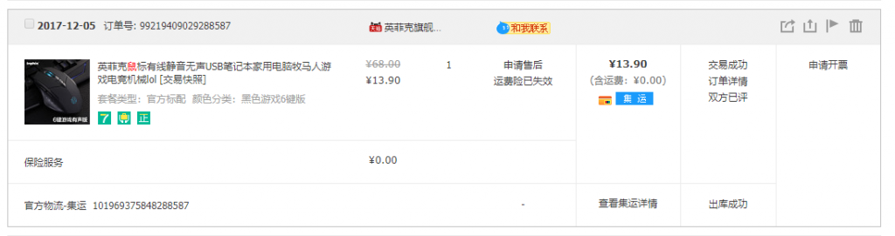 _Before Price - Gamer Mouse_

When we tried to buy it again this month, it jumped to RMB 23.80 (72% increase). Even the basic version is RMB 15.10 - higher price for a lousier product.

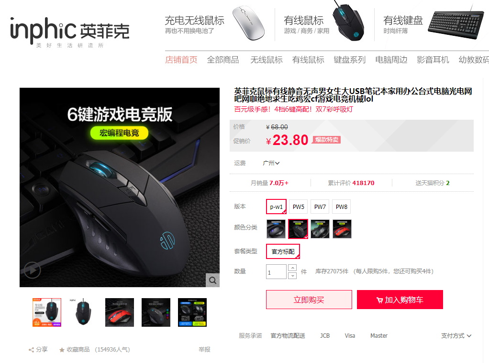 _After Price - Gamer Mouse_

### Neti Pot (+35%)

For some reason Shopee or Qoo10 can be cheaper. A cheap neti pot on Shopee sells for SGD 2.66 without shipping.

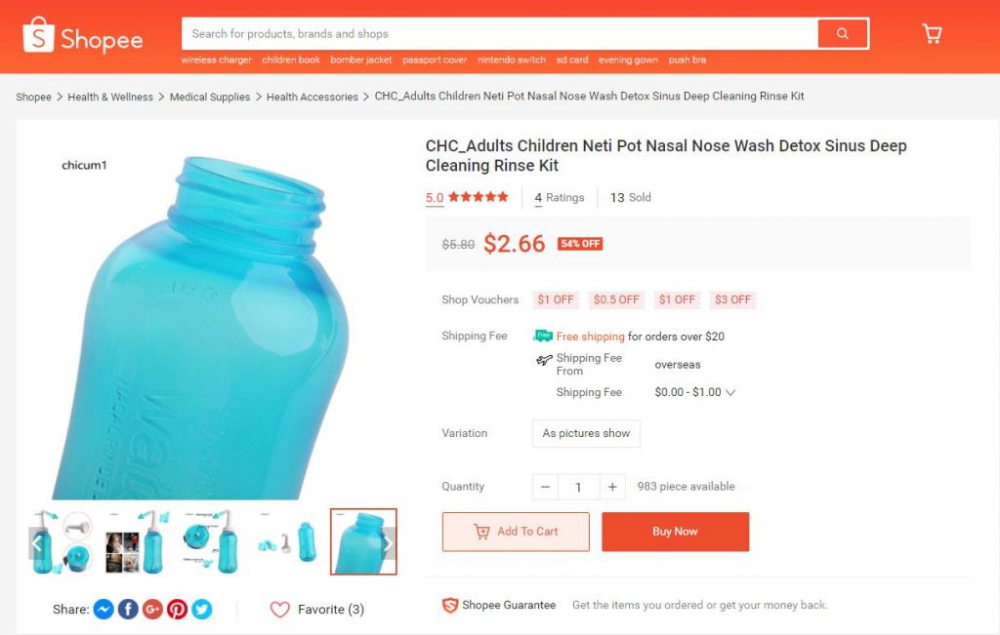 _Shopee Price - Neti Pot_

A cheap Taobao seller sells for more, i.e. SGD 3.60, without the shipping cost.

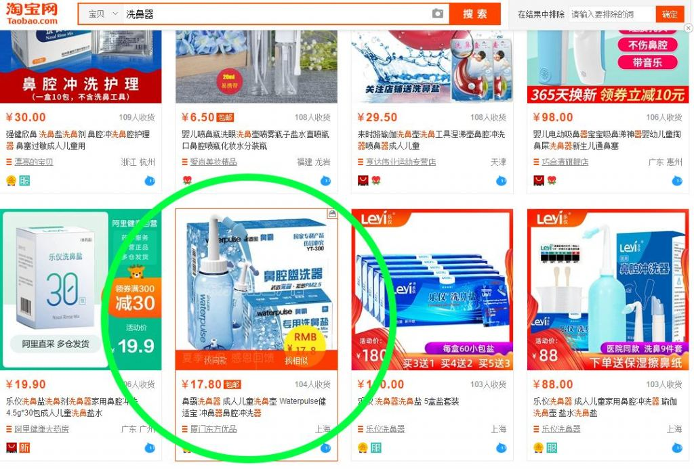 _Taobao Price - Neti Pot_

### Hangers (+4%)

The price of nice, thick hangers similar to those Ikea used to sell increased a little. It was RMB 57 for a pack of 50 hangers.

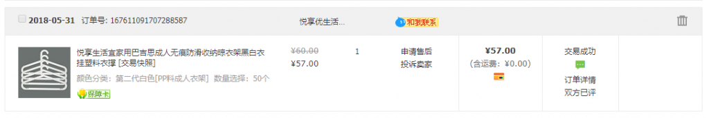 _Before Price - Hangers_

It's now RMB 59 for a pack of 50 hangers. A small increase that you won't notice unless you look closely.

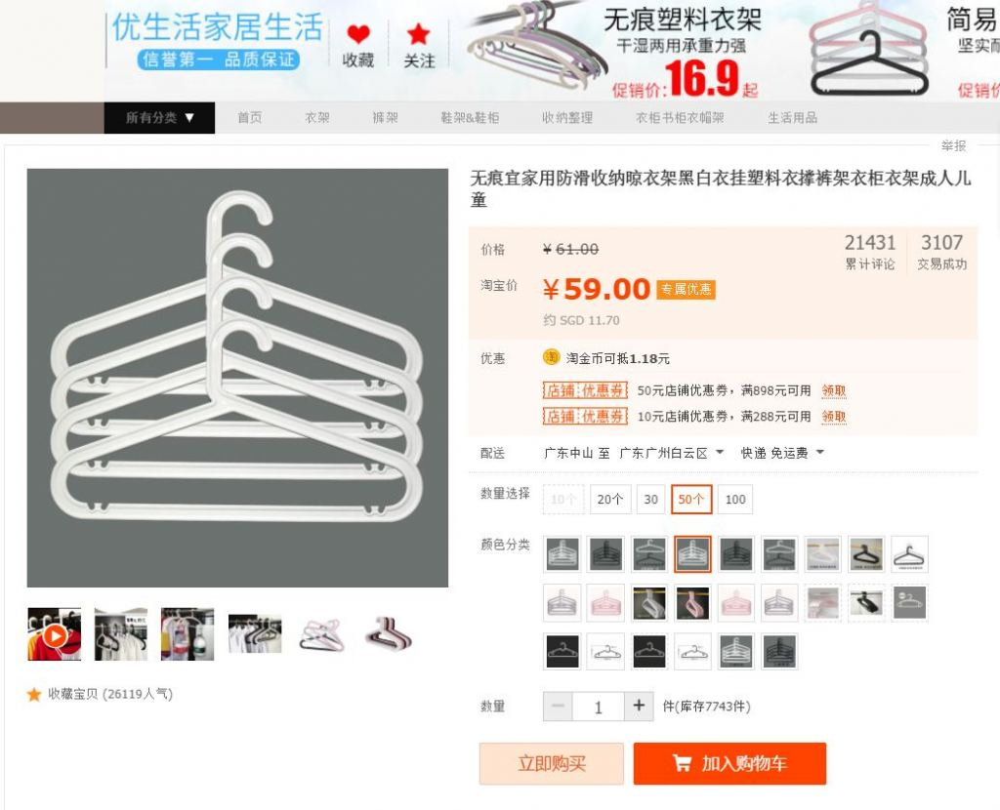 _After Price - Hangers_

### USB Type C Cable (+14%)

Although sale prices can vary, we used to buy the USB type C cables at RMB 13.90 for 3.

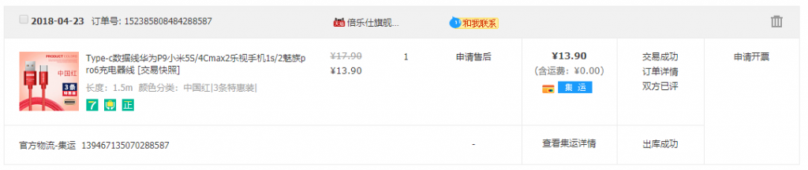 _Before Price - USB Type C Cable_

It fluctuates, typically upwards, and is now RMB 15.90 even on promotion.

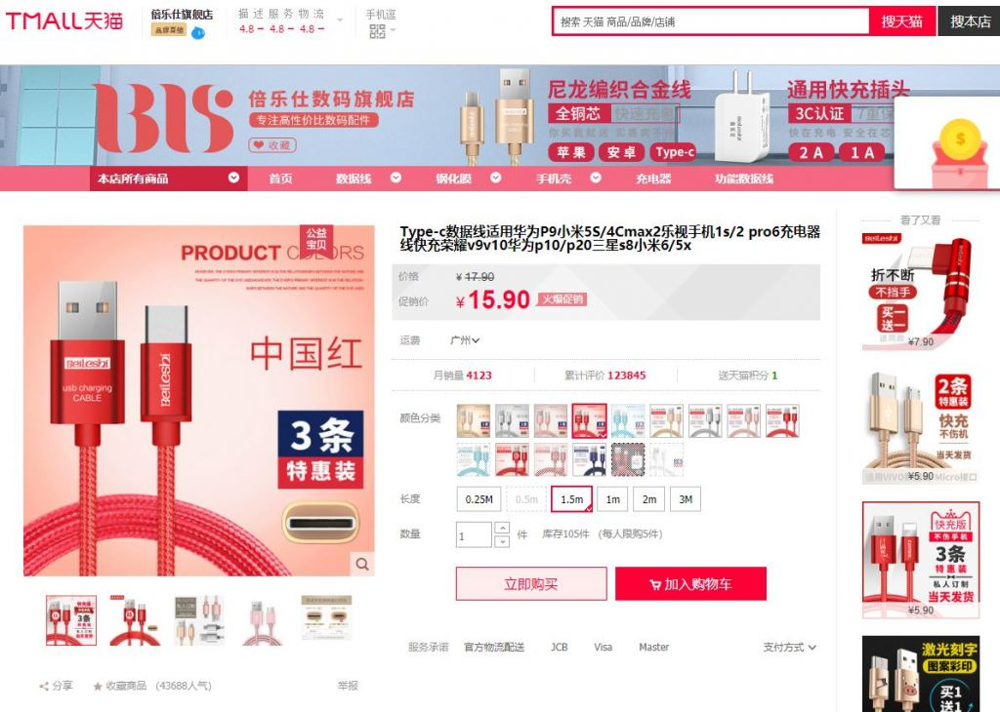 _After Price - USB Type C Cable_

### Bathroom Tap (+18%)

Our bathroom tap increased in price, from RMB 288 to RMB 330 (increased 18%).

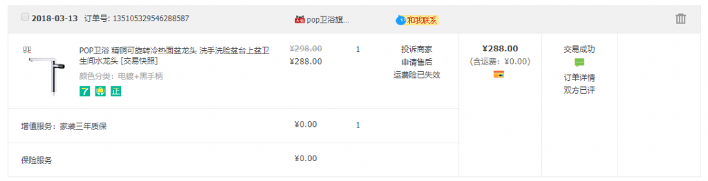 _Before Price - Bathroom Tap_

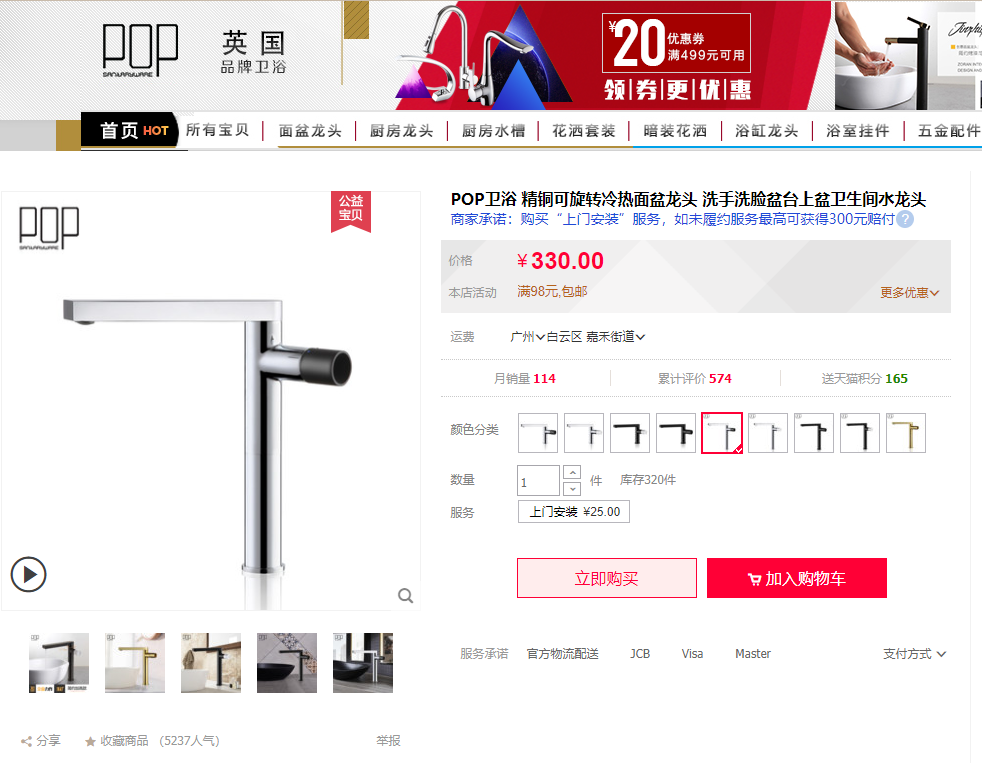 _After Price - Bathroom Tap_

### Clothes Hook (+21%)

Our clothes hook increased in price from RMB 114 to RMB 138 (increased 21%). That said, this might be due to differences in promotional prices, although we doubt it, because 女王价 weren't fantastic.

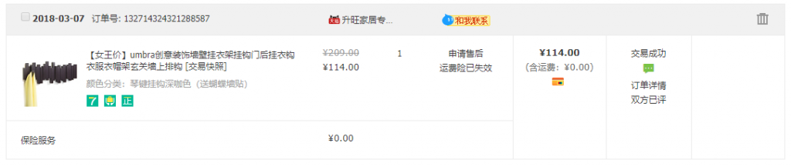 _Before Price - Clothes Hook_

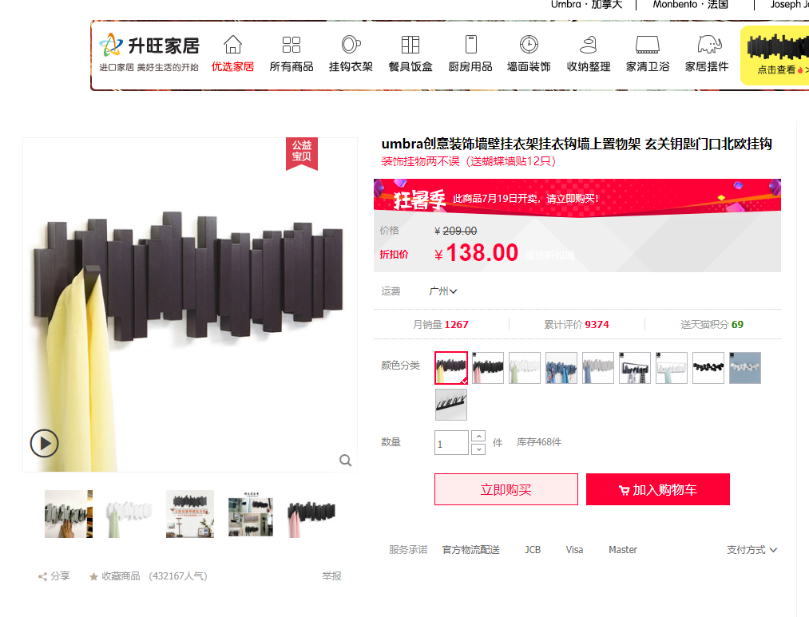 _After Price - Clothes Hook_

### Animal Stool (-10%)

Some items do drop in prices. For instance, the cow and elephant stools we bought dropped from RMB 99 to RMB 89, because they added more colours and reduced the prices for the original colours.

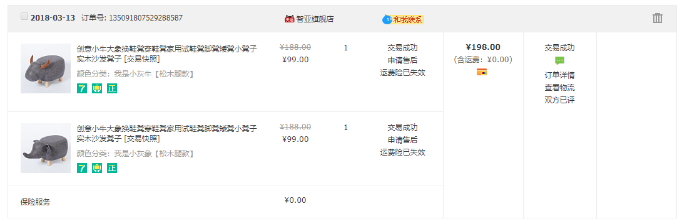 _Before Price - Animal Stool_

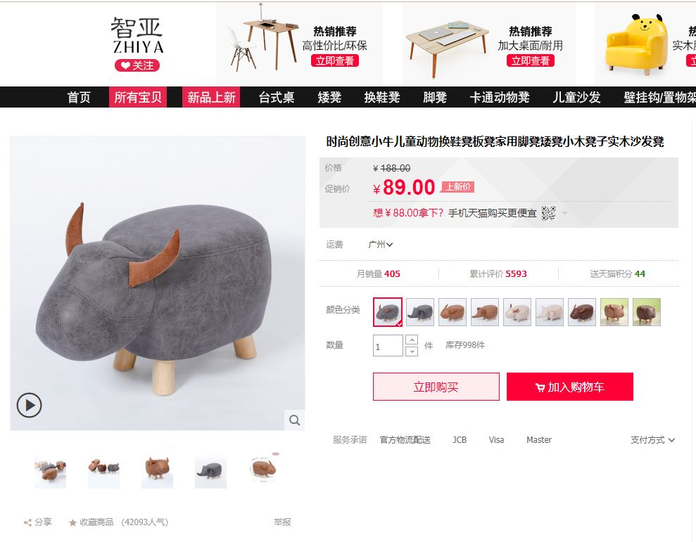 _After Price - Animal Stool_

## Conclusion - you can still buy, but don't assume Taobao prices are always cheap or constant

The aim of this post was to show that Taobao prices are not always cheap, they're not always constant. They can go up.

Do your homework and make sure you don't buy something that's not that cheap. Might as well go to the 五金店 / hardware store / Ikea and buy whatever you need at a cheaper price.

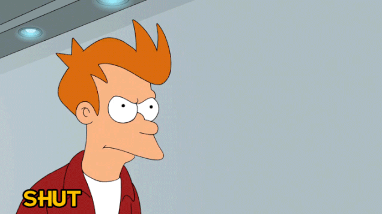 _Take my money dammit!_

Caveat: this is not a rigorous scientific study, we cherry picked the examples above. Many shops have kept their prices or lowered those. Like the prices for the animal stools.
