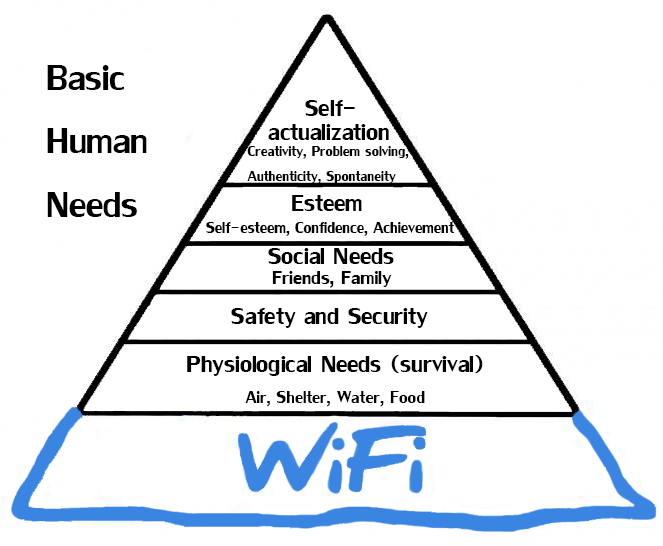
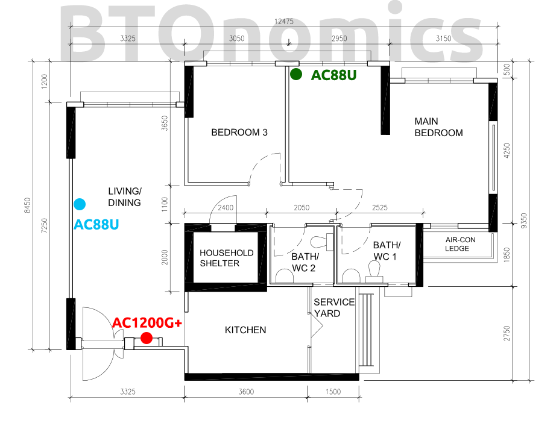
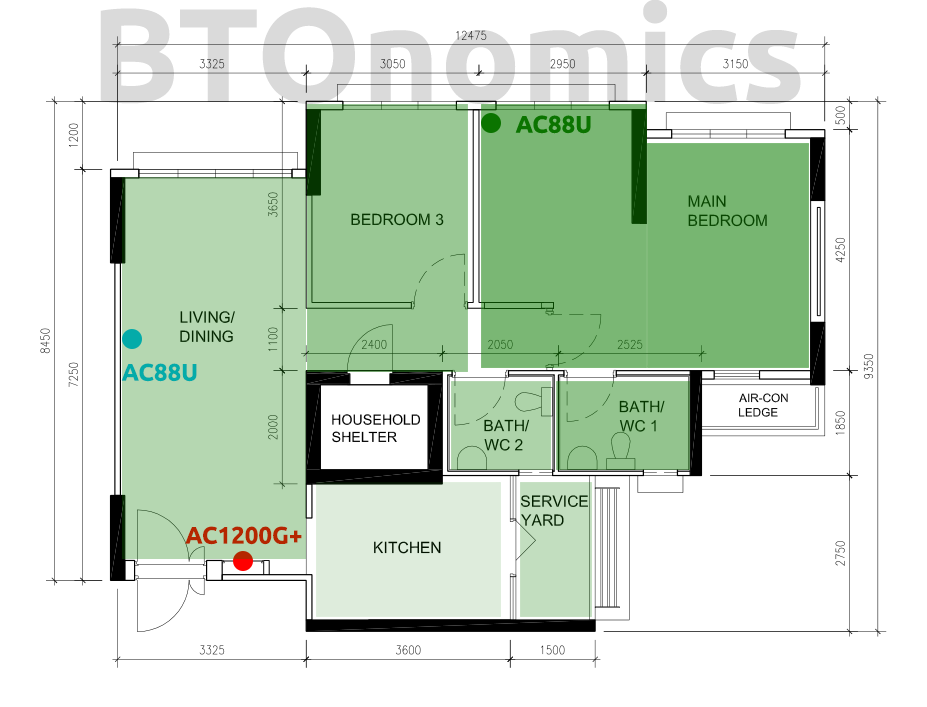
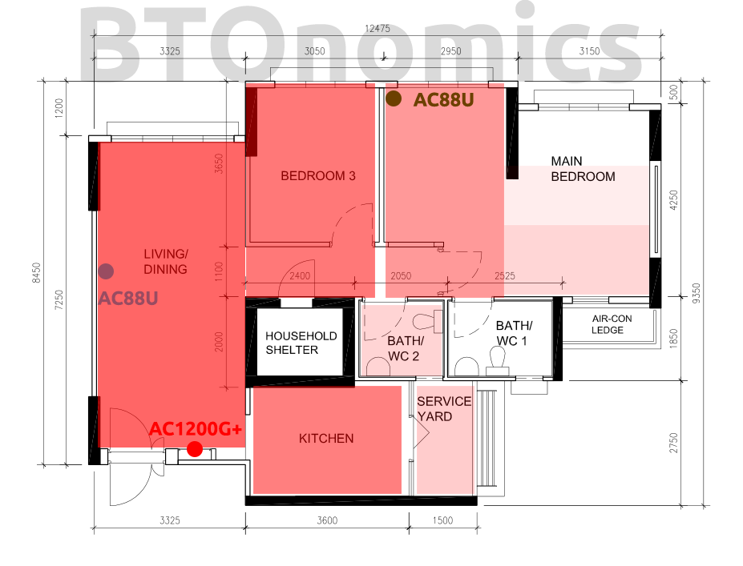

Wifi is [a basic need](https://www.studyfinds.org/food-shelter-wifi-study-says-free-internet-should-be-a-basic-human-right/). Especially in Singapore. Everyone here goes online on their laptops and phones via Wifi. So your HDB Wifi setup is the most important thing to get correct, otherwise you better hope you're not on a shitty legacy Singtel Combo 1 2GB plan.  _Maslow's Hierarchy of Needs - Wifi is our ultimate need._

## We Use a Mesh Network

We're using a mesh system. Mesh networks allow you to have 1 network (SSID) name across different routers and access points. If you've 2 routers and networks, your phone will keep disconnecting/reconnecting if you walk around. So videos pausing, downloads stopping. With mesh there's no such disconnect (at least to the user).

Our mesh is not the traditional mesh, it's Asus' AiMesh. AiMesh is Asus' technology to turn a few Asus routers into a mesh network. The benefit is you can reuse old Asus routers or get more flexibility to use them separately.

We originally considered whether to buy a traditional mesh like Google Wifi (replaced by Nest Wifi), Asus Lyra, and Linksys Velop. But we opted for this because our entire setup is still slightly cheaper and we have the flexibility of owning 3 individual routers.

## Our HDB Wifi Setup

HDB Wifi setups typically only have 1 router in the DB box. We have 3 routers, but we typically only turn on 2 (main bedroom and DB box).

- **DB box:** 1 x RT-AC1200G+ router --- Network switch, connected to ONT
- **Main Bedroom:** 1 x RT-AC88U router --- Main AiMesh, connected via Ethernet backhaul (i.e. it gets Internet through wired connection)
- **Living Room (optional)**: 1 x RT-AC88U router in the living room --- AiMesh node, connected via WiFi

 _Our routers in our 4-room HDB BTO. We only turn on the red and green most of the time._

Our usage is primarily in the main bedroom, [which is the size of 2 normal bedrooms](https://btonomics.com/renovation/our-clean-bto-home-design/). That's why we decided to put our main router connection in the bedroom, for the best speed and signal.

**Note**: We can use the RT-AC88U as the switch router and main AiMesh in the DB box. We didn't because it runs very hot and is expensive, so if we do that the router will spoil faster. So we bought a cheap AC1200G+ router from Carousell (it's given out as a free 1 Gbps contract router by M1) to use as a switch.

## Wifi Signal Strength

To give you a sense of how the Wifi signal is, we created a couple of charts by using a Wifi signal strength analyser.

### Bedroom Router (AC88U)

Stronger signal strength is illustrated in darker green.

The bedroom router is great for the bedroom (obviously) and the toilets. Great signal for times when you need to watch Youtube videos while you're taking a long dump.

The Wifi signal gets really weak when it hits the kitchen, but otherwise the whole house is covered. But this is also due to the AC88U being much more powerful in its signal strength. It can also switch between 5Ghz and 2.5Ghz automatically.

### Living Room Router (AC1200G+)

Stronger signal strength is coloured in darker red.

The living room router is much weaker. There're dead zones in the bedroom, especially where our bed is. The toilets are also a problem.

But as mentioned before, this is also due to the weakness of the router, rather than its placement.

## Wifi Setup Conclusion

If you're not a fussy user and are ok to replace your router more regularly (due to the heat generated degrading the hardware), then you only need to buy a powerful router and stick it into the DB box.

But always estimate how much space your DB box has and whether your router can fit inside. You also need to accommodate your router and ONT, which is typically the size of a small router. The RT-AC88U is large, so it does not fit well inside for our DB box.
