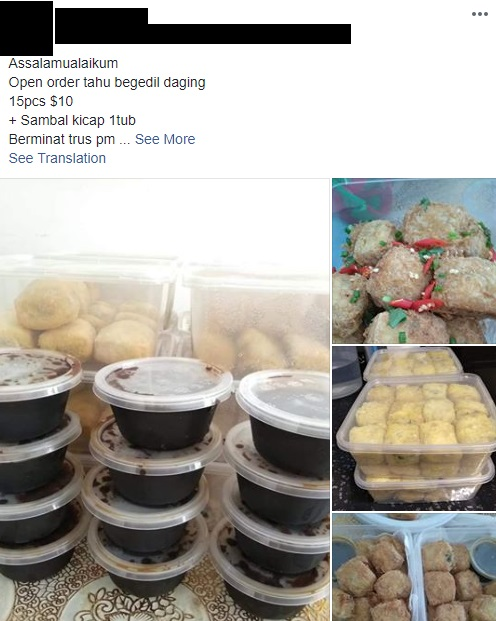
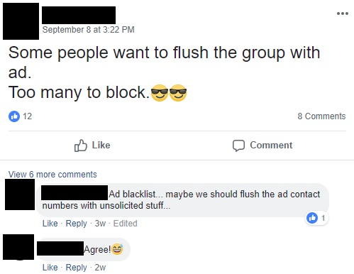

Since we booked our current BTO, we have been in a  HDB Whatsapp chat, Telegram group, and Facebook group. These are for the sake of connecting with the community here.

## It's been quite weird so far

It has been a strange experience, connecting with people who we would never have gotten to know. Not that we actively participate. But it has been interesting to say the least.

We think the strangest thing has been the [imagined community](https://en.wikipedia.org/wiki/Imagined_community) within the estate. People feel like they are linked because their postal codes are related and that should exclude people from across the road.

We found it funny observing the different types of people in these chats. Some conversations and replies can only be greeted with face-palms. There seems to be similar types of people in other estates as well, so I think it's common everywhere. Try to spot them sometimes when you next check out your Whatsapp/Telegram/Facebook groups.

---

## 15 types of neighbours

### "Give me some sugar, I am your neighbour".

They have a strange aversion to Google and find it better to tap on the wisdom of the few residents in their estate. They sometimes expect neighbours to have answers to their worries and problems.

_Let me google that for you?_

### Self fivers

They attach photos of their homes and family at every opportunity, even out of the blue. They have a generous heart and want to share their joy. Of course, they'll feel happy if you praise their good taste and nice homes. "You didn't want to see my home? How about I show you my service yard? Kitchen? Nvm I'll post my toilet anyway, you may like it."

_Self five_

### Cheerleaders

The bedfellow of self fivers. They offer the receiving hand for high fives. One man's meat is another man's poison. But for them, all meat is delicious.

_High Fives_

### Tourists

They ask to visit every home they can because they want to "see see". They match well with self fivers, who welcome all visitors with or without an estate visa.

### Group buyers

They die die have to buy every last furniture or appliance via a group buy, even for cheap items and where savings are negligible.

### Early risers

They must do a good morning without fail when typing in the chat. (Come to think of it, I've never seen good morning greetings in all my other convos.)

_No good morning text??_

### Referral Kings/Queens

They have a referral for everything. Many will post their photos of their buys and urge everyone to sign with their salespeople or contractors. They often caveat "Tell them XX recommended you. I'm not earning any commission, but just wanted to share cos they have been very good." In that case, why do I even need to tell them you recommended me?

### Marketers and Entrepreneurs

Similar to referral hunters. They are the people who bring products and services to you. Even when you don't want them. If you ever wanted to know whether their sister-in-law is a talented kuey maker, brother is an awesome painter, just read all the Whatsapp chats fervently.

You'll be sure to spot several text messages from them asking for the neighbourhood's support. After all, what're neighbours for anyway if they don't buy stuff?

Or if you're looking for an ID or contractor, you'll be pleasantly spammed by helpful "neighbours" giving their honest referrals. Until you realise they're probably IDs themselves.

_This is probably not allowed by the food authorities, but it doesn't matter, what matters is the neighbourly spirit! /s_

### Couch dwelling bargain hunters

Those who are too lazy to get their bargains and end up asking people to help them buy stuff from Jalan Besar, Ubi, JB, etc. Some will also ask for free kitchen and service yard tiles.

_Free stuff_

### Geeks

They will suddenly participate in the chat with much enthusiasm when it comes to a technical discussion about the energy consumption affected by insulation for wiring in the aircon setup... you get the drift.

### Scouts

They are the advance party who always help others scout their houses. "Is my aircon guy there now?" Yes. "Are there packets of cement screed on the floor?" No. Is there anyone in now to help..."

_Recce_

### Lonely folks

Those who are genuinely lonely or want friendships. Many immediately ask for BBQs with people they've never known. Others try to suggest outings to Ubi, JB, and supper. "Prata tonight, anyone? Anyone interested? Meet tonight?"

_Hello? Anyone here?_

### Antagonists

They are the antagonists in any story. They argue, they blame, and they stir issues in ways that Channel 8 dramas would be proud of. No estate is ever complete without them and they are talented in making any problem seem like a controversy.

### Fed up people

When you just can't take the bullshitanymore, you just gotta let it all out.

### Future politicians

They need to control the group(s). If they don't, no one else will. It's not enough to be the creator of a Whatsapp group, it has to be THE Whatsapp group around. There is just no room for new groups. Crush all resistance. They will oftentimes ask for everyone to identify themselves for privacy concerns, because residents are all nice people and outsiders are all dangerous folks. If you don't, may the force be with you.

_Destroy!_
