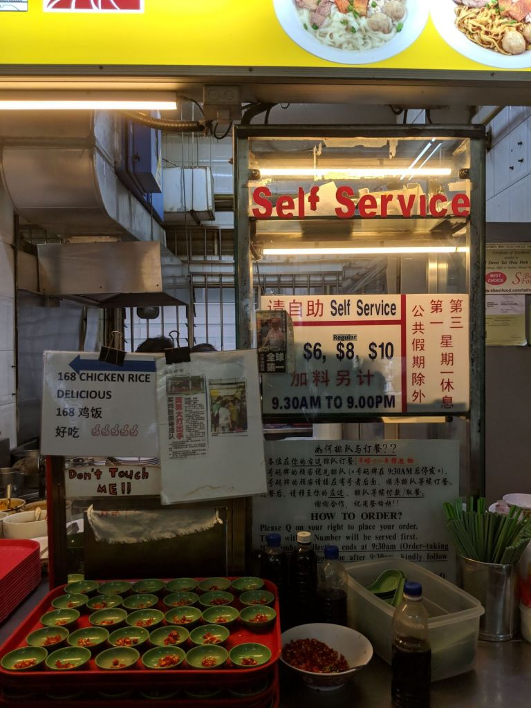
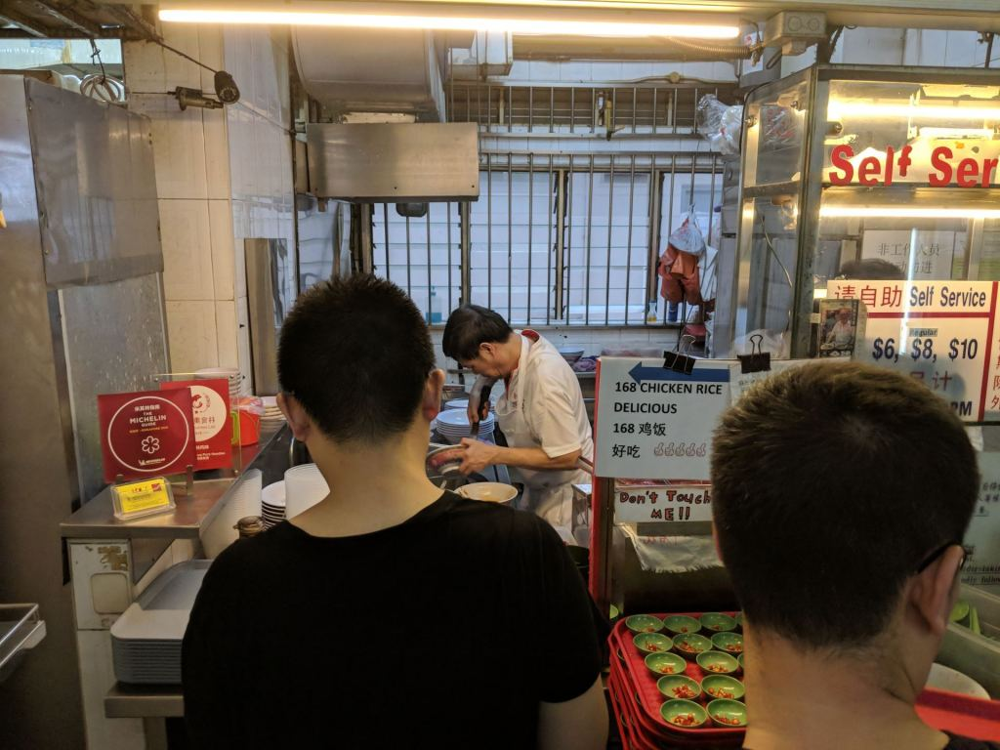

We break with our usual housing-related routine to review good hawker food, [without all the "English" that some food bloggers use](https://www.facebook.com/InfluencersAndBloggersWriteShitEnglish/). As huge hawker food fans, we love a good bowl of pork noodle (bak chor mee). We got the "privilege" to queue for one of the best pork noodles in town, the legendary Hill Street Tai Hwa Pork Noodle (大华猪肉粿条面). It's a Michelin-starred pork noodle famous for its super rich soup.

It's also quite recently renowned for its super long queues.

## Psychology of queues and the sunk cost fallacy

We wrote this blog post during our time queuing. While in the queue, we thought about why people wait in line.

It seems we typically judge that things are good based on how long we have to wait for it if we agree that time is money.

Our willingness to wait for something therefore reveals the value we place on it. So we see people queuing and think that the queue leads to something good.

Coupled with this is the sunk cost fallacy. As this [Atlantic article](https://www.theatlantic.com/health/archive/2013/05/how-to-walk-away/275833/) puts it,

> ... people are generally loss-averse. Putting in a lot, only to end up with nothing to show for it, is just too awful for most of us to seriously consider. The problem is one of focus. We worry far too much about what we'll lose if we just move on, instead of focusing on the costs of not moving on: more wasted time and effort, more unhappiness, and more missed opportunities.

To overcome this, rational people should focus on the benefits of moving on, instead of the disadvantages of, well, not moving.

Unfortunately, most people aren't. We also weren't immune.

## Queuing for Tai Hwa Pork Noodle

Anyway, back to our journey. We didn't queue because there was a long queue though. We went to eat the noodle because we were in the area and PQ has never eaten it before.

The last I remembered it was good but it certainly wasn't worth queuing for 30-45 mins 3-4 years ago.

The queue this time round was damn frigging long, probably due to it being a Saturday and after the Michelin star.

Sometimes the queue didn't move for ten minutes. Sometimes we agonised when people ordered 5-6 bowls at once.

 _This kind of queue must mean the noodle are awesome right? We started out along the walkway at the kopitiam. Damn far away from the stall. The lady in pink gave up halfway._

 _Lady in pink left, survival of the fittest! We progressed a metre or so after 20 mins._

 _An hour plus later we were finally in the vicinity, a sprint finish awaited. The sunk cost fallacy kicked in and we decided not to leave. Apple tshirt guy kept sighing and shaking his head, rightfully so._

 _Almost there! At this point you'll be asked for your order. Apple tshirt guy was noticeably excited when he got his noodle. That bowl of noodle must've been like the iPhone XS Max for the dude. We felt really happy for him._

We considered leaving after an hour. But we couldn't and we didn't. We were irrational suckers who queued too long to give up.

## Ordering

The noodle sells for $6, $8, and $10. I think it used to be $5, $8, and $10 the last time I came. Usually, you'd see people ordering the bigger portions because the queues are just so long.

To order, someone will ask you for your order when you're almost reaching the stall. You'll see this:

 _No one wants to eat 168 Chicken Rice after queuing for 2 hours :(_

It means you order either the $8 or $10, no way someone queues 2 hours just to eat a small bowl. Ok, we kid, some people really do that. #Respect

 _Seriously not going to eat the chicken rice!!_

Anyway, we finally got it at the 2-hour mark.

 _Uncle preparing to cook our long-awaited noodle._

 _Uncle still preparing to cook our long-awaited noodle._

## It was good but wasn't worth the wait

Short answer, it was good but wasn't worth the super long wait. Here's the breakdown of our verdict:

- The minced meat was springy, much better than the overcooked ones that you usually get elsewhere.
- The pig's liver was cooked well, tender and not too cooked. One piece was slightly undercooked but it's no big deal.
- The fried sole fish was really flavourful and crispy.
- The pork lard was very very crispy and didn't have a smelly oily taste.
- The meatballs were ok, nothing special.
- The wanton skin was quite thick and the wanton itself tasted normal, nothing fantastic.
- The noodle were drenched full of vinegar, which was fine, and were sufficiently springy for us.
- The noodle lacked spicy chilli, although this was perhaps more of a personal preference.
- The soup tasted very rich but also carried MSG flavour. We could be wrong though, perhaps that could be due to the umami taste of the seaweed. But it definitely tasted less delicious and rich as compared to the last time I ate it.
- The noodle and soup had dang chye (冬菜), which is pretty awesome as a Teochew.

 _Of course we ordered 2 bowls! Husbands and wives can share weal and woe, but no one should have to share Tai Hwa Pork Noodle._

 _Introducing the Hill Street Tai Hwa Pork Noodle. The fried sole fish always is and was the best part of the dish. You can see the noodle were just drenched in vinegar._

 _The rich soup which I felt declined in standard, as compared to the past._

It's a very solid bowl of pork noodle. It's probably not too expensive at $8 a bowl, even for us.

**Overall, it's a good bowl of pork noodle, but definitely not worth the amount of queuing. 30 mins might be the most you should queue for it.**

We probably won't go back to eat it for the next few years.

## Admin details for Hill Street Tai Hwa Pork Noodle

- Hill Street Tai Hwa Pork Noodle (大华猪肉粿条面).
- 466 Crawford Lane, Tai Hwa Eating House #01-12, S190465.
- Stop at Lavender MRT and walk past ICA and cut through the HDB shops.
- Opens from 9.30am to 9pm. Closed every 1st and 3rd Mondays of each month.
