We got a lot of stuff from Taobao for our HDB BTO home - well, [at least those that arrived safely](https://btonomics.com/shopping/taobao-missing-item-how-shipper-lost-parcels/) anyway. (If you're thinking of starting out, then you should [check out our guides](https://btonomics.com/tag/taobao/)!) Many of you probably are thinking of buying a cabinet from Taobao. It's so cheap there. We won't discourage you, but maybe you can pick up a tip or two from our experience. So this is where we do a Taobao cabinet review.

We needed one to fill the space under our clock. We bought a Taobao cabinet. It was not the cheapest but definitely pretty and in line with our theme. Or at least this was what we saw in the product description. The tricky thing was that it was the first time we'd bought a huge, bulky item from abroad. We also had no idea if we could install it ourselves (for China-based buyers they've a home installation service).

But we took the plunge anyway - YOLO and it was very expensive if we wanted to buy anything like that locally. Here's a picture of what it should look like:

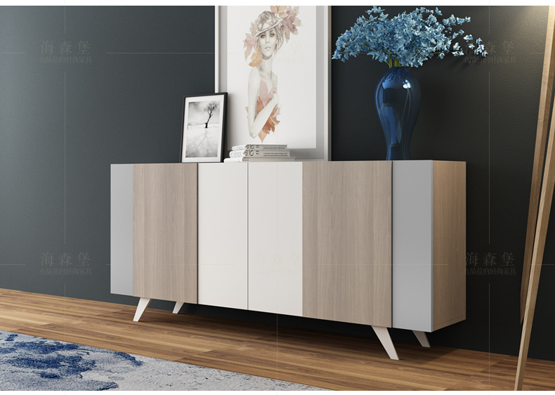 _Beautiful, but as with Taobao product images could be a misleading computer-rendered picture._

But it does look a little like a computer rendered design because the lighting looks artificial. In any case, this is the best case serious. Not too bad.

## Buying it

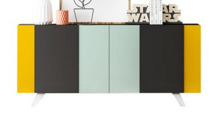 _This was definitely not going to fit our grey theme. Nope._

Buying it was simple enough. Before we bought it, we asked whether they could do a wooden crate to protect it (the answer was yes). We bought it. On hindsight our buy was a problem because they still didn't ship it after almost 2 weeks. We asked how long it'd take for them to send it out. The answer was about 15 more days to ship it out. In total that worked out to be almost 1 month from the time we paid for it. It was crazily long, so we rushed them. Apparently they couldn't hurry because they made each cabinet individually and they ran out of stock. They wanted us to take another Star Wars inspired themed cabinet instead (picture above), which totally didn't match what we were gunning for. So we said no.

Wait, we did. Eventually they did send it after about 3 weeks. It took another week to reach our China Taobao warehouse. 4 weeks in total from the time we paid up. This is something to consider when buying furniture on Taobao.

## Shipping our cupboard to Singapore

We received our stuff. Then we shipped everything back. No fuss, and we eventually received it in a huge shipment with all our other stuff. That was the first of 4 shipments in total for the house. In the end, it didn't come with wooden crates. It came in several boxes - 1 for the large planks and 1 for the accessories. But so far, so good.

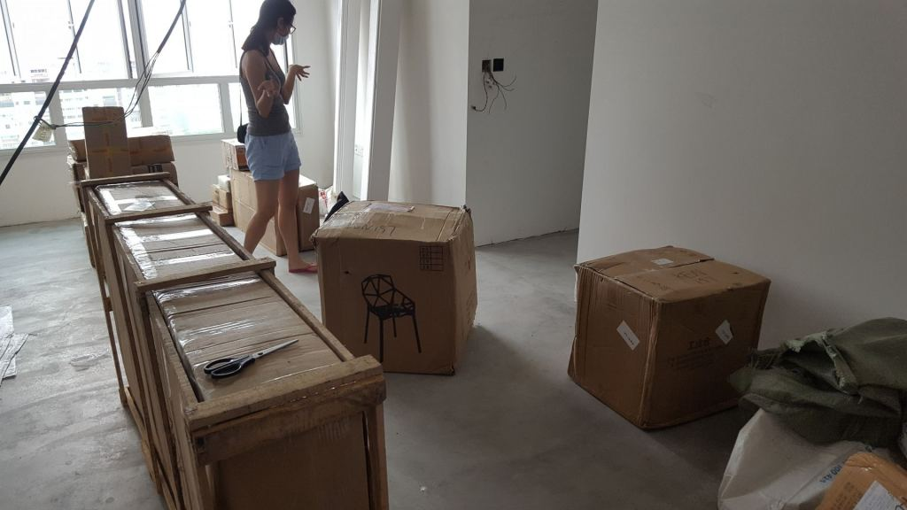 _Big boxes, small boxes. Big cost savings but also big headaches managing the shipping and logistics. The wife appeared quite flustered!_

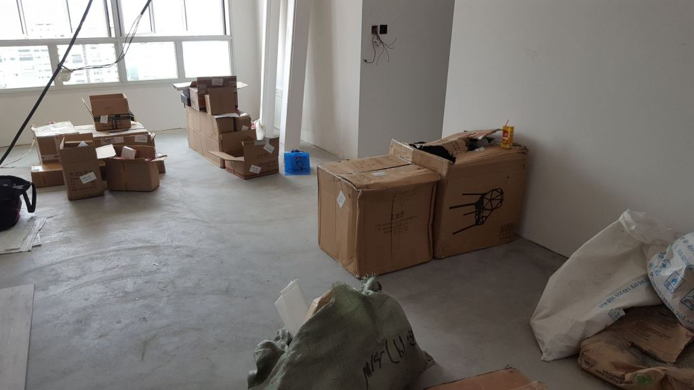 _We packed the boxes a little._

The materials were good. The typical concern with Taobao stuff is that the quality suffers quite a bit. But not so in this case. The wooden planks were solid, the screws and hinges weren't rusty. The hinges were even soft closing ones. The paint laminate looked pretty ok.

## Installation

Installation of the cabinet was where it got real tricky. But it took some time before we realised that. One thing most guides or sellers don't tell you is that once you buy your furniture online, you're on your own. Sure, sometimes the seller can give you some tips or guide you through on 阿里旺旺 but don't expect world-class service. When the cabinet came, it came with just the planks and accessories. There were basic instructions on how we had to install it. The problem was it wasn't very clear, it was sometimes wrong, and at times just confusing. That said, the start of the installation went without a hitch. We were clearing the steps easily!

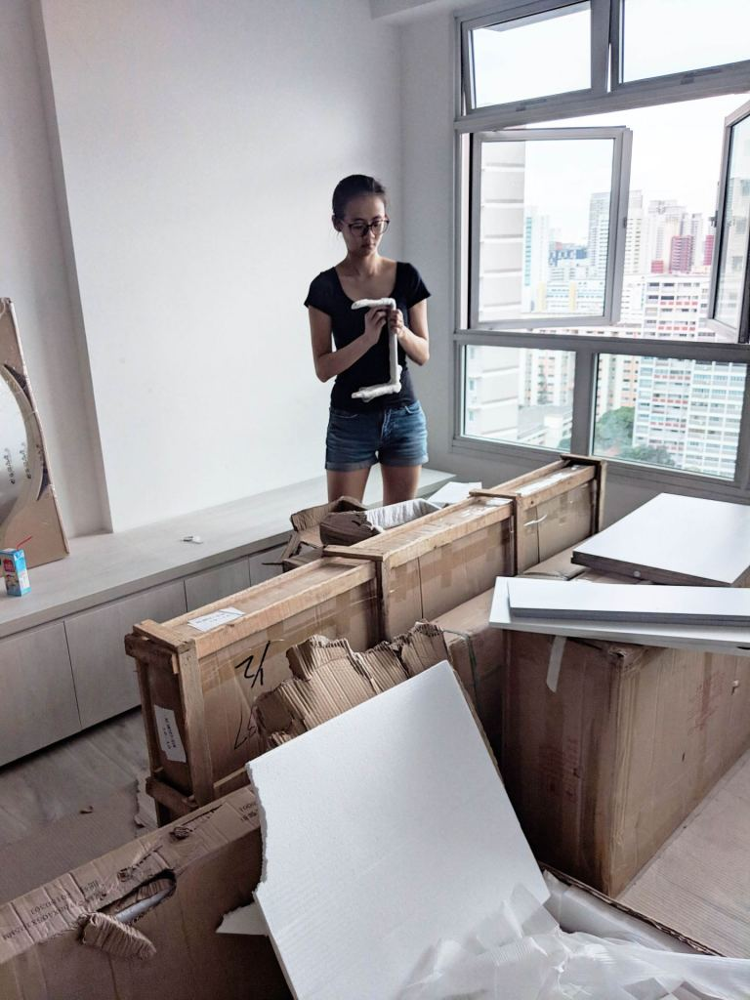 _Getting ready to tear open the boxes and starting the installation. We were so full of hope and enthusiasm._

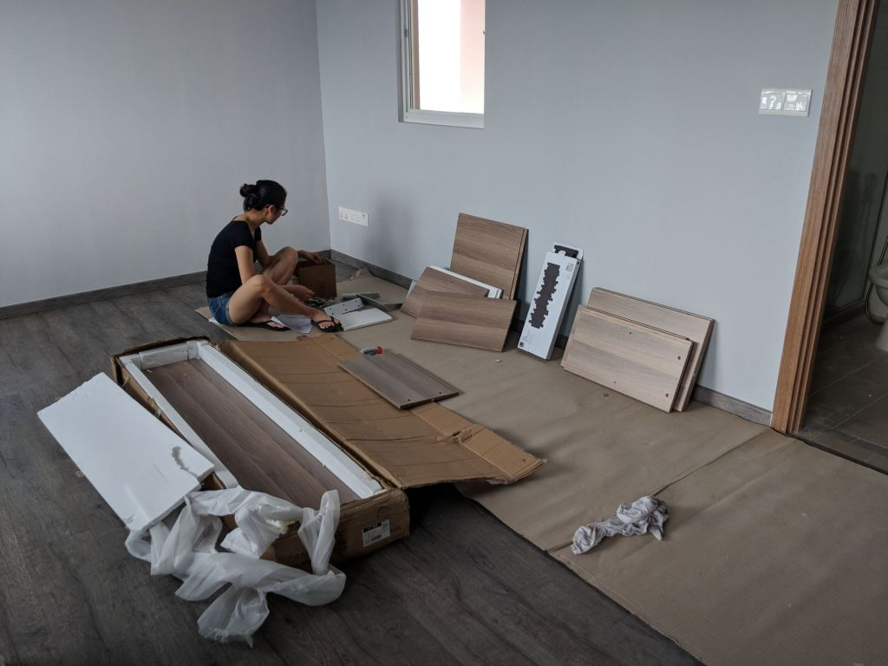 _We laid everything out nicely. There were long planks and there were short planks._

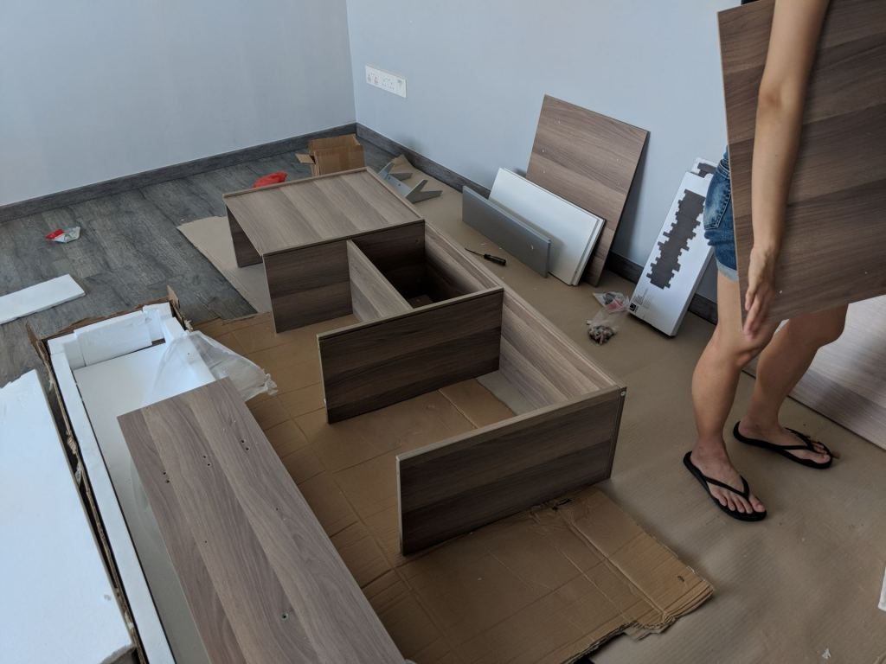 _The process was like building lego but with confusing steps and having to plug in screws and plastic joints. We felt like a million bucks when we reached this stage! Everything seemed under control._

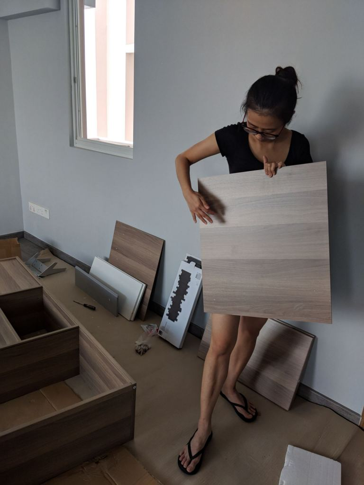 _We could almost smell success. It all seemed straightforward._

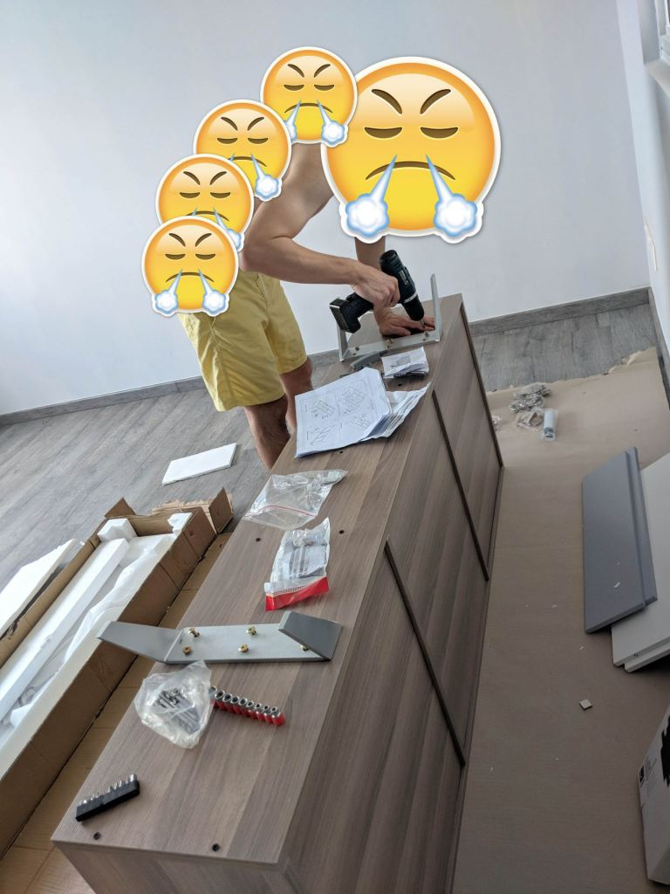 _Then came the legs, which were also quite straightforward. We took our electrical drill with the screwdriver bit attached and easily screwed them in._

### Then shit hit the fan

It got real problematic when we had to screw the doors. The doors were the biggest ever headache. There were holes on the main cabinet wooden planks where you installed the hinge. Just screw the screws in. But there were no holes to guide you once you put the hinge into the circular part of the cabinet door. So we had to estimate and agar agar. And they required an electric screwdriver - because there weren't holes we had to press hard and make a hole ourselves using the screws.

The end result was super bad. The door closed but it was obviously slanted. We thought ok maybe we'll try another door. Same result, but now it was worse - THE FIRST DOOR CLOSED ON TOP OF THE SECOND ONE. FK OUR LIVES. All the life and hope and enthusiasm drained out of our lifeless corpses when we saw that steaming pile of crap that was our DIY cabinets. Usually that's when you cue husband-wife quarrels.

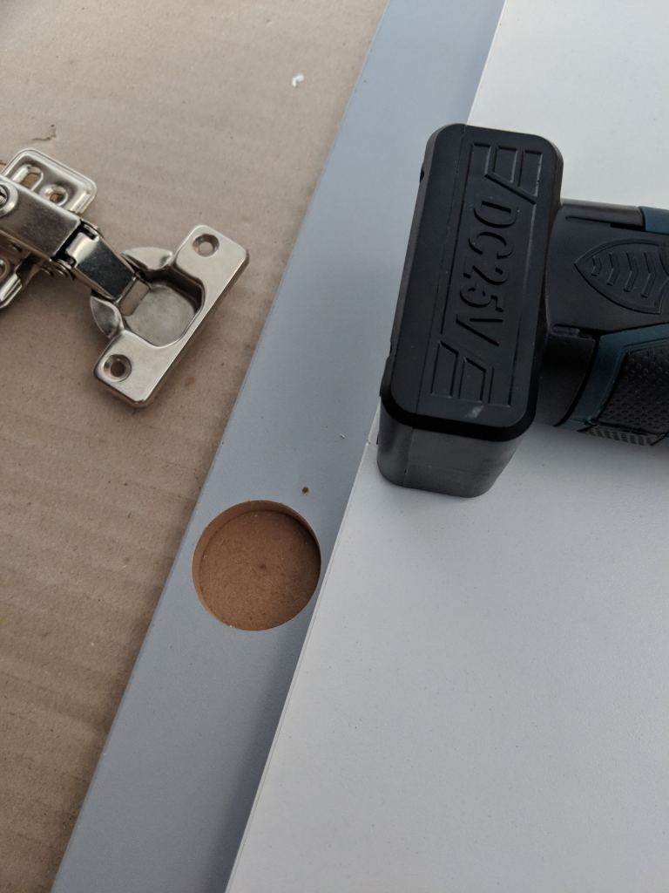 _We used the planks to align the hinge. Not the best way to do this._

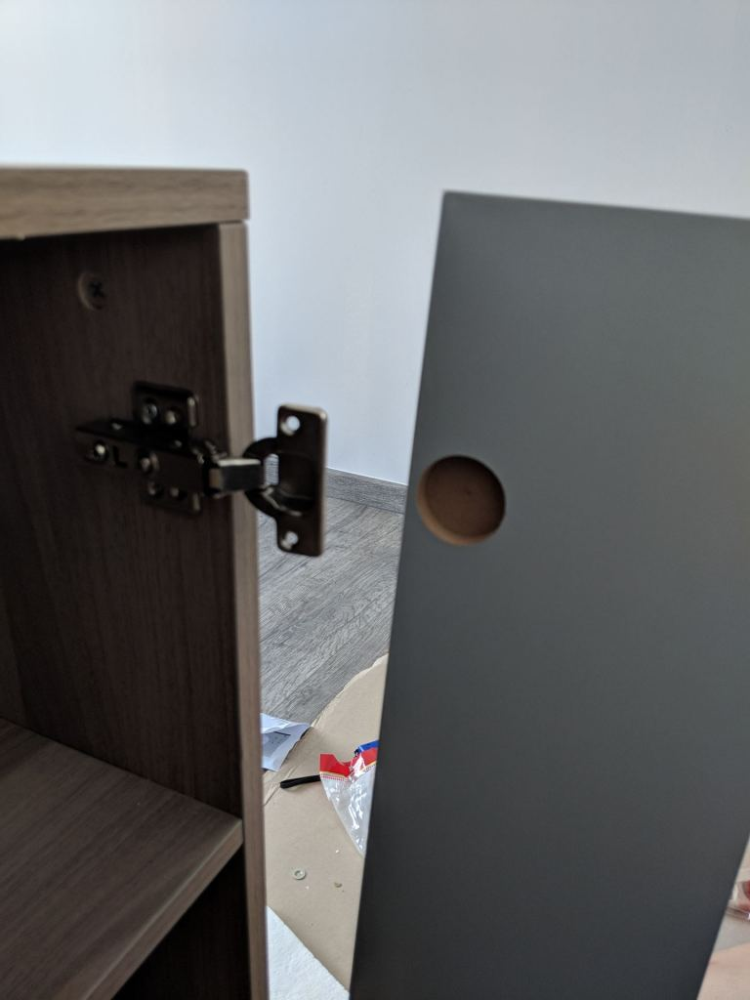 _There weren't any holes to guide us in placing the screws. We had to just press the screws in harder with an electrical screwdriver._

### It got worse

To make matters worse, we tried to redo the screws on the main cabinet planks and cabinet door. We did it a few times, not knowing that we could've adjusted the hinge (the screws on the hinge itself that allowed you to adjust the angle of closure and the gaps). We came to another FML moment. PQ said she was ok with the uneven door heights and them being misaligned. I said no way I'd accept this, because a cupboard that couldn't close properly was crap. But then this caused another problem. I screwed and unscrewed the screws so many times that the wood couldn't hold onto the screw anymore. The wood lost its strength because I damaged the screw hole. Now the door couldn't even stick onto the main cabinet, because it'd just drop down.

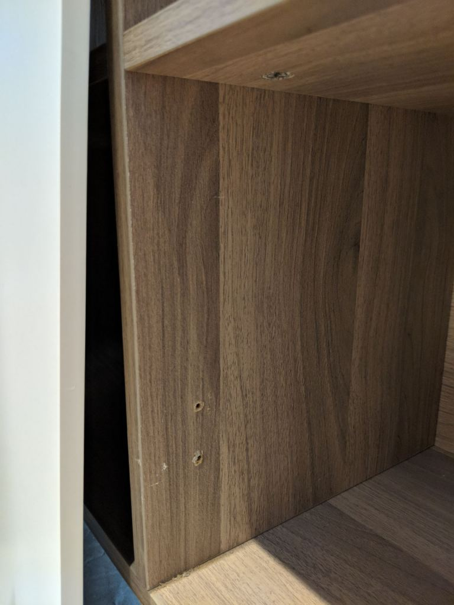

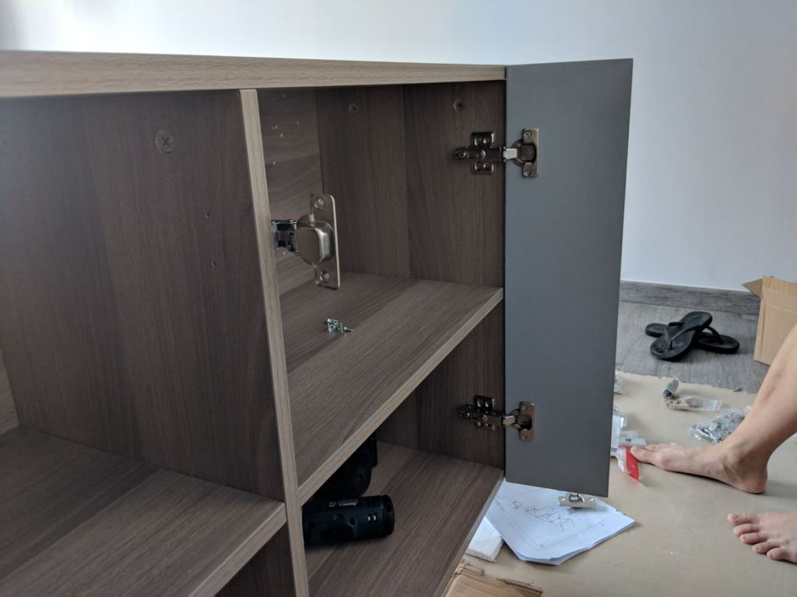

At this point we were probably at the point where we seriously had to consider having a cabinet that didn't have any doors, or consider writing off a $300 cabinet. It was bad. We thought about getting a carpenter to come in to save our cabinet, even though that'd cost quite a bit of money. Totally not cost effective but at that point we were desperate house-husband/wife.

## Getting saved

We called out an SOS and we managed to get some help from Jun Wei. He popped by a couple of weeks later to check on some stuff and helped us to drill that couple of holes. He managed to reseat the screws instead of that spoilt hole. Phew! We realised that we could adjust the hinges by adjusting how tight the screws on the hinge were (there were screws popping out of the hinge in the middle). Though we didn't use it for this case, we also learnt that we could use matchsticks and glue in future if we had similar problems. After that we went ahead to fix all the other doors.

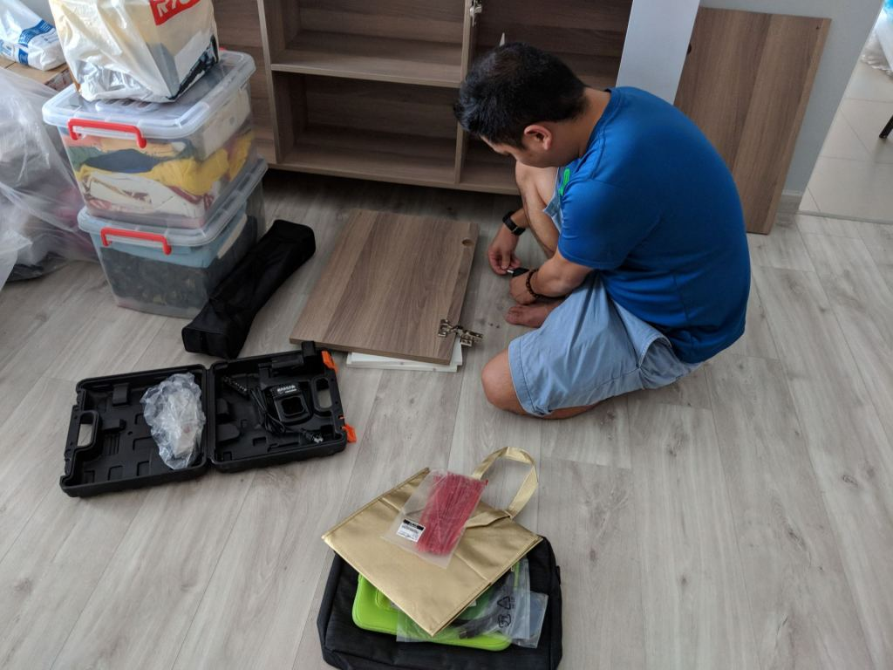 _Our saviour, Jun Wei, at work. He was good at this._

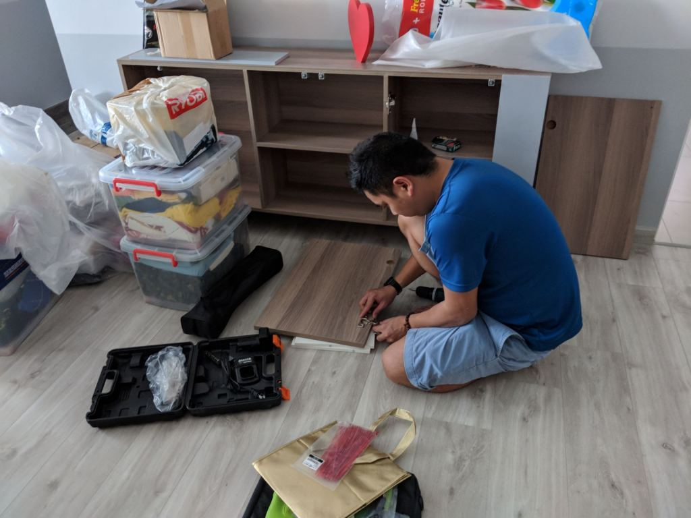 _Like really good._

There were some faults. The middle doors weren't perfectly aligned and it's a little too tight at some of the doors (so the side of the door scratches the main cabinet). But it's all fine - at least we didn't waste $300. We finally had a working cabinet. We were too lazy so we skipped a lot of stuff like random things to screw on the back part, spring mechanisms for the door, and the lights.

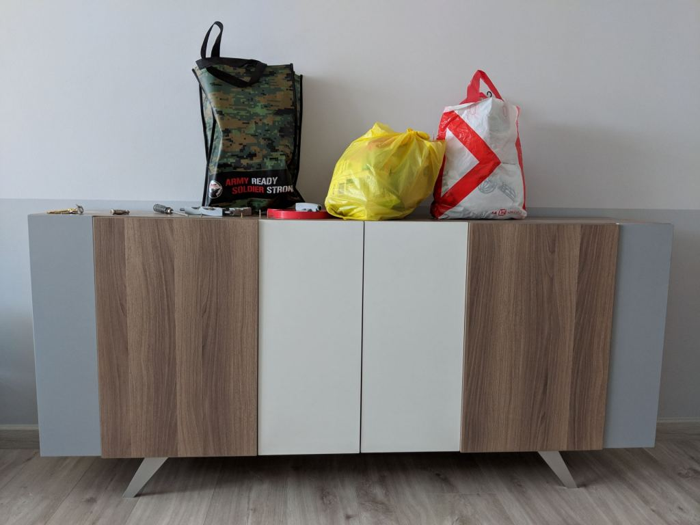 _The result after installation. Yes that's an Army Open House tote bag, the wife is a huge fan of everything in the SAF and enjoys being a mini "SAF ambassador"._

### We managed to get replacement planks from the seller

After we did up our Taobao cabinet, we went to contact the seller. We fixed the cabinet, but the cabinet doors still felt like it could drop down. It felt flimsy. After much persuasion, the seller was damn nice. They agreed to send us replacement wooden planks in exchange for a good review. Actually they didn't even need to say that because we already gave a good review.

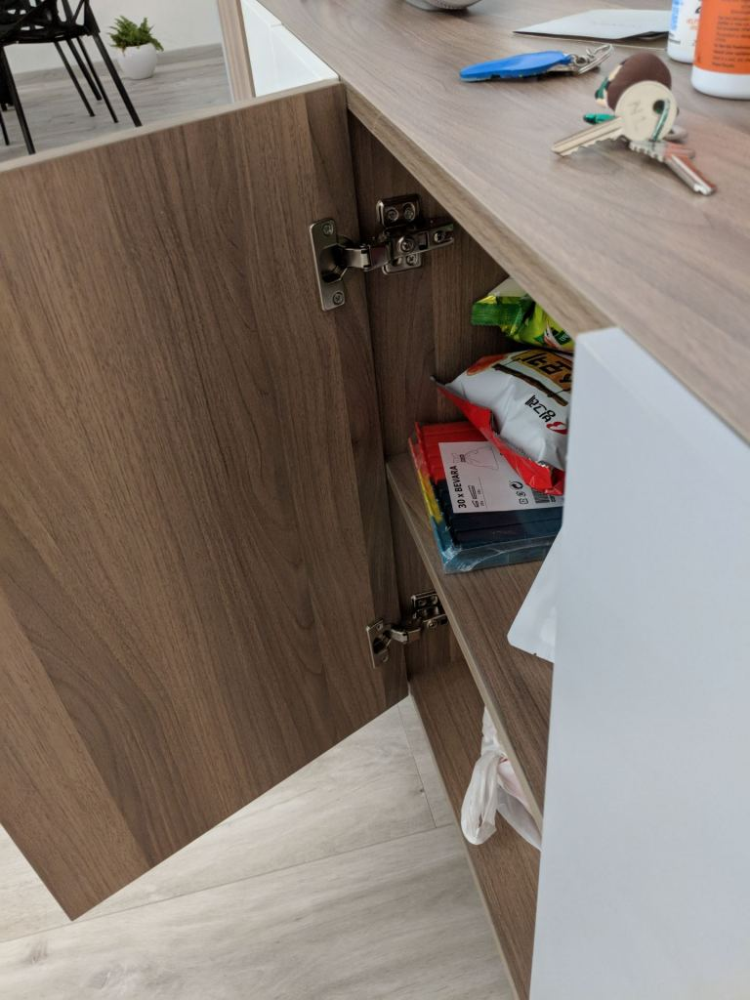 _Jun Wei fixed our botched job with the screws. It was eventually flimsy but serviceable._

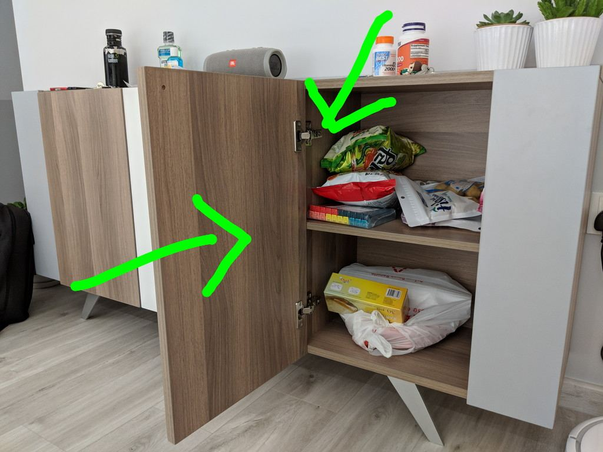 _We texted the seller to say we needed these 2 planks, and they agreed to ship replacement planks._

A month later we received the planks, but we didn't use them in the end because the cabinet held up rather well and we'd need to dismantle the whole thing to replace the planks. The cabinet might not withstand dismantling, so we ditched that idea.

## End result

The eventual result was this:

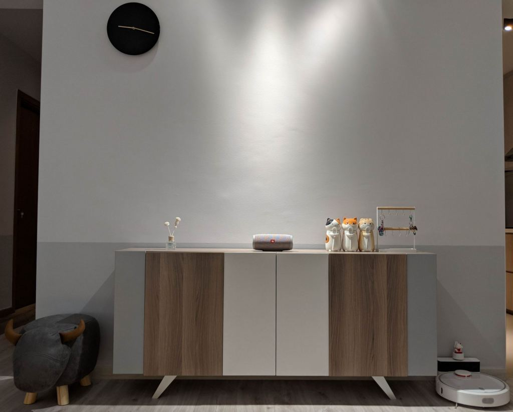 _The finalised cabinet, sorry if the photo looks like crap. Because no one took "professional" photos for us so we whipped out our camera phones and took a photo._

Pretty good result. Our Taobao cabinet fit our theme and wall paint colour quite well. It wasn't worth the effort we had to expend though. There're much easier and cheaper (opportunity cost) ways to do this. In short, our Taobao cabinet was not very cheap, quite pretty, but super hard to install. The quality was good if you think about the components. It was probably better then the typical Ikea quality of DIY furniture, but definitely several notches below your Scanteak type of quality.

Get your other half to help out, the assembly and installation really felt like a 2 person job. Make sure you prepare yourself if you must buy a Taobao cabinet and make sure to do things slowly and cautiously. Have a lot of patience. Don't be like us and continuously screw and unscrew the screws. You might spoil the holes and mess up your cabinet. And get an electrical screwdriver if you want to do these things. You can't install your cabinet otherwise with all the screws that needed quite a lot of force.
