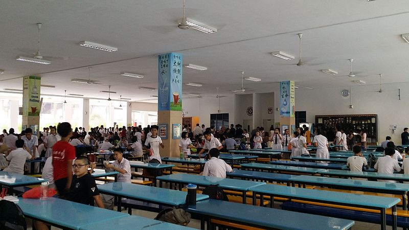
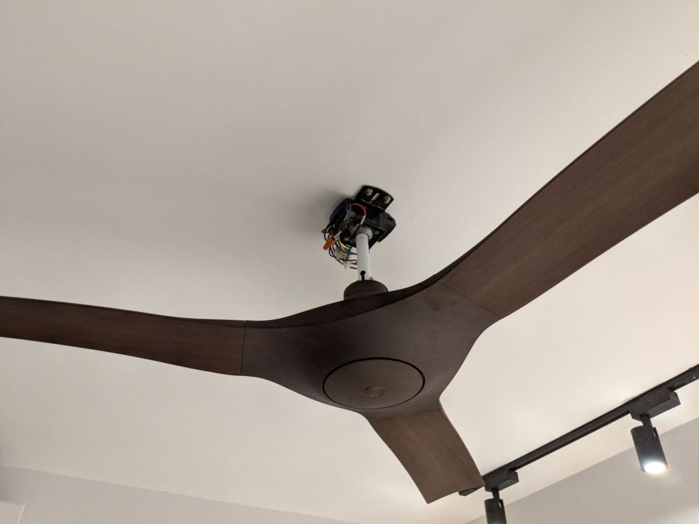
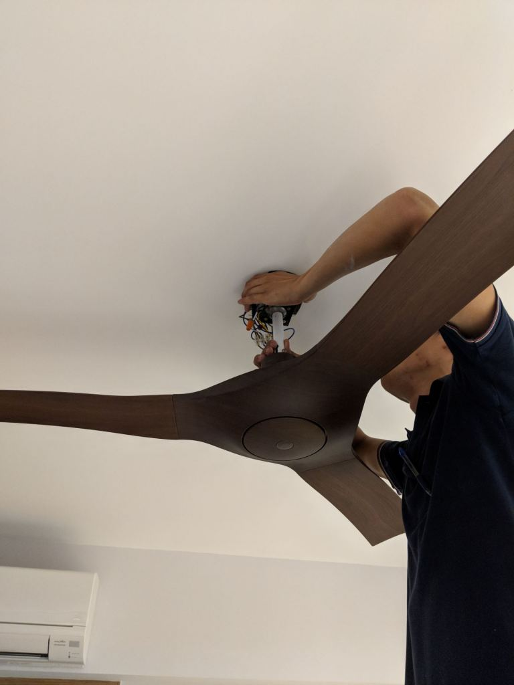
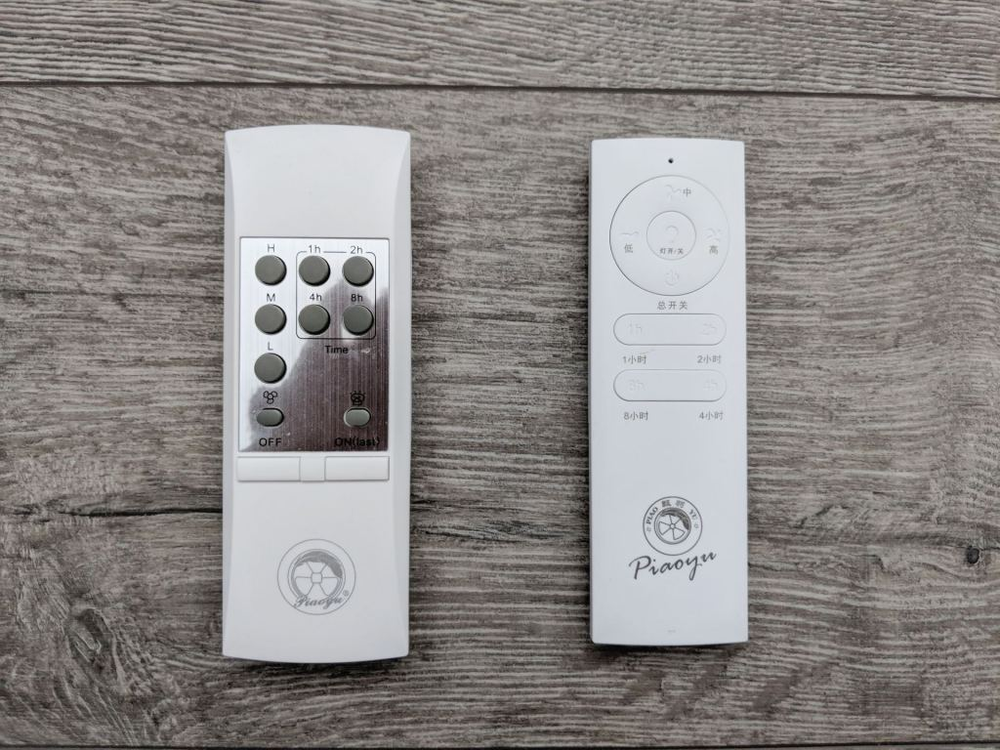

We bought a couple of our ceiling fans from Taobao, so here's our Taobao ceiling fan review. [If you missed our post, get up to speed here with why we chose to buy the fans from Taobao](https://btonomics.com/renovation/getting-ceiling-fans-for-a-bto/).

The first reaction most people have after hearing this is - "Like that also can ar? Will the fan drop?" To be honest that was also the initial reaction we had. Back when we were deciding to buy ceiling fans there weren't Taobao ceiling fan reviews. So we had to rely on a review by someone we knew who bought Taobao ceiling fans. They worked fine and that gave us courage to buy them.

## Purchase and Installation

[We bought our ceiling fans from a seller that was supposedly an OEM of Elmark, under the name of Piaoyu](https://btonomics.com/shopping/getting-ceiling-fans-for-a-bto/#installing-fans). The Taobao reviews were good except for a few complaining that the fan wasn't powerful enough. We got our ID to install the ceiling fans for us. Of course, they don't look fabulous like haiku fans. But they still looked great after installation because they were quite stylish. Very different from those white/black KDK ceiling fans that you'd typically see at kopitiams or schools.

 _The typical school canteen KDK ceiling fans ([source](https://commons.wikimedia.org/wiki/File:Nan_Hua_High_School_Canteen.jpg))._

## Usage

### Rattling, _tik tik tik_, sound

Poor quality control for parts. We haven't had the PCB blow up on us, or maybe not yet, but the quality for the fan still hasn't been ideal. It always gave a _tik, tik, tik_ sound, like something loose was rattling. You can probably tell from the videos, although the sound is not very loud relative to the sound of wind generated (it's difficult to capture audio near the fan).

<iframe
    src="https://www.youtube.com/embed/B4wVlvXUWBw"
    width="560"
    height="315"
    frameborder="0"
    allowfullscreen="allowfullscreen"
></iframe>
<iframe
    src="https://www.youtube.com/embed/qZMTWBrlH-8"
    width="560"
    height="315"
    frameborder="0"
    allowfullscreen="allowfullscreen"
></iframe>

We asked the seller, but their suggestions weren't helpful. We got the electrician to fix the fan twice, but it always came back after each time a few days after.

 _We got our helpful electrician to fix the issue, which he did by opening up the casing and inspecting it._

 _He made sure that everything was connected well._

The rattling got worse when we switched the fan to a higher speed. After a bit of investigation, we realised that it was the middle round piece that was loose. The piece became loose usually if we turned it to a high speed. We could fix it every time it happens by screwing it back on. But it's a pain in the ass to have to do it every time.

 _Our lemonade of a fan truly sucks sometimes._

### Remote controls for each ceiling fan came in different design

Our 2 identical fans came in 2 packages that look exactly the same, except that they came with completely different remote controls. One was probably old stock that they needed to clear. We checked with the seller who said it's alright and it's just aesthetic differences. We're not trying to be picky here but it's just stupid to have completely different remote controls for the same fan.

 _Different remote controls for the same ceiling fan model. The one on the left was probably old stock that they were trying to clear._

### Motor noise

The motor often makes a mmm mmm mmm, whirling sound as the fan spins. Like a washing machine kind of sound. It's much noisier than the super quiet motor inside our KDK fan in the living room.

### Fan speed is normal

It's a 3-speed fan design. The minimum speed is good enough for daily use and the maximum speed doesn't threaten to kill you with mega gusts of wind. The worst thing about some fans is fan speed 1 is either too cold (which means you can't even use it) or too weak (which means you need to use speed 2, which is too cold). Our fans don't face this problem. It's suitably cooling and does its job well.

## Verdict

If you're thinking of buying a Taobao ceiling fan, you should either a) drop that idea, b) buy something super cheap so if it goes wrong just replace it, c) buy something that's super expensive and pray that it'll be good, or d) just buy a frigging KDK ceiling fan and call it a day.

Our Taobao ceiling fans that we bought at around $200 is not super value for money, considering the problems they come with. It's not much much cheaper than your average fans in the market and you can't really claim warranty easily when something goes wrong.

And this experience really shows you that KDK ceiling fans are top-notch. Our KDK fan in the living room is super quiet and sturdy, there have been no problems and we couldn't be happier. It looks great as well.

_Did you buy a Taobao ceiling fan as well? Or do you also get rattling sounds when you turn on the fan? Let us know in the comments below!_
