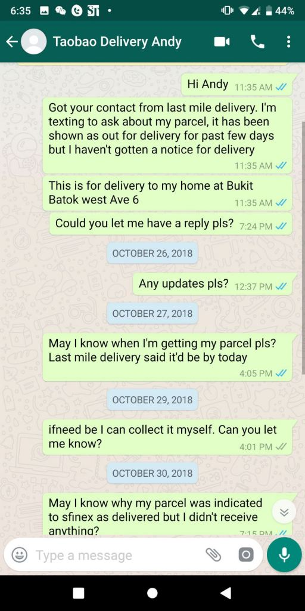
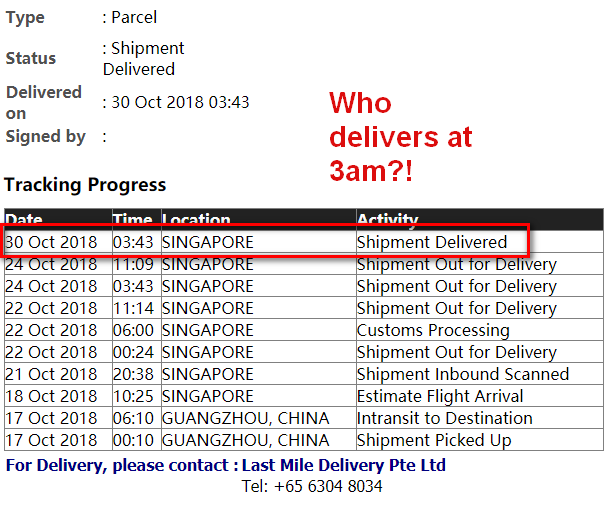
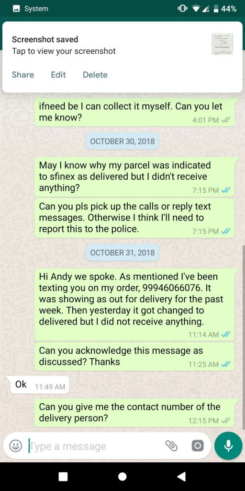

**This is a post to tell ourselves to stop shipping from Taobao, because it's not worth it. You lose more money than you save.**

**TL;DR version - We got Sfinex to ship our Taobao stuff, which subcontracted to Last Mile Delivery Pte Ltd, which subcontracted to Infinity Freight Solutions Pte Ltd. Infinity lost our stuff, we were compensated far below the value of our stuff and what we were told was possible. To make matters worse, both companies just constantly went missing, uncontactable, at times were rude and aggressive, and just displayed a lack of business ethics. [There has been an update where we got our money back in strange circumstances, you may wish to jump straight to it if you prefer.](#Update)**

This is an ongoing story of lost parcels, except this time the entire order went missing.

Regular readers will remember that we previously raved about shipping from Taobao, [but we became more cautious after our shipper MRC lost a few of our items](https://btonomics.com/shopping/taobao-missing-item-how-shipper-lost-parcels/). We lost around $150 then.

Fast forward to today, we're probably going to lose more. Here's another disappointing tale of shipping using third-party forwarders and having either incompetent or dishonest couriers.

## The story of our missing items, starring the mysterious Infinity Freight Solutions and elusive Andy Leong

We shipped around $200 worth of items over air through Sfinex. They have this option to ship via actual weight rather than volumetric weight. Which is good because the cost is low.

We shipped some time after the 10/10 sales, so we didn't get stuck in the "hot season".

Everything appeared fine, the parcel went through the standard shipping from China, clearing through customs on both sides. That's when the nightmare started.

### Parcel reached Singapore, but there was no update

We just monitored here and there, as and when we could. After it reached Singapore it became strange. A few days after it cleared Singapore customs, there was completely nothing on our parcel. Usually shippers would call or text you when they were going to arrange delivery.

But no.

We then called the delivery company, Last Mile Delivery Pte Ltd. We tried many times before finally getting through. They're the ones who are in charge of delivering items from the plane to your homes.

We said we only wanted them to arrange with us and update us on our parcel. They gave us two numbers, someone named Andy Leong and an unnamed admin supervisor.

### Courier company disappeared

We called Andy and the admin supervisor. We must've done so at least 20, 30 times. And left tons of Whatsapp messages.

They were all read.

No replies.

 \_ \_

This didn't look good, at all. We were worried. The last time we lost stuff, the shipper was very honest to tell us that 2 items were missing. This time around, nothing.

We had to do something. We turned back to Last Mile Delivery Pte Ltd to ask. This subcontractor led by Andy, Infinity Freight Solutions Pte Ltd apparently received many complaints and they were late. Andy was told that they only had a day left to deliver everything. The Last Mile Delivery lady said we would receive our stuff by then.

We were like, _ok, why don't we self collect our items?_ But we were told the parcel was already on the delivery van and making its rounds.

### They didn't deliver

But they didn't deliver by the deadline. So we continued to text and call Andy. Still didn't work.

In our desperation, we googled his phone number. Strangely enough we did find an Andy Leong, which we later confirmed had the same surname as Andy from Infinity Freight Solutions Pte Ltd.

We called Last Mile Delivery Pte Ltd again. Again they said they told Andy to deliver everything and Andy would comply.

We weren't feeling very sure, so we also went to Wechat Sfinex to tell them to apply pressure on the courier company as well.

### Dishonest attempt by Infinity Freight Solutions Pte Ltd

During our conversation, Sfinex told us that the tracking system said the delivery was completed. It was impossible because we didn't receive anything, but Sfinex's system said the parcel was "delivered" on 30 Oct.

 \_ \_

This was ridiculous. We called Andy, he still didn't pick up. It was definitely the correct number. We called Last Mile Delivery Pte Ltd, they said that was atrocious by Andy and conveyed to Andy that there was a problem with my parcel.

### We finally reached Andy

After all the panicking, somehow we managed to reach Andy subsequently. He picked up the call and said he'd deliver the parcel by 10pm. We were so happy we cut short dinner to return home to wait for the delivery.

But it never came. We should've suspected something was wrong because he never asked for our name or address. Only my phone number was in his record, which he didn't bother to reply to.

Meanwhile, we learnt from Last Mile Delivery Pte Ltd that Infinity Freight Solutions Pte Ltd's system was down, so the latter marked all parcels as "delivered" regardless of delivery status. Apparently, there was someone else with the same problem of non-receipt of items. In short, this whole problem arose because Infinity Freight Solutions Pte Ltd lost all ability to track items, and the driver either lost the parcel or took it with him.

### Andy said it wasn't him

The no-show upset us and we called Andy again the next day. After many attempts, we managed to get him. He denied that it was him who spoke to me, and asked us to refresh his memory.

When we told him the problem, he said he couldn't help us. It was a different team handling the issue. He said he had to escalate the problem to customer service. Andy denied that his system was down. He said all parcels were delivered, as shown by the status update.

Andy kept harping on how he needed to solve the problem we raised. He wouldn't give any reasons for why we couldn't contact anyone from his team or why no one informed us that our parcel was missing. Apparently, non-receipt is different from non-delivery, and his team couldn't handle a non-receipt claim.

He wanted us to send him a "black and white" Whatsapp text so he could escalate the matter (no matter that it was already escalated). He said he was doing us a favour. At this point, he was a bona fide asshole to make himself seem like doing the client a favour, which often is the case for shitty contractors or service providers. It's always the customers' fault and the contractor is the angel who's helping out of goodwill.

### Sent the text, but...

We sent the text he wanted, but he again didn't acknowledge it. We had to call a few times and asked Last Mile Delivery Pte Ltd to tell him to acknowledge it.

Then he finally did.

 \_ \_ Meanwhile, Last Mile Delivery Pte Ltd people said Andy was talking nonsense. They only liaised with him, there was no other team involved. Sfinex said the courier company had tons of complaints and did things improperly.

Subsequently, we received a call from Infinity Freight Solutions Pte Ltd that our case was being investigated. An Infinity lady called us a few times, to ask "did you receive your parcel?" and "_we'll update you again_".

### Our parcels were missing

So we just received a call to update us that the parcel was lost. And Infinity Freight Solutions Pte Ltd hid behind the fact that they informed the Chinese side (Sfinex). They refused to say what had happened, only that they had "done their part". We requested to speak to Andy, but he was apparently in "a meeting" and never responded. Andy switched off his phone.

At this point, Sfinex said we'd likely lose out quite a bit monetarily, as their compensation will not cover much.

## We essentially paid Sfinex money to throw away our items

To be rational about this, we essentially paid Sfinex money to throw away or lose our items.

There're many doubts:

- Why was it impossible to contact Andy and his admin supervisor?
- Why was it impossible to contact Andy and his admin supervisor when our items were still confirmed to be inside the delivery van?
- Were the parcels listed as delivered so we didn't notice anything and they can claim innocence, that it was already delivered?
- Why would our parcel be listed as delivered at 3am in the morning, if as Andy claimed their system wasn't down?
- What is the role of the driver in this situation?
- Did the driver steal the parcel? Did Infinity Freight Solutions Pte Ltd investigate? After all, the compensation value is always lower than the value of the goods.

Andy will never answer these questions. On our end, we need to prepare for the eventuality that we can't get a single cent. Sfinex can only refund money to our Alipay wallet, but even that might be impossible because our account is unverified.

Only someone like the Punisher can find out the truth of what really happened and whether they were out to cheat us. We did the next best alternative, report it to the police. But it's unlikely anything would come out of it, it's essentially a small case where no one got hurt and doesn't warrant police resources.

 _Only the Punisher can avenge us haha._

## What happened next

The shitstorm got worse. We were offered only $70 as compensation by the Chinese, even though Last Mile Delivery previously said the goods were covered up to $200. Andy and his staff Daxter went missing, as usual.

So we tried to challenge both sides. And it turns out that upon stressing them, Last Mile Delivery said that the $200 limit is not applicable to us, because they were subcontracted by Sfinex. They also accused us of not choosing private settlement and leaving the case to Sfinex.

That was a lie because we were never offered private settlement. Every step of the way we were told that the Chinese side were the ones to settle, even when we kept badgering for an update.

**Put simply, Last Mile Delivery and Infinity Freight Solutions have really questionable ethics and way of doing business. The money lost is not a large sum, around $100. The items also weren't critical.**

**But it's just proof that there're some companies that are poorly run, are ethically unsound, and provide poor service (if your job is to deliver something and the whole thing disappears, then you suck at your job).**

So we hope this is a warning for everyone who engages shippers who use Last Mile Delivery Pte Ltd and Infinity Freight Solutions Pte Ltd - don't, unless you want a bunch of unprofessional, rude, and morally questionable people handling your stuff.

## Morale of the story

At this point in time, the desire to buy from Taobao, to do shipping from Taobao must have dried up. We're losing more money than we'd ever save.

If you do still want to use Taobao, try your very best to avoid those involved above. At its best, Infinity Freight Solutions Pte Ltd is the most incompetent courier company who gets away with it. At its worst, they have questionable ethics in terms of customer service and possibly is abetting shady practices (in terms of getting to the bottom of the matter for problems they cause) when it comes to courier services.

Last Mile Delivery Pte Ltd receives less blame, but we must still fault them for putting us in harm's way by engaging a contractor (Infinity Freight Solutions Pte Ltd) it knew was shitty and incompetent. Same thing for Sfinex, which said that it turned to Last Mile Delivery Pte Ltd because it got swarmed with orders.

Anyway, let our story warn you of Taobao's hidden dangers, helped along by truly questionable couriers and dear Andy.

## Update

We got only $70 in compensation from Sfinex. Non-negotiable.

After this post went up, 2 drivers made comments here which accused Last Mile Delivery of shady practices and complained about unfair treatment. The language was colourful, to put it mildly. Those comments have since been hidden out of respect for the drivers and the company - it seems that they might get into trouble and they are also locked in a dispute with the company. We've no wish to get in between their dispute.

Andy then contacted us to urgently request that we take down the post/comments. For some reason he very kindly refunded us the loss we incurred. We suppose it was out of their goodwill. They didn't have to do it. But they still did it. Good for us!

We do wonder whether the matter would've ended this way if we didn't write this post and the comments weren't made. Probably not.

We still have no idea whose fault it was that our items got lost/stolen.

We won't take down this post, but we will put up any statement that Last Mile Delivery has to offer if they decide they want to.
