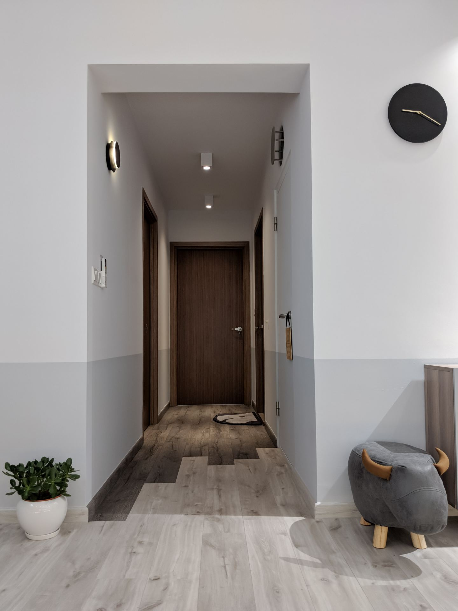
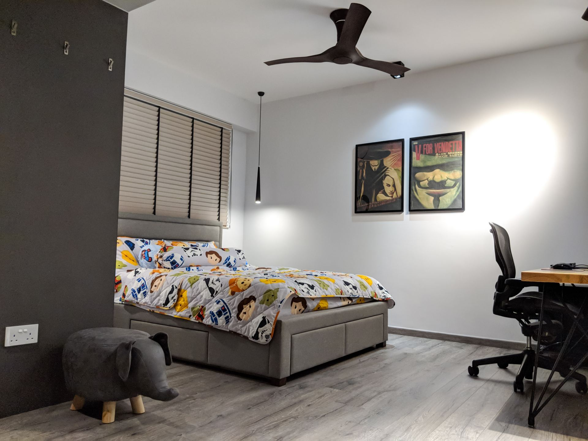
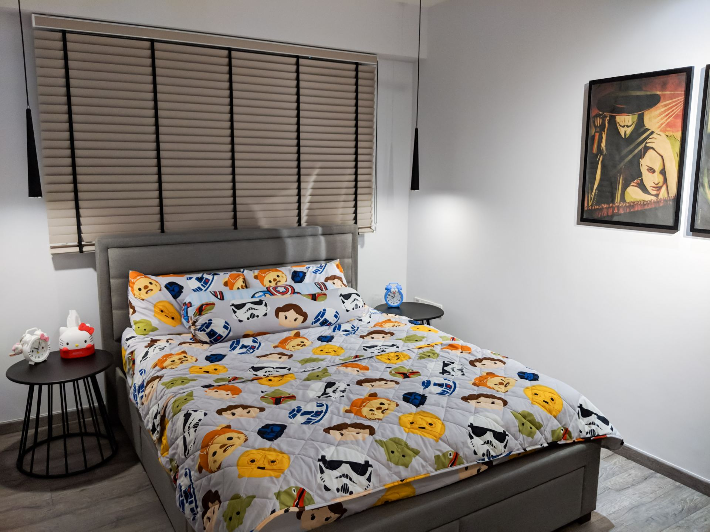
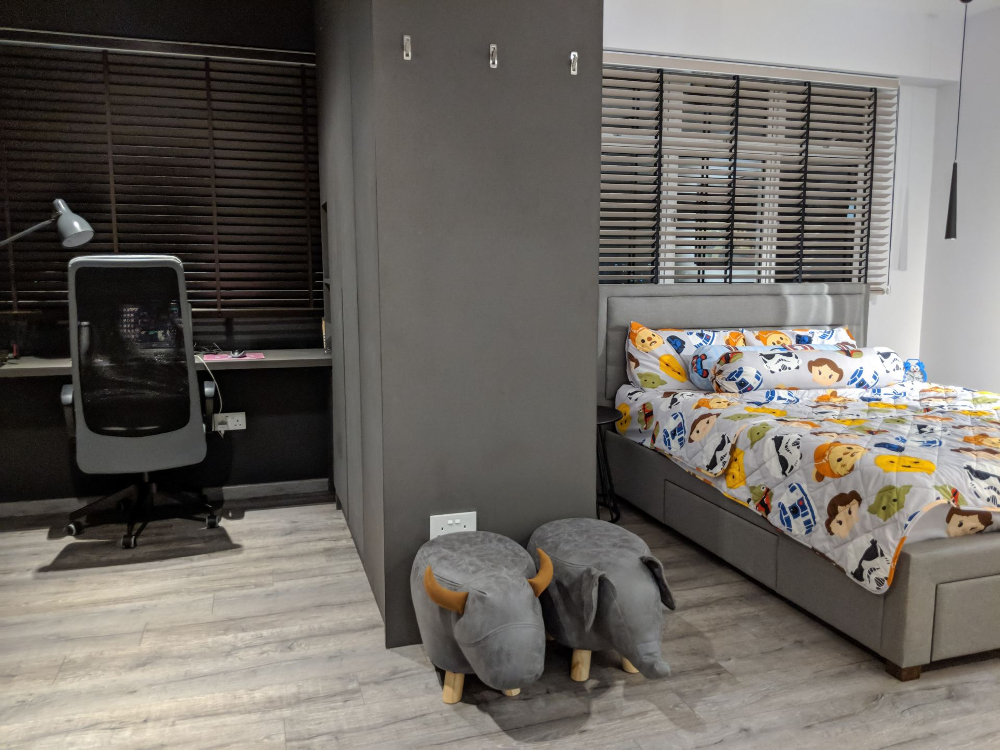
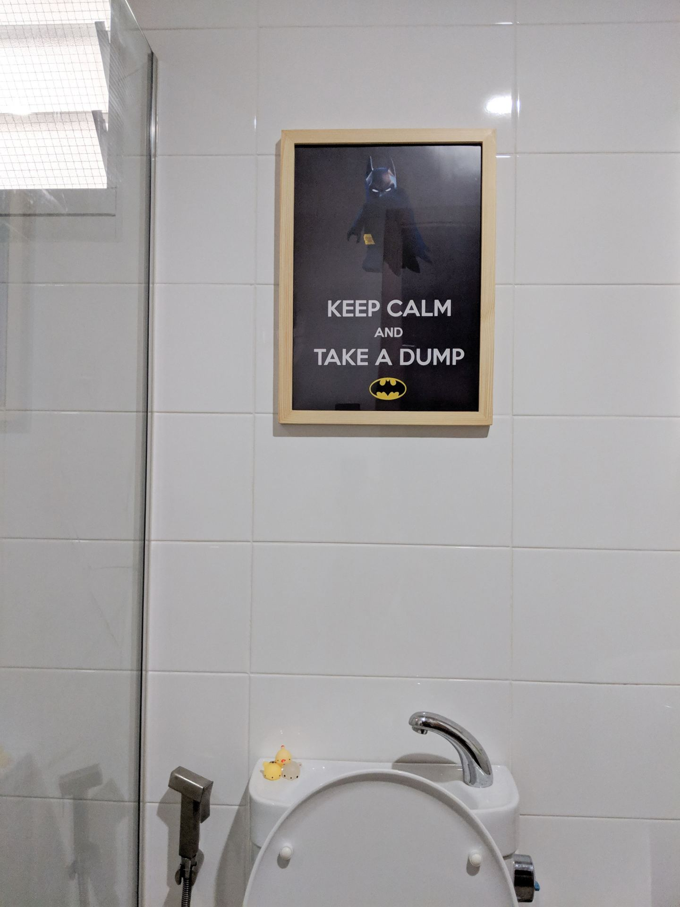
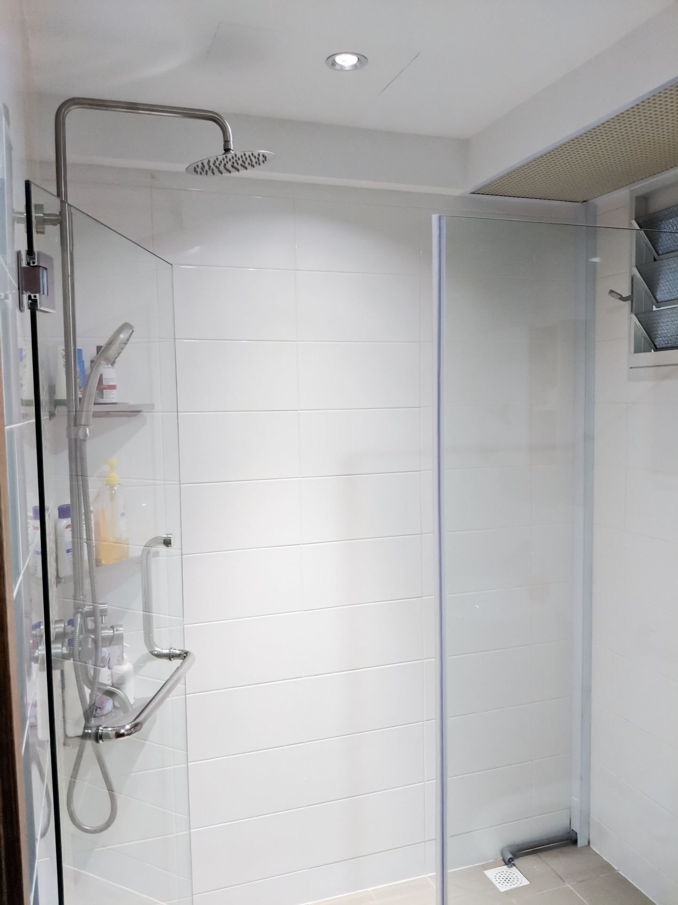
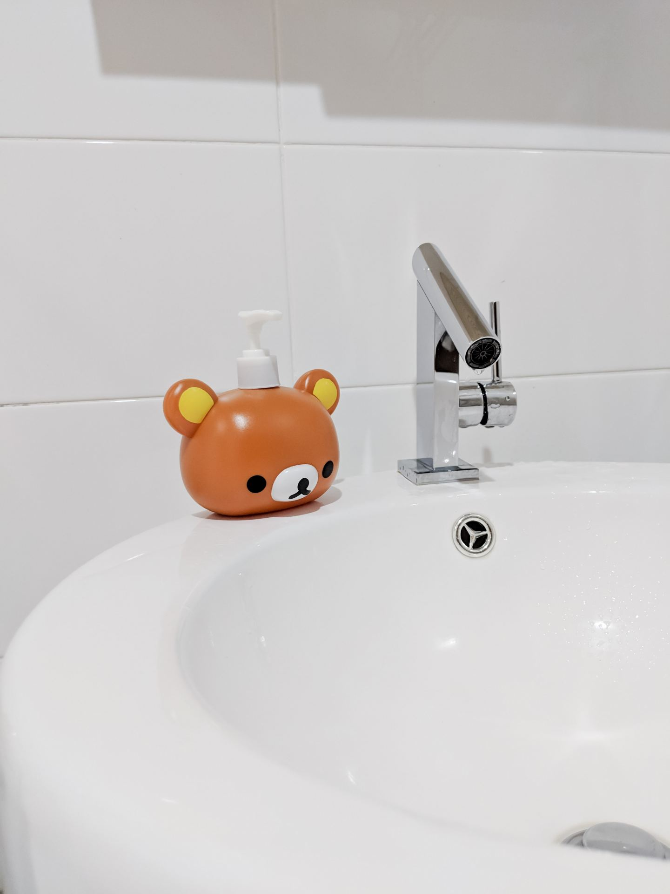

We've settled in around half a year. We took some pictures of our final 4 room BTO design and outcome. Our home probably isn't impressive enough to be featured! So we had to DIY with a Pixel camera, although on the plus side it's not a staged photoshoot. All things considered, it's quite similar to what Shao Jie had originally designed. It was a good job translating it into the real world. All in, we spent around SGD 40k, including electrical and water works, but excluding furniture and appliances.

## The pictures

 _The living room. We don't typically turn on all the lights, the LED lights beneath the settee isn't really useful. It's primarily for aesthetic purposes. [The 60-inch ceiling fan fits quite well, we were originally concerned that it'd be too big](https://btonomics.com/renovation/getting-ceiling-fans-for-a-bto/). But it's just right._

 _We're huge fans of Strange Things. So it was a really easy choice to use these posters that we got from Taobao for really cheap, rather than get an eclipse drawing or painting that meant little to us. The router placement is also quite good and the signal reaches most of the house except for some parts of the bedroom._

 _The empty space beside the kitchen and corridor. The [colour of the cabinet](https://btonomics.com/shopping/taobao-cabinet-review-not-cheap-quite-pretty-hard-install/) was surprisingly matching with the wall paint and [colour scheme we settled on](https://btonomics.com/renovation/multi-tone-painting-works-for-greater-contrast/). On a side note, if you're ever in doubt, don't worry and just buy a robot vacuum cleaner. Best invention that keeps marital woes at bay._

 _The corridor is less well lit by comparison. We love the way the colour of the floor changes as you get into the rooms. The accent light that is shaped like an eclipsed moon was an awesome and cheap find on Taobao as well._

 _We bought these pendant lights shaped like moons because they fit our themes. They were very expensive but pretty. We really like the way they cast reflections on the windows and mirror, although those are typically obscured if we let down the blinds. Apologies if the table looks a little shiny, this photo was taken when we just applied a fresh layer of varnish to mend cracks on the table._

 _We intended our kitchen to be low cost to build, minimalistic, and fuss free to maintain. The hood is something that works decently but probably should've been changed to something that looks more boxy. We also opted against having a built in oven. It was a great choice because our Sharp Microwave Oven works very well._

![Our 395L fridge, which fits well and is sized just about right, under our electrical storage water heater. It's a 35L basic water heater that does its job well. The pipes can't be hidden unfortunately. The disadvantage of having the water heater above the fridge is that it would be disastrous if it leaks. Thankfully ours is a Joven water heater that comes with a 10-year non-leak guarantee, which should show the manufacturer's confidence in delivering good products that don't leak. Totally not an advertisement by the way haha.](./images/36_upload_IMG_20180731_204148.jpg) _Our 395L fridge, which fits well and is sized just about right, under our electrical storage water heater. It's a 35L basic water heater that does its job well. The pipes can't be hidden unfortunately. The disadvantage of having the water heater above the fridge is that it would be disastrous if it leaks. Thankfully ours is a Joven water heater that comes with a 10-year non-leak guarantee, which should show the manufacturer's confidence in delivering good products that don't leak. Totally not an advertisement by the way haha._

 _The common toilet. We opted for a shower curtain because it'd be terribly squeezy if we put glass panels. We also saved money in the process. The [counter top was from Ikea](https://btonomics.com/shopping/how-to-choose-basins-and-taps-for-your-hdb-homes/), which looks really good but it's probably not going to last that long since it was wet all the time. The curtain and rod were from Taobao and were a huge bargain._

 _The master bedroom. [Our fan is a 52-inch one from Taobao](https://btonomics.com/renovation/getting-ceiling-fans-for-a-bto/). It works decently. [The bed was from Baton Sleep and is comfortable](https://btonomics.com/honest-reviews/baton-sleep-review-good-bed-value-money-bed-frame/). The hooks were a good idea from Shao Jie, although 3 hooks really aren't enough for the wife..._

 _Bedside tables and clocks were also from Taobao. They don't really fit the theme but we thought what the heck and just bought them._

 _We love how the dresser area is a slightly darker tone than the bed area. Gives a nice feeling of contrast even within a supposedly darker zone. Unfortunately [we couldn't place a ceiling fan](https://btonomics.com/renovation/getting-ceiling-fans-for-a-bto/) here because of the wardrobes and tight space._

 _We did minimal work on the toilet. We got a pedestal basin for the master bedroom. We've no idea how we should clear any chokes in the basin, but we just YOLOed and bought it anyway because it looked nice. The white dustbin was also a good purchase because it fit really well into the small space beside the basin and the colour matched._

 _Since our original post, we designed something new to put up in the frame._

 _The rainshower set was the same as the common toilet one. We installed a shower screen here which is very welcome and keeps everything dry outside the shower area. But the downside is you've to maintain and wipe it._

 _The master bedroom basin tap that we love. It has a unique design and the flow of water is very fitting. A lot of times the flow of water is problematic - sometimes too near to you, sometimes too far. This one is just right._
