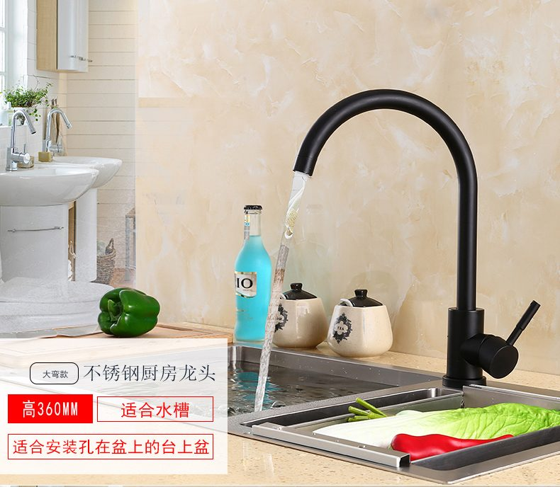

Having used our bathroom accessories for around 8 months, and having had some readers ask about this, we're finally doing a review on our Taobao bathroom accessories and taps. We bought taps, rainshower sets, toilet roll holders, shampoo/soap shelves, and toilet racks from Taobao. (If you want to know why we bought from Taobao and how we chose what we bought, you might want to read [our guide on buying basins and taps](https://btonomics.com/shopping/how-to-choose-basins-and-taps-for-your-hdb-homes/) first.)

These Taobao bathroom accessories were very cheap, especially taps.

Everything we bought was 304 stainless steel (SUS304). It's made up of around 18–20% chromium and 8–10.5% nickel. In practical terms, household items are commonly made of SUS304. It's more resistant to corrosion and more expensive than another popular grade, 430 stainless steel, because of the inclusion of nickel.

**Note: All prices quoted here exclude shipping.**

---

## Rainshower (花洒)

We bought a basic rainshower set from Taobao, which cost around SGD 60. It's a Tmall seller and one of the top results when you search for the rainshower. We liked that the seller claimed it didn't contain lead and wouldn't rust.

 _Source_

The actual product was almost identical to what we saw in the photos. The price is really unbeatable. At SGD 70, it looks about the same as the rainshower set we saw at Royal Fanco. The Royal Fanco set cost 3 times more and wasn't made of stainless steel.

 _Our rainshower looked exactly like the advertisement pictures._

 _Our Taobao rainshower wouldn't look out of place in Royal Fanco's shop._

Unfortunately like the water pressure from the rainshower isn't the best. We live on a high floor, so our water pressure for all outlets is already bad as it is. We can't be sure whether this rainshower worsens the problem, but so far it seems like it does (rainshower, hand shower, and tap). The water flow from the tap is much lesser as compared to the other taps.

Some parts of the pole rusted. Though they were easily scratched off by hand, it isn't ideal. The rust can spread and cause much more damage to the rainshower. So much for the seller claiming that this wouldn't rust. We subsequently learnt from Taobao sellers that they based their claims on the Chinese climate - which is typically much less humid than our tropical environment where 80% humidity is common.

 _This was one of the small patches of rust._

After a month of usage, we realised that the shower head was very brittle. If you're someone who likes to tilt the angle of the shower head, then you shouldn't buy this. The base of the shower head is very weak. This might be because it's made of plastic inside. You can possibly break the base if you use some force to pull the shower head downwards. A gap opened up and water leaked in the video below. We had to adjust our usage pattern to gently adjust the angle of the shower head instead of yanking it down. You definitely won't need to worry about this if you buy from reputable brands like Grohe.

    <iframe
        src="https://www.youtube.com/embed/6hXtrAhwq68"
        width="560"
        height="315"
        frameborder="0"
        allowfullscreen="allowfullscreen"
    ></iframe>

One of the two rainshowers had a problem where the shower head stand kept sliding down. Although it should've been locked (by turning the knob), it still slid down. It was frustrating. Every time we put the shower head back, it would slide down. We got the seller to send a replacement to us, which we then had to pay to ship it to Singapore. The worst thing is that you can't just replace the shower head stand. We had to get our ID to take out the whole pole and replace the stand. Talk about hassle.

    <iframe
        src="https://www.youtube.com/embed/DNQVfBMmbdc"
        width="560"
        height="315"
        frameborder="0"
        allowfullscreen="allowfullscreen"
    ></iframe>

There was also an inconvenience we encountered with the knob, which controls where the water comes out of. Even though we turn off the tap lever, turning the knob makes water still come out of the tap. This happens because the knob is in between the default positions, e.g. it'll leak if you turn it to be in between shower head and tap. It's alright most of the time. It's only a minor inconvenience to have water coming out for a second when we turn the knob. However, it gets frustrating when water keeps coming out because we accidentally turned the knob halfway.

    <iframe
        src="https://www.youtube.com/embed/9YlAAPO5NgQ"
        width="560"
        height="315"
        frameborder="0"
        allowfullscreen="allowfullscreen"
    ></iframe>

### **Verdict: It's super cheap, which makes it still worth all the hassle of dealing with the crap it gave us.**

---

## Bathroom Taps (台上/下盆卫生间水龙头)

We bought taps that weren't the typical ones you see everywhere. They weren't cheap, all things considered. The common toilet one cost around SGD 59 and the master bedroom one cost around SGD 67. They're much cheaper than what you buy locally. However, if you compare them to other Taobao taps, these are the luxurious, atas ones.

 _We got this for the common toilet, because we had a counter-top basin. ([Source](https://detail.tmall.com/item.htm?spm=a220m.1000858.1000725.101.59385460nUTdS2&id=553490982719&skuId=3413463381518&areaId=440100&user_id=1131565653&cat_id=2&is_b=1&rn=20170ef62cb0523c772b534a73f1f81d))_

 _We got this for the master bedroom, placing it on our pedestal basin. We bought the metallic rather than the white one, because the white one would've looked weird beside all our stainless steel bathroom accessories. ([Source](https://detail.tmall.com/item.htm?id=560519568240&spm=a1z09.2.0.0.3c852e8dOxf95W&_u=a2m1h1uh41a7))_

Both taps work alright.

The common toilet tap is longer than normal taps. This makes it a little harder to wash our faces. But we just had to get used to it.

There's a small issue with the master bedroom tap. It doesn't stop the water flow immediately after you turn it off. There's always a second of delay. Maybe it's because of the V shape of the tap. But that's alright.

The bigger problem was with the accessories that came with the 2nd tap. They rusted. We couldn't replace them without removing the entire pedestal basin, which was impossible to do without a plumber. It's probably because water dripped when we were turning off the tap.

 _The back part of the pedestal basin._

We originally thought the components came from the pedestal basin. When we eventually approached the Taobao seller, they said it was too bad but the rust wouldn't affect the tap.

We subsequently used sandpaper to sand away the rusty parts. It was very difficult because the space was tight, but we managed as best as we could. We then added some metal polish to the surface. It's not clear whether the metal polish works though.

### Verdict: Good buy. The taps were cheap, worked well, and looked nice. But the accessories might rust.

---

## Bathroom Shelves (三角浴室置物架)

Our shelves were also SUS304 and cost around SGD 21. Strangely, the shop seems to have disappeared. It cost much more than other shelves on Taobao, which generally look like what it is below. Not nice.

 _This is how bathroom shelves look like. Not nice._

So we paid extra to buy the ones we got.

Unfortunately the shelves rust very easily. They rust on the main surface, grooves, sides. Everywhere.

 _An example of the rust._

 _The sides were rusting as well._

 _Grooves also._

We're not sure if it's because of Singapore's humid weather, the soap, or the water from showering. But it definitely sucks to have the shelves continuously rust. We managed to use white vinegar to wipe away some of the rust, but the rest has been very persistent.

The worst thing is the shop has disappeared, so we can't buy shelves to replace the ones we have now. We need to drill new holes if we get other shelves, which we can't do ourselves.

Worst outcome ever.

### Verdict: Don't buy. Not worth it.

---

## Bathroom Towel Rack **（活动旋转毛巾杆毛巾架）**

 _[Source](https://detail.tmall.com/item.htm?id=547251891559&spm=a1z09.2.0.0.56a52e8dbMoYFa&_u=92m1h1uh2235)_

We bought an unconventional clothes rack. These racks are typically nailed to the back of the door, but we decided we wanted something more flexible that could fold behind the door if needed. We found it for around SGD 18 each, which is a bit pricey. It's also not the prettiest. But we bought it anyway because it's very unique. And it fits our needs perfectly.

The actual item looks exactly the same as the picture and works perfectly. It hasn't rusted, which is very good.

### Verdict: A little pricey, but worth the price. Not the prettiest when installed though.

---

## Bathroom Toilet Roll Holder (卷纸架)

We bought our SUS304 toilet roll holders off Taobao, this is how they supposedly looked like:

 _These are computer generated pictures so they look super sleek. [Source](https://detail.tmall.com/item.htm?id=549522712356&spm=a1z09.2.0.0.56a52e8dbMoYFa&_u=92m1h1uh17cf)_

We got the glue version that doesn't require screws for around SGD 9, although we ended up using screws because it's more sturdy. It's very cheap. We also like that it allows us to put a phone there is we need to.

 _It looks dirtier than it actually is, due to water and toothpaste splashing about sometimes._

There're some problems with the toilet roll holder, though they're not major. The whole thing is quite flimsy, especially for the stick that goes through the toilet roll. There has been some minor rusting, but we wiped it away. The stainless steel surface attracts a lot of water marks, but we can't control that. It's also not perfectly parallel to the ground, but we're not complaining.

### Verdict: Cheap and good buy.

---

## Bidet (妇洗器喷枪)

We decided to buy something different for our bidets. People usually bought round shaped bidets, so we opted for boxy ones. They probably don't fit our eclipse theme as well as round ones, but it's a small matter. They cost around SGD 22.

 _[Source](https://detail.tmall.com/item.htm?id=529418539024&spm=a1z09.2.0.0.56a52e8dbMoYFa&_u=a2m1h1uh0a38)_

We got the 1m water pipes instead of 1.5m. The rationale is to keep it at the optimum length. Too long, it'll be unsightly and the pipes will end up on the floor. Too short, it becomes difficult to use. Since we didn't need to use the bidet to wash the toilet, we opted for 1m.

They look good and work as how bidets should be. It's comfortable to use, despite the boxy look.

 _Our bidet does look quite different from most bidets._

### Verdict: Average buy. Around the same price from local shops, but probably better in quality.

---

## Kitchen Tap (洗菜盆仿古台盆冷热龙头)

[We bought the kitchen tap shown below.](https://btonomics.com/shopping/how-to-choose-basins-and-taps-for-your-hdb-homes/#Kitchen-taps) It was a steal, at about a fifth of the price of a similar tap bought locally.

 _[Source](https://item.taobao.com/item.htm?spm=a230r.1.14.1.40673a5baVBDPQ&id=548764843400&ns=1&abbucket=8#detail)_

What a gem! It works as intended, looks great, and swivels smoothly. At this price point it's a no-brainer. The slight inconvenience is the lever sometimes comes loose and we need to screw it back in. But if that's the only negative thing to say then it's truly one of the biggest bargain ever.

### Verdict: Must buy!
