We bought several wooden Taobao photo frames to decorate the living room. [You'd recall this was something we chose instead of a large painting.](https://btonomics.com/renovation/our-clean-bto-home-design/)

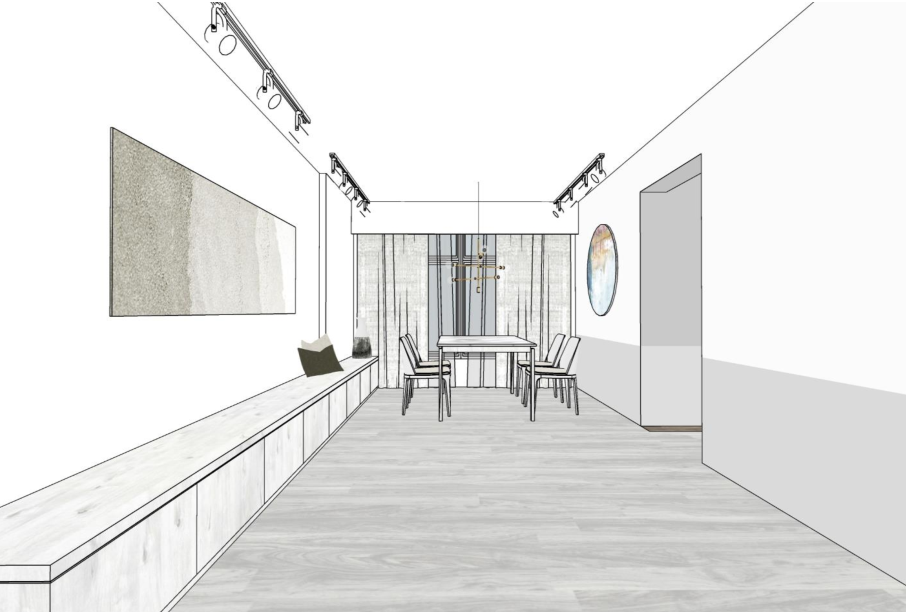 _The original concept would've been a long, rectangular painting._

## Buying wooden Taobao photo frames

Wooden photo frames are expensive in Singapore. There's a shop at Esplanade, Poster Hub, that sells framed posters. Those cost a bomb because they sell original posters (e.g. [this Joker poster](http://www.posterhub.com.sg/original-posters/superheroes/joker-en-4/) costs SGD130 with a 27"x40" frame).

We went to DIY - we bought the wooden frames and posters (the 牛皮纸, dirty and retro kind) from Taobao. Those were really cheap, each frame was about SGD4 and each poster about SGD1.50 (excluding shipping). All in, 6 frames cost less than half of the poster sold at Poster Hub. _Screenshot_

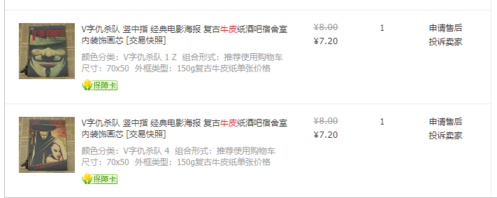 _Screenshot_

## Warning signs

We shipped them via sea shipping, so there wasn't a problem with shipping cost.

When the wooden Taobao photo frames came there were some warning signs. They came in a cardboard box that looked damaged and torn.

There were some dents and scratches on the Taobao photo frames when we took them out of the Styrofoam covers. The wood wasn't the best. The acrylic surface wasn't the best, they weren't very clear (not 'shiny') and there were scratches as well. The result was that the pictures inside didn't look very vibrant and eye-popping. But thankfully our posters were the retro kind and weren't vibrant in the first place.

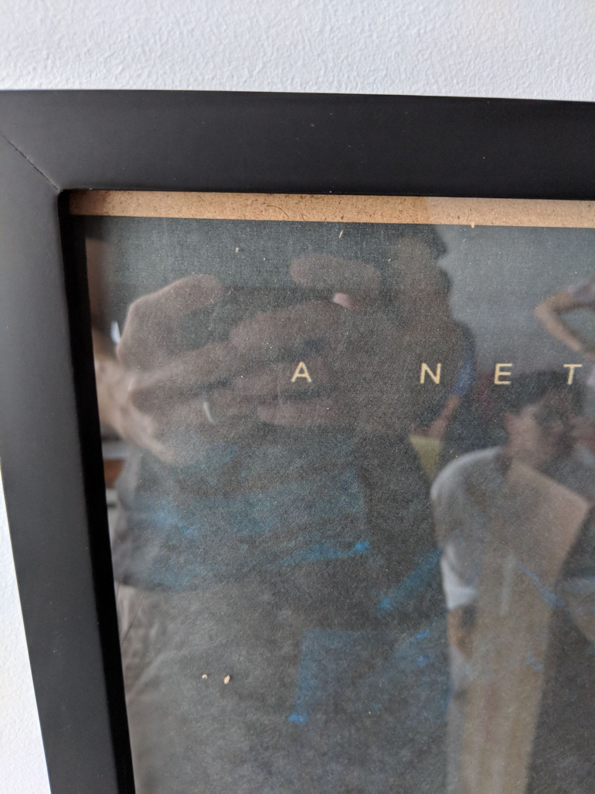 _It was dusty and the surface wasn't smooth._

For the price though, it's hard to complain.

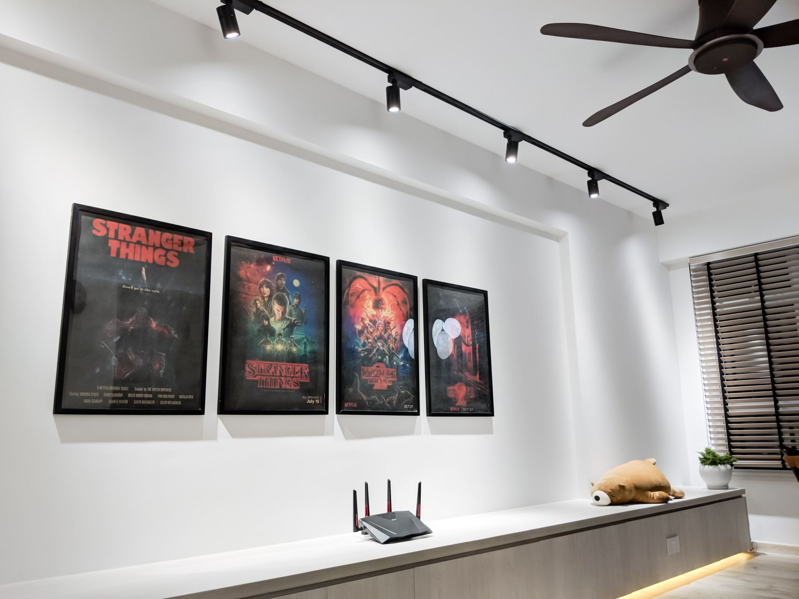 _This was the finished look. Notice the lack of shine on the acrylic surfaces._

## Everything went well for a while...

Nothing to complain there for the better part of a few months. Or maybe there were problems but we didn't notice. We don't really know.

## Until we noticed a bug infestation on our walls...

One night we randomly noticed several tiny ant-like insects on the wall, just walking about.

Fuck our lives. It's like those times when you're about to sleep or do something good, and a giant cockroach or lizard walks in front of you. Then you've to chase it. Move stuff around. Kill it. Sweat. Clean up. Get insomnia after that from the workout.

They looked like ants, except ants liked to walk with purpose and grouped up. These 'ants' were just chilling and walking. They didn't bite either when we picked some up.

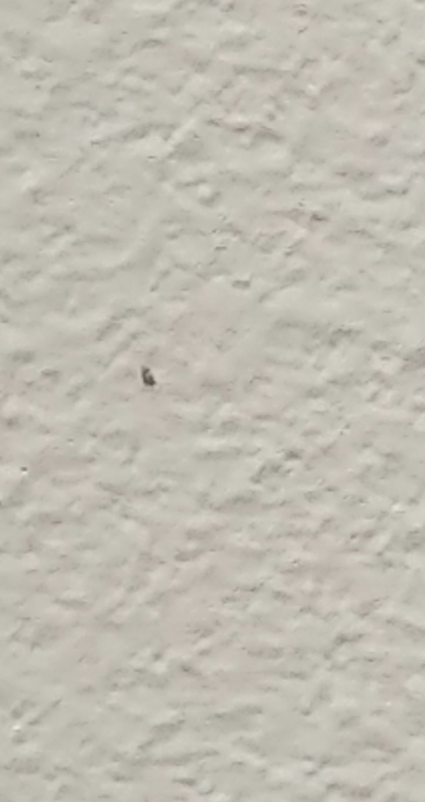 _A very blurry picture of the little insect, but you get the idea._

Having looked closer, we realised there were a lot of them. We couldn't figure out why they were there. We investigated further and realised they were coming from the Taobao photo frames. After taking them down, we saw many more on the wall.

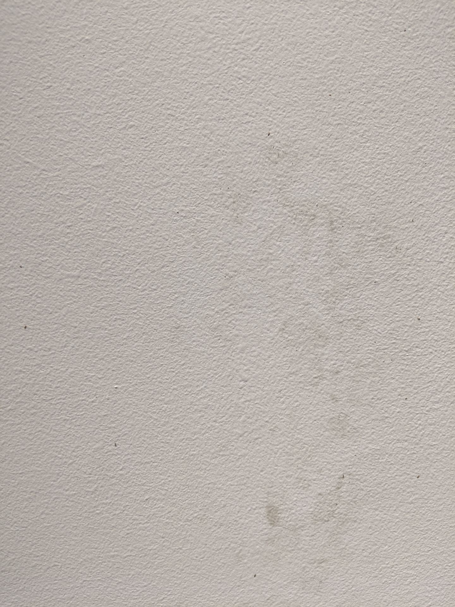 _Whole wall full of these little bugs. The frames also dirtied the wall, staining it black and brown._

They were mainly on the fibreboard that supports the pictures. The ones at the back of the photo frames. The bugs were just crawling all over.

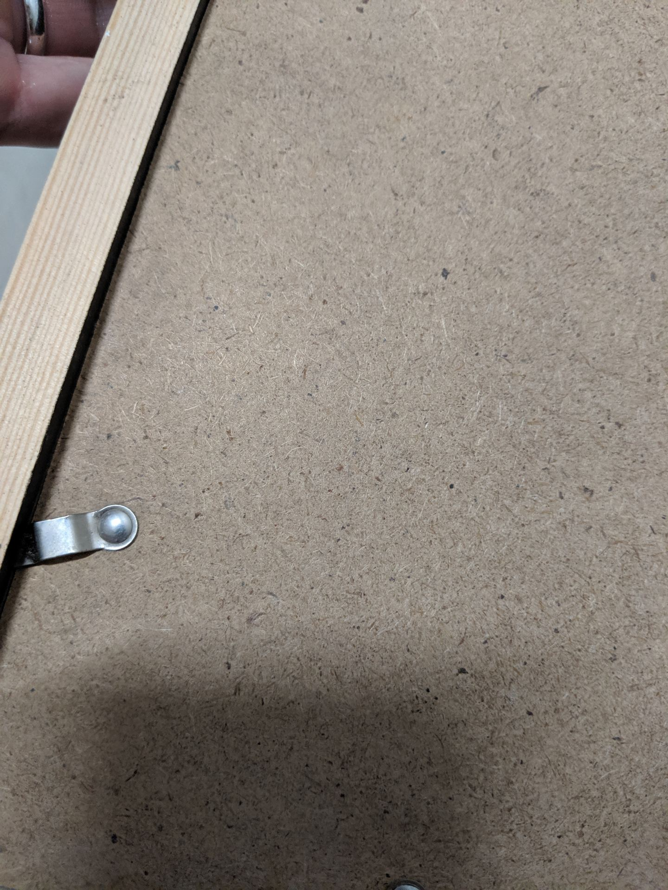 _They blend quite well with the colours, but rest assured they were there._

[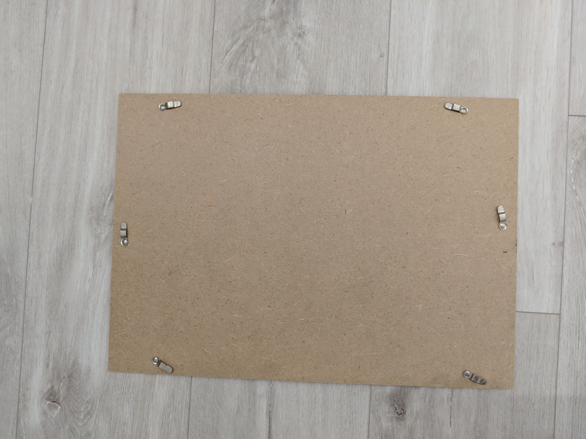](https://btonomics.com/wp-content/uploads/2019/11/IMG_20190112_183727.jpg) _You can't see it well, but there were many bugs crawling all over._

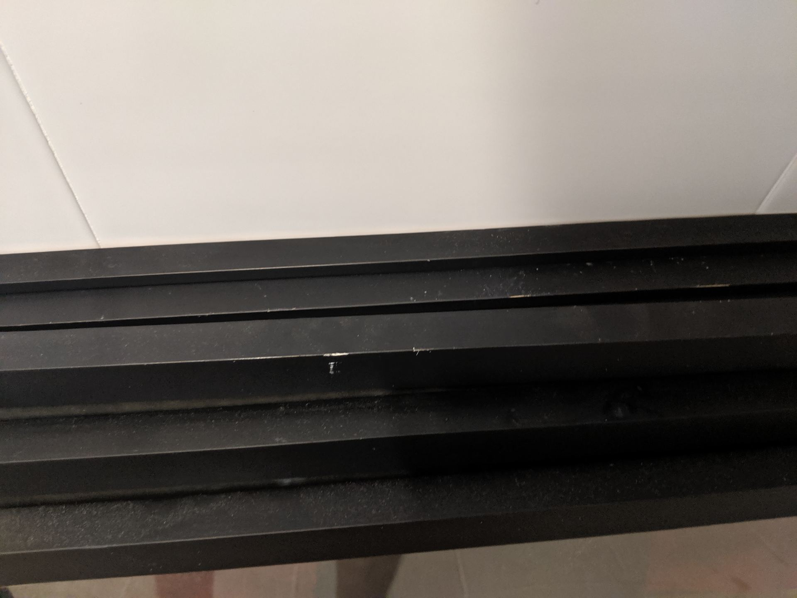 _They were also on the black parts of the frame._

    <iframe
        src="https://www.youtube.com/embed/e6bT6vDt-Zg"
        width="560"
        height="315"
        frameborder="0"
        allowfullscreen="allowfullscreen"
    ></iframe>

## Nope, not termites

We thought at first that these were termites, since they were attracted to wood and didn't really look like normal ants. We Googled and didn't think they look like termites either.

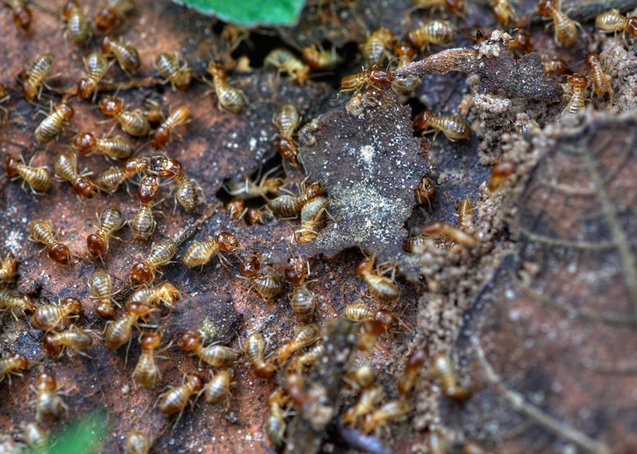 _These are termites. (Source: [Aleksey Gnilenkov](https://www.flickr.com/photos/gnilenkov/))_

## They were booklice

We found out subsequently that they were booklice. These little shits were all over the place because they eat mould and mildew, which grow well in high humidity. They were attracted to mould growing on the fibreboard and the small seams on the Taobao photo frames. Those are common actually, just like how leather boots often get mould on the surface.

At least they didn't bite.

To get rid of the problem, we dumped all the photo frames. It wasn't an expensive loss, but it did leave the house empty. Not to mention, the walls were brownish, after being stained by the fibreboard.

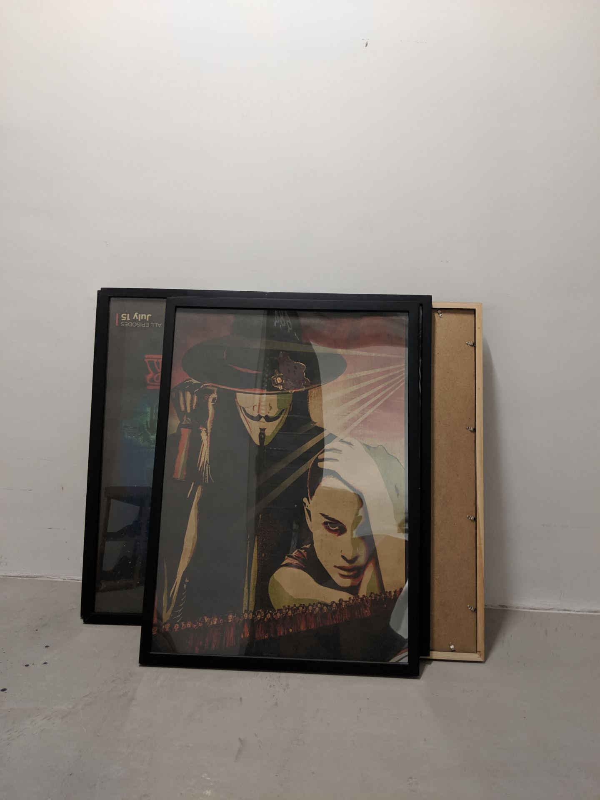 _Dumped._

## Verdict

In all, the Taobao wooden frames and posters were very cheap. But they came at a price. Because the wood and fibreboard used was lousy, it grew mouldy very fast. This attracted a lot of booklice.

The frame and fibreboard also dirtied the wall, so that sucked as well. On hindsight, we probably wouldn't buy the wooden frames again.

Strangely enough, we have one last Taobao wooden frame in the bedroom that sits on the bedroom aircon ledge window. That window has lots of sunlight (even through the frosted glass) and heat. And unsurprisingly the frame hasn't had any booklice or mould.
