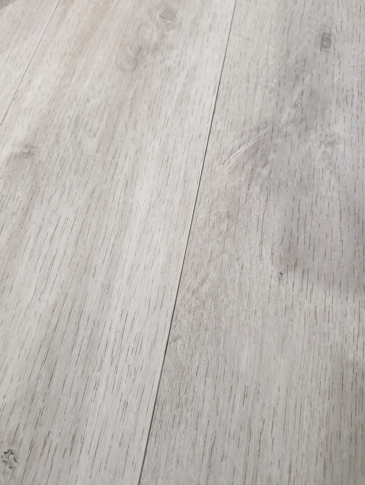
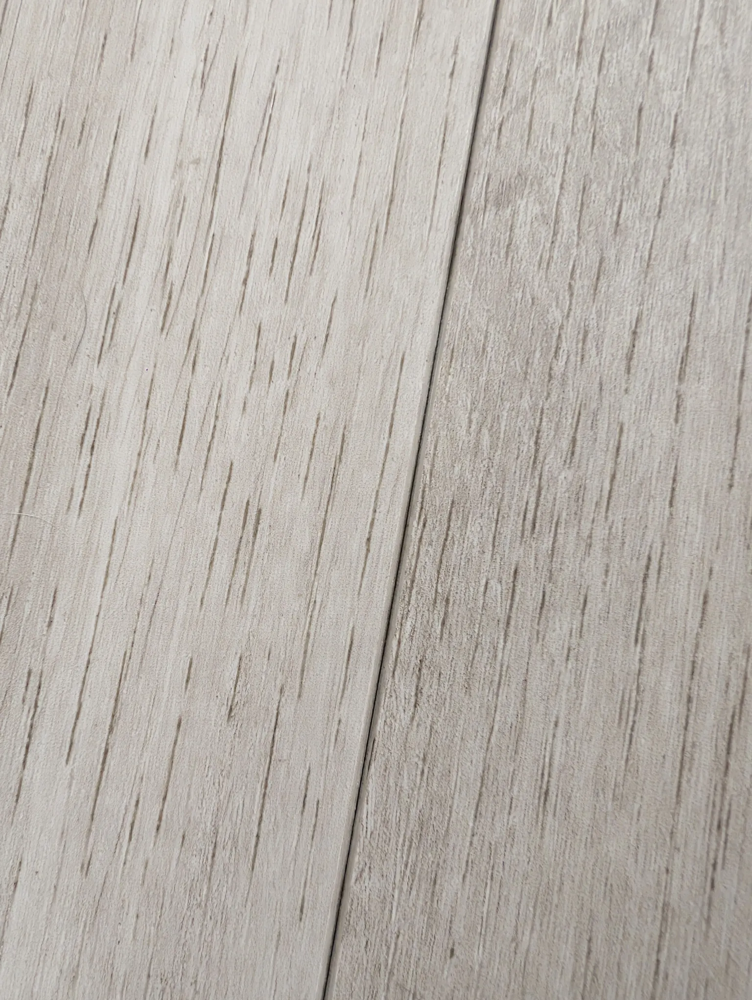
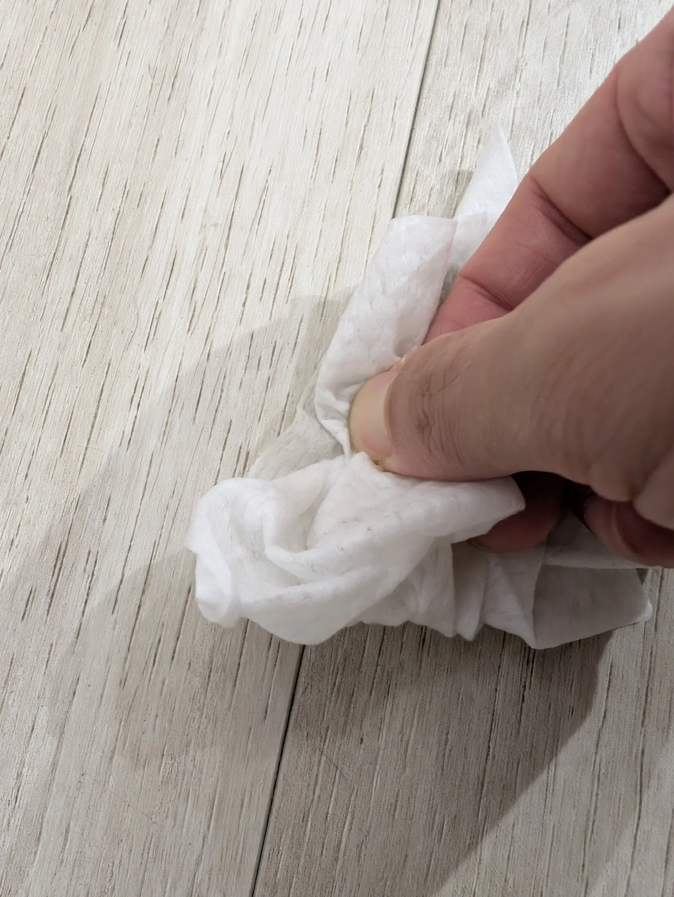
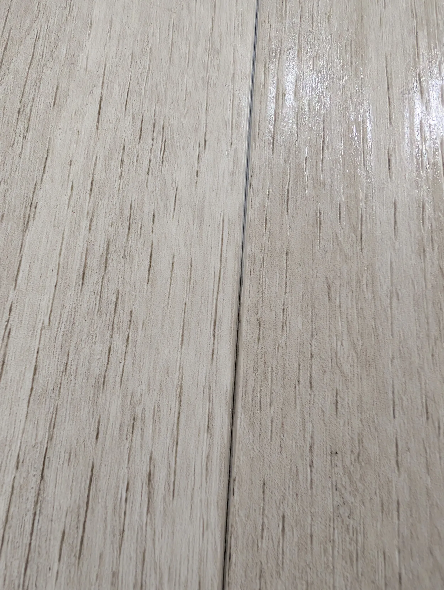
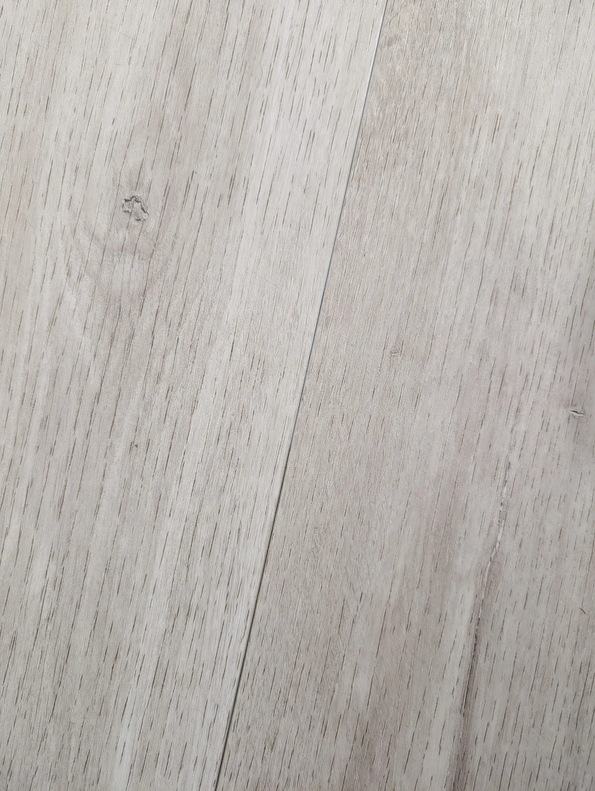
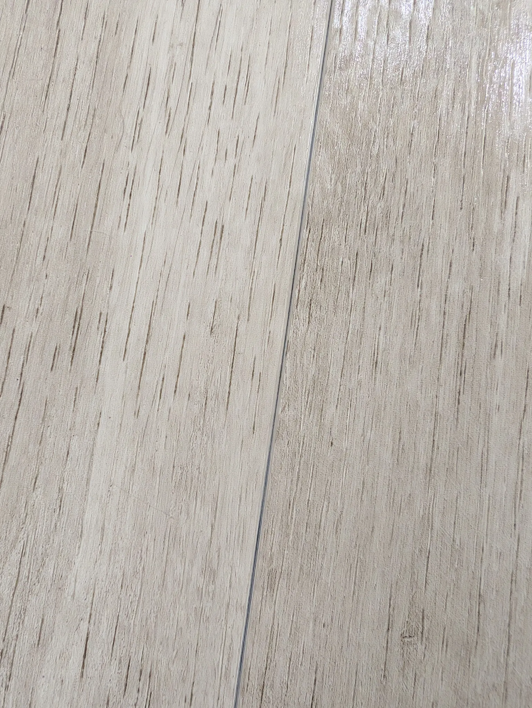
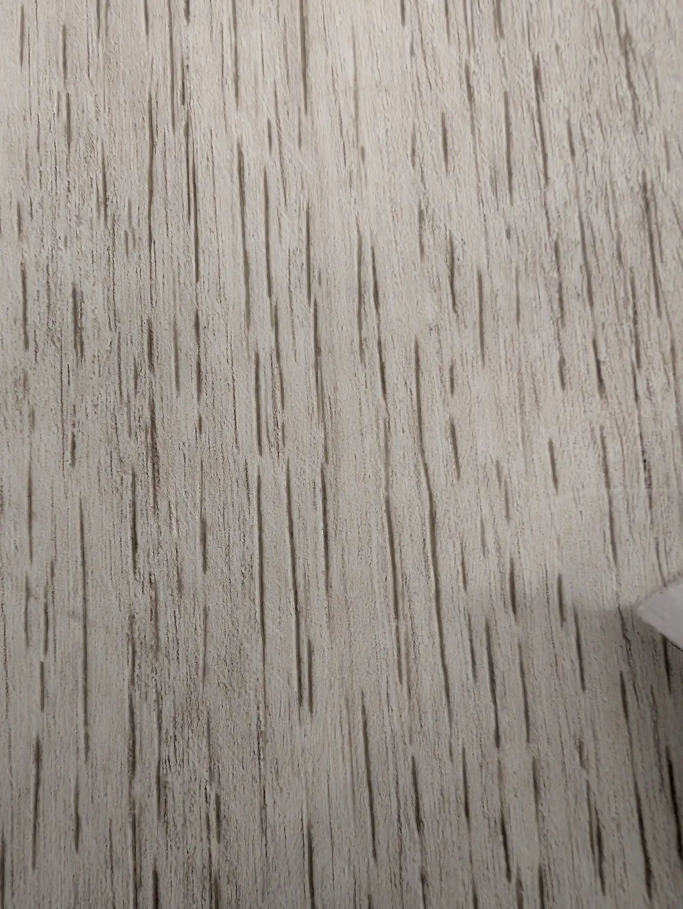
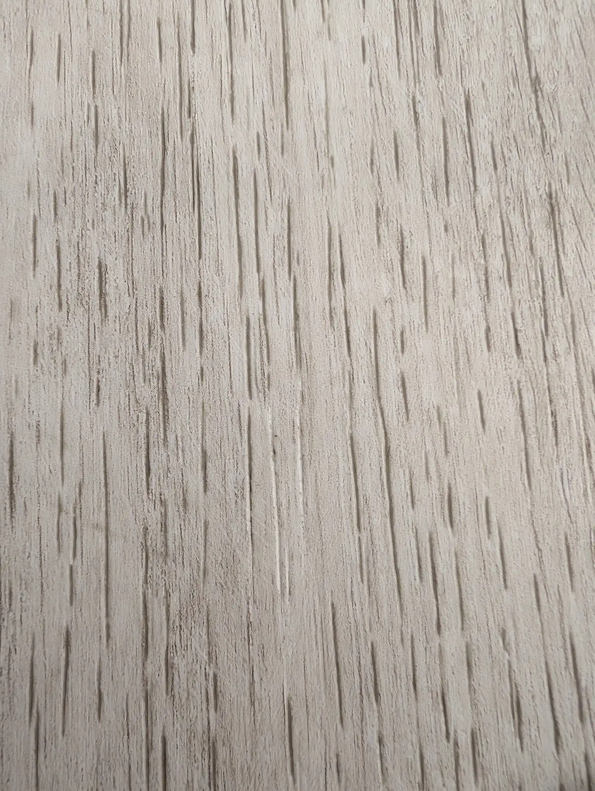

We went with [vinyl flooring some time back](/honest-reviews/floor-xpert-lurf-review-great-value-money-after-sales-service).

## General Verdict, 6 Years On

Generally, it's good. For one, it's softer than tiles. This meant when our kid fell (and that happened more than a few times), it hardly hurt. That's a relief.

People like to say that vinyl flooring is good because it doesn't come with grout lines, whereas tiles do. So we thought it'd be easier to clean. And look cleaner.

Right? Not exactly.

## Dirt in Gaps like Grout Lines

There are still small gaps between each vinyl piece. Those gaps trap quite a bit of dust and dirt, with a "blackened" look.

It's hidden in plain sight. Not obvious. We didn't notice it, until I saw it while wiping our doggo's paws.

And since then, I always notice it when I wipe her paws. I guess once you see it, you still don't notice it much unless you're constantly staring at it. If you do, it looks dirty. Like it's drawn there by a magnet.

## Cleaning Is Tedious

Cleaning is tough. Mopping, sweeping, vacuuming won't clear the gunk. We use a damp cloth or tissue, pressing with our fingernails to get into the crevices. Add in the occasional dog accident, and that dirt isn't just dust — it's sometimes something worse seeping into those tiny, unreachable lines.

In the end, it's an uphill battle. Sure, vinyl is softer and doesn't have traditional grout. But the upkeep isn't as carefree as it sounds.

## Images:

### A typical view. Hard to spot from a distance, from afar it looks alright:

### Once you look nearer it looks quite dirty. Looks like mould, but it's not (I guess?):

### Wipe wipe:

### To see it clearer, I wiped half the vinyl tile. The bottom part is **much** dirtier:

### Another angle:

### These are clean already:

### Dirt is also in the "wood grain" lines - looks like wood grain, but it's dirt

### After cleaning the line in the middle is barely visible

