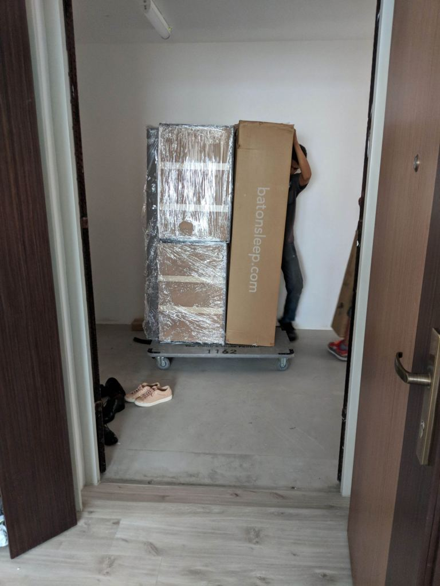
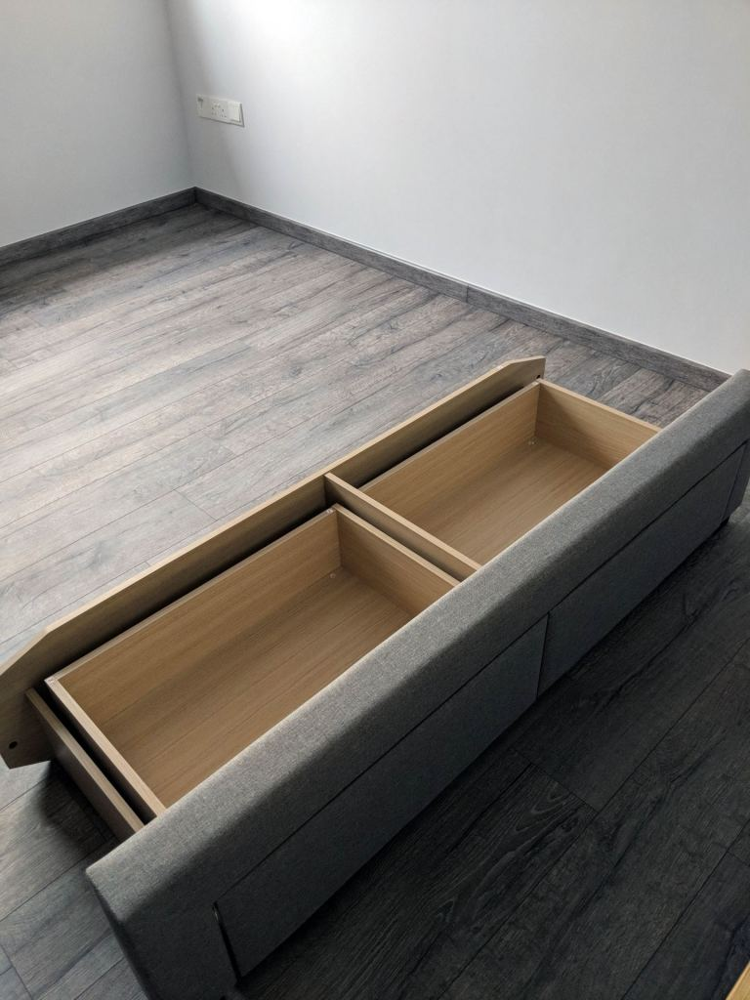
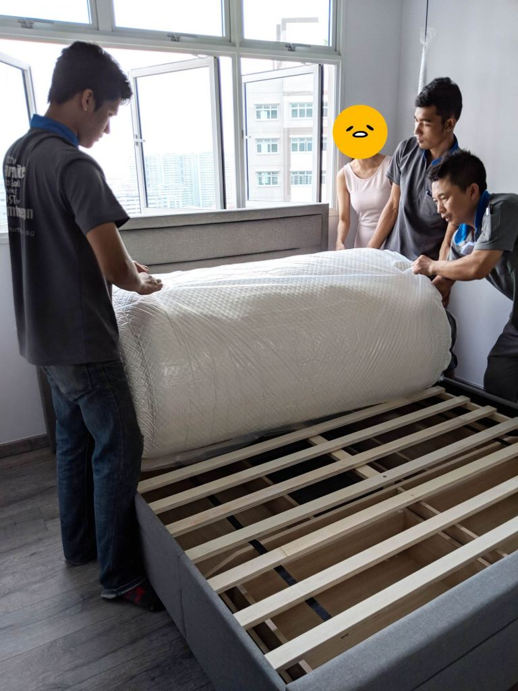
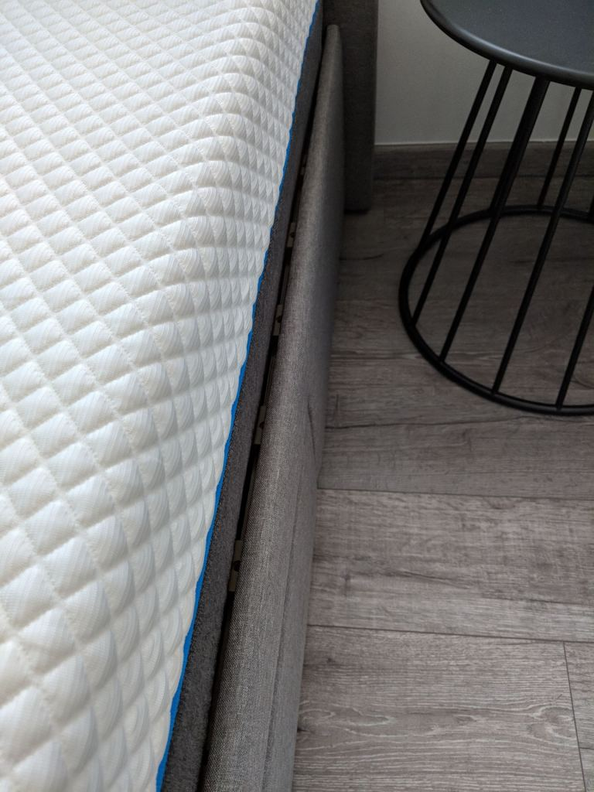
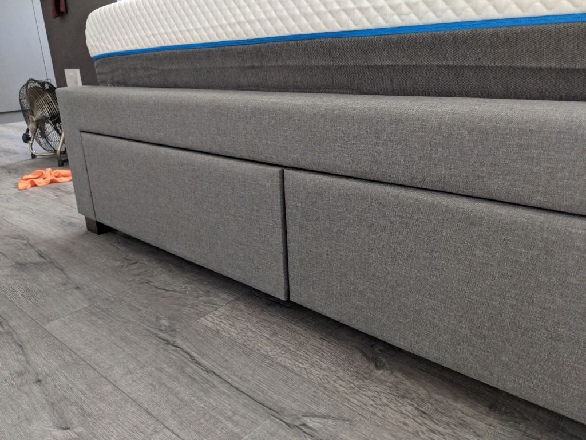
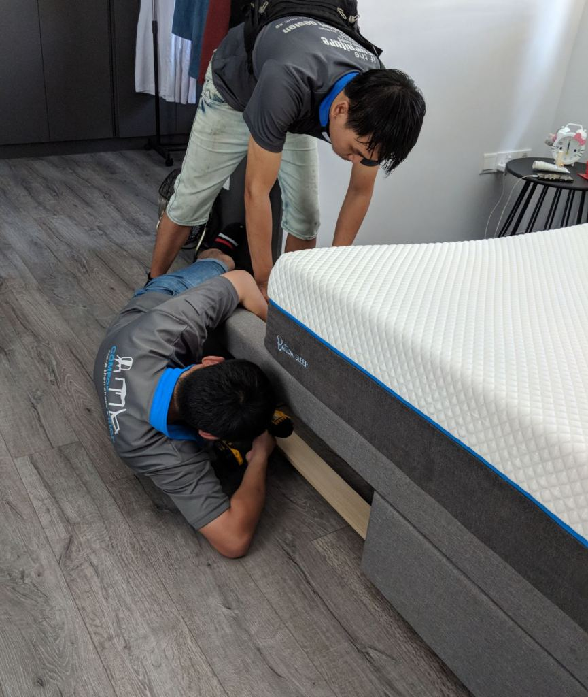

[Baton Sleep](https://batonsleep.com/) is an online retailer of beds in Singapore. It adopts a similar online strategy like US online retailers (e.g. Casper) and competes against others like [Noa Sleep](https://www.noasleep.com/), [Haylee](https://haylee.sg/), and [Wonderbed](https://www.wonderbed.sg/). You know everyone's copying everyone when each retailer uses the same website design, pricing strategy, and "review" page. Check their websites out yourself. We [eventually chose Baton Sleep](https://btonomics.com/shopping/guide-on-buying-a-bed/) because we received a good review from a trusted source. Having slept on the bed for around 2.5 months, we now have a good gauge of how good our bed is to write our Baton Sleep review. If you want to see a general guide for buying a bed, [head over to our article](https://btonomics.com/shopping/guide-on-buying-a-bed/) instead.

But first we need to caveat this guide. It is purely written from our perspective, so our experience may vary from others'. And there are no affiliate links here, this is purely an honest review. Calling a spade a spade. If the product is lousy, then we'll surely call it out.

Our caveat done, let's begin.

## How do you pronounce Baton?

Before we begin the substantial content, we need to detour a little into pronunciation. We've heard the customer service officers butcher the brand name by calling Baton "Bay-ten". They continuously mispronounced it even when we subtly pronounced the name completely differently, like in a "do you mean Baton Sleep" way. It's an injustice to the brand, its founders, its staff, when its own people can't pronounce the name correctly. If anyone from Baton Sleep is reading this - make sure everyone pronounces your brand name properly!

For the record, it's probably ok to pronounce it as "Ba-tawn" or "Ba-ten". Here're 3 videos for research purposes.

<iframe
    src="https://www.youtube.com/embed/445tb1VMIuo"
    width="560"
    height="315"
    frameborder="0"
    allowfullscreen="allowfullscreen"
></iframe>
<iframe
    src="https://www.youtube.com/embed/v2ltfUQaUAE"
    width="560"
    height="315"
    frameborder="0"
    allowfullscreen="allowfullscreen"
></iframe>

## We bought a Queen bed and storage bed frame

We bought a Queen size hybrid bed and a stash storage bed frame. In gray.

 _The Baton Sleep "Stash" storage bed frame. Ignore the bed sheet and pillow cases, no one deserves to see those, in this combination._

You've got to appreciate it when bed retailers do crazy stuff like jumping on beds with wine or Uno Stacko on it, it shows crazy (perhaps fake) confidence. Baton Sleep did that, the video's below. Such gimmicks are good for leaving lasting brand impressions. Who can forget Simmons using a bowling ball and pins to show how their pocketed coil system absorbed shock?

<iframe
    src="https://www.youtube.com/embed/g7PEJqkKUFA"
    width="560"
    height="315"
    frameborder="0"
    allowfullscreen="allowfullscreen"
></iframe>
<iframe
    src="https://www.youtube.com/embed/dNyEcnwPJxk"
    width="560"
    height="315"
    frameborder="0"
    allowfullscreen="allowfullscreen"
></iframe>

Our purchase of the Baton Sleep bed seemed risk-free. They offered a 30 nights refund policy. That seemed fair enough. This is not to say they're industry leading, because they really aren't. Noa Sleep, Haylee, and Wonderbed offer a 100 nights trial. So Baton Sleep provides less than 1/3 the trial duration. Nevertheless, we bought Baton Sleep. Because a good review from a trusted source is worth a lot. They can all pimp their review pages, and those do seem pimped up (check out their reviews page). If they make us their marketing heads, we'd totally get rid of these fake looking reviews and just get the installers to take photos with the clients or the beds. You know, like how other retailers with Facebook pages do it. Genuine, authentic feel. But that's besides the point, we're not here to save the world.

 _An example of reviews. Not saying these are fake, but does the review from Chris V convince you after the guy said "Finally, I'm able to have a good deep sleep throughout the night,"? For us, definitely no._

## Buying online was easy and cheap

You can buy Baton Sleep mattresses at their Comfort Design showcase. But we bought our Baton Sleep bed during their sale online. SGD 100 off. This meant that our Queen size hybrid bed costs SGD 850. We paired it up with the storage bed frame, which came in grey and [fit our theme perfectly](https://btonomics.com/renovation/multi-tone-painting-works-for-greater-contrast/). The process was easy. Go online, make sure click the item and quantity, fill in your address and credit card details, and you're done. We followed up by emailing to request for a later delivery date, which was easily arranged. So far so good. To top it off, we used our OCBC 365 card to accumulate cashback. Got to earn that sweet cashback. Ka-ching.

## Installation

On the day of installation, we came back to find that the Baton Sleep guys were earlier by half an hour. They were waiting outside for us when we came back. Poor guys, their admin people must have over-catered travel time for them. The installation, told through pictures:

 _They came with a relatively small trolley of stuff. Then again, that's normal because the mattress is vacuum packed._

 _The guys unpacked the stuff outside and brought them in._

 _First step was laying out all the pieces of the storage bed frame._

 _More pieces coming into the picture._

 _The headboard being brought in._

 _Preparation would then be done to fix all these pieces together._

 _The side of the bed frame came on._

 _The guys laid the planks on top, and once everything was ready they unpacked the bed onto the bed frame. I think PQ was trying to communicate to help them manage the rolling out of the mattress._

 _Our Baton Sleep bed installed, complete with a surface layer of plastic._

The installation wasn't fantastic. There was a big gap at the side of the bed, which couldn't be covered by our temporary bed sheet. The laminate of one of the drawers looked like it was poorly glued. And one of the wooden plank looked chipped and fragile.

 _We tried to make the gap at the sides smaller, but this was the smallest we could achieve. It couldn't be covered by our bed sheet._

 _The laminate for one of the side drawers was also poorly stuck. It felt a little like excess paper that got glued onto the surface anyway._

 _One of the plank was chipped and looked like it'd break anytime. We're not heavy, but that is not reassuring._

 _We also spotted many creases on the bed surface, but those are thankfully normal._

## Installation - 2nd try

It wasn't good enough to have such a large gap. So Baton Sleep's guys came down to rectify it. The guys really tried very hard to push the bed frame and the planks together, so much so that they leaned against the wall and used their feet to push the sides of the bed. Bonus points for effort, but because our bed frame is cloth-based, we must deduct major points for putting their feet on the cloth.

Unfortunately, the rectification caused more problems. While the gap was indeed smaller, the gap because non-uniform. Some parts curved out. The drawers also weren't aligned, probably because the frame was forcefully adjusted.

 _The gap became much smaller, and this was far better than the original attempt._

 _However, if there's a gap, it should be uniform. But in our case the gap curved. This suggested that some wood pieces were misaligned._

 _The drawers were also misaligned. This was the front, so it's more obvious than if the side drawers were the problematic ones._

## Installation - 3rd try

At this point we were ready to just phone it in. Some part of us was screaming, "_Change the bed and buy the Dunlopillo!_" It was still within the free trial period, so we could do that. But we liked the bed, so we again got Baton Sleep's guys down. We were told that another team of guys would be coming. This new team was supposedly more experienced than the previous one.

 _They started off correcting the misaligned planks._

 _Turns out the planks couldn't be forcefully compressed._

 _The guys fixing the misalignment of the drawers. They had to work on it for around 20 mins, but eventually they did it to an acceptable standard._

This time, our bed was adjusted well in a way that minimized the gap at the sides while keeping the alignment of the drawers as straight as possible.

That said, we didn't appreciate their internal communications. The servicing form which we had to sign off said that the rectification was done as the customer (us) was still not satisfied, rather than labeling it as the product being not up to scratch. It just made us feel like Baton Sleep thought that we were picky, which was not nice. But they apologized for it subsequently so we all moved on.

## Baton Sleep bed is pretty good

Our misaligned bed was finally fixed. That wasted quite a few of our Saturdays staying home to welcome the Baton Sleep guys, but thankfully it was over. If there's anything we learned from home renovations, it's that rectifications are a natural law like taxes. The saving grace was that we didn't incur any cost.

Apart from the inconvenience, the bed is actually quite good. It's a good buy. The bed is soft, but not too soft that you sink in completely. It still offers suitable back support, which is good because the both of us have some back issues. When one person gets onto the bed, the other person also hardly feels a significant disturbance. That's a plus because we never get into and out of the bed at the same time. The bed doesn't feel too warm either, which helps as we don't need to turn on the aircon for that. More ka-ching $$$.

The best litmus test is that we sleep really easily in the bed and we look forward to sleeping in it. As a bed maker, that's what you really want to hear from your customer, when your core product achieves its purpose.

The storage bed frame is good value for money, for the price and style. For that price you won't be getting the best laminates or materials, so we weren't disappointed due to unrealistic expectations. They provide additional storage room in a way that doesn't add bulk to your room, so that's always a plus. Moreover, we don't have to lift up the bed to access the storage space (like other bed frames make you do), so the drawer design is great.

## Too Long; Didn't Read

**We bought a Baton Sleep bed and storage bed frame. The bed is good - the right firmness, it's cool to sleep on. The bed frame is good value for money. But the installation wasn't good.**
