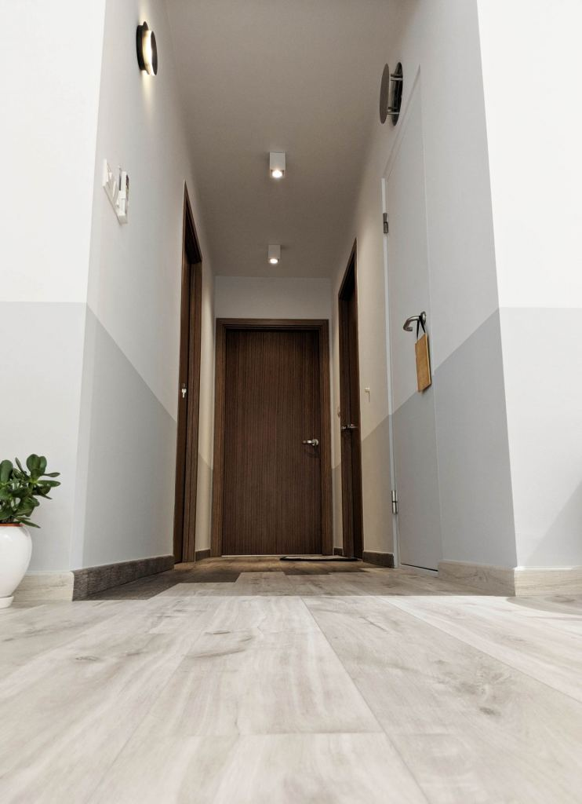
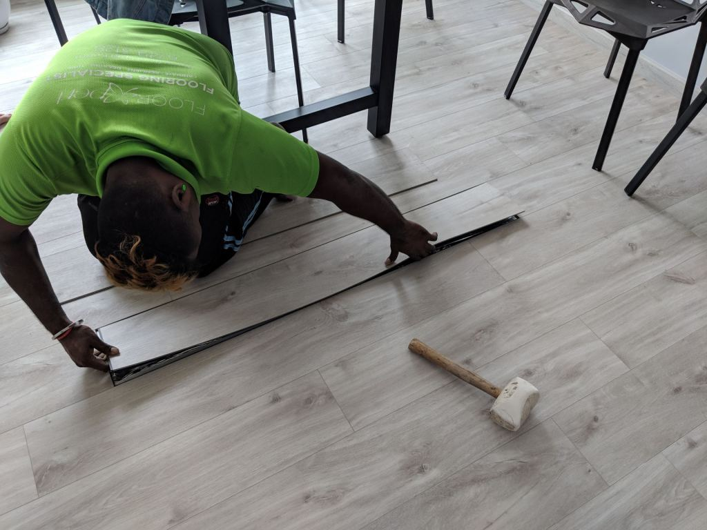
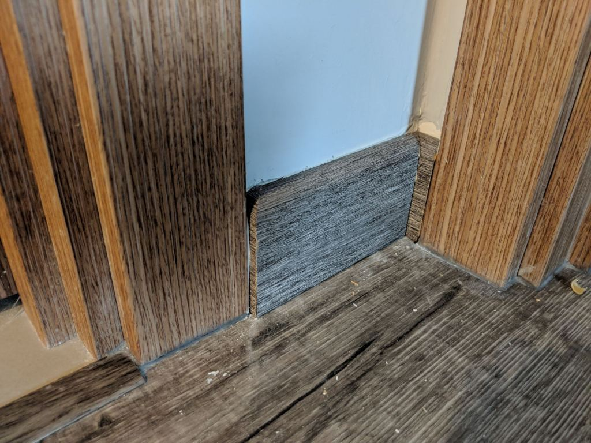

We've been meaning to write our Floor Xpert LURF review for some time now. There weren't that many reviews back when we were doing our research so hopefully this review helps those who're still undecided.

We went with Floor Xpert's LURF vinyl for our HDB BTO home, throughout the flat. It's the Belgian-made one that's supposedly lower in VOC and resilient to chemical stuff and scratches. It was at a good price point. It certainly wasn't the cheapest, because you can get Chinese-made vinyl much cheaper. But it was good value for money.

If you want to know more, you can check out [our post on choosing our flooring type](https://btonomics.com/shopping/choosing-vinyl-tile-laminate-or-cement-flooring-for-btos/) for more details on how we came to choose LURF vinyl.

---

## Installation

Check out our previous post about [our experience with the LURF vinyl installation](https://btonomics.com/renovation/installation-of-vinyl-flooring-for-our-bto/). It was a painless and fast process, but that was also because we weren't on-site to scrutinise everything.

---

## It's been good so far

So far we've had no major complaints with the LURF vinyl and it's pretty good. Here's a photo we took while sitting down in the living room:

Looks pretty much like wood flooring, which gives off a softer feel! Then again, we're neither particular nor knowledgeable in how real wood looks like.

### Easy to maintain but still hardy

The vinyl flooring is very easy to maintain. We don't have to worry about wet mops or staining the floor. It's also hardy. I came from a laminate flooring, which was soft but extremely fragile. At our old home, I dropped something at shoulder height. That left a hole in the laminate flooring.

The LURF vinyl, on the other hand, seems pretty soft but is actually very tough. It's easy to clean and is quite forgiving. If we ended up with water spills, it's ok, as long as we don't leave it out for too long.

### No (dirty) tile grout

This is easily the best thing ever with vinyl flooring, there's no dirt or grime stuck in between tiles. Grout is notoriously bad when it comes to getting things stuck in between, or end up making it worse when you try to scrub it. So, vinyl is excellent for those who hate dirty grout.

 _Say goodbye to these!_

### Resistant to scratches and chemicals

The LURF vinyl is also resistant to scratches. Before we did up our home it was easy to say we'd be careful. Don't drag our furniture, don't do anything funny.

Sometimes it's inevitable, however, because you might drop something or accidentally push your furniture. The vinyl has held up thus far to minor damage. We haven't managed to scratch it.

For example, as with all renovation work we got drops of paint on the floor after we took over our home from our ID. The flooring is resistant to scratches and chemicals, so all we had to do was gently scrape it off with our fingernails. You can also use turpentine oil (turpin/tarpin or whatever you call it) to quickly get the paint off the floor.

But one thing to note: the skirting isn't resistant to chemicals! We learnt that the hard way, but more about that in a bit.

### Comfortable

Thanks to the foam underlay thingy, the LURF vinyl is quite comfy to walk on. It's not hard like tiles, so walking/running on it doesn't hurt. Neither does jumping, not that you should do that of course. It's also not cold even with the aircon on, so it has been perfect for PQ who hates anything cold.

### Easy to replace

The vinyl pieces are super easy to replace. While we were just cleaning up one day, we found one piece of vinyl that was slightly more sharp at the edge. It wasn't anything sharp enough to cut, it was more irritating than dangerous.

Nevertheless, we got the Floor Xpert guys to come and change that (pictures below). Some time later they came, plucked the offending piece out, and replaced it with a new one. The guy did everything in less than 10 mins. No fuss.

This is unlike tiles where you've to think about drilling, potentially damaging other tiles/grout, and whether the new tile looks different from the existing ones.

### Little Volatile Organic Chemicals (VOCs)

VOCs are no joke, and our thoughts are with those who live in Punggol if [this article is true](https://www.99.co/blog/singapore/hdb-punggol-pasir-gudang/). Just kidding. Vinyl flooring can sometimes emit VOCs, especially the cheap ones. They can have an undesirable health impact.

Ours had no such issue and we expected that much since we paid quite a bit for the LURF vinyl flooring. PQ's eyes typically water when there's VOC, like when the cupboards and wardrobes were newly installed, but there's no such problem so far.

### Great after sales service

We never did communicate directly with Floor Xpert, everything was usually done via Jun Wei or Shao Jie. Regardless, their customer service was either quite good or the both of them worked their magic well to get things done.

#### Vinyl piece replacement

When we first moved in we saw quite a few tiles which were a little far apart from one another. There were small gaps. We gave feedback and a Floor Xpert guy came down to rectify it.

He came down with a hammer and knocked on the tiles. After knocking the tiles were better aligned. That closed the gaps. It's quite a good indicator of how easy it is to maintain the vinyl flooring.

 _The guy started by getting the vinyl piece loose. Looked like it was going to be hard._

 _The offending piece came out easily actually._

 _Another angle, underneath it was the mesh thingy that was cushion to the vinyl piece._

 _Next step was to lay the new piece._

 _Hammer on the new piece. Finish! Tough eh?_

#### Skirting replacement

We also had a problem with cracking joints on a few of our walls recently. We repainted the wall but the same parts would always crack. So we asked BSC.

 _The cracks where two walls joined one another. It was probably caused by poor workmanship on those walls and drilling in other units. HDB sure doesn't make flats like they used to!_

They came to fix it, but in the process accidentally dripped paint on the skirting. The BSC guy used turpentine or thinner to wipe the paint, but we realised that that bleached the skirting orange.

Thankfully he didn't damage the flooring after spraying some turpentine oil onto the vinyl pieces (when he tried to show us that the oil was fine for wiping the door and floor).

 _The paint or the turpentine oil ended up bleaching the skirting, which turned orange._

 _These parts ended up bleached too, likely due to the turpentine oil. If needed we could've lived with this or used a pencil to colour the whole thing gray._

The Floor Xpert guy who came to fix it subsequently explained that the paint damaged the skirting. To be frank it wasn't a big deal and if need be we could have lived with it.

That said, Jun Wei and Shao Jie were able to help us work something out to replace the skirting. The replacement skirting was easily done as well. So overall the customer service has been pretty good and they've been able to rectify whatever faults (minor or not) there were.

 _The Floor Xpert guy using a penknife to cut the damaged skirting parts and pull them out._

 _This is how the skirting looks like inside. This is much better than wood laminate skirting, because it doesn't rot._

 _In case you're curious, glue and hooks hold onto the skirting. Be prepared for a lot of dust all around though!_

 _The Floor Xpert guy will take a cutter to cut long pieces of skirting into the desired lengths. We're still amazed by how accurate he was in making sure the different parts fit around the corners._

 _The measurements and cutting were very precise, as you can see from the tight way they were slotted in. Sadly some paint peeled while the job was being done, so we'll need to eventually tape the skirting before painting over the hole on the wall paint._

 _As good as new! Although actually the skirting was new after he changed it._

### Hard to see hair and dirt though

It's no fault of the LURF vinyl, but the design we chose was like wood. Compared to tiles, it's difficult to see where there is hair or dirt because everything looks like the standard pattern. It's a good problem to have though when we're lazy to sweep or mop the floor though.

 _Like seriously though how to see hair or dust? Good excuse to tell the wife that the floor is still clean to avoid mopping!_

---

## Overall review - great value for money and after sales service

There's very little to complain about Floor Xpert's LURF vinyl flooring. It's great value for money even though it's more expensive. The after-sales service is excellent as well. You don't feel like you're abandoned after you've paid - in fact the supplier probably received money a long time ago when our home was still being renovated.

Thumbs up and would recommend to anyone not keen on tiles or looking for vinyl flooring!

