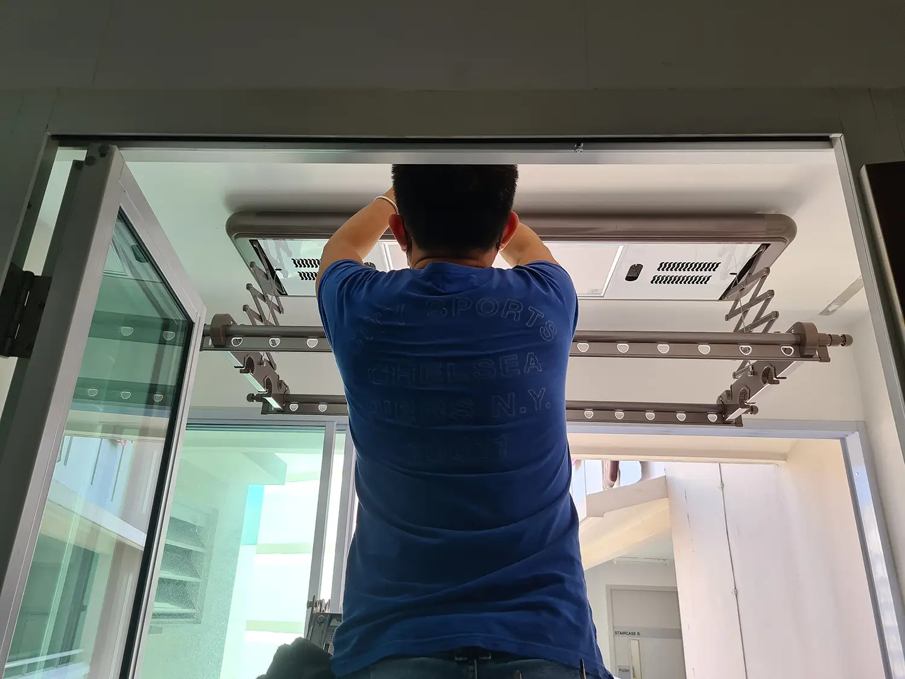

It’s been a long time and I’ve been meaning to write a review of our Varlux laundry rack system. Varlux appears to be a local company selling cheaper automated laundry rack systems made in China. It comes with nice-to-have features like a automated height adjustment, heater, UV sterilizer, fan, and light.

Most people would have heard of Steigen, which gives you a laundry rack system that also gives you a heater to dry your clothes. Varlux was way cheaper than Steigen, so we bought that. No laundry rack system is worth the exorbitant price of Steigen, $1,300 are you kidding me!

## Our laundry rack system purchase

We bought our Varlux laundry rack system in mid Dec 2020 for $735 (nett $716 after deducting generous Shopee vouchers back in the day). The same thing costs only $648 on Shopee now, so incredibly it seems Varlux cut their prices when every price underwent inflation.
Installation was done 10 days after I paid for it. Pretty fast considering this appointment had to be arranged.

The model we bought was a basic one with up-down motor, heating, UV light (which was gimmicky and useless), a light, and a fan. From the remote control and instruction manual, it seems made in China.

 _Remote control of the Varlux laundry rack_

1 person came over, dismantled the existing laundry rack from HDB. Our laundry rack was spoilt after only 2 years in service, so that was good. We also had a service yard light, which had to be dismantled. The result was a rather big hole in the ceiling for the cabling, and this was patched back with plaster. And the sides were the HDB laundry rack was bolted/fastened also came out, taking the paint out as well.
 _Started by taking out the HDB laundry rack_

 _Installing the Varlux laundry rack_

IRC the entire installation process took less than an hour, so it was over very quickly. Be prepared to clean the floor, because there was quite a bit of debris from the ceiling that dropped out.

A few of the hanger slots rubber lining were missing, so I texted the Varlux folks. They dropped it off at our home, which was fantastic. No complaints about their service tbh, maybe they were dropping by the area but the cost of transport/mailing would be so much higher.
 _Varlux laundry rack Installed, with a gaping hole yet to be filled_

 _Patched the hole with some plaster or putty, can't be sure._

 _The Varlux aftermath, looks pretty alright although the entire laundry rack setup did feel cramped at the start._

## Review – Varlux Laundry Rack 4 years later

We’ve had the laundry rack for almost 4 years now, using it every 2-3 days. So this is not the typical review where it’s only been 1-2 months and you can't give any review of normal, longer term usage.

### The good

- **Clothes are usually dry.** The missus summed it up perfectly – we have not bothered about the weather when thinking about washing clothes! It’s not like a dryer per se, but it gets the job done. It dries the clothes much faster than just hanging it in the service yard and praying the weather’s hot and dry that day. For large things like thick blankets, bedsheets, it works somewhat alright. For children pillows, bolsters, just put them right under the heater vents and usually they dry within the day.

- **Used more than machine dryer.** We use it much more than our dryer machine. We have a Samsung washer-dryer combo washing machine. We try not to use the dryer because we’re not sure if it damages the clothes. It also feels like the dryer uses more electricity than Varlux, but honestly we can’t be sure because we can’t be bothered to do accurate measurements.

- **Super convenient to adjust height of laundry rack.** It used to be that the HDB rack needed manual pulling and tying to adjust the level. After a year the lever broke, so we couldn't adjust it properly. Nowadays we can't remember the HDB version, because the automatic up and down height adjustment has been so good we have gotten used to it.

- **Cheaper than Steigen.** Varlux is much cheaper than Steigen. I can’t remember how much Steigen cost in 2020 when we bought Varlux, but it was much more expensive, something like half the price of an equivalent Steigen.

- **Remote control is magnetic.** We just put it on the fridge, which is right outside the service yard. We haven't needed to change the battery in 4 years, so that has been great so far.

### The “meh”

- **The UV light is gimmicky and pretty much useless.** The light is really weak and looks more like an airplane reading light. And I feel it’s better that it’s weak. if the UV light is strong I’d be super worried about getting too much UV light exposure and skin cancer.
  If you’re looking for something that’s really pretty, this is not it. It’s not pretty. The plastic that patched the ceiling is also not for those who value aesthetics.

- **Remote control takes some time to turn off the heater.** The remote control can be improved. Some functions are instant (e.g. press the button and the fan turns off immediately). However, press the button to turn off the heater, and it turns off only after like a minute or so. Maybe it’s the motor needing time to shut down. Of course you could turn off the main switch for instant shutdown, but that could damage the thing.

- **Heater runs on cycles.** It's good and bad. 1 cycle lasts only for some time, so if you want to use the heater for things like blankets, which can take a few hours, then you need to wait for the heater to finish one cycle, and then activate another round. It's somewhat inconvenient. But it also prevents cases where you accidentally turned the heater on for hours.

### The bad

- **Placement not central.** The service yard had existing water pipes, which restricted where we could install Varlux. We would have wanted it more central, instead we needed to have it nearer to the window.

- **Couldn't fully extend the bar.** One part of the Varlux rack couldn’t be opened fully, because the water pipe was effectively blocking it. We can always hang clothes there, but realistically it’d get dirty when put right beside the pipe. So that part just stays retracted all the time.

_You can't put any clothes there, so we keep this part fully retracted._

- **Dropping bars.** The middle bars on the rack can sometimes drop down while hanging. It drops when you push it upwards and dislodge it from its groove, the groove is shallow. It’s meant to be modular and opened up for more rack space, but it’s annoying when sometimes you’ve clothes hangers all on the rack, suddenly one bar drops/opens down, and then all the clothes hangers drop to the floor. It doesn’t happen often, but on the occasions when the bar drops down, you’ll be cursing (especially if you’re OCD and need to rewash the clothes that dropped).

## Verdict

No regrets buying Varlux. Easily one of the better purchases at home. Can't imagine a life doing laundry without Varlux (or basically any laundry rack system like Steigen) - no way we're going back to the default HDB one again.
