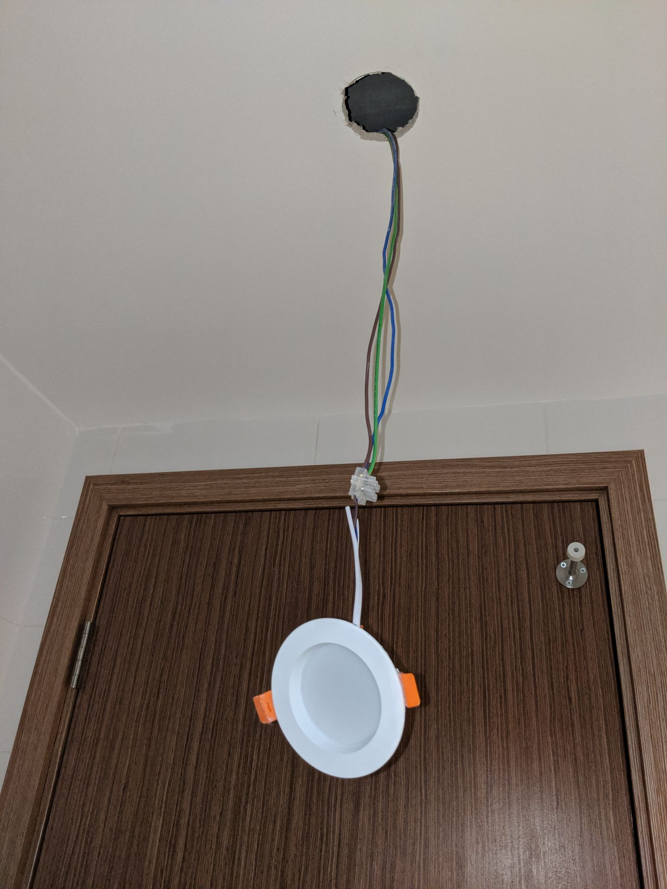
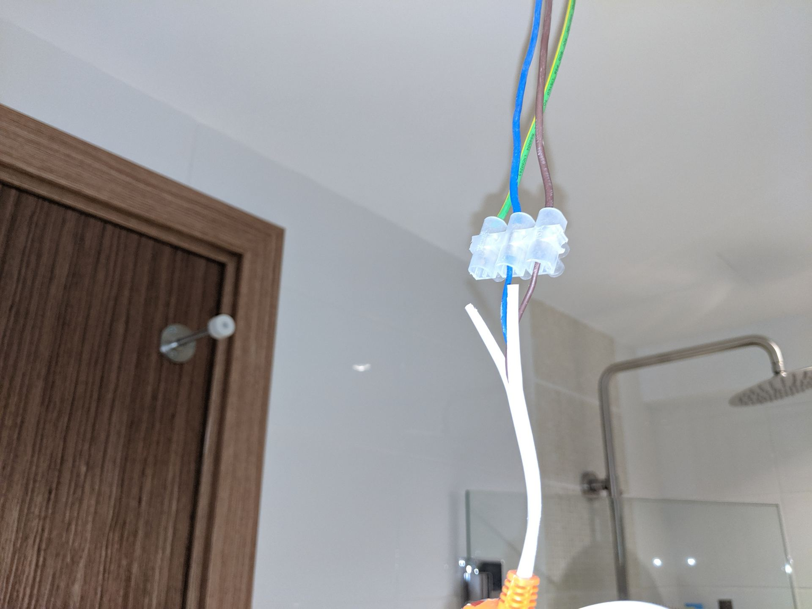
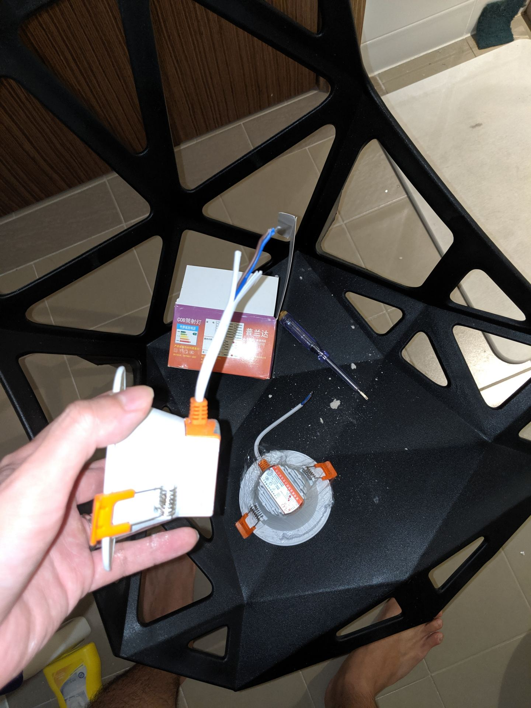
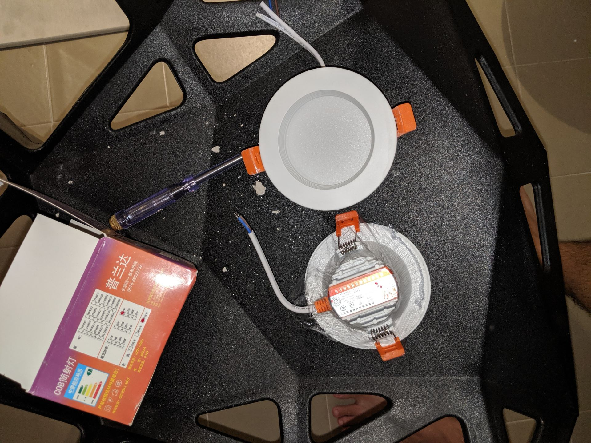
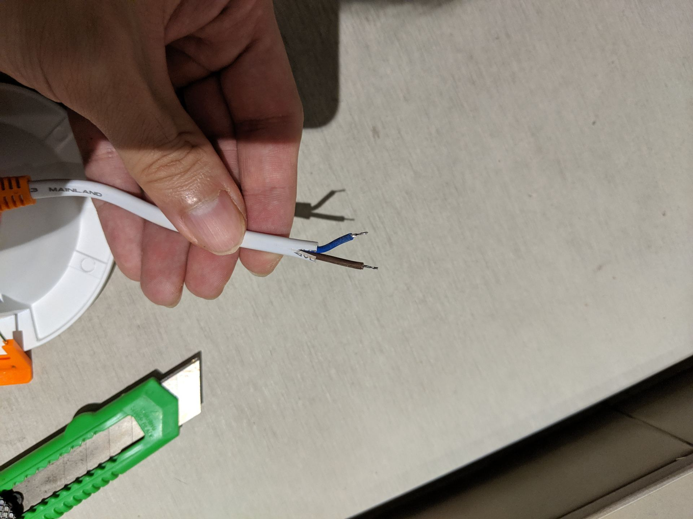
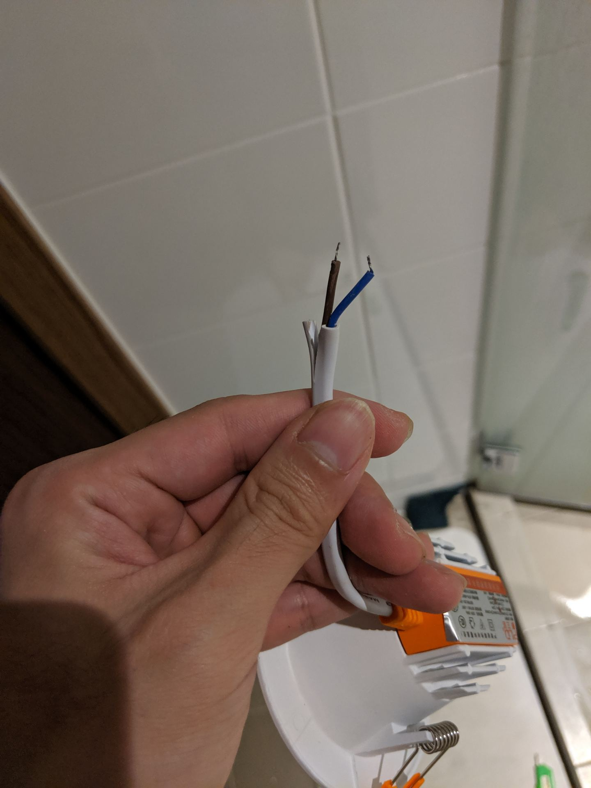
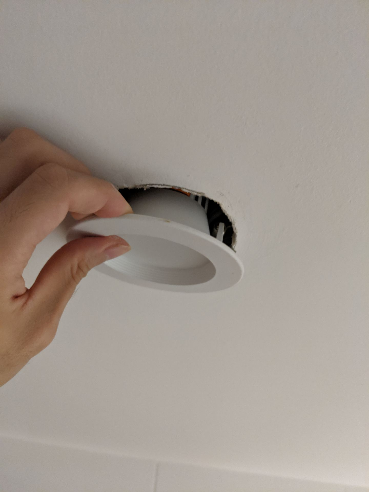
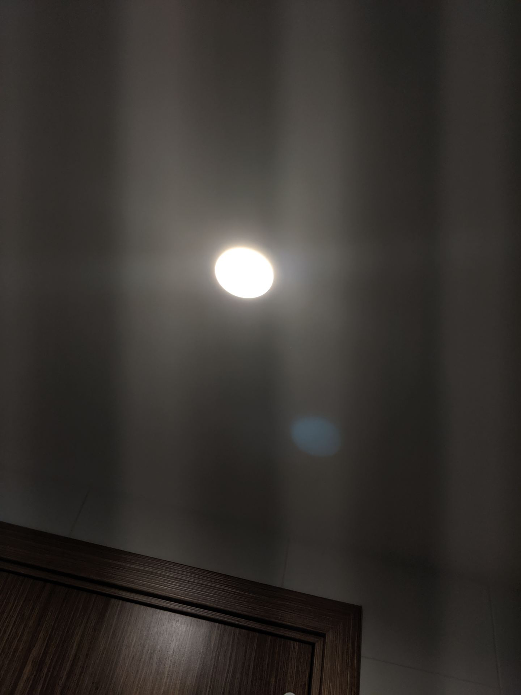

We moved in for about a year, so some things have started to spoil and needed replacement. We had to change a [bathroom ceiling LED light bulb](https://btonomics.com/renovation/our-bto-home-lighting-design-and-lighting-installation/), a [recessed downlight](https://btonomics.com/shopping/how-to-buy-lights-from-taobao/), that spoilt.

Neither of us has ever done this before, so we went by trial and error. We succeeded so we get to write this tutorial.

Before we begin, you need to realise that this is not for you if you've a fluorescent light bulb (see [our guide here on the differences](https://btonomics.com/shopping/how-to-buy-lights-from-taobao/)).

## Step 1: Make sure no one turns on the light while you work!

Very important, don't let anyone turn on the light while you're working. Else, you'll become bak kwa.

 _You're not going to smell as nice when you're burnt and fried by the electricity._

## Step 2: Pull the downlight

Don't turn the light like we first tried. Grip both sides of the recessed downlight and pull it down. Dust and random crap will drop down, so wear your dirty clothes (before bathing, of course) when you do so.

You might need to put in some force as the clips lock the light in place. But don't pull so hard that your whole ceiling comes down!

 _The stuff that drops from the hole will give you a nice white mask for your face and hair._

## Step 3: Unscrew the screws that hold 2 wires

Unscrew to loosen the wires and take out the faulty LED light.

 _The screws are on the flipside, get a test pen (straight screw head) to unscrew it._

 _The light bulb, loosened from its unity with the controller or cables from the ceiling_

## Step 4: Admire the shit that dropped and contemplate the clean-up that lies ahead

No, really, take some time to absorb the fact that you're now dirty, smelly, and have to clean up later.

Meanwhile, bring out your replacement light bulb.

## Step 5: Cut the rubber wire insulation, if necessary

The blue and brown wires need to go into their respective holes. If the insulation is preventing the wires from splitting, then you need to cut the insulation so the wires can be free to go in.

 _Cut it up!_

 _Easy peasy, but don't cut the wires!_

## Step 6: Put the wires into their respective coloured holes and tighten the screws

Self explanatory. Don't mix up the order of the wires - always go back to the same colours.

## Step 7: Put the LED light bulb back into the hole

Stuff it back. To do that, pull the clips up so the LED light bulb fits into the hole.

 _You can see the clips are already pulled up. Else they won't fit._

## Step 8: Turn on the lights and see if it worked out

Of course it works. A change of ceiling LED light. Not bad huh?

