Having a toilet shower screen is nice, especially when it's made of glass. A screen is more expensive (around $500) than a shower curtain, but they keep toilets drier. We have both, so it's very obvious a screen works better.

It's also something most hotels have, so it looks more atas.

Unfortunately, shower screens get a lot of water and soap marks (duh). If you're like us, being lazy to clean it regularly, the marks harden and become very difficult to get rid of. (But if you want a natural privacy filter for your screen then this is great.)

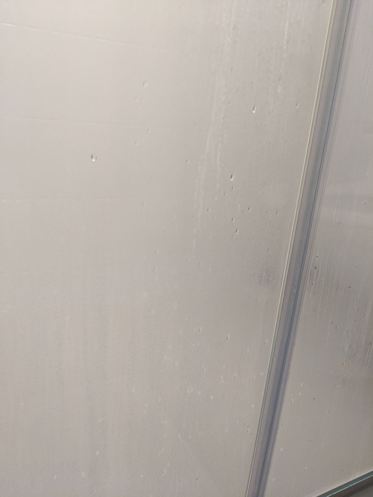 _The bottom part is full of water marks as well._

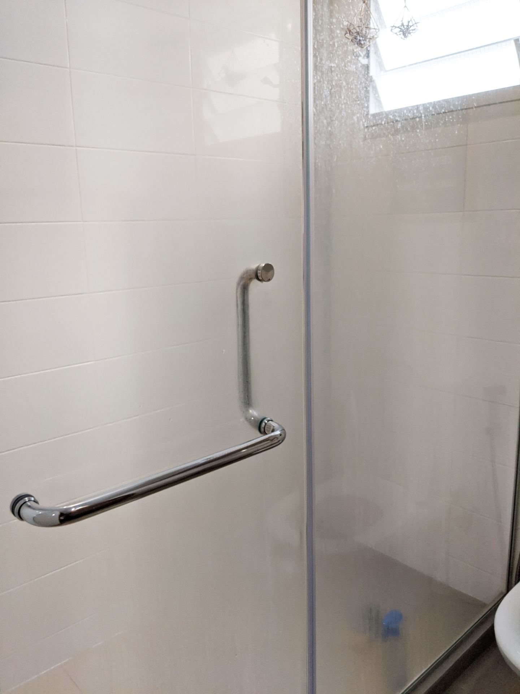 _The water marks look like a privacy filter for our toilet shower screen._

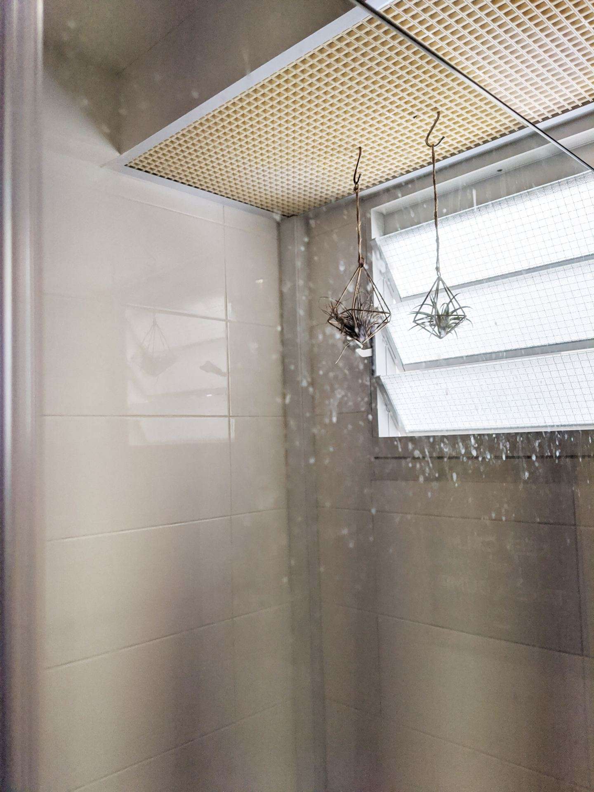 _Up close and personal._

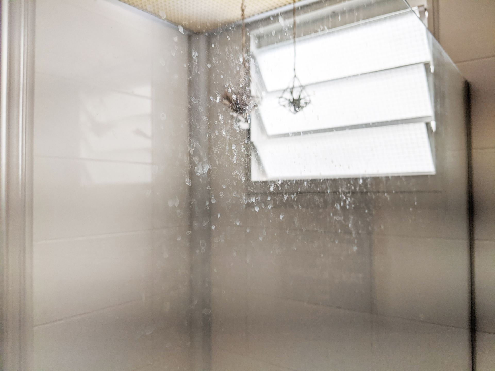 _They're surprisingly stubborn to wiping using cloths._

We tried glass cleaning liquids, glass wipers, and wet cloths. None worked. The water marks are still there on our toilet shower screen.

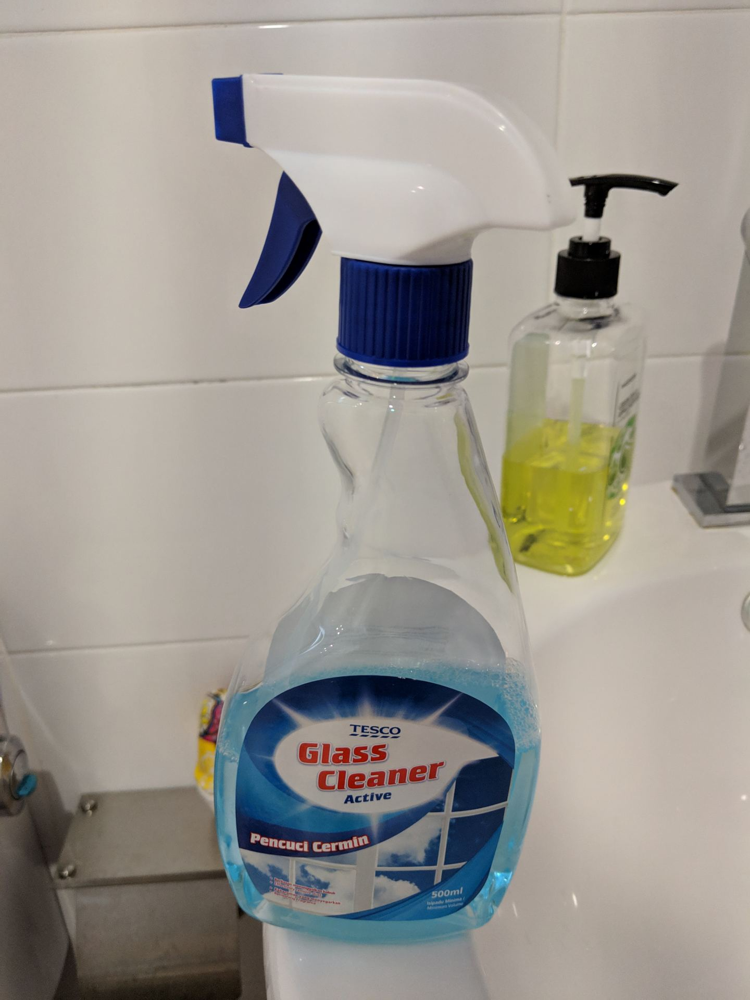 _We bought this from Tesco to clean our mirrors. Unfortunately it doesn't work to get rid of the water marks._

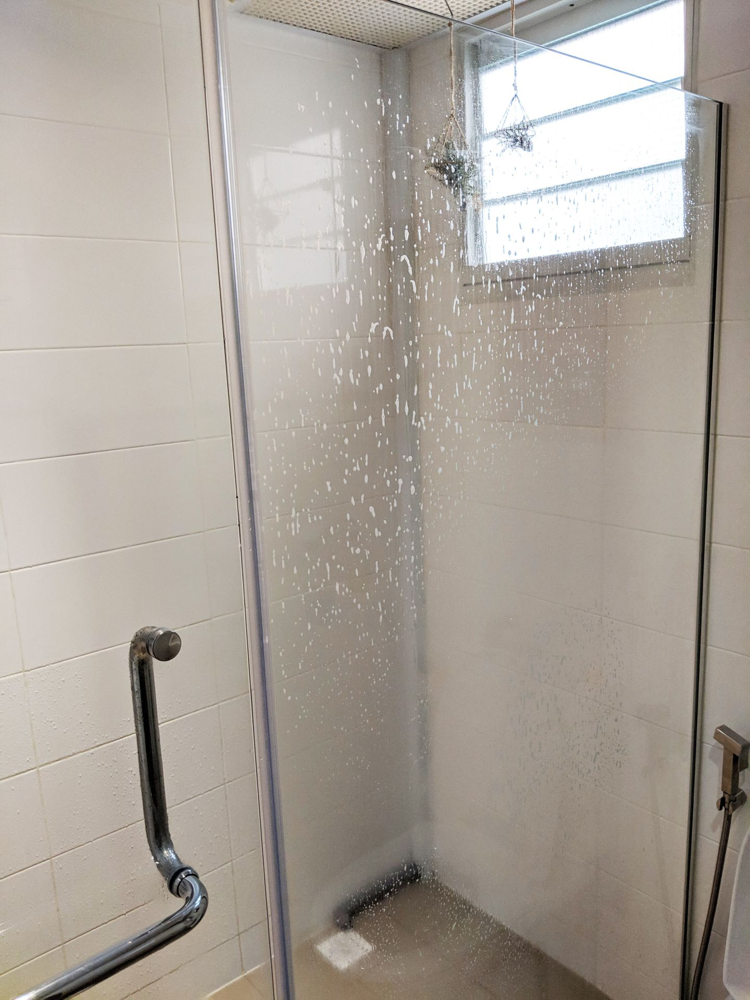 _The effects of the glass cleaning liquid, doesn't work._

We also tried glass cleaning sponges (gifted to us by the shower screen contractor), but it was super slow to clean and after a while didn't clean well.

## Solution: CIF and Scotch Brite Non Scratch Scrub

We researched and found a great solution: use CIF and 3M Scotch Brite Non Scratch Scrub (for non-stick pans) to scrub the shower screen. It's not abrasive so you won't scratch your shower screen glass. At the same time it dissolves the water marks well.

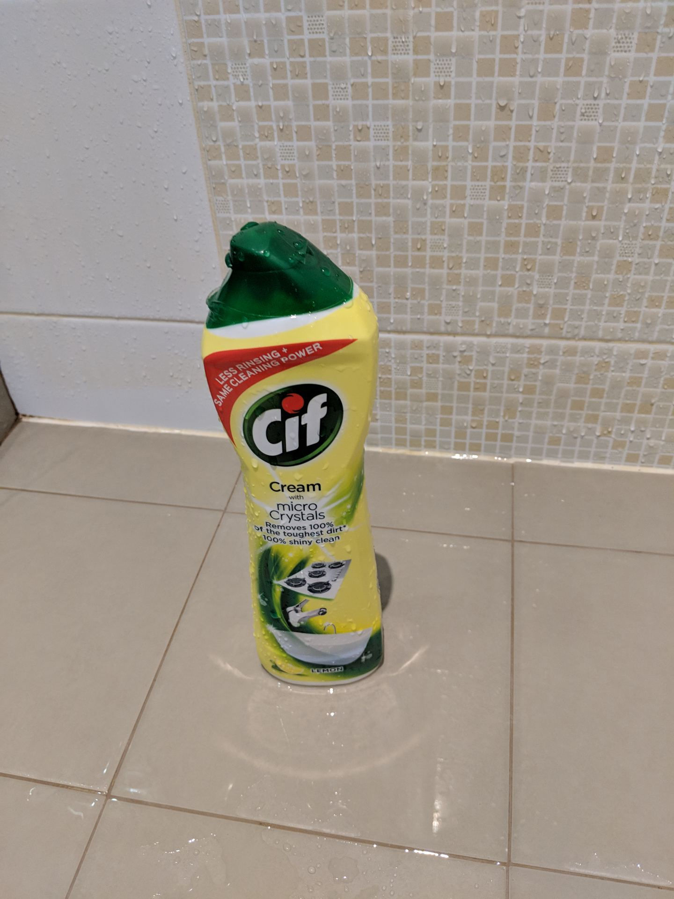 _Trustworthy CIF, sold for about $1 at Value Shop._

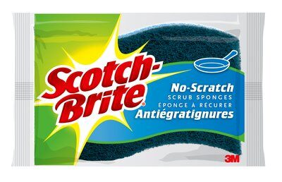 _Get this instead of the Scotch Brite Heavy Duty scrub._

Don't use too much or press too hard though, our CIF had micro cleaning particles, so we still need to be careful.

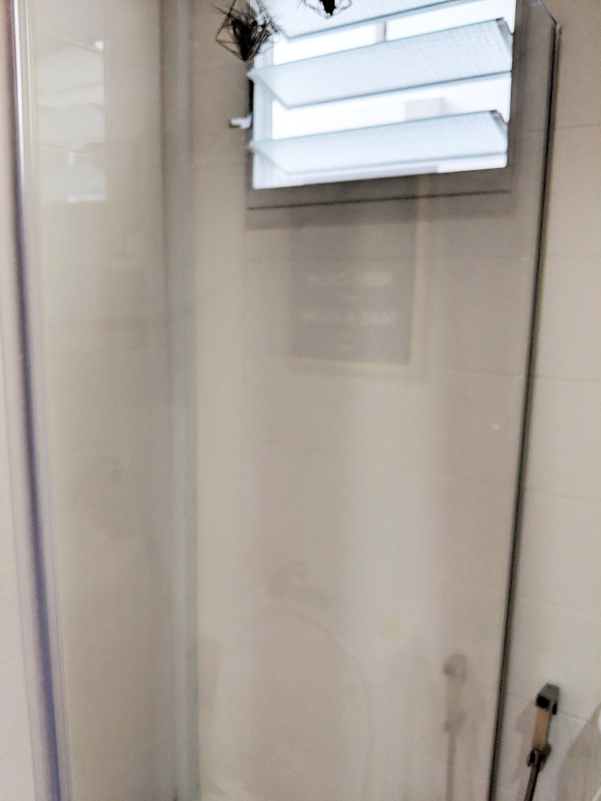 _It becomes super clean after it dries up._

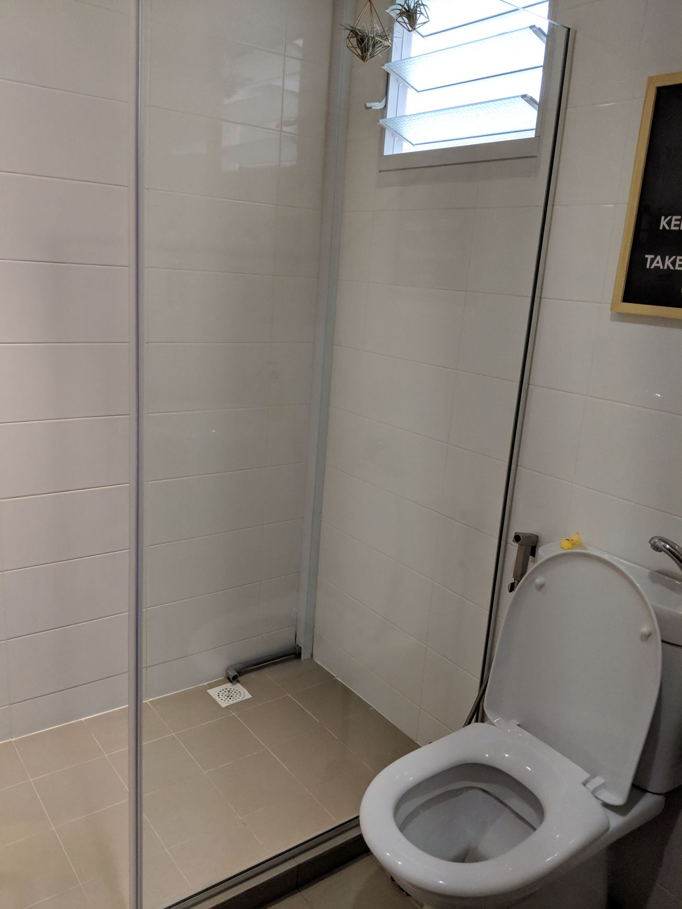 _Almost like brand new, until your next shower that is._

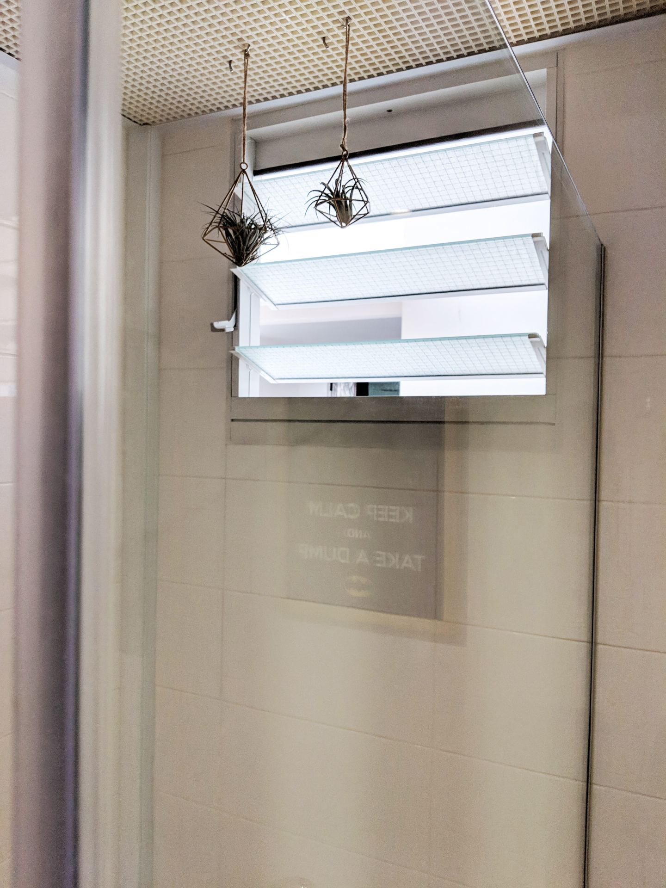 _Ditto, spotless._

And once you're done you can use the glass wiper to dry the shower screen if you want to.

Problem solved! Now you can get a bright and clean shower screen just before your friends and family visit. (Of course you only clean before visits.) The marks start to harden after a few weeks, then you need to bring out the CIF and Scotch Brite again.

