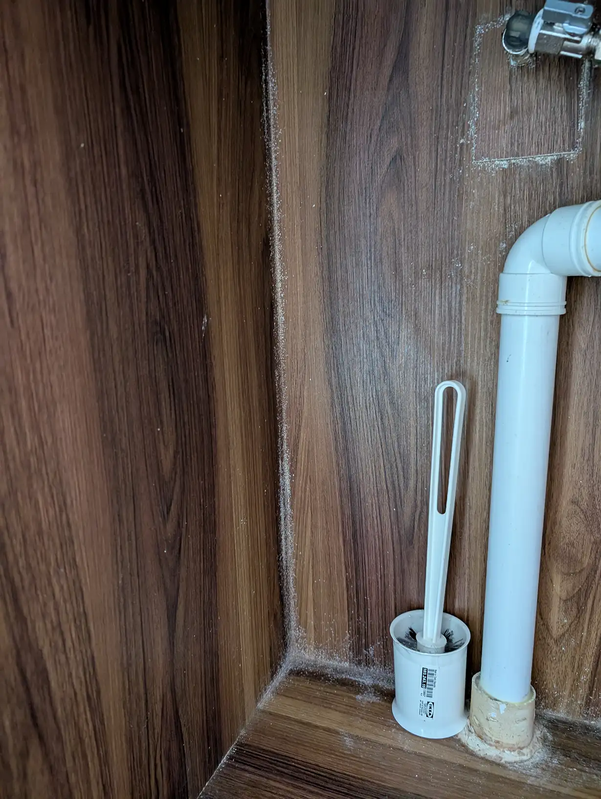
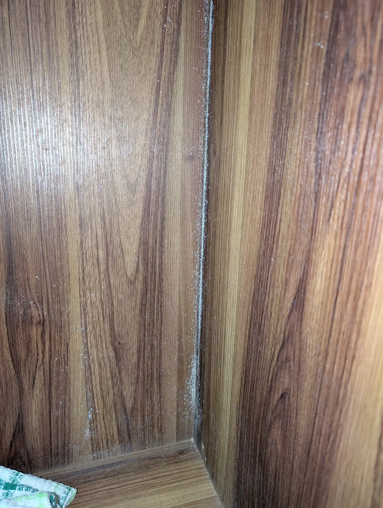
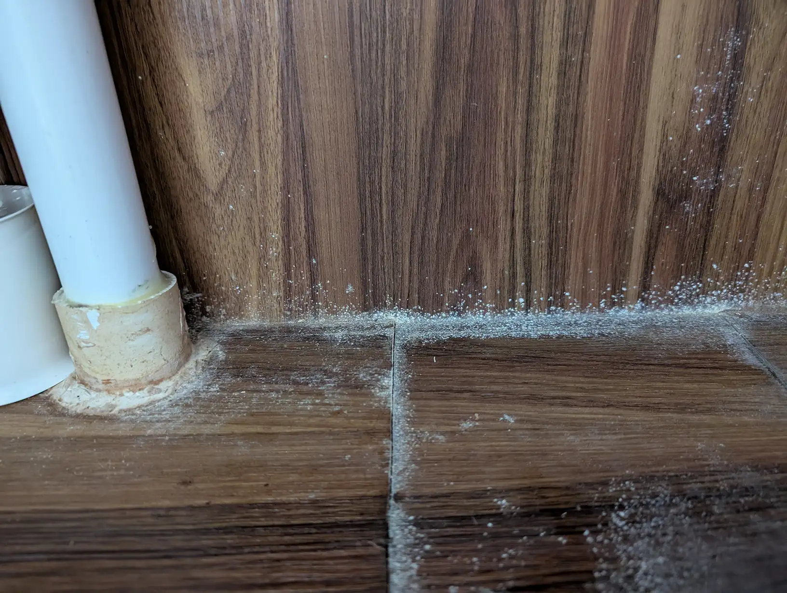
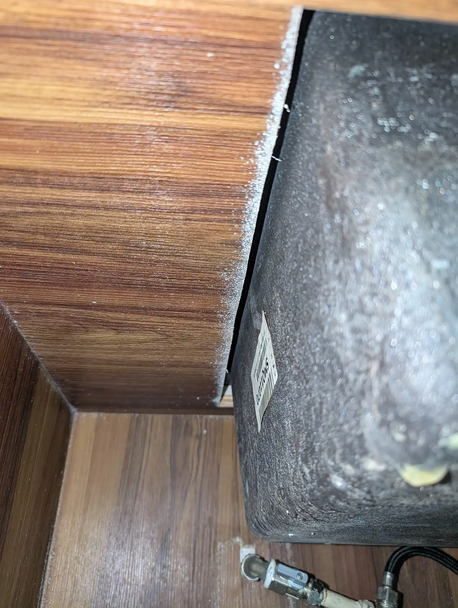
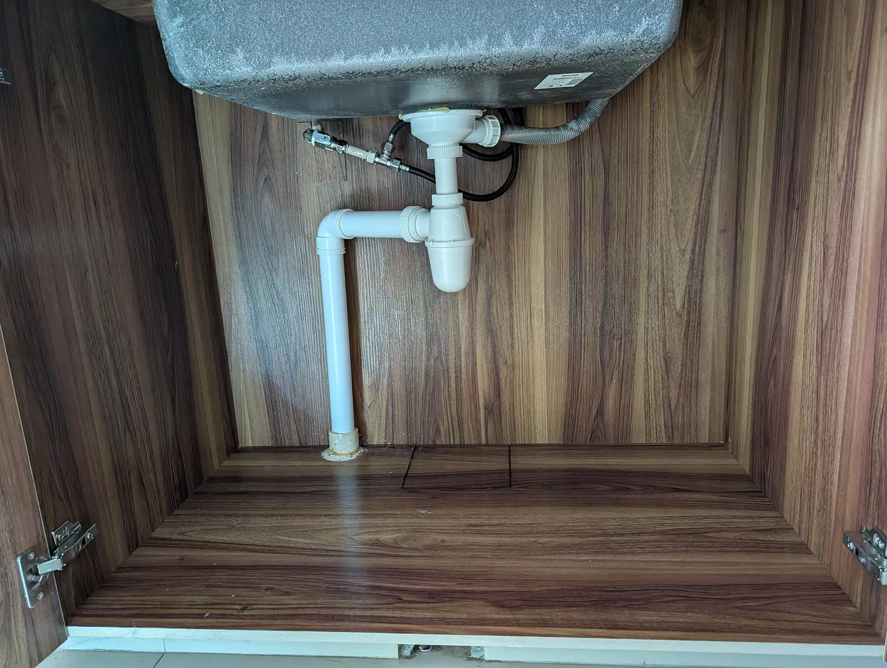
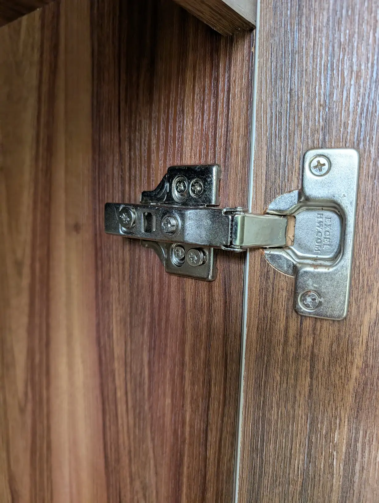

I cleaned out the cabinet under my kitchen sink recently. It's often damp there because of water and detergent spills. I found a lot of mold.

I don't think of cleaning it actually. But coincidentally I was looking for some stuff and saw tons of white stuff. So I took everything out, cleared out the cabinet.

## The Damage

This was the cabinet before I cleaned it.

The cabinet before cleaning. Not looking good.
Tons of "white dust" along the corners.
Tons of "white dust" along the corners.
Especially bad near the cutout.
Even the hinge was moldy! Ugh.
The edges for the sink cutout was affected too, it's not somewhere I think of cleaning tbh.

This definitely wasn't healthy! Especially for an adult with respiratory issues and a kid with eczema.

So it was up to Magiclean bleach and scrubbing.

## Warning

But before that, a PSA: CDC says that people with allergies, lung disease, immuno-compromised, or have respiratory diseases shouldn't clean mold. I wore a standard surgical mask but it wouldn't have been effective anyway, you'd need an N95 mask for mold.

## After Cleaning

And it's really difficult to reach all the corners, almost missed stuff out. So check with a phone with flashlight and take pictures of tight corners.

Almost missed this.
Almost missed this.

I don't know how long the mold was there. It probably was there for a long time. We don't wet it intentionally, but probably worth putting a Thirsty Hippo in future.

After the cleaning, we made sure to leave the cabinet doors open for a couple of days. It didn't hurt.
