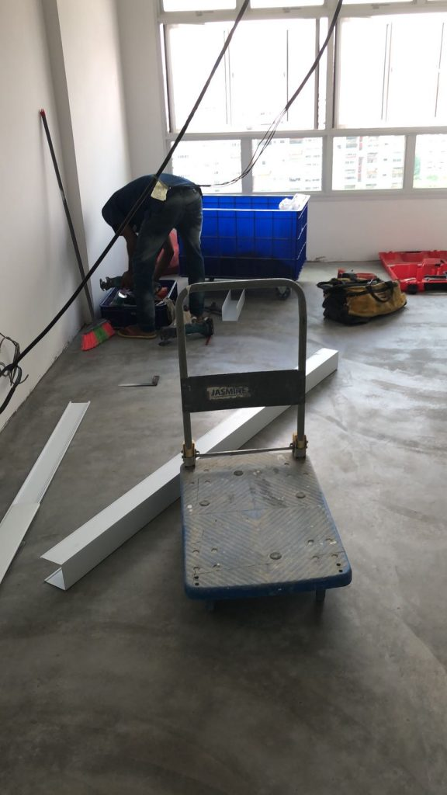
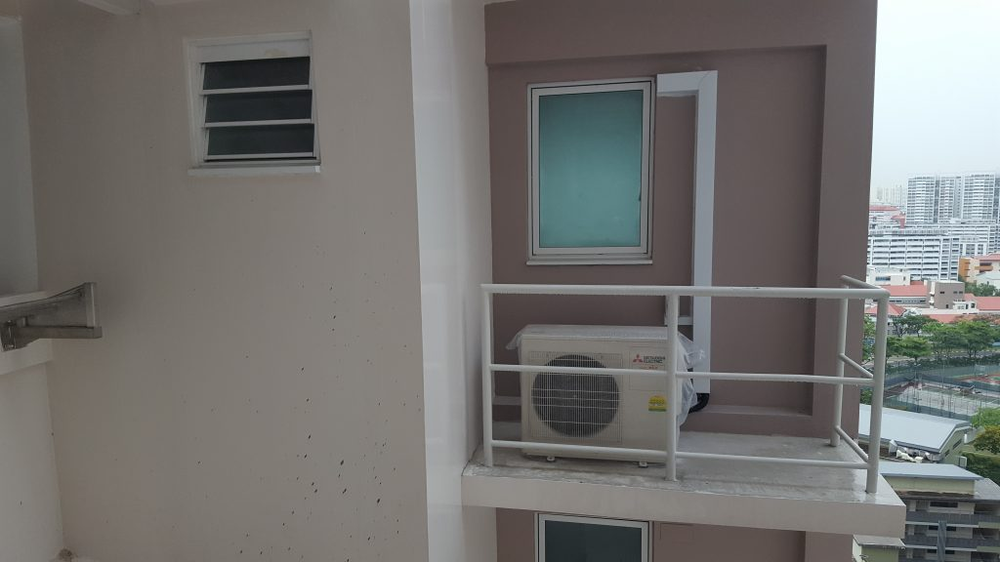
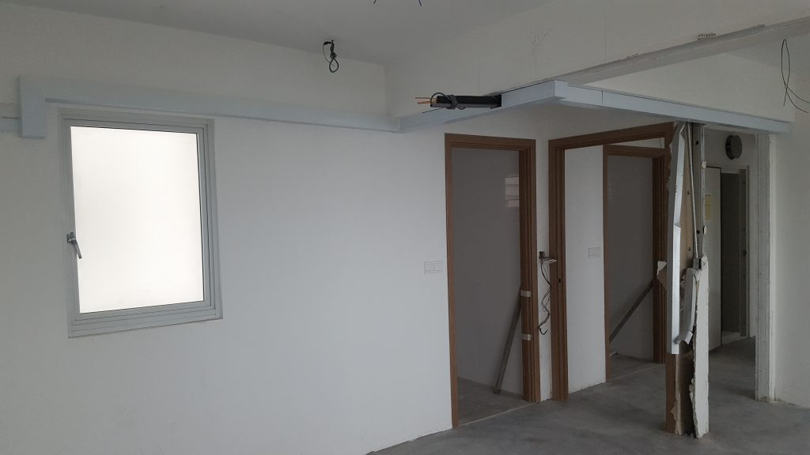
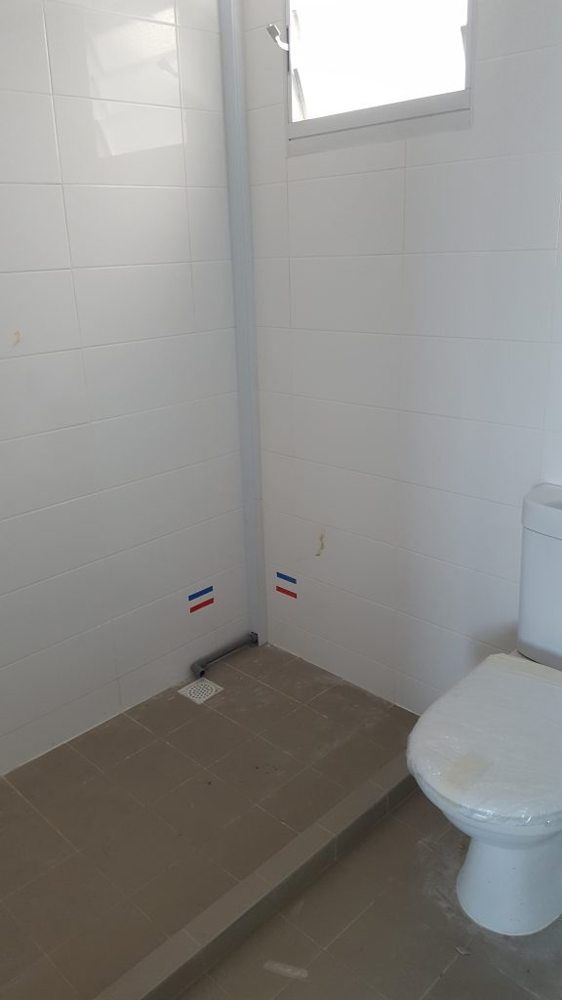
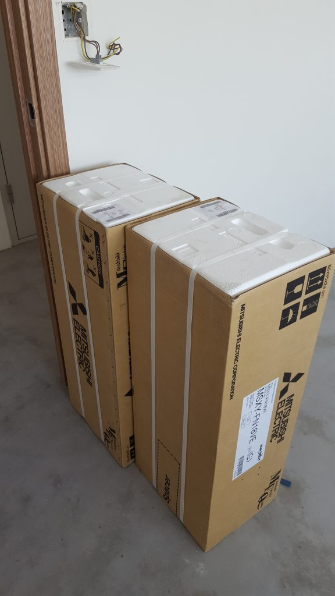

After [choosing our aircon installer, brand, and system](https://btonomics.com/shopping/how-to-choose-an-aircon-for-your-bto/) we went ahead with the installation once Shao Jie and Jun Wei said it was time. We were busy with work. So we got Jun Wei to supervise Jex Aircon's first trip to install the aircon piping. This was after we paid up via bank transfer. It was easy to reach Alex and arrange with him several days beforehand. He was very flexible.

The installation went well. We would've preferred if the aircon piping could end elsewhere other than the MBR toilet, because it's a little ugly to be honest. But there was no choice. Oh well.

After the installation, I realised we didn't even specify any details about the aircon stuff. It just, happened. This is probably the best thing about getting an ID, they settle every detail like this and you need only care about the larger details. The end result was really pretty good, a better job than I'd done.

_Tools loaded up to install the aircon piping_

_The compressor installed_

_Aircon piping in the MBR was surprisingly neat and well done, we've seen much worse_

_The aircon piping that terminates in the toilet_

_There had been a strike in Thailand which caused a shortage of stock for Starmex across Singapore. That prompted us to pay upfront and store the aircon units first, lest we get caught in a bind without stock and needing to complete our renovations._
