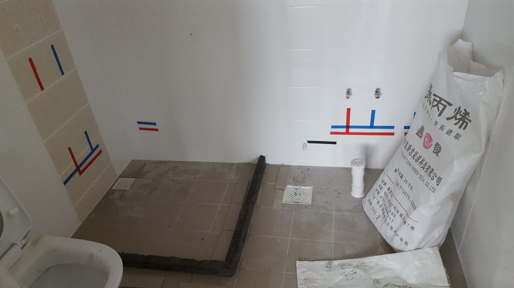

Jun Wei's guys did minor wet works in the kitchen and toilets around the same time as the painting.

Nothing fantastic or abnormal for those works. It seemed like our home already needed very minimal wet works. We have seen cases online where the wet works were extensive, and a large part of it was because the home owners overlaid tiles. If I'm not mistaken [the new rules that mandated the use of pre-packed cement](https://www.straitstimes.com/singapore/housing/renovating-flat-rule-on-cement-may-drive-up-bill) drove up the costs of doing these kinda stuff. The larger bill sucks but on the flip side it probably is less messy than mixing stuff in the flat; in the past you used to see sand piled up in the BTO flats. We probably saved quite a bit because we didn't need to tile our place. That was lucky. The colour of the tiles were good and didn't need to be replaced.

_This was the end result of the wet works for the kitchen_

_The kerb for the MBR toilet, which differs from the common toilet because it will accommodate a shower screen_

---

## End result

After allowing the cement to settle, the guys went ahead to do up the tiles for the toilet kerbs. We measured the size of the common toilet kerb thereafter, so we could buy our shower curtain and curtain rod from Taobao. We didn't need a curtain for the MBR toilet because we opted for an atas shower screen. To be honest, the kerbs looked like they were on the smaller side, as they wouldn't really fit someone who was larger in his/her build. But that's too bad. BTO toilets are really small.

_The end result for the MBR toilet kerb_

It was strangely satisfying to see progress made when the tiles came on. A small victory of sorts. Not sure whether everyone feels the same way, but the process seems thoroughly enjoyable when you see progress on the home renovations.
