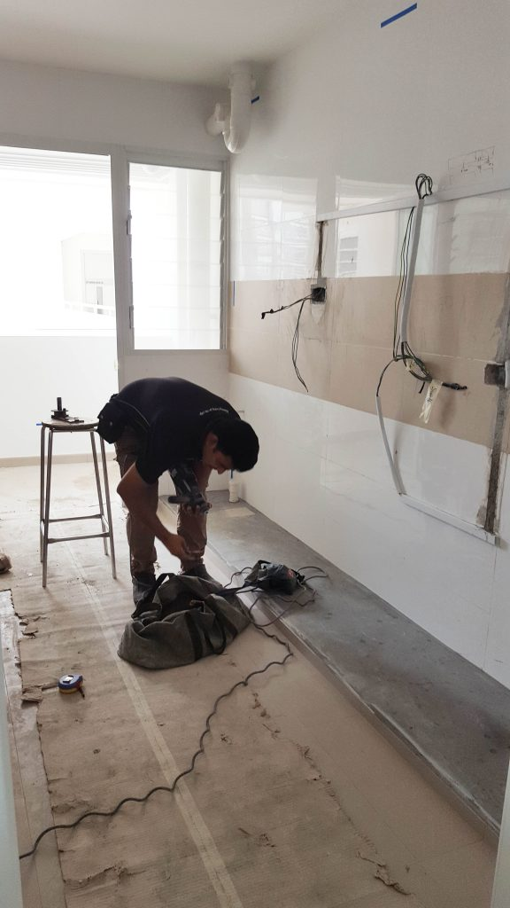
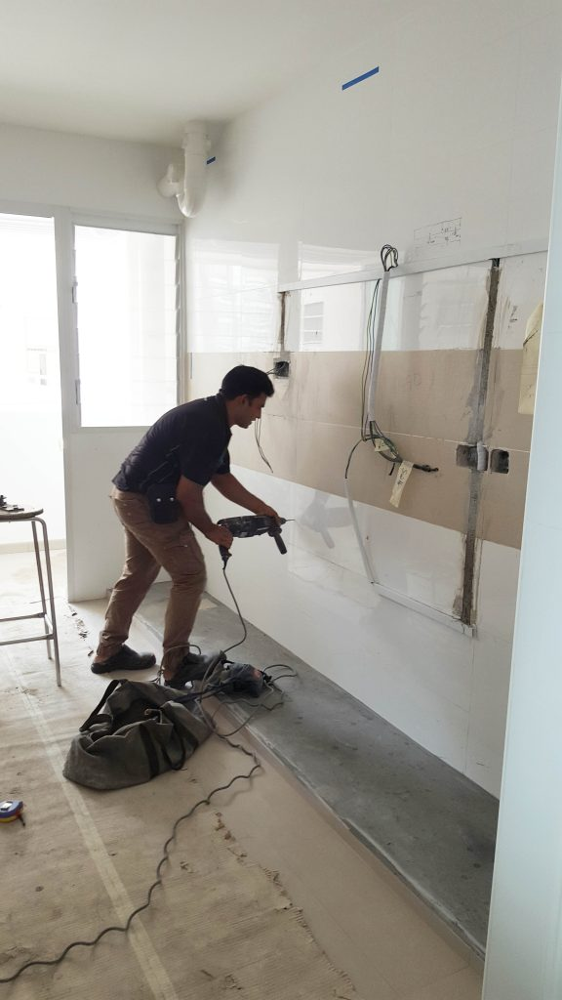
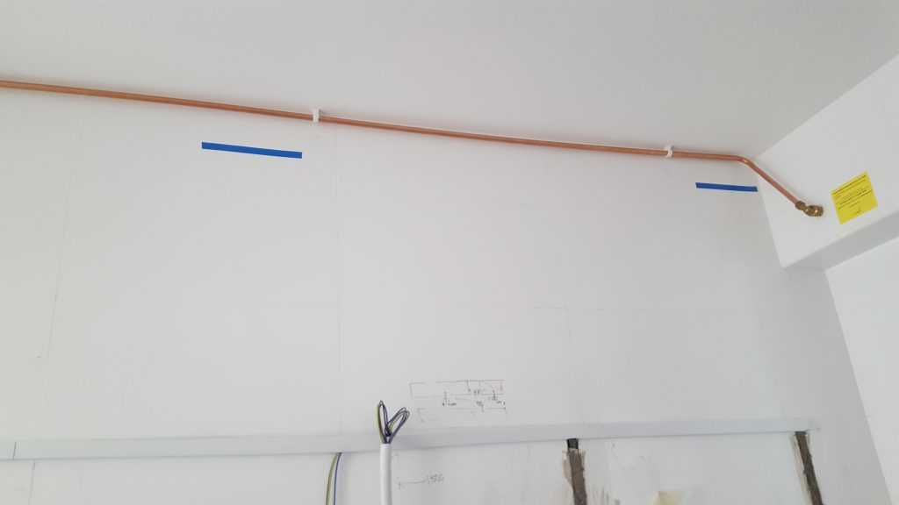
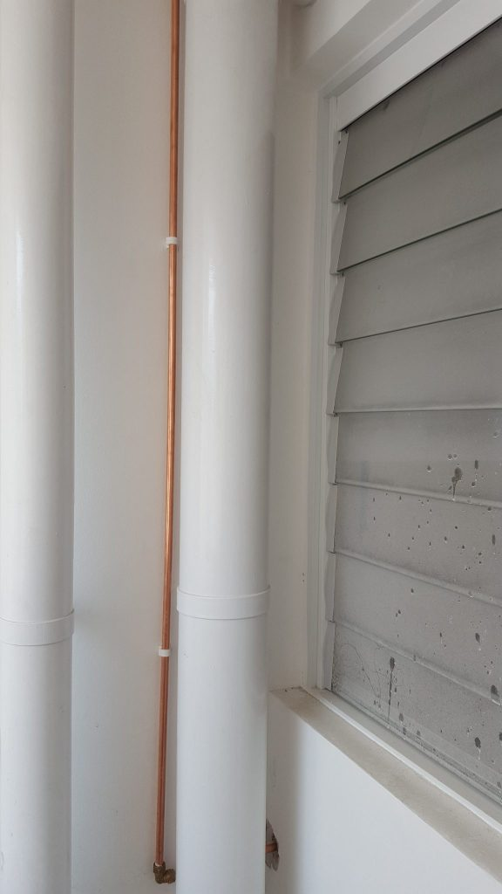
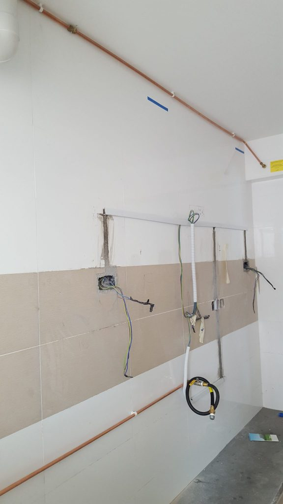
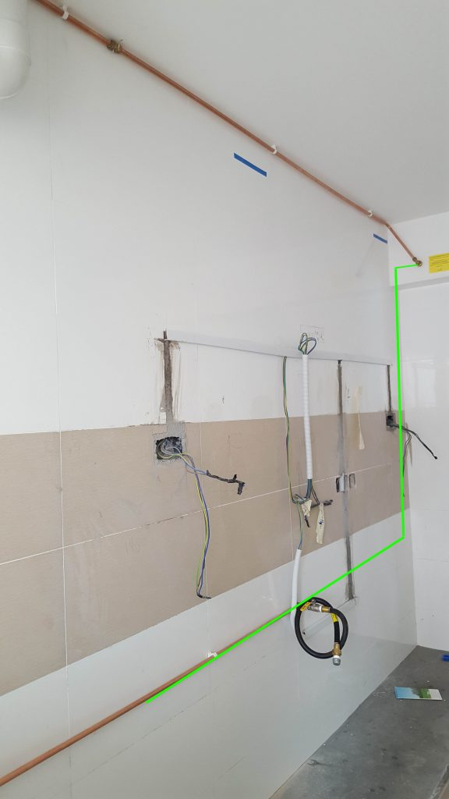

## Intro

While the various works like [flooring](https://btonomics.com/renovation/installation-of-vinyl-flooring-for-our-bto/) and lighting were being done, we needed to do up the City Gas pipe installation for our home. The point of doing so is to lay the gas pipe from your gas outlet outside into your kitchen. Without it, you can't use the gas even though the infrastructure is already set up outside your home.

You usually can't do your carpentry without installing the pipe first. If you do so, the alternative is to build in some allowance for the pipe later. But you could end up with a lot of spare space. And you also might limit how you can run the piping in the future. So it's not recommended.

Even if you don't use a gas hob, like if you opt for an induction hob, you still should do up the gas pipe. This way, you don't have to dismantle the carpentry if you decide to go for a gas hob. Honestly, cooking is more shiok if you use a gas hob.

## Remember to book your appointment early

You can book an appointment [online](https://www.citygas.com.sg/services/homes/make-an-online-appointment/) or you can call in (1800-555-1661). We called in because we needed it soon. Do not be like us (and many others)! We sat on it till it was too late. The appointment timings are often hard to get. You could be looking at a month's wait just to install the pipe.

We made that mistake when we tried to book a slot around 1.5 weeks before Jun Wei started our carpentry work. City Gas gave us the bad news when they told us it would be a month later at the earliest. This was the same as what the folks in the West Terra telegram chat group said.

We feared the worst. This was a bad situation because the hold-up could have delayed our renovation by a month!

Jun Wei later told us that most of the other clients usually got their appointment slots the week after, but we knew that was definitely not the case. It would've been good if they reminded us, but such a long wait probably wasn't normal or expected.

### Bringing forward our appointment

We ended up having to call City Gas every few days to try to get a better date. It took 2 calls that I made to push it forward by a couple of weeks. We kept stressing that we needed an earlier date because this was holding up our renovation.

The City Gas customer service officers were very understanding, surprisingly, and they helped us move our date forward little by little. This might've been because someone cancelled his/her appointment, possibly because their renovation was delayed. It also could've been because they have spare dates that they don't offer, and they then try to use those dates to cram as many homes in the same vicinity as possible. The second way makes a lot of sense to maximize efficiency.

In any case, if you want to avoid the hassle of constantly calling in and potential delays, it's best to book the slot early. Like really early. Be kiasu, it's worth it in this case.

## City Gas pipe installation

A couple of days before the installation, City Gas' contractor called us to confirm the timing. We asked Jun Wei to come along as well on the actual day to ensure that everything was set up according to plan. He came ahead of time, which was great.

The contractor was also punctual. It didn't hurt that the two seemed to know each other. He proceeded to survey the site and do the drilling. He seemed very experienced. It was a good thing that Jun Wei was there because he was able to get the guy to lay the pipe in a longer and more difficult, but nicer, way (shown further below).

_The contractor preparing his equipment, that bag looked and sounded very heavy._

_He went ahead to drill holes for wall plugs._

The gas pipe ran quite a distance, across the kitchen, into the service yard, and back into the kitchen. This was so that we could avoid having the pipe running down the side. We took away the tall unit and there would be nothing in the middle to conceal the pipe if it ran down vertically. But it definitely was a lot more work.

_Start of the piping._

_Went into the service yard._

_And came back again._

_The contractor originally wanted to lay the pipe as shown by the green line. It'd have been much uglier._

## The ending came quick

He then checked for gas leaks. When there wasn't any, he packed up and left as quickly as he came. He did everything within 30 mins. There was also no payment to be done. City Gas billed us directly via our utilities bill, which is $120 excluding GST. In a nutshell, it was a fuss-free installation.
