We DIYed our washing machine installation. It sounds easy. Unfortunately, it wasn't.

## Buying our washing machine without installation

We bought our washing machine before renovation finished. We wanted to take advantage of [LiveUp cashback](https://liveup.lazada.sg/liveup/liveup-introduce/) by Lazada (non referral link, needed to put this for the nice SEO), which made it much cheaper than traditional stores like Gain City, which can hold your purchase for you until your home is ready.

Shops on Lazada don't hold your order, they deliver ASAP because they have inventory/warehousing costs to pay if they store it for you.

So we bought our fridge and washing machine 2 months before our home was ready. The cashback was good, on top of the cash rebates via credit card.

 _Kevin Durant agrees._

But there was no installation, even though it'd have been free. We had no home so we couldn't install it. We didn't think it'd be a problem until we moved in.

## Our washing machine installation guide

Without further ado, here's our totally pro guide on washing machine installation, to do what everyone gets professionals to do instead. Because DIY is more satki.

## Step 1: Remove the box and move the washing machine to the service yard

Straight forward enough. Actually we asked our ID for help, they were super nice to oblige.

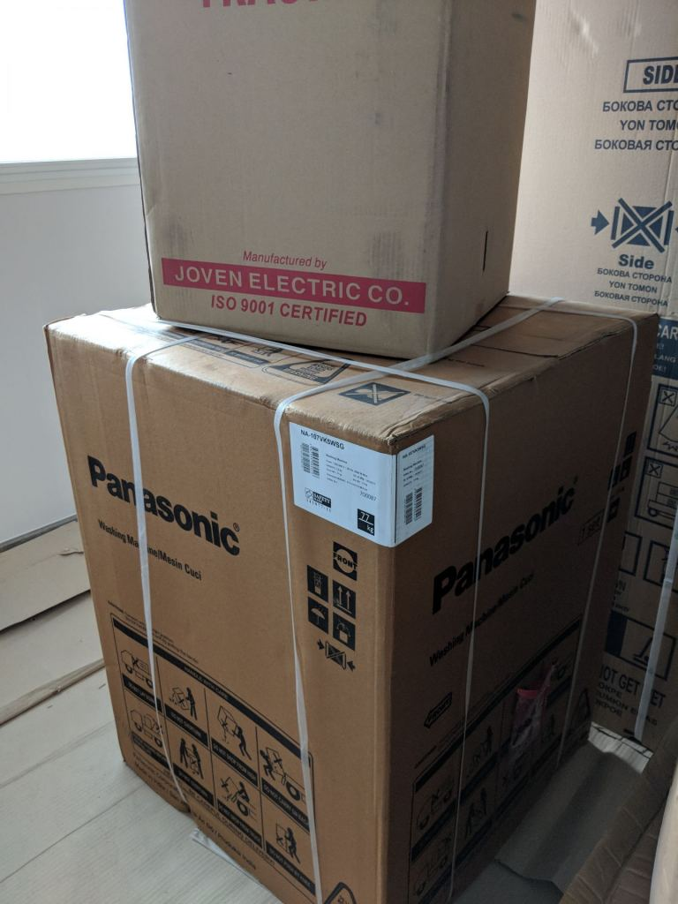 _Our washing machine in its full, boxed glory._

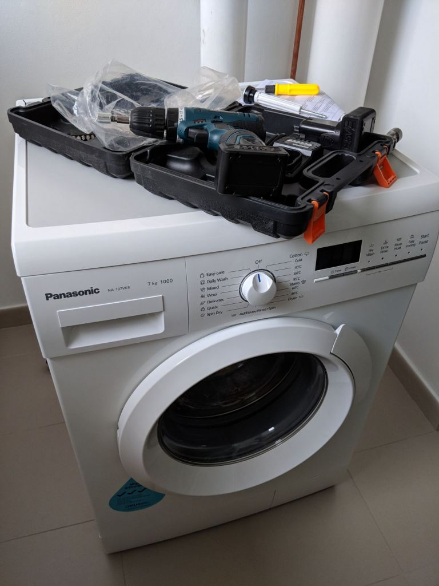 _We brought out the big guns, ready for action._

## Step 2: Remove the transit bolts at the back

Washing machines ship with some transit bolts at the back. Remove those.

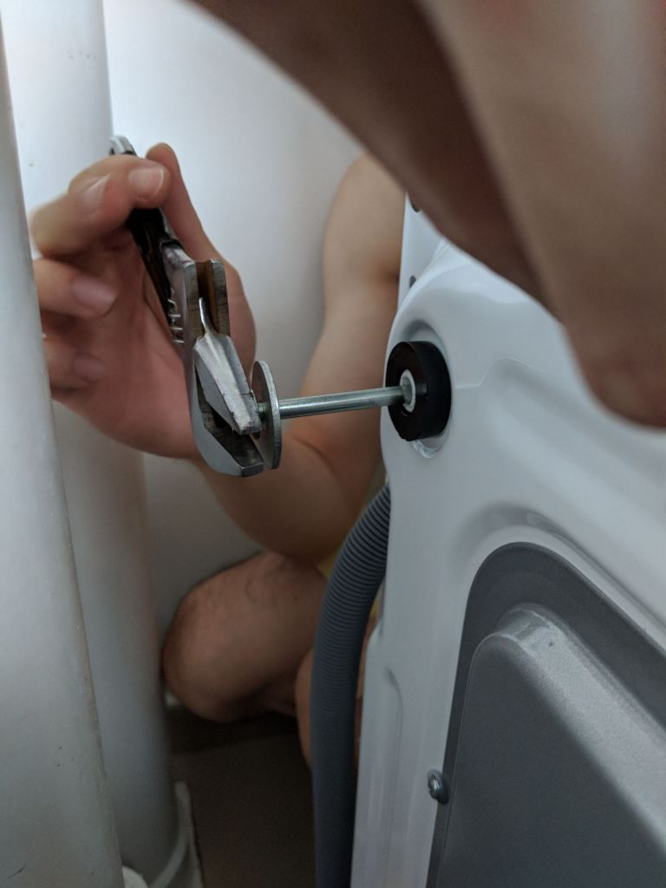 _Remove the transit bolts._

Replace them with caps provided.

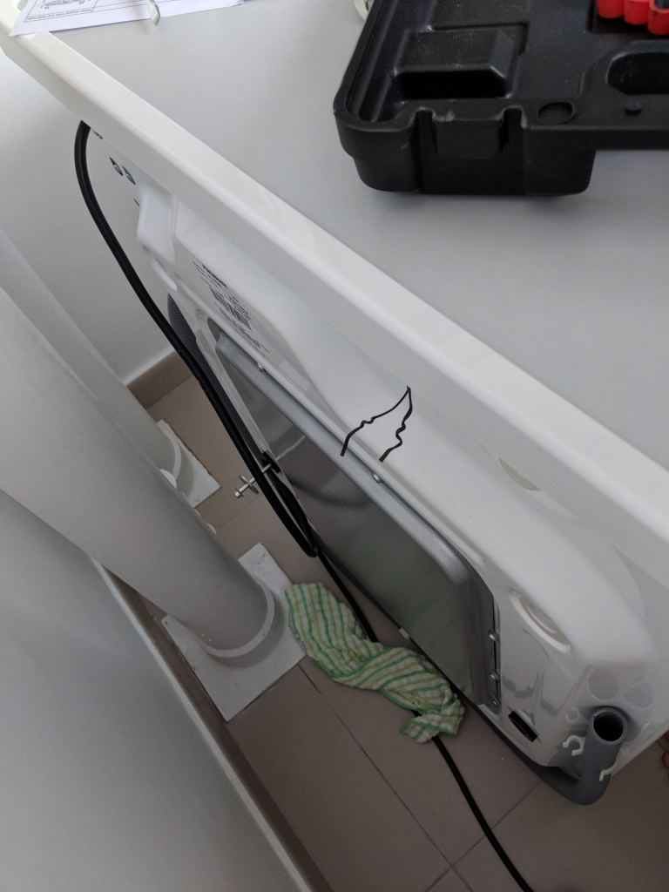 _Caps in place._

## Step 3: Adjusting the washing machine feet

This is also an easy step. Just make sure the washing machine is level by screwing/loosening the 4 feet.

## Step 4: Connect the washing machine pipe to the washing machine

Self explanatory. Our (Hitachi) washing machine pipe already had a mesh filter that either saves water or filters sediments.

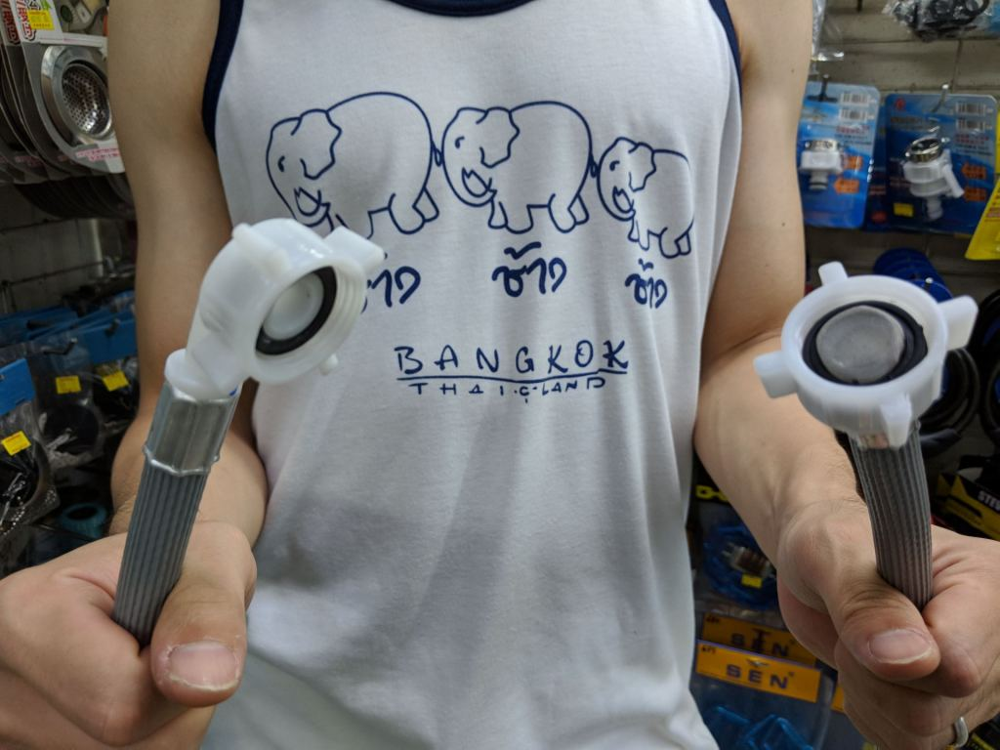 _Left one goes to the washing machine, right one goes to the hose._

## Step 5: Get an adapter for the tap

The new service yard taps are the worst. They have a weird shape, so the typical washing machine hose doesn't fit. Don't jam your tap into the hose!

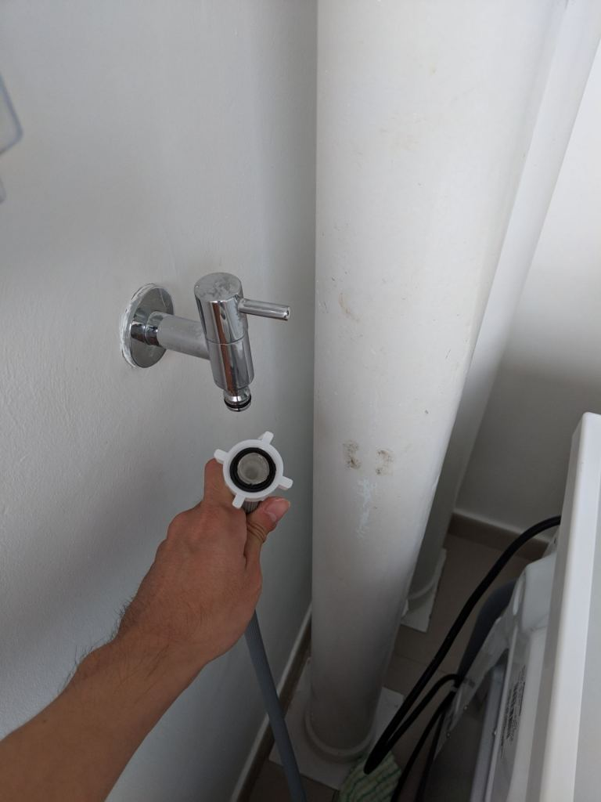 _This was a WTF moment. We realised we messed up big time not getting someone to install the washing machine for us._

They also have water saving features, which is stupid because washing machines use the same amount of water regardless. They just take longer if the tap flows slowly, which causes more electricity consumption. HDB if you're reading this, this is genuine feedback!

We rushed down to the 五金店 / hardware store to see if we could find something. We brought the whole pipe down, which was a good move because there're a lot of adapters. Just test those available with the permission of the store owner.

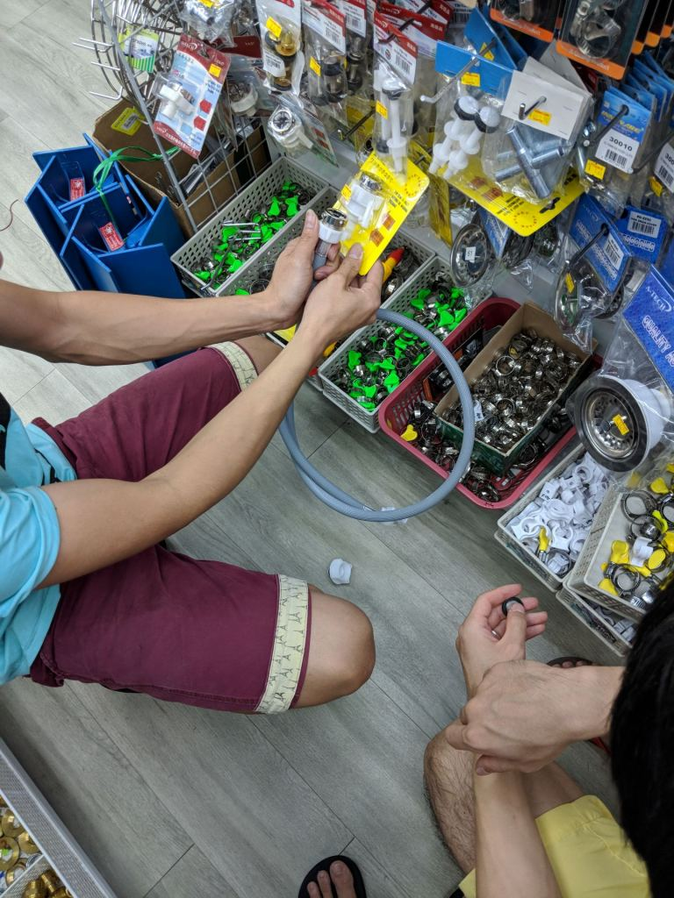 _Testing and comparing adapters._

We finally bought the correct one, which could fit if we removed the mesh filter. Luckily the adapter wasn't too expensive.

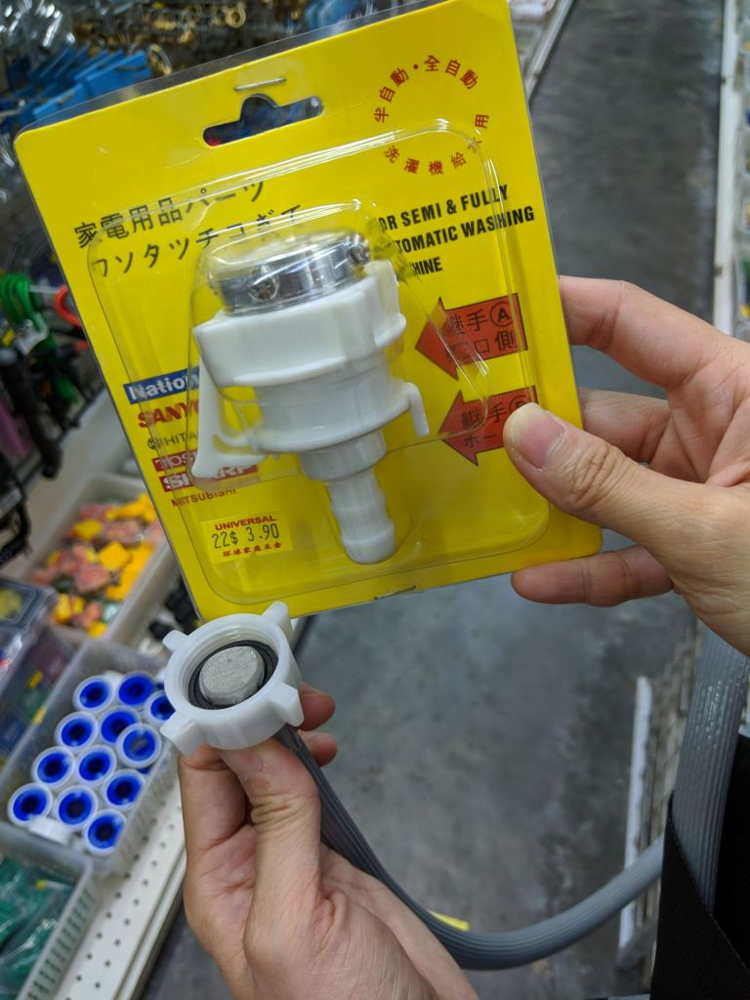 _Proud owners of a washing machine adapter._

## Step 6: Screw the damn adapter in place

We didn't take photos of the process because all 4 of our hands were busy. But you need to be careful when tightening the screws.

There're 4 screws, at the 12, 3, 6, 9 o'clock positions. You need to tighten the screws in pairs, do them bit by bit. Tighten too much of any screw and the adapter becomes imbalanced and leaks water.

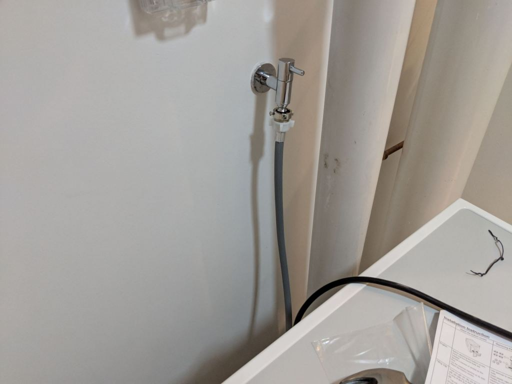 _Probably not the nicest, but it was tight enough and didn't leak._

We had to do this for 15-20 mins. Very stressful. But finally we got it done.

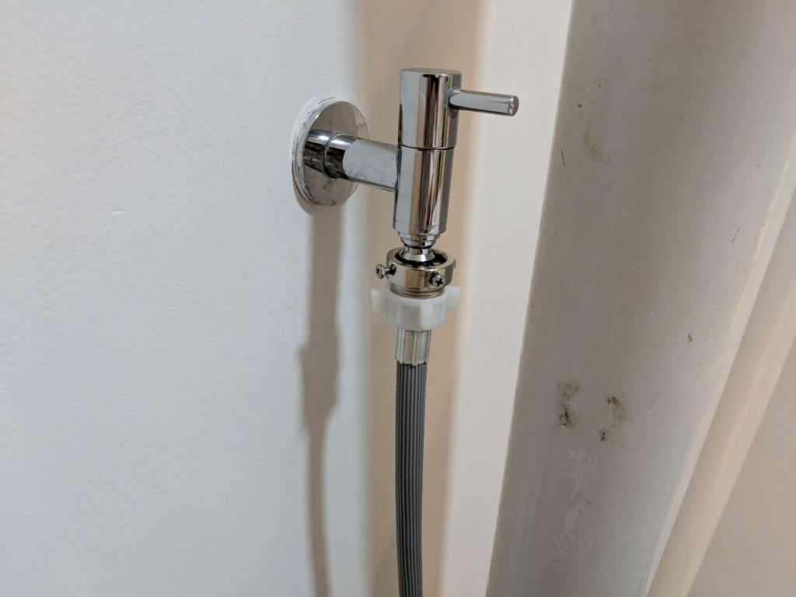 _The screws were screwed into the rubber, which is dangerous because they looked like they were going to tear the rubber. But there was no choice._

## Step 7: Put the washing machine drain hose into the discharge drain

Put the only drain hose left, the one where soap water is discharged, into the discharge drain. Of course, you'll need to uncap the discharge drain before insertion.

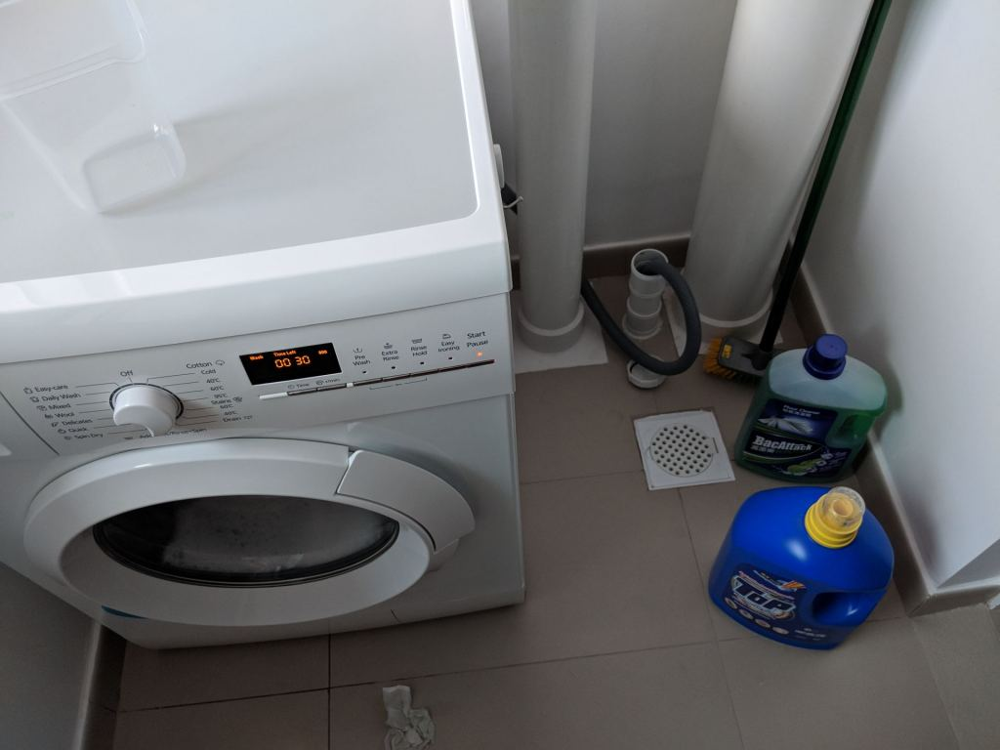 _Drain's on the right._

## Lesson Learnt

Morale of the story - make sure you get someone to do the installation for you to save a couple of hours' worth of backache and sore arms.

Or if for some reason you want to DIY install your washing machine, then read our guide and get cracking!
