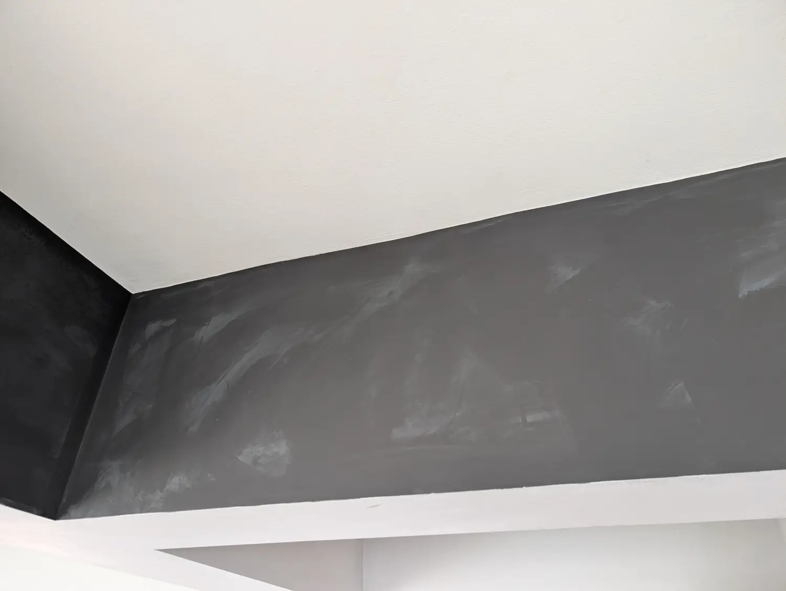
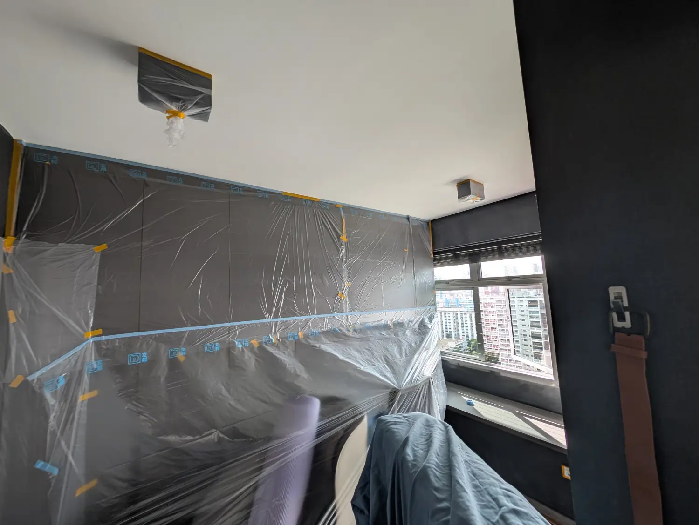
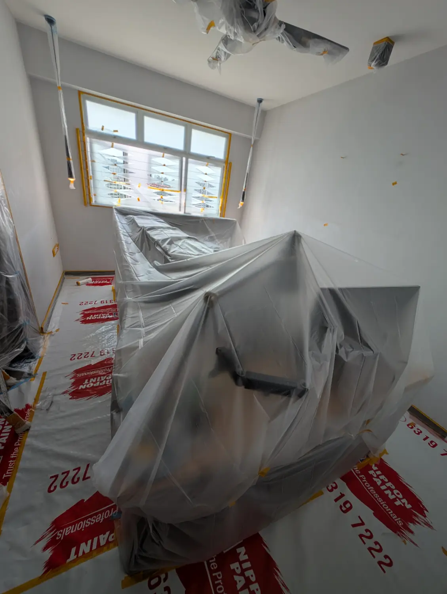
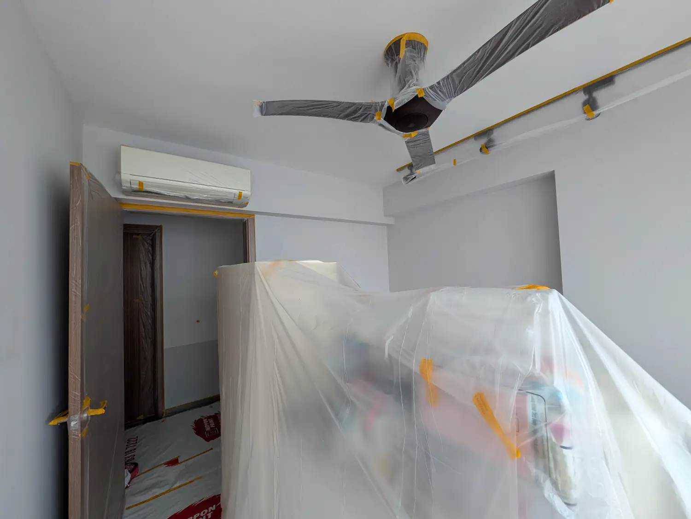
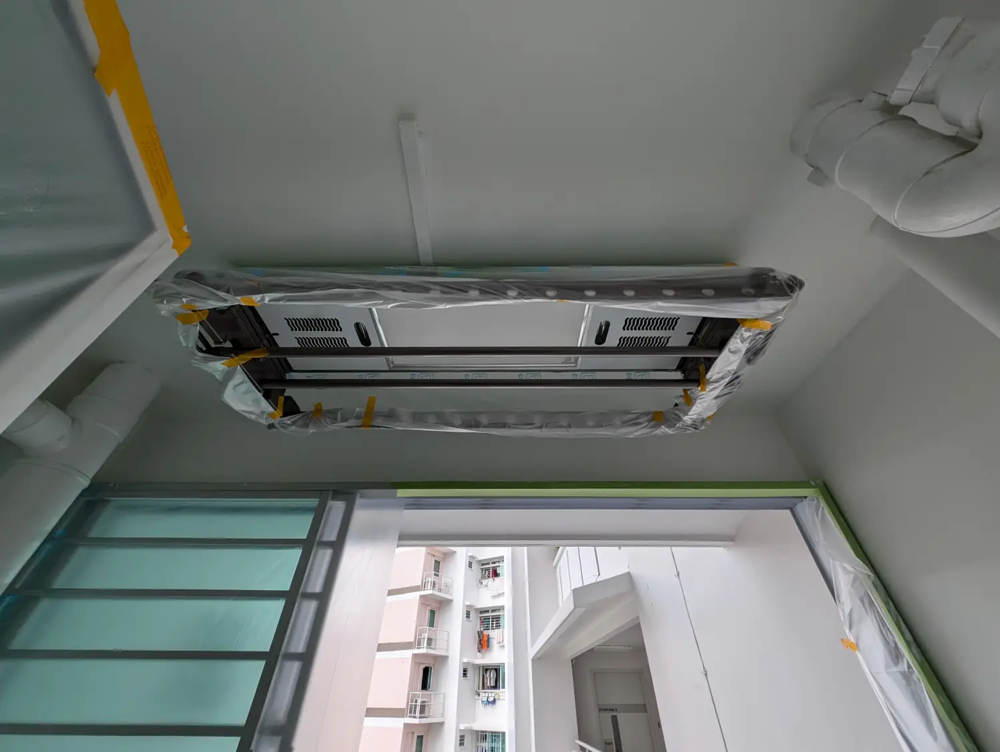
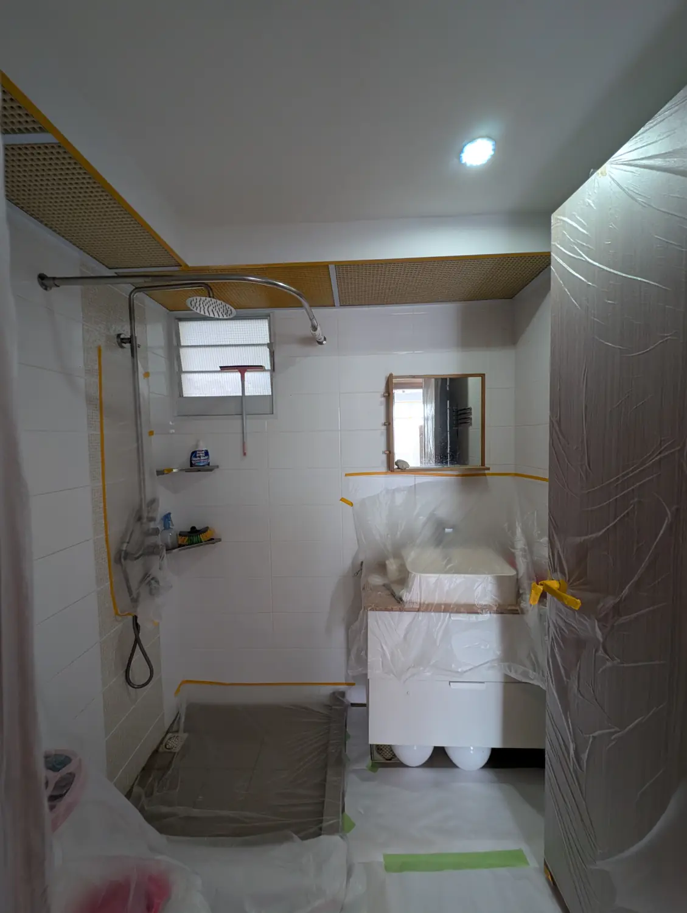
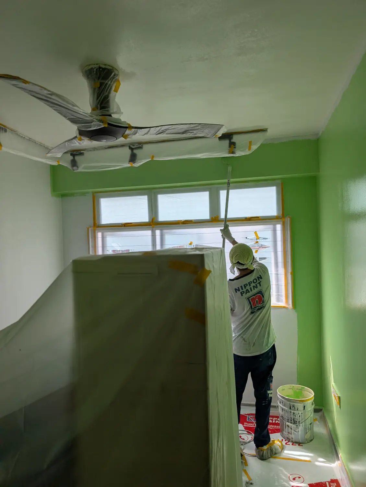
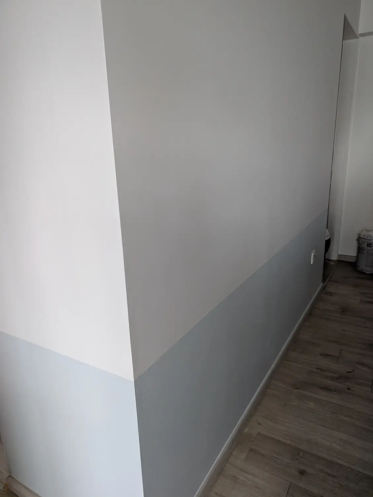

Yes, that structure makes a lot of sense. It naturally guides the reader from the "Why" (the mold/health scare) to the "How" (prep) and finally the "What" (the messy reality).

Here is the revised blog post, split into your three requested sections with the expanded Day 3 details.

---

## 1. Background: The Mold

We decided to engage Nippon Paint to repaint our house. They certainly aren't the cheapest options around—coming in at about $3,800 for a 4-room flat—but they aren't the most expensive either.

### The Problem: Mold & Rust

We have had a mold issue for some time. We really should have known something was wrong because metal stuff in our house has been rusting. We don’t turn on the aircon much, but we also don’t open the windows wide, so the moisture was just accumulating in our home.

But to be honest we didn't get the dramatic, obviously moldy black ceilings.

It got to the point where we had white patches on the wall that were likely mold. It was affecting our health, too. We had tons of coughing and brown sputum that wouldn't clear up even with an air purifier, because the mold was all around us. I tried wiping the walls with a white vinegar solution, but it didn't solve the root cause.

### The Assessment: No Sealer & Leaks\*\*

Here's the shitty part. According to the painters, we didn't have a layer of sealer on our walls. Apparently, contractors usually won’t add the sealer because it adds cost, but honestly, for such critical work, I thought this should have been flagged out.

During the site survey, we also found a specific wall in the living room with bubbling and crumbling paint. A test revealed water was seeping through from the outside. I had to get the Town Council to fix it, which involved a contractor "spider-man" dropping down from the roof since I’m on a high floor. It took two tries because I only found a second crack when the paint bubbled again.

### What I Opted For

We opted for the full works: the additional [anti-fungal treatment](https://nipponpaint.com.sg/product/anti-fungus-solution/) for the entire house, including the ceilings and the bomb shelter.

---

## 2. Before Actual Work: Prep & AI Design

Once you confirm the date—for us, it was a Saturday to Monday job—you need to book the slot.

### Selecting Colors with Gemini (Because the official tool sucks)

Nippon Paint's service for visualization mock-ups exists, but the quality is average, like "really pixelated Photoshop masks on a PDF" quality at best.

So I used Gemini 3 Pro instead. I fed it room photos and gave it constraints. Things like don't clash with the blinds, match the wife's preferences, and voice out if the colors don't work together.

The lazy AI just returned product links, so I did something clever: I grabbed the actual hex codes (#85cc80, not "Spiney Green") from Nippon's site via Developer Console, then asked Gemini to digitally repaint my photos with those exact colors, adjusted for lighting.

This let me see realistic previews without painting sample patches or trusting vague color names.

Since the AI was lazy and just gave me links, I went to the Developer Console on the [Nippon site](https://nipponpaint.com.sg/colours/trend-beyond-colours/) to grab the actual Hex codes (e.g., #85cc80) rather than trusting English names like "Spiney Green". Then, I asked the AI to replace the wall colors in my photos using those codes, adjusting for lighting so it looked realistic.

### The Light Fixture Mistake (Learn From This!)

One of my biggest regrets was not getting an electrician in first. Since we were doing full anti-fungal treatment on the ceilings, we couldn't just paint around the fixtures. The mounts were already rusting from humidity—another warning sign we'd missed.

We had the painters remove everything completely so they could treat the entire ceiling properly. This left us with dangling wires and the stark realization: **we should have coordinated electrical replacement BEFORE the painters arrived.**

If you're considering new light fixtures anyway, do it before painting. Just trust us on this!!

### Packing: The Real Nightmare

Box up your stuff because it gets real messy.

**Before they arrive:**

- Purge ruthlessly. We shifted stuff out of the bomb shelter, only to throw it away later when we realized everything was moldy anyway.
- Tape drawer units shut so they're easy to carry without flying open.
- **Don't skip this:** Get your electrician done FIRST if you're replacing fixtures. (We learned this the hard way—see above.)

---

## 3. During Actual Work + Pictures

The actual schedule for our 4-room flat took about 2.5 days. They come at 9am sharp, so don’t depend on getting access to your stuff once they start.

### Day 1: The Messy Start

- **AM:** Shift, pack, and wrap. We just stacked everything in the middle of the house. Note: You lose access to water and the toilet once they wrap everything.

- **PM:** They sand the walls to remove the top layer. Then they put on the anti-fungal treatment that kills fungus, algae, and mold. It doesn’t have much of a smell. This is left overnight.

### Day 2: Sealer & The Bomb Shelter Purge

- **AM:** They apply the sealer layer. Then they start painting the small bedroom, toilet, kitchen, and service yard.

- **PM:** You need to be around to help shift stuff from the bomb shelter out to the living room. It’s basically putting everything wherever you can find space, including the DB box stuff.

### Day 3: The Chaotic Finish

- **AM:** They tackle the living room painting.

- **PM:** This is the tiring part—shifting everything back.

You really need to be mentally prepared for the shift back. Because they still need space to do final touch-ups, the whole house feels incredibly cramped. You can't neatly organize things yet. The best strategy is to just dump as much as possible back onto the bomb shelter racks immediately just to clear the floor space.

I continued to throw stuff away even while putting things back and cleaning up, because I realized just how much junk we were hoarding.

By evening we were exhausted, covered in dust, and the house still looked chaotic. But when we finally stepped back and saw the clean walls without those white moldy patches? Worth it. We could breathe properly again—literally.

---

## 4. The Visual Log

Since words don't do the mess justice, here is how the 3 days actually looked.

_Packing and stacking._

_Sorry state of the moldy black walls_

_Protecting the floor_

_They remove the blinds, if you have them_

_Covering everything_

_Fully wrapped up_

_More wrapped up stuff_

_We had a mechanized laundry rack so that was wrapped up too_

_Even the toilets are covered_

_Inside the master bedroom toilet too_

_For our invisible grills, they were wrapped up nicely too_

_Sanding the walls_

_Anti-fungal solution_

_Applying the anti-fungal solution_

_Paint and painting tools around the house_

_Painting in progress. The fan is placed at the walls that are freshly painted, to get them to dry fast._

_Painting in progress_

_Painting in progress_

_Even the service yard pipes were painted, which previous renovation didn't_

_Great end result!_

_Ditto_

## What We'd Do Differently (The Expensive Lessons)

- **Don't wait on mold:** We really should have repainted long ago. We let the mold situation fester until it started affecting our health with constant coughing. If you see white patches or smell something off, act fast.

- **Rust & Booklice = Humidity Warning:** We ignored the signs. Metal stuff around the house had been rusting for a while, especially the light fitting brackets, which was a clear indication that it was too humid inside. We used to dismiss it as lousy quality from Taobao, truth be told it was probably both. We also spotted booklice, another classic indicator of high humidity that we shouldn't have overlooked.

- **Insist on a Good Painter** It's not always allowed to get your own painter, but Nippon Paint was great, so we'd go for them if we have a choice in future.

- **Sealer is non-negotiable:** We learned the hard way that our previous renovation lacked a sealer layer. Always ensure your contractor includes this, as it's the first line of defense against moisture and mold.

- **Sequence matters (Electrical first!):** We did this backward. We should have redid the electrical work _before_ the painting. Because we didn't, we had to deal with removing lights and leaving them dangling, which made the painting process messier than it needed to be.

- **AI color matching is a game-changer:** Choosing colors normally means flipping through catalogs while squinting at tiny squares that look nothing like they will on your wall. With Gemini, we could go back and forth to find the best colors, and even give contextual prompts to discuss the trade-offs for any color being chosen. Even more important was the previews for the actual room and with the real-world lighting. This alone saved hours of decision paralysis and eliminated the "did we pick the right color?" anxiety.
