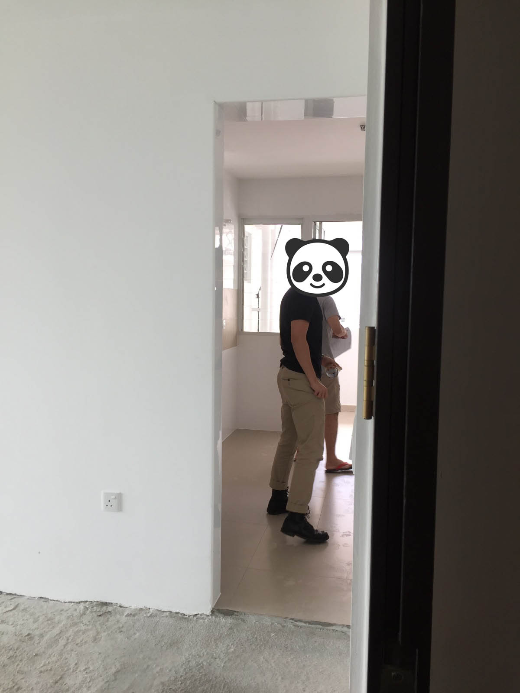
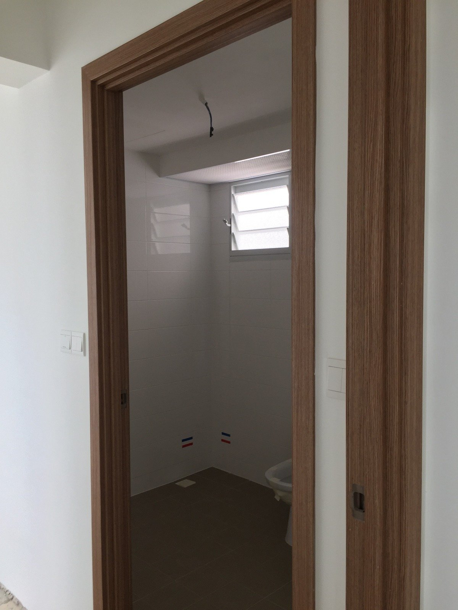

The wait for the BTO key collection was quite long but it eventually ended. This would be followed by rectification works by BSC. The process was to get our keys, do our defect checks, do the cement screeding, then do renovation works. We were still pending HDB's decision on our cement screeding application.

To explain the screeding situation, we were appealing to get free cement screeding. It's not entirely free, as they only give you 40mm. But if you don't really want more you don't have to pay.

It was quite logical when HDB said there wasn't cement screeding when I appealed to HDB a year ago. They changed the policy around the time we signed the agreement to take the flat. We initially dropped the idea of getting them to do screeding. We were resigned to higher prices when you get private contractors to do it.

However, we subsequently visited the estate open house. Surprisingly, the MP said there would be free cement screeding and the HDB officer I spoke to concurred. Not sure if he was mistaken, we gave him our case and he promised to look into it. He didn't get back to us. But we ended up appealing to HDB and through our MP, and eventually it got approved. It probably was because we our estate was in a transition phase where HDB's screeding policy could still apply.

_Errbody gets free screeding!_

---

## The BTO key collection process

HDB keys appear to be released in batches, in order of the completion of construction works. We appealed to HDB so that we could collect our keys first, to ensure that there wouldn't be a logjam once it came to rectification works and screeding. We set an appointment through the system and fixed it on Valentine's Day. This was already brought forward. The initial date was later, but we managed to get an earlier date booked through the system. I think the tip here is always to be proactive - check with HDB staff and refresh the HDB portal frequently so that you can take over someone else's slot when it opens up.

### Things to do prior

A week before the BTO key collection appointment we bought [fire insurance](https://www.etiqa.com.sg/personal/general-insurance/property/hdb-fire-insurance/) online. It's mandatory if you own an HDB flat. The premium's cheap, at only SGD 5.5 a year. I think this included a discount when we bought it on a Friday. We ended up buying the more comprehensive home insurance as well, because it was an additional couple of hundred dollars. It might seem unnecessary, but we were trying to avoid being penny wise, pound foolish. There was also a need to activate our SP services earlier so we could immediately head down to do defect checks on the same day of the key collection, so we did it earlier to do the necessary deed. You can do it via the [mobile app](https://www.spgroup.com.sg/mobile-apps), it's very convenient. You can skip the queuing, unless for some reason you really want to queue just to soak in the experience.

_Let the kiasu flow in you._

### Things to bring

On the actual day, do remember to bring the following:

1. HDB appointment letter
2. Original copy of marriage certificate
3. NRICs
4. Copy of fire insurance proof of purchase
5. CPF statements, although I don't recall bringing those
6. Completed GIRO form (if necessary, we didn't because we don't need to pay via cash)

When it came to the waiting and key collection process, I must say it was quite a weird feeling. I felt very much like an adult, buying a house and all that stuff. The waiting was shorter than expected, because the appointment timings were quite accurate. But the whole process took longer than expected. The lady who attended to us was not really friendly. She seemed disinterested and impatient at times. Oh well. My advice to people collecting the keys is to familiarise yourselves with the technicalities of taking the housing loan and the insurance, I had problems understanding how the insurance worked. Eventually I got it. You pay the insurance with CPF so that if any of the home owners are dead or incapacitated, you get the remainder of the loan paid off.

_We didn't have have many keys because we didn't get doors._

The last thing left to do was to pay for the first month Service and Conservancy charges. It was a simple process in short, I think not many countries can make this whole process so seamless and efficient.

---

## The flat

_First impressions of the block_

_First look at the view from the top_

We then met Shao Jie to check out the house.

_There's a huge recess in the main living room wall, but I've no idea who it's designed that way. [Edit: a knowledgeable forumer at Renotalk has explained that (1) the huge recess in the living room is actually due to the 2 columns and the beam running across the columns; (2) the concrete block wall which was built is aligned to take reference from the center line of the columns so both us and our neighbor will have a similar unit size; (3) else if the wall is built flush with the beam and columns, there will be a deeper recess on one size and both units will have different floor areas.]_

_Our only shot of the kitchen, hopefully didn't anyhow expose Shao Jie haha._

_Corridor view_

_The door frames were surprisingly nice and high quality._

_View from one of the bedrooms, the wall on the right's going to be knocked down._

_The tiles on the wall aren't too bad. The colour scheme for the toilets fit our theme as well. I've seen tiles with floral designs, those are horrendous - HDB should be the ones to pay people to use those instead._

_This is where the trunking will run out I guess_

_The master bedroom toilet. The sad thing is the water pipes are on the wrong side, beside the WC. So this laid to rest any plans we had for a half shower screen._

The tiles that came with the flat, i.e. in the kitchen and toilets, were pretty good. The colour scheme for the toilets fit our theme as well. I've seen tiles with floral designs, those are horrendous - HDB should be the ones to pay people to use those instead.

---

## Defect check and rectification work

I think it's important to get someone who knows what he/she is doing to do the defect check. Shao Jie did it with us. We forgot to bring measuring tape, sticky tape, and markers, but Shao Jie had that covered. We were novices, but we did contribute by bringing a charger to test the switches. (I must imagine it probably wasn't too good for the phones, but we were lazy to buy a night light just for this.) But then again, I recall that it costs several hundred bucks to hire professionals to do your defect check, and I'm not sure if it's worth the money to do so.

### Doing the check

There were minor defects but nothing major. It was expected as we didn't opt for OCS, so there was no major rectification needed. The most enjoyable part was pouring water onto the toilet floors, so that you can see how the water flows and whether the toilet tiles were done well. One point to note. It would be good if you brought a pail, because we had to fill our bottles to pour water. If the water doesn't run, as we found out when we were there, it's because the water switch isn't turned on. It's located outside the house, in the riser.

There were defects from holes in the painting on the walls, a window latch that didn't work, privacy layer on the glass window that needed touching up, marks on tiles, and grouting that needed filling. We thought the clothes rack was rusty but turns out it was easily resolved by cleaning it, as what the BSC supervisor said. Shao Jie filled in the form, we handed it to the BSC people.

### Verifying defect rectification work

BSC rectified the defects before getting us down to verify that the rectification work was completed. That was when we realised we all missed defects on the door frame, but that was alright we found it eventually. This was really credit to the Whatsapp chat group, because someone highlighted that problem. Turns out the door frames didn't get stuck properly, the whole pieces at the top were loose if you pull on it. But those just need silicon to be touched up and they were rectified. A tip to make life easier for the BSC folks. Try not to stick too much tape on the walls, as the paint seemed to come off with every tape we tore off. Every tape we tore seemed to rip another hole in the paint.

All in all, there was a slight delay for the rectification works to be completed. It was the CNY weekend, but we still got it done within 2 weeks. There was a really long queue for the defect check. We were lucky we quickly got the keys by appealing to HDB and we didn't have many defects. This was mainly because we didn't take the optional components.

Those who took the optional ones apparently took much longer to rectify their stuff. Tiles and doors seemed to be one of the common complaints. Some had tiles which weren't laid properly. Apparently some neighbours also had ceilings which kept cracking (because their homes were under the roof garden) and doors that needed replacing. When we were at BSC for our verification appointment, we saw the whiteboard filled with queue numbers waiting for their turn. Thankfully we finished ours before the stampede of other owners came in with their defects.
