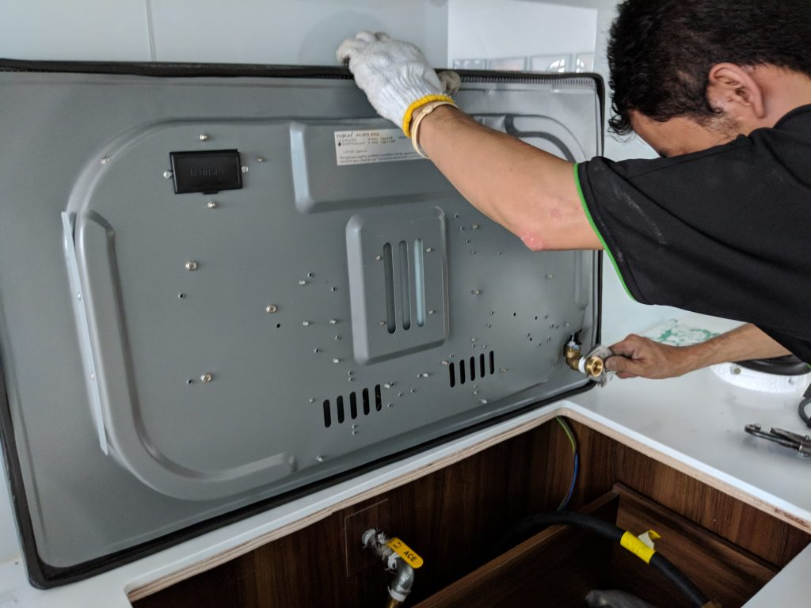

## Intro

We previously got the City Gas contractor down to [install the gas pipe](https://btonomics.com/renovation/city-gas-pipe-installation-for-our-bto/) before we did our carpentry. That was the initial piping work. The pipe in the riser was still unconnected, as was the pipe in the kitchen. They were waiting for a second trip. The next milestone where gas was concerned was therefore for the City Gas activation to be done.

## Getting an appointment

We went to book an appointment after the completion of almost all works. Unfortunately, we booked the appointment too late again. The typical wait time is around 2 weeks, but it was more than a month for us because there were many homes that were also lining up for the City Gas activation just like us. That's the disadvantage of renovating at the same time as other people in the neighbourhood. It's all about being _kiasu_, and we weren't meticulous or _kiasu_ enough!

### Express service

What wasn't very nice when we called was the City Gas customer service officers offering you an express service that costs $50, after they tell you the wait time is 1 month. In other words, City Gas is almost forcing you to pay $50 to jump queue to get immediate service the next day. Paying extra for a service that's basic. We refused to pay it because a) this is a basic service, b) we weren't expecting activating the service immediately and were ok with waiting for a couple of weeks (though not a month), and c) we're renovating on a budget here. So we kept calling in to hopefully get a slot that someone else cancelled. Thankfully we did get an earlier slot and ended up waiting 3 weeks in total! The weird thing is PQ called a few times and never could get a slot. I called once and everything was settled. Sexism perhaps - they might treat a female client less seriously than they treat a male one, and therefore provide more respect and privileges to the latter. Or maybe I'm just more assertive.

## Appointment day

As per their standard practice, the contractor called 1-2 days before the date of appointment to confirm the timing. On the actual day he came earlier than scheduled. He was very polite, friendly, and professional. He even took the time to explain to me what he was doing, since I was being curious. The activation trip was very simple actually. He connected 2 pipes to the cutout in our carpentry, went outside to connect the pipe, tested the setup to ensure that the stove was working fine and there was no leak, and then installed the meter. So you'd need to bring out your hob/stove. But other than that there's nothing much to do. There's no payment either, the charge for the first installation already covers the second trip. There was a leak in our setup, which was later traced to a faulty pipe. Everything worked fine when he replaced it.

### Tip - make sure your drawers do not block the gas pipe(s) when closed

An important thing he mentioned was the need for the carpentry to cater enough room for the pipe to fit behind the drawers. He said quite a few houses he went to had drawers that went too deep. The drawers couldn't close fully because the pipe was blocking the way. The only solution was to adjust the carpentry, and that mean sawing or rebuilding that part. I think this is something we owners often take for granted. You'd assume that carpenters doing this day in day out would know this. But the fact is they don't always know or do it correctly. And there's hardly any way for people choosing their IDs to know beforehand. Thankfully Rooot Studio's carpenter had it made perfectly. The space catered for the pipe was just right. Not too large, not too small. So if you go with Rooot Studio, you'd know at the very least the carpenter won't screw this part up!

## City Gas activation told through pictures

_The contractor will bring and fix a pipe to the middle and right hand side._

_It's important that your carpentry cater enough room for the pipe to fit behind the drawers. The contractor said quite a few houses he went to had drawers that were too deep and needed rework, i.e. sawed. Thankfully Rooot Studio's carpenter had it correct - the space catered for the pipe was just right, not too large not too small._

_The second last step was to test the pipes for leakage. This was one way to test. Thereafter he'd use a wet soapy sponge in the kitchen to test the pipe connections. Unfortunately our pipe was leaking and probably faulty. We realised it was the newly installed pipe that was spoilt. The leak stopped after the contractor changed the pipe. And thankfully so, because it'd be a much bigger problem if the gas pipe hidden by the carpentry was faulty!_

_The last step was fixing the meter and calling it a day!_
