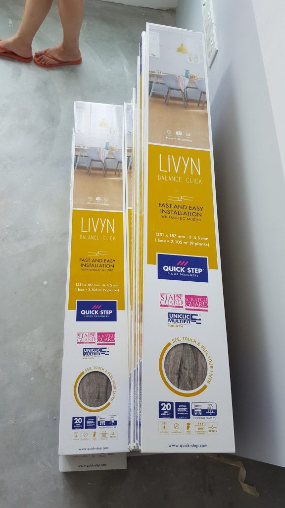

## Intro

[After our decision to use the Luxurious Resilient Flooring from FloorXpert throughout](https://btonomics.com/shopping/choosing-vinyl-tile-laminate-or-cement-flooring-for-btos/), we had to get into the installation of vinyl flooring for our BTO.

## Selecting the vinyl flooring colours

When it came to selecting the colours for the vinyl flooring, we left it to Shao Jie. We let him choose the colours when we met him face to face. He matched the colours with what we already [chose for the wall paint](https://btonomics.com/renovation/multi-tone-painting-works-for-greater-contrast/), the kitchen carpentry colours, as well as the [general design](https://btonomics.com/renovation/our-clean-bto-home-design/). There were some slight changes to the colour scheme, so that the living room floor would be light brown instead of gray. It made sense to us, because the brown would complement our carpentry and loose piece wooden furniture very well.

I thought his taste was good. The living room would be lighter in colour, and transit into a darker shade in the bedrooms. PQ only had a concern that the light colour would easily show the strands of hair we drop. Shao Jie and I thought that wasn't a big deal. After all, we're buying a robot vacuum cleaner!

## Installation of vinyl flooring

Similarly, we left the installation of the vinyl flooring entirely in the hands of Jun Wei. He kept us updated on the progress, although there wasn’t really much to update in between because the whole process was really fast. If we don't recall wrongly it was done within a day or two.

The last time we left off, we had cement flooring that had screeding completed. And this was how the house looked like:

  
_The stacks of boxes at the sides were the vinyl flooring planks._

  
_A view of the 'alley'._

  
_The huge roll of stuff probably was the underlay for the vinyl planks._

  
_These were the ones for the living room._

  
_These were for the bedrooms._

Jun Wei updated us after they finished the installation. Installation went pretty easily from the looks of it.

  
_Work in progress for the living room._

  
_It might not be super unique, but it looked pretty damn good to us._

  
_The darker shade of brown went very well with the overall darker feel of the rooms._

  
_It looked good even against the whitish wall as well._

## Installation completed

After the flooring was done we went to take a look. I thought it was great. PQ felt alright about it, because she had some reservations about the number of wood grains (those circular 'eyes'). The sample didn't have that much and she was fairly uncertain about the whole look. Ok, to be honest she didn't like them very much. But in the end she was more assured when she realised that much of it would be covered by carpentry. And in any case it was something that all wood grain lookalike flooring had, it would be weird to ask for wood flooring but want to avoid the eyes.

  
_The entrance portion was done swee swee._

  
_The living room completed._

  
_Ditto for the MBR._

  
_BR3 looked great as well._

  
_There were some gaps between the end of the vinyl planks and the walls. That's why we needed skirting to finish off the flooring, however much we hated it._

We also spotted a hole which was not yet filled up. The hole occurred because of the hacking. But I guess we were overzealous in looking for these. Jun Wei assured us that they would fill it before they installed the skirting.

  
_The hole is in the middle. We just wanted to make sure that it doesn't harbour an unwanted colony of insects._

  
_This was the original before the vinyl flooring went up._

Overall, we were very happy with the vinyl flooring selection and installation. It couldn't have gone any better.

If you're keen, do check out [our Floor Xpert LURF review](https://btonomics.com/honest-reviews/floor-xpert-lurf-review-great-value-money-after-sales-service/), which has been good so far.
