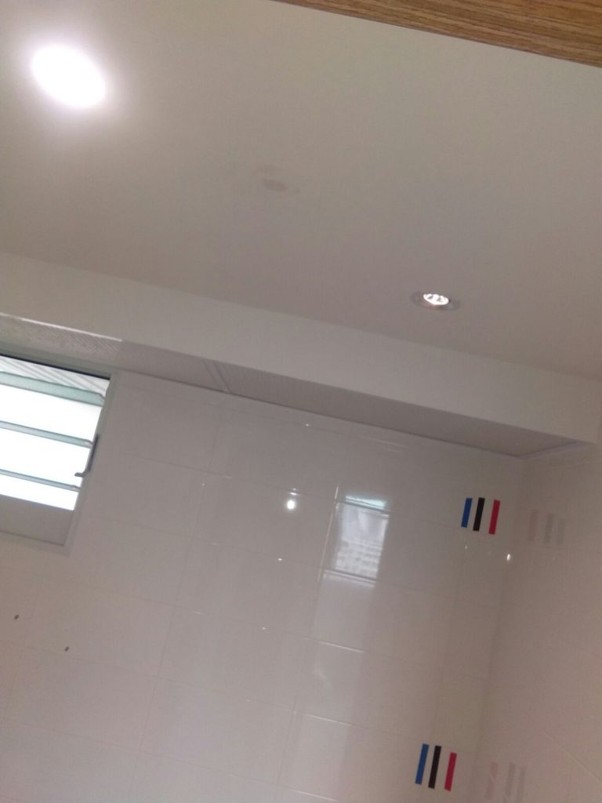
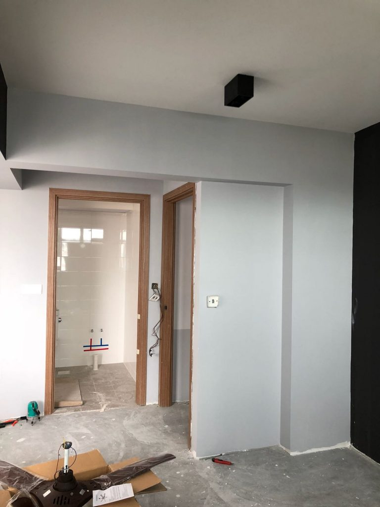

## Intro

We previously [shared a guide](https://btonomics.com/shopping/how-to-buy-lights-from-taobao/) that introduced the different kinds of lights we considered for our home and how we bought our lights from Taobao. The next process was doing up our BTO home lighting design and installing them. The design was largely done up by Shao Jie. But it was a consultative process. We shared the temperature and mood that we wanted to have at home. He did the heavy lifting.

This was great. The whole point of getting an ID is for his/her design input. In contrast, quack IDs show their value proposition by professing to show you their mastery of carpentry works, places where you can buy the cheapest lights, or give you contacts for the best aircon installation.

_Nothing like a greasy salesman ID/contractor excited to get you to sign on the dotted line._

## BTO Home Lighting Design Coordination

The main idea was to have the lighting match the transition of colours and tones in the house (that we [shared previously](https://btonomics.com/renovation/multi-tone-painting-works-for-greater-contrast/)). For that, the design relied a lot on accent lighting to emphasise the colour contrast while still being practical in having sufficient lights for daily use.

Coordination was simple. We appreciated the fact that Shao Jie was meticulous about the lighting design. Shao Jie did up detailed drawings. They showed where each light should be. There was no ambiguity, even though we aren't really literate in the types of drawings people usually do for electrical points/plans. We realised it was something that Rooot Studio does that the industry doesn't always do. The drawing takes quite a bit of work. And if you really wanted to cut costs, you'd cut this first. Shao Jie mentioned this at the start of the ID consultation process, but we only truly realised the drawing was clear and helpful when we were midway through renovations.

_The lighting design drawn out._

We took charge when it came to the buying of lights. We have seen many cases where IDs or contractors bring their clients to 'recommended' lighting shops. Most of the carrot head chopping (tok cai tao) occurs there and then. For us there was no such thing - we're a budget couple who will resist all kinds of carrot head chopping! Everyone should at least source for alternative quotes, if only to make sure they're not being taken for a ride. Shao Jie sent a list of things to buy, sorted by the different areas in the house, the types of lights, and the temperature of the lights. At no point did he even talk about his recommended supplier, which was great - no pressure, no hard selling.

But sometimes we do wonder how Rooot Studio makes a profit by being so honest with their business. We didn't take up any of their referrals at all, neither did they try to push their contacts. So how do they earn? Perhaps this goodwill generated by honest dealings spur more word of mouth, organic advertising for them. But that's good news for their clients.

## Type of lighting

- Track lights - we used them quite a fair bit. We love them for their ease of maintenance and adjustments. In addition, our theme allows us to use track lights given the emphasis on clean straight lines. The colour contrast plays nicely into our theme as well. We used track lights in several areas, in the living room, in the bedrooms, and the kitchen.
- Pancake and box ceiling lights - we used them in selected areas (e.g. corridor and some parts of the MBR/dresser) to do accent lighting.
- Pendant lights - we used them in 2 areas - the dining area and above the bedside tables. The pendant lights above the dining table were perhaps our best buy, even though they were really expensive when you consider that they were from Taobao and yet more expensive than if you were to buy it locally. They are 3D printed moons, complete with the craters on the surface. The look was absolutely on point for our theme.
- LED strip - we used them for our living room settee for accent lighting. This was the kind of extra _oomph_ that offered a lot more bang for our buck, because LED strips are very cheap but they look delightful.

## Temperature of lighting

- Living room - we mostly had a mixture, cool white on one side and warm light on the other. This would allow us to adjust the mood when we want to.
- Corridor - mostly warm light, but that's good. We want the corridor to be warm and channel us towards the bedrooms.
- Toilets - 1 warm and 1 cool white each. We opted for the cool white light to be above the mirror, because PQ thought that you should have a whiter light when you look in the mirror. The warm light's for the shower area so we can look marvellous while showering.

_Warm light allows you to do this but look way better._

- Kitchen - warm lights. It was a toss up because either cool white or warm light works, so we went with my preference since I'll be the one doing most of the cooking.
- Service yard and bomb shelter - cool white, no problem with this.
- Bedrooms - almost exclusively warm lights, because I really like the cozy look. And I find that it doesn't destroy your eyes when doing work. The disadvantage is having yellowish pictures, but we can always solve it by adjusting white balance. Small problem.

## Installation

Turning out BTO home lighting design into reality, i.e. installation, was really quick and easy. The workers did the work over several days. But that was mainly because we misread how much track lights we required and bought too little. We waited a bit for the new Taobao shipment to arrive. Jun Wei and his guys were nice to do it subsequently for us. The pictures aren't really in sequence and come from multiple stages of renovation, but should give a good flavour of the lighting in action.

### Living room

_Track lights on both sides of the living room._

_The track light on this side is longer. It runs almost the entire length of the living room._

_This side's shorter because there're entries to the kitchen and corridor._

_We'd still need to adjust the moon pendant lights but this shows the general concept. We realised that the reflection on the windows is beautiful. Sadly the blinds will be set up and will cover the reflection. The LED strip lights are also nice._

### Corridor

_The box lights do the accent lighting for the corridor._

### Toilet

_The common toilet lighting, which is fairly standard, with 2 lighting points on the ceiling._

### Kitchen

_The kitchen lighting. We like the warm mood that it gives off._

### Service yard

_The pancake shaped ceiling light works well for our theme. It was a good choice for the service yard and bomb shelters._

### Master bedroom

_A couple of box lights for the dresser area. But because of these lights and the casement wardrobe, we didn't get to place a ceiling fan here._

_The second box light that allows accent lighting around the area where work will be done as well._

_The box lights in action. The bulbs we got were on the dim side, so we will be getting task lights for the desk just in case._

_Another box light just beside the bed to provide some accent lighting._

_We loved the suggestion from Shao Jie for pendant lights beside the bed. Otherwise, we'd have thought of bedside table lamps instead. We searched and decided on the eventual design, which nicely complemented the MBR look._

### Bedroom 3

_There was a shortage of track in BR3. It was subsequently fixed._

## Lighting done

All in all, our BTO home lighting design was quite easy to deal with once we bought the lights from Taobao. That took a lot of research and decisions. Once we got past it, everything was very straightforward. This goes here, that goes there, install it, test it, bam we're done.

That being said, this was really the case only because Shao Jie and Jun Wei are great at what they do. As the saying goes, give your bosses just enough information to make the decision, nothing more, nothing less. They got the hang of it. Both of them went to us for the right amount of decisions. Everything else they were able to settle by themselves or upon request. The streaming updates from Jun Wei on Whatsapp was a good touch as well. It gives you a good sense of how the renovation works are progressing and to see something up quickly is good to allay fears by homeowners concerned that their renovation is too slow.

If you already need to change your lights, check out [our guide on changing our ceiling LED light bulb](https://btonomics.com/maintenance/how-change-ceiling-led-light-bulb-recessed-downlight/).
