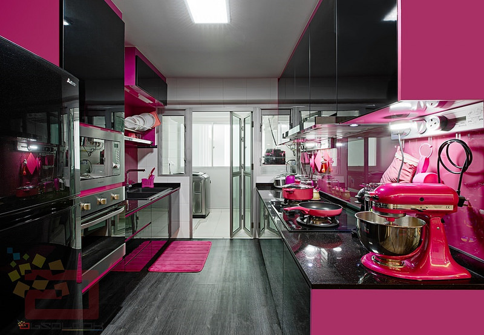
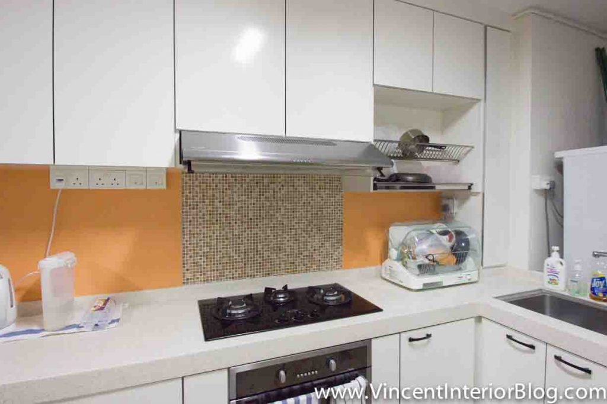
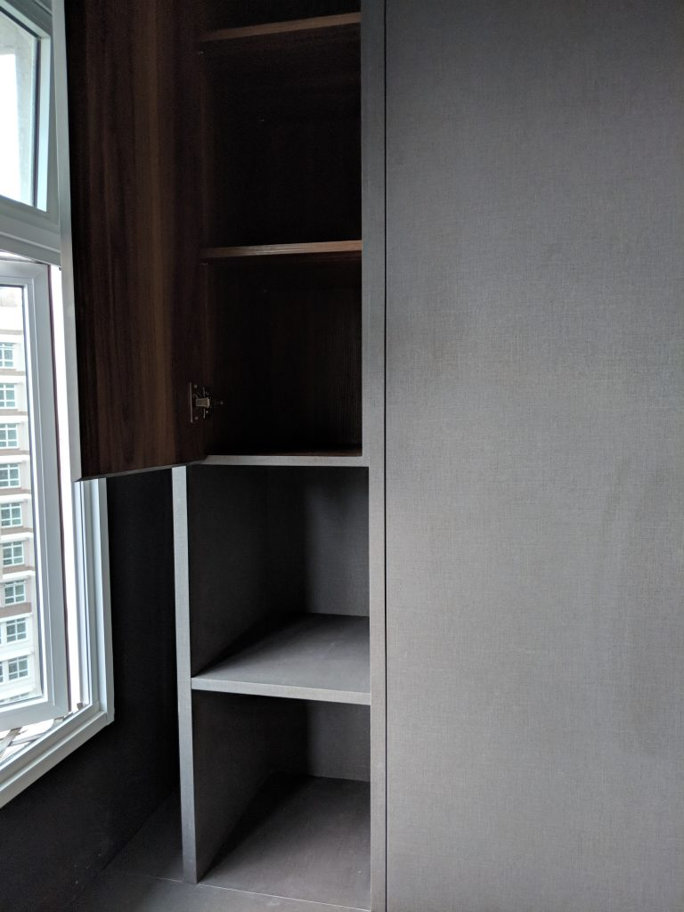

import { Image } from 'astro:assets';
import kraftStorage from './2400x1600-1-k-aa6m-g78m-g80m-rs-003.jpg';

## Intro

After the flooring was done and while progress was ongoing for electrical work, we had carpentry work done to bring our HDB cabinet design to life. We had originally wanted our home to have as little carpentry as possible. But we ended up with quite a fair bit of carpentry in the end, because it was just not practical to use concrete/aluminium, do without storage space at all, or to use an open concept (the dust would kill).

The main categories for our HDB cabinet design were for the living room, kitchen, and bedroom:

- A storage settee that runs the entire length of the living room. Storage settees seem to be very popular, especially along the windows. Ours is in a rather unique position so it's different from the 1001 designs that have the same storage settee.
- 2 rows of wardrobes and bookshelves.
- 2 rows of bottom cabinets and 1 row of top cabinets for the kitchen.

## Wardrobe and bookshelves

### Laminate

We chose something that gave a gray, matte feel. It doesn't even feel like the typical laminate. The advantage is that it looks and feels great. But maintenance-wise it looks like it'll take a hit. Scratches, dents, and stains are going to look a lot more visible than normal.

_Grayish tone with a matte finish. We really liked it._

### Casement doors

We went for casement doors for all the wardrobe doors. Casement doors do not allow us to install a ceiling fan at the dresser area. When you open the wardrobe doors you'll hit the fan. We had two ideas. One was to convert the doors to sliding ones. But they look much uglier and you get dust trapped on the door tracks. The second idea was to split into 2 parts, i.e. to have a top door and a bottom door so you only open the top part when the fan is off. But the design does look a little off because you suddenly introduce more lines. In the end, we opted not to have a ceiling fan and will make do with what I call a standing fan.

### Thickness of planks

Some of the shelves and planks need to be thicker. Especially for the bookshelves that need to accommodate heavier stuff.

_The shelves originally came a little thin._

_We got the guys to change it to thicker shelves._

### Sides for adjustments

Some people like the multiple puncture holes at the side (like the track system below) but we were worried about the holes trapping dust, so we refused to do it. We had a couple of holes punched and that's sufficient. You can see the holes in the picture above.

_An adjustable track system for shelving ([Source](http://www.thisiscarpentry.com/2011/10/07/adjustable-closets/))._

### Covering up as much as possible

We don't require display cabinets, so we opted to cover the shelves as much as possible. This would help to prevent dust, which we hate. We still have 2 narrow columns of open shelves, but maintenance would be much easier.

### Soft closing hinges

Soft closing hinges are the best! There's no reason not to get them.

In the market there're [many brands for soft closing hinges](https://diyhousehelp.com/products/cabinet-door-soft-close-hinge-dampers). It seems like the most popular is Blum. Many IDs offer and boast about them. But there's often some overselling and upselling involved. Though they aren't obscenely expensive, not everyone requires Blum hinges. As long as you have soft closing hinges that last it'll be fine.

Shao Jie mentioned that Blum is typically needed only if you’re going for aluminium (e.g. the legrabox series). The advice probably holds for the other branded hinges as well. Otherwise, the conventional runner track is the same as any other brand in the market. For us we were given no frills soft closing systems and drawers runner with heavy duty track. They have been great.

### Edges and finishing

Make sure to get your ID or contractor to properly sand away the areas with rough finishing. You don't want to get a prick from opening or closing wardrobe doors.

_Ouch._

## Kitchen cabinets

### Laminate

We went for something that fit our living room floor and settee colour scheme, while still fitting in with the kitchen wall tiles and floor tiles. The finishing of the laminate is the matte wood grain feel. Overall, we were happy with it. The clean and neutral look is much better than some designs which are very very loud and complex, to the detriment of the overall design.

_A colour scheme like this would be too much for us. We would probably get headaches just by looking at it ([source](http://id.com.sg/hdb-bto-hot-pink-kitchen-at-blk-430a-yishun-orchid-spring/))._

_Another overly complicated and colourful design that would've ended us ([source](http://www.homeanddecor.com.sg/blogs/house-tour-colourful-five-room-hdb-flat-marine-parade))._

### Number of rows

We opted to have cabinets on both sides of the kitchen. We don't have the option and we wouldn't want a kitchen island, so we were able to choose to have 2 rows of cabinets. And it's a good thing to have, as there're a lot of things to store. I think it's always better to have more storage than too little.

### Dimensions

The dimensions are largely standard, but we also chose to adjust the width and depth slightly to accommodate an Ikea utensils tray that we bought.

_We chose to buy the bamboo utensils tray rather than the plastic one. At $25, it's much more expensive but the look fits much better._

### Silhouette and dish drying area

Some people like having jagged edges for the silhouette of their top cabinets. Case in point:

_The jagged edges don't look that good. Gives the impression of being cluttered ([source](http://www.vincentinteriorblog.com/practical-and-hygienic-dish-dryer-is-a-must-have-home-appliance/))._

_Another example of jagged edges ([source](https://www.straitstimes.com/singapore/housing/open-kitchen-concept-to-be-automatically-applied-to-new-hdb-flats))._

We chose straight lines rather than having some parts of the cabinet popping out. It just looks better and tidier.

_A straight line from the left to the right. Gives a cleaner feel._

For the dish drying area, many people go for a casement door that swings upwards. We were briefly swayed by that idea.

_There's a slight pop out and it's something that we've seen quite a bit when we researched this. But we didn't get this in the end and we're happy about it._

There is a practical advantage, it'll be less likely you hit the casement door opened upwards with your face if you leave it open to allow stuff to dry. Unless you're really tall. But Shao Jie was probably right to discourage us on that. For starters, you are short of a line in the middle and this makes the look a little different. And even with the normal casement doors (opening in the middle) we can still open the door nearer to the windows to allow more air circulation without getting hit.

### Forgoing the chimney hood

At the start we really wanted a chimney hood. The name is a bit of a misnomer, they don't really connect to any chimneys and are in fact recirculating models. To us, these hoods usually look much better.

That said, we weren't able to go for it. We found that out when we [first got the keys to the house](https://btonomics.com/renovation/bto-key-collection-and-rectification-work/). We wanted to place the hood and hobs on 1 side of the kitchen, and washing and preparation areas on the other side. But the gas pipe/point was on the same side as the washing point, so we needed top cabinets for the side that'd house the dish rack and the hood. The end result would be either a) having a chimney hood and top cabinet, or b) going for a built-in hood. The choice was clear, no one chooses a). Design wise it'll be ugly. Ok we kid, some people actually do:

<Image
    src={kraftStorage}
    alt="A chimney hood with top cabinets is just a horrendous mix."
    width="1000"
/>

_A chimney hood with top cabinets is just a horrendous mix ([source](https://www.kraftmaid.com/kraftmaid/warm-neutral-kitchen-design-ideas/))._

### Cutout for built-in hood

The cutout for the built-in hood was pretty standard. Most people would buy a hood that is more angular. It looks more chic that way. We bought a built-in hood that looks more opiang, the Fujioh FS890R. The reason why we bought it was because it does its job well while not being overly expensive. Among the non-chimney hoods, it's actually very good and made in Japan.

One piece of excellent advice that Royal Fanco gave was to cater for more allowance because we bought the Fujioh hood. The model we bought was slightly narrower than all other hoods, so if we did everything down to exact measurements we wouldn't be able to change our hood in future without redoing the carpentry.

### Solid surface counter-top

The typical choice nowadays for HDB BTOs is between solid surface or quartz. Both are non-porous and resistant to bacteria growth. Quartz is more durable and doesn't scratch or chip. But it's also more expensive, like almost double.

In the end we chose a solid surface counter-top. Design-wise it's not the most fantastic, because it's not as plain as we'd like it to be. It's a little 'noisy'. But the main consideration was definitely budget. We couldn't justify paying so much for a quartz counter-top. We're also not going to be cooking a lot and won't be using the counter-top so much to justify getting a quartz one. If we sell the house after 5-8 years, we won't be able to lift the whole thing and reuse it in the new house. Well technically we could, but no one does that. This decision is very similar to why we chose a 4-room flat. We could afford the more expensive one, but we don't need it and we won't use it to the fullest extent.

_Not trying to nitpick but the patterns on Quartz surfaces are much busier than the plain designs of solid surface ones ([source](https://www.zillow.com/digs/contemporary-kitchens-7122474393/#noAppRedir))._

Shao Jie got for us a white counter top. Plain colour. Initially it was good. But on hindsight maybe we should've gotten something with grains or patterns. We've a few stains already after we cooked pasta, and while it's not immediately noticeable the maintenance is quite hard. If there were noisy patterns then perhaps it'd be less noticeable. Scratches are quite visible too. We'll just have to live with these.

### Soft closing hinges

Same thing. Get them.

## Storage settee

### Laminate

Shao Jie chose biege and a wood grain feel for the settee. It is a nice shade and fits very well with the floor and wall colours. However, it might be a little problematic maintenance-wise, as it seems like it might get dirty more easily than dark wood colours.

### Power points and data port

Be sure to look into adding power points and data ports to your settee. There's nothing worse (ok we exaggerate) than resting on the comfy settee and realising that you need to get up just to charge your phone. We are also placing a router there, which would give excellent coverage for the living room and kitchen, so we also installed a data port there as well. These additional points come at an additional cost, but we were happy to pay it for the increased convenience.

_Extra points on top of the storage settee._

### No cushions, please

We've been asked why we didn't build in cushions on the settee before. It's a personal preference. It never crossed our minds to put cushions because we think it'd look terrible. Besides, it'll be a huge problem if the leather or synthetic leather cracks due to humidity or wear and tear, and we have to replace it. It just creates a problem that wouldn't have arose if there was no cushion.

_No offence but this doesn't really score well for us. The cushions just destroy the look ([Source](http://artrend.com.sg/project/modern-hdb-strathmore-ave/))._

### Soft closing hinges

Again, get em!!

## Final product

The pictures should do most of the explanations.

### Storage settee

_The storage settee is designed quite unconventionally here. It works only because we are forgoing a TV and sofa._

### Kitchen

_The area for appliances._

_The other side with the water and gas points._

_One of the large drawers under the hob._

_Cutout with the granite sink installed._

_Dish rack. There's a cut out below to let in more air._

_The kitchen with the work done, complete with the solid surface counter-top._

### Wardrobe

_The wardrobe. This area seems to be the one most liked by guests._

_All of the doors close by themselves, i.e. no overlap where you must close one side before closing the other._

_Shao Jie previously proposed the top portion to be open, but we changed it to reduce dust._
