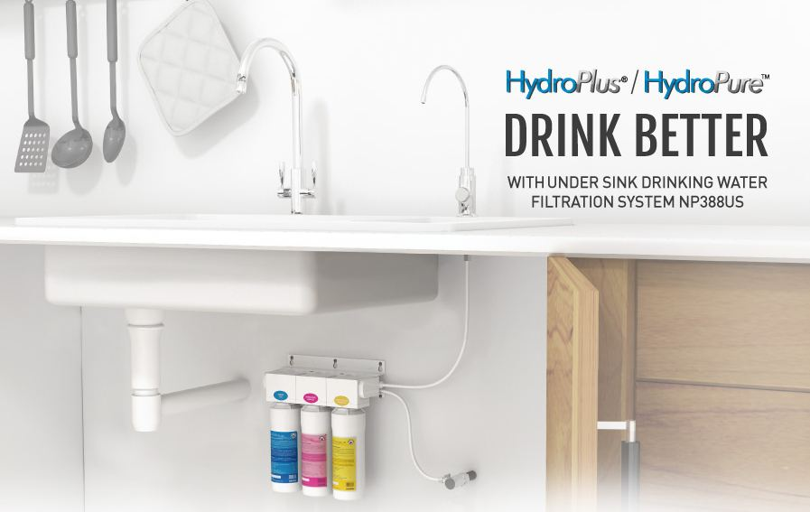

The process to choose basins and taps for our HDB home sounded like an easy one. How difficult was it to choose basins and taps, especially since we weren't fussy people who needed specific shapes for our basin and certain types of water sprouts?

Our preferences were actually quite simple. PQ doesn't like to have her hands touch the basin when washing hands, so we just needed to make sure that the tap was high and long enough, and this had to fit with the basins that we were going to buy. We also needed to make sure that the design passed Shao Jie's taste, because it had to fit with the overall theme and mood. So overall, look simple, look classy, and don't cost a bomb.

However, we were very wrong! Even though we were not particular, we still had to go through a very painful process of searching and researching before we could properly choose basins and taps. There were many things to learn and take note, including cost, size, material, colour, usage requirement, type of mounting, and storage needs.

---

## Basins

### Shops we visited

For our basin shopping, we visited these shops:

1. Ikea
2. IMM shops (e.g. Hoe Kee, Sim Siang Choon, and Asia Excel)
3. Ikea
4. Poh Joo Hardware
5. Fullsun Marketing
6. GR Link Marketing
7. Eng Soon Huat Hardware Merchant
8. Poh Seng Hardware Enterprise
9. Royal Fanco
10. Hoe Kee

We decided to shop for basins locally. We never considered getting basins from Taobao even though they are cheap there. It's because basins are fragile items and you never know whether the shipping to Singapore could damage/crack the basin. With local shops, you can at least replace defective basins. In addition, not all Chinese basins are compatible with our local pipes. If they don't, they would require some sort of adapters, just like the American ones.  We just didn't want to deal with these long tail issues.

### Toilet basins

We wanted, as far as possible, to not create a 'poorer toilet' look. One toilet, usually the MBR toilet, should not be much prettier than the common toilet, because the atrocious look for common toilets can drag the overall look of the house.  Another point is that if you are a heavy 'splasher' and like me, wash your face with a huge force, then you probably need a suitably wide and deep basin. Because the basins were in the toilets, we also needed to consider the issue of storage space in those areas, which are usually accomplished by adding a vanity unit. We wanted something that was nice and therefore looked at a few options:

- Getting Shao Jie to fabricate a vanity with a solid surface top and buying a vanity counter-top basin. This would be the most expensive.
- Getting a separately purchased vanity with a built-in basin. This would be the cheapest, but might be the ugliest.
- Getting a pedestal basin, which comes without a vanity.

We found the typical vanity counter-top look fabricated by IDs quite boring. It's your block design that really screams uniformity and the standard issue. Shao Jie also told us that it would be quite expensive for him to fabricate it, because there's the cost of the wood pieces and the solid surface top, which would work out to be something that we weren't willing to pay for. That was quite a shame, because we found many vanity counter-top basins that we were really keen on, those came in various shapes and sizes. It was easy to eliminate wall mounted options, because they were really off the mark when we went to search.

_An example of vanity counter-top basins we really liked, especially since this was round and fit the eclipse theme._

_Wall-mounted basins, it was easy to eliminate them from our choice. I dont think they look nice at all, they remind us of basins at hawker centres_

_Another example, this would not be out of place in a public toilet and was easy to dismiss_

### Common toilet vanity and basin

After discussing with Shao Jie, we eventually decided that we would get a loose piece vanity with a basin for the common toilet and get a pedestal basin for the MBR toilet. We would then have sufficient storage space for the MBR toilet if we buy a mirror cabinet. In doing so, we'd be able to reduce the total cost, assuming of course that we were able to get a cheap pedestal basin.

We checked out Ikea, which has a huge range of vanities and basins for an affordable price. You can also [check out its whole range at their website](https://www.ikea.com/sg/en/catalog/categories/departments/bathroom/20719/).

_Something like that could work, but the basin was too large and wasn't really in theme._

We also visited other shops that sold vanities as well, Hoe Kee, Sim Siang Choon, some other shops in Jalan Besar and Geylang. But they didn't have nice and good quality pieces. For instance, Hoe Kee was a huge disappointment. Their pieces were ugly. The lesson learnt was to not go to the toilet accessories shops looking for vanities.

_We came across many designs like this at Hoe Kee, I dont think this will do any toilets justice._

The basin and vanity we really liked was from Ikea. It was really wide, around 82 cm in total. I think most of the HDB toilets would find that quite space consuming. We made many visits back to Ikea before we finally decided on the vanity. Nevertheless, we really liked the bamboo counter-top look, and we could also change the sink to allow us to use the long tap. The price was also good, only around $400+.

_We eventually settled on this design, because we really liked the vanity colour and texture, and also for the fact that it allowed a higher tap that could differentiate itself from the MBR tap._

### MBR pedestal basin

The pedestal basin idea was a good one and was from a past job by Shao Jie. We really liked the shape of the pedestal basin, but one concern we had was cost. Shao Jie said it might cost around $700 plus, so that would make it as expensive as the vanity top. But this would be the statement piece in the MBR toilet.

_The reference picture for us, and it showed pretty nice execution overall_

We found a very similar piece at Hoe Kee, under their house brand Roz, and it was around $600. It was what we wanted, although it was a little lower than expected. But we weren't ready to pay for the sink at that point in time, it was a good time to find cheaper alternatives.

_We found this basin at Hoe Kee, under their home brand Roz. It was everything we wanted._

We headed to the Jalan Besar stretch, and popped in and out of most of the shops. A tip, try to go on a Saturday instead of a Sunday, because when we went on a Sunday many shops were closed. Pedestal basins that were what we wanted were in short supply, and those available were awful.

_One of the pedestal basins we saw, not to our liking_

When we dropped by Royal Fanco, we weren't expected much. The shop wasn't large and there didn't seem to be anything there on display, certainly not the pedestal basin we wanted.

_The sign is not something that'd make you want to go in and is pretty standard_

_The place is quite small and doesn't have much on display, but don't let that fool you_

But the shop owner (I think he was called Henry) and his wife Lina were very nice and helpful. We went back and forth with our requirements several times, and eventually we settled on a pedestal sink that only cost half the price of the Roz one. This was slightly lower than the Roz one, but for the price I wouldn't complain. When we told Shao Jie, he couldn't believe the price we got this for. This was a great start to creating our budget toilets.

That said, let us not kid you that it was a quick decision. We only confirmed it roughly a month later, because we were still toying with the idea that maybe we didn't need a pedestal basin and we could just do vanity counter-top basins for both toilets. Eventually we dropped that idea and ordered this.

_We found a pedestal basin half the price!_

---

## Kitchen sink

We wanted a granite sink, because we felt that a stainless steel one looks much cheaper in comparison. Thankfully we weren't stainless steel sink fans, because you used to be able to get Kraus sinks from Amazon which came with free shipping.

There were 2 options we considered for mounting. We went for a top mount sink even though Shao Jie felt that an under mount sink would be prettier on the eyes. A top mount sink is essentially what we saw displayed at Hoe Kee for the Blanco shown below, the edges of the sink are on top of the counter top, whereas you only see the counter top with an under mount sink. There was also the need to decide whether we needed 1 or 2 bowls ('partitions'). My present home uses a kitchen basin that's 2 bowls, but 1 of it is usually unused. We felt that it'd be better to stick to 1 bowl and save the space.

_An example of a top mount sink_

_An example of an undermount sink ([source](https://www.magnushomeproducts.com/blogs/inspired-living/undermount-kitchen-sink-how-to-choose-one-for-your-kitchen))._

We liked the Blanco sink and tap combo that was sold at Hoe Kee. It really fit what we wanted and the colours were fantastic. There were many sizes and options to choose from. The one that we eyed, the Blanco Naya 6, [fit our gray theme very well](https://btonomics.com/renovation/our-clean-bto-home-design/) and wasn't too expensive, at $500 in total for the set. However, we had to look for other options if we were to find the best deal around.

_We really liked this, especially because the gray totally fit our colour scheme_

Having settled the two toilet basins, we asked the Royal Fanco bosses to see the sinks that they carried. And we got a good surprise, they carried granite sinks that were pretty affordable. They carried 2 brands of granite sinks, one made in Italy and the other in India. While Lina told us that the Indian-made sink was cheaper and most granite sinks were on par with one another when it came to their quality, it wasn't available in the smaller size that we wanted. It was a shame because we could've saved even more. Nevertheless, the sink we eventually chose from the catalogue was around the same size as the Naya 6 and came at around $330 for just the sink. It was a very good deal!

_The sink that we chose, which was again from the catalogue and was at a really attractive price_

---

## Taps

We needed two kinds of taps. The vanity counter-top basin requires a tall tap with a long sprout, whereas the pedestal basin can only support a short tap. You may be tempted to go to Ikea, but [it appears that there're multiple complaints online about their taps rusting easily and being of lower quality](https://www.renotalk.com/forum/topic/19954-materials-that-u-regret-using-installing/).

### Material

We are by no means experts in toilet taps, but from what we found, it seemed like brass and stainless steel are the most common.  Brass taps seem to be very common and more often than not chrome plated to be shiny and reflective (although sometimes they do carry that matte look that stainless steel taps have). Brass is composed of copper, zinc, and lead. The breakdown is generally between 50% to 63% copper, with the rest zinc. The pros and cons of brass taps are:

_Brass tap advantages_

1. Brass is durable. They typically maintain their excellent condition for long periods of time and won't crack or cui.
2. Brass can take high temperatures, and have good conductivity and ductility at high temperature. These make it efficient for distributing hot water around the home.
3. Brass is versatile because you can get fittings of different sizes, shapes, and dimensions. You can get brass fittings in chrome-plated, antique/nickel, lacquered, or polished brass.
4. Brass is easy to mould, more so than steel or iron. It's therefore cheaper to make.
5. Brass is quite resistant to corrosion and doesn't rust. This makes it good for water delivery.

_Brass tap disadvantages_

1. Brass can be toxic because they can leach lead into your water. [This applies even to supposedly lead-free brass taps that're approved by PUB.](http://www.mdpi.com/1660-4601/13/3/266/pdf) For those who are very concerned, no amount of lead consumed is safe for human health, and consuming lead can lead to severe gastrointestinal and neurological problems, particularly for children and fetuses. The risk seems to be greatest for hot water and when you drink the water has been still in the pipes/tap for hours.
2. Less common, but still possible, brass taps can be the cause of arsenic in water.
3. Yucky stuff can build up in the interiors of brass taps, which are usually textured. While copper surfaces have some antibacterial properties, I think this is still something that isn't good.
4. Brass taps are also environmentally unfriendly, because of the chrome-plating process.

In comparison, stainless steel tends to be more expensive and limited in its designs. It is a myth that stainless steel is rust-free - they are resistant to rust, but can certainly rust. Lower grades of stainless steel (basically anything lower than sus 304) will be more likely to rust. However, stainless steel has no similar health concerns, so those who are more paranoid about the quality of their water should go for stainless steel.

### Mixers

The other thing that is important to determine whether you need hot and cold water in your taps. Those with hot/cold water mixers built in are more expensive. We didn't need hot and cold water, because there's no point trying to get hot water from the taps. It'd also be a potential hazard if we turned on the hot water and scalded ourselves.

### Swiveling

Do you need the tap to swivel? That matters as well, mainly for taps in the kitchen, especially if you've a double bowled sink.

### Stores

When it came to physical stores, we checked out Hoe Koe and Poh Joo first. These two shops seemed from online research to have what we needed. Hoe Kee turned out to be just average, there were many taps but the designs weren't fantastic. We were very excited for our trip to Poh Joo, because we'd heard tremendous things about it online. But it turned out to be totally disappointing. The staff who was there was nonchalant and didn't seem like she cared. In addition, they didn't seem to have many designs with stainless steel taps.

_The designs seemed quite disappointing to be honest_

_This was pretty good but was on the pricey side. It also didn't really fit the theme and wasn't that practical._

### Brands

The most well known ones are your Grohe and Hansgrohe. These are the iPhone Xs of taps - super atas, top quality, and chic. But they are expensive, you might need to sell your kidneys to buy a whole house worth of these. [The two companies supposedly started from the same source, but branched out.](http://forums.finehomebuilding.com/breaktime/general-discussion/whats-difference-btw-grohe-and-hansgrohe) Based on what people say online, you should get Hansgrohe taps rather Grohe if you're really trying to go for quality, Grohe seems more mass market.

_A Grohe Allure tap, super chic and nice, but carries a very nice price tag as well ([source](https://www.grohe.sg/en_sg/bathroom-collection/mixer-taps-allure.html))._

There are also many places which sell cheaper branded or house branded taps, including Rubine, Nobel, Hoe Kee's Roz, and Poh Joo. My sense is you can often buy a better value tap from these sources rather than spend a bomb on Grohe taps, or you could always get a tap of higher quality for the same price. The best value taps can be gotten from Taobao.

---

## Toilet taps

We decided to get our taps from Taobao. The most important thing is whether the taps can fit the Singapore standard for water pipes. Sellers would usually say that their taps are 四分, which means their taps are 1/2 inch in diameter. This is different from the American or European standards, which are typically 3/8 inch wide and [require adaptors](https://www.renotalk.com/forum/topic/59385-usa-kitchen-faucet-thread-size-not-correctly/). But even if you confirm that the pipes are 四分, there is still the risk that the pipes might not fit, which is par for the course for anything you buy from Taobao.

For the toilet taps, we felt that there's no need to get stainless steel taps, because we won't be drinking the water from the tap. Stainless steel taps are less versatile in their designs and we wanted nicer taps for the toilets.

The taps on Taobao are ridiculously cheap, both for brass and stainless steel taps. The question I usually have is whether the taps are of sufficiently good quality to ensure that they don't leak. I've seen some complaints where taps leak a month after they're installed. But for the savings you're getting, it's worth it just to change your taps when they leak. You save 4 times of the Singapore prices, because you pay the same amount in RMB.

_This SUS 304 tap costs only RMB 108 ([source](https://detail.tmall.com/item.htm?spm=a230r.1.14.130.83a44f2fRXy6pZ&id=545654393413&ns=1&abbucket=8&skuId=3293346156785))._

_There're also more atas and chic designs - this costs more, at RMB 498, but it's still much lower than what you'd pay for a Rubine or Nobel tap ([source](https://item.taobao.com/item.htm?spm=a1z10.5-c.w4002-15010058952.75.73c23915x5EFTu&id=531625294739))._

We wanted a balance between the generic taps that you found in almost every toilet (the first pic above) and those very elaborate one (above). We eventually chose these taps for their looks. Their prices were fantastic, even though they were more expensive than the general Taobao tap, because for the prices we got them for it was a no brainer. They came with mixers even though we didn't need it, but it was cheap so we didn't mind the wasted functionality. Most importantly, they got the Shao Jie stamp of approval haha, design-wise.

_We eventually settled on this RMB 288 tap for the common toilet, and the only regret is that we can't accommodate this in the MBR toilet even though it's much nicer ([source](https://detail.tmall.com/item.htm?spm=a220m.1000858.1000725.101.59385460nUTdS2&id=553490982719&skuId=3413463381518&areaId=440100&user_id=1131565653&cat_id=2&is_b=1&rn=20170ef62cb0523c772b534a73f1f81d))._

_We chose this RMB 329 for our MBR toilet, because this was a good balance between the generic tap design and the elaborate waterfall design ([source](https://detail.tmall.com/item.htm?spm=a1z10.3-b.w4011-2627493702.229.7dcb252eD52k8I&id=560519568240&rn=e63bcab5ff65d4f758d7f8be274857e3&abbucket=19))._

---

## Kitchen taps

We thought it'd be good if we could get a stainless steel tap, one that could swivel. Like toilet taps, kitchen taps on Taobao were also very cheap. We were very enamoured with a black Rubine tap that we saw at Royal Fanco, which sold for around $160. We weren't willing to pay that price, however, because the average stainless steel tap was only around $100.

_Black Rubine kitchen tap that was more expensive than we were willing to pay, however much we liked it ([source](https://www.sgappliances.com/product/rubine-kitchen-sink-mixer-tap-stylo-9144-black-color-724))._

Looking on Taobao brought us some comfort. The average stainless steel taps only sold for an amazing RMB 70, like those below. These are no frills taps. For that price, you could change a new tap every year and still have it cheaper than if you bought the $160 tap.

_Incredible value, these taps only cost up to RMB 80 depending on what add-ons you choose ([source](https://detail.tmall.com/item.htm?spm=a230r.1.14.1.552647c1dtZBvo&id=37016497154&ns=1&abbucket=8))._

Of course, there were other ones with designs that were close to the Rubine one. Those were more expensive but still affordable.

_This cost RMB 148.80, which was very good value for money ([source](https://item.taobao.com/item.htm?spm=a230r.1.999.6.2a45523c9K2x0E&id=545213003273&ns=1#detail))._

We eventually settled on this, which was a little cheaper and had more curve to the design. It should fit very well with the black sink. I think the black tap on stainless steel look doesn't really look nice in the product pictures. Buying this saved us more than $100, even with shipping factored in (which wouldn't be high in the first place, given that we have been doing sea shipping). The hole on the kitchen sink is around 35mm, so that fits the tap base which is compatible for holes 32mm to 35mm in diameter.

_We liked the curve on this and it matched well with our black sink ([source](https://item.taobao.com/item.htm?spm=a230r.1.14.1.40673a5baVBDPQ&id=548764843400&ns=1&abbucket=8#detail))._

---

## Filtered water - yay or nay?

There are many who go for expensive filtration systems for their water needs. Some advertise their ability to make water alkaline, others tout their advanced filtration system to rid the water of all impurities. Our advice is there's no need to. [The science behind things like alkaline water is not certain](http://www.chem1.com/CQ/ionbunk.html) (there're other articles that doubt the science as well, like [Huffington Post](https://www.huffingtonpost.com/john-berardi-phd/alkaline-water_b_7762588.html) and [New York Times](https://www.nytimes.com/2018/04/27/well/eat/alkaline-water-health-benefits.html)). Tap water is safe to drink, although not everyone will like the taste. PUB has clarified on several occasions that Singapore's drinking water meets international standards of water safety. Taken directly from their [FAQ page](http://www.ifaq.gov.sg/PUB/apps/Fcd_faqmain.aspx):

> Singapore’s tap water is well within the drinking water quality guidelines of the World Health Organisation (WHO) and is suitable for drinking without any further filtration, treatment or use of point-of-use water treatment/filtration devices such as water filters and purifiers.
>
> PUB discourages the use of filtration devices as bacteria could grow on the filters if they are not cleaned or replaced regularly.
>
> For customers who choose to add filters on their taps, they may see brownish deposits on their filters over time. This is because our tap water contains minute amounts of minerals including iron and manganese. These are natural minerals inherent in water. Although minerals contents in the water are very low and not visible, discolouration of the filter will eventually be noticeable when minerals absorbed in the filters are oxidised.

That said, water filters can be helpful if you are nursing or if the system is very cheap to purchase and maintain. What we didn't like, in addition to the cost, was the fact that many systems had several disadvantages:

1. You require a separate tap that dispensed filtered water, which looked like water coolers and were ugly.
2. You might Incur quite a bit of wasted water from systems using reverse osmosis, because half the water from the pipes are waste by-product.
3. Under-sink systems can end up flooding your kitchen when they leak or burst.

_An example of an under-sink system, with the clean water tap on the right ([source](https://estore.novita.com.sg/under-sink-drinking-filtration-system-np388us.html))._

To save the hassle and cost, we just decided not to get it. Whatever you do, do not be like that [Singaporean family who only drank bottled water](http://www.straitstimes.com/singapore/health/the-truth-about-bottled-water). [Most bottled water seems to be contaminated with micro plastics](https://www.theguardian.com/environment/2018/mar/15/microplastics-found-in-more-than-90-of-bottled-water-study-says) that could harm your health when ingested long-term. Sometimes [it may also contain bacteria](https://www.nytimes.com/2005/06/14/health/the-claim-bottled-water-is-cleaner-than-tap-water.html). In any case, if you do intend to use a water filter, it's important to change the filters regularly. Using a dirty one will lead to more impurities and ironically cause more problems instead. You also never ever want to end up drinking water from these filters, which were common in Singapore families decades ago.

_We'd probably get a diarrhea if we drank from this tap ([source](https://irawaterpurifiers.wordpress.com/2013/02/10/i-thought-my-citys-tap-water-was-safe-to-drink/))._
