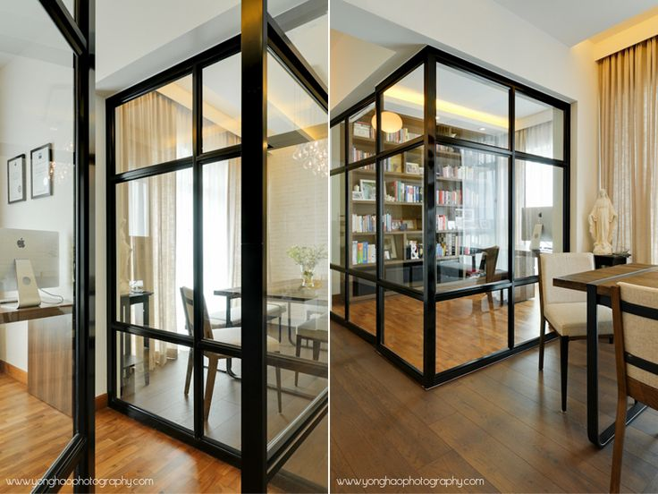
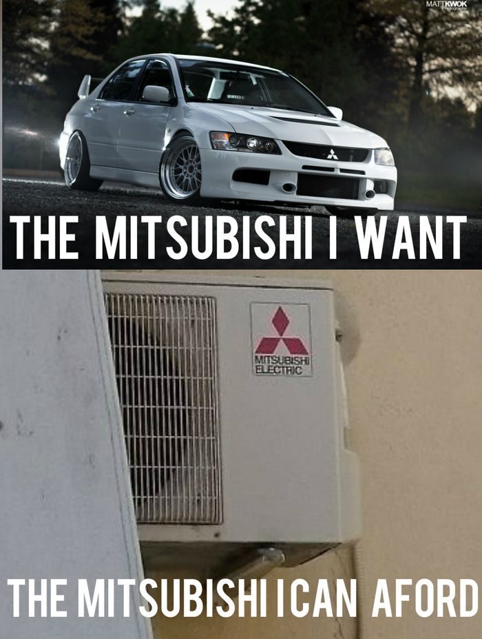

## Intro

We're not sponsored, so first off we need to add a disclaimer that we wrote only our honest opinion. It is important to know how to choose an aircon for your BTO. You should want as little repair and overhaul as possible for your aircon system. It was important for us to decide how we wanted to cool the entire house before we could decide what to buy. Do we go for an aircon in the living room? Many do. However, we wanted to move away from that, because we'd hardly be in the living room. It'd be a waste to install one there and never use it. Even if we have guests, the fan should be able to cool the living room enough to not warrant a fan. As such, we only needed an aircon unit each in BR3 and the MBR.

As for the MBR, we contemplated whether to build an aluminium and glass door so that we could open, kind of like the pic below. Unfortunately cost wasn't on our side, however much we liked the idea. The doors would cost around 2-3k. We were very sure the amount of aircon saved from getting a smaller unit and saving on energy costs would not be more than that.

_We had an idea similar to this so that we could close the door when necessary and save on the space needed to cool (<a href="https://www.pinterest.com.au/pin/438045501239521112/">source</a>)._

## Sizing of Aircon

The next thing to do was to choose the sizes of the aircon units, which would determine the aircon system that we'd get. The size of the aircon unit is determined by its BTU – British Thermal Unit. It measures the energy level of the aircon unit. You need an appropriate BTU. If your BTU is much larger than what you need for your room, you will end up wasting electricity and worse, end up cycling off too quickly (therefore the humidity will not be properly removed from the air). If your BTU is much smaller than what you need, the room will hardly be cooled, and the unit will run continuously which also wastes electricity.

In other words, if you get an appropriately sized aircon unit and the correct BTU, your aircon unit will be more productive, it will require less power to cool down the area and that can cut your electricity bill.

The typical configuration for BTOs, which we used, would be

- Living Room - 18k BTU
- Bedroom - 9k BTU

We could've gotten away with a 12k/9k BTU if we installed the aluminium door, but we didn't. such a configuration requires a system 3 even though there're only 2 aircon units. To compensate for the larger unit and the increase in power consumption, we decided to go for a 5-tick system.

## Brand

We then had to choose which brand to go for. There're several brands in the market. There's Mitsubishi Electric Starmex, Daikin, Mitsubishi Heavy Industries (which is a separate entity from Electric), Samsung, LG, Toshiba, Panasonic, Electrolux, and Midea. Realistically, having done some research, what you really want is either Starmex or Daikin, because those are your premium brands and their quality appears to be the best. Whatever you do, I think you shouldn't choose Midea or Electrolux unless you're feeling really courageous and wanted to save some money in the process, but I doubt it'll be worth it. You'd need to overhaul stuff and endure a lot of inconvenience if repair work is major. The hassle simply isn't worth it.

We opted for Starmex. It ultimately boils down to preference and we just tikam our way through. But I must admit, the Daikin song is very catchy. 5 ticks Daikin, Daikin is for everyone!

<iframe
    src="https://www.youtube.com/embed/oG8THGUByNI"
    width="560"
    height="315"
    frameborder="0"
    allowfullscreen="allowfullscreen"
></iframe>

## Installer

The final decision was the installer to install the aircon system. There're several recommended installers when you search online:

1. **JK Aircon**: They're the company that everyone online seems to be talking about and sharing on. They seem to have the lowest prices.
2. **Cold Engine**: There is some mention of them on HWZ forums. But some HWZ members accused them of promoting themselves on forums by creating accounts to give themselves fake reviews.
3. **U-Sin**: There is some mention of them online.
4. **Jex Aircon**: A couple of mentions online but that's about it. We did receive flyers at the estate that were from them.

Prices for all of them were similar, although Jex Aircon was the joint lowest. But the prices didn't tell the whole picture. All of them gave free upgrades for premium materials, which are standard in the industry:

- Two free trips for installation
- ½ inch insulation Armaflex class O
- SWG 22 copper pipe
- Keystone wire
- 16mm drainage pipe
- Litaflex Trunking

There're a few things to note for these materials:

1. 2 trip installation is good. The painter paints the trunking and the wall after the installer does the trunking. Towards the end of the renovation, the installer will then install the aircon unit. If you do it all on the first trip, you might end up having the part behind the aircon unit being unpainted. In future when you want to replace the aircon and get a new one, you will need to touch up the painting because the wall will be of a different colour.
2. Insulation covers the copper pipe and absorbs moisture that forms because of condensation on the copper pipes when the aircon is turned on. If your insulation sucks, you get more condensation and leaks. Armaflex Class 0 is better and more resistant to burning, but Class 1 is fine as well.
3. SWG is the grade of the copper pipe. The thicker it is, the better it can handle high operating pressure. What you want is at least SWG 22 or 23 (the lower the number the higher the grade). it seems like SWG 22 is for commercial/industrial use and is very thick, so it causes larger and possibly uglier trunking. Combined together, you should get at least Class 1 and Grade 23.
4. Make sure that the aircon piping is bent using pipe benders at the corner (90 degrees) and to lay the piping nicely in the trunking.
5. Drainage pipe is typically made of PVC and comes in 2 sizes (diameter of 13mm and 16mm). The bigger the size, the faster the drainage of water and lower the chance of leaks. So where possible just get a 16mm pipe.
6. Keystone wiring is to link the air-conditioner to the power and indoor aircon units to the outdoor one. There are 3 types 4C40 (4 wire cords, 40 copper stands each), 3C70 (3 wire cords, 70 copper stands each), 3C40 (3 wire cords, each with 40 copper strands). The better grade ones are 4C40 and 3C70. But generally installers provide 3C70 for the outdoor unit to the power source whereas 3C40 is for the indoor units to the outdoor unit.
7. Make sure you avoid wiring made in China. Get those from Singapore instead.

What we also thought were important points were responsiveness and reliability. All four were, to their credit, very responsive to inquiries as you'd expect for installers recommended online. But not all were equal in giving the impression of being reliable and trustworthy. Some appeared to be playing around with pricing gimmicks and promotions to pressure you to commit. I also found it quite concerning that one of the companies seemed to have created accounts to post fake reviews on HWZ ([a few users complained about this](https://forums.hardwarezone.com.sg/112521966-post963.html)), so they could advertise their services. That's just despicable and shows a serious lack of integrity. There's no way to prove it, so I just felt it better to avoid them altogether.

_Sorry you thought I was an idiot!_

### Servicing Vouchers

It seems quite common for installers to offer servicing vouchers for their customers. I don't recommend putting too much weight on these vouchers. The worst thing you can do is to count it as cash, because it really isn't. There're always conditions to using those vouchers, and those conditions hardly make the vouchers worth it. For instance, one of the installers offers $100 worth of servicing vouchers, which seems like a good deal. But if you dig deeper, the vouchers come in $20 denominations, and you can only use 1 piece if you spend $150 or less, and 2 pieces if you spend more than $150.

You cannot spend the vouchers quickly. You also cannot engage cheaper and better aircon servicing guys unless you forfeit your vouchers.

### Our choice

We chose Jex Aircon in the end. What won us over was that they were very responsive and nice in sharing over the phone some advice for our flat. In addition, their pricing was more upfront and transparent. Their prices were the lowest. They offered the recommended materials. Jex Aircon matched the pricing of the others without resorting to a Chinese New Year promotion that the others had. This meant that their prices were genuinely the best, without gimmicks. They also didn't offer servicing vouchers. The servicing discount was a one-time free servicing offer instead. This meant more than just having multiple vouchers.

### Why not Gain City?

Quite a few people go to Gain City to get their aircon system. It isn't that bad, but it seems like for the same price as those outside you'll get less premium materials. My current home aircon system was bought from Gain City, and around 4-5 years after installation the servicing guys from Antara said that the wires were in poor condition, which sucks because the only option was to redo the cables. That bad experience pretty much sealed the deal against Gain City for me.

However, they do offer credit card and instalment payment, so if those are important then it's alright to go with them. Just be clear what you're paying for, the quality of the materials you're getting, and to make sure you or your ID supervises the installation.

_The Mitsubishi we got, because we don't always get what we deserve._
