**Note: We no longer recommend shipping from Taobao. Check out our [Taobao vs Shopee comparison](https://btonomics.com/shopping/taobao-vs-shopee-taobao-more-expensive-covid-19/).**

## Taobao Shipping to Singapore - Is It Possible?

Yes! In the past, you needed to do a lot of extra work just to do Taobao shipping to Singapore - those were the days of 65daigou and other third-party companies. But now there're many options. Don't worry if it looks complicated and is in Chinese. It'll save you some money.

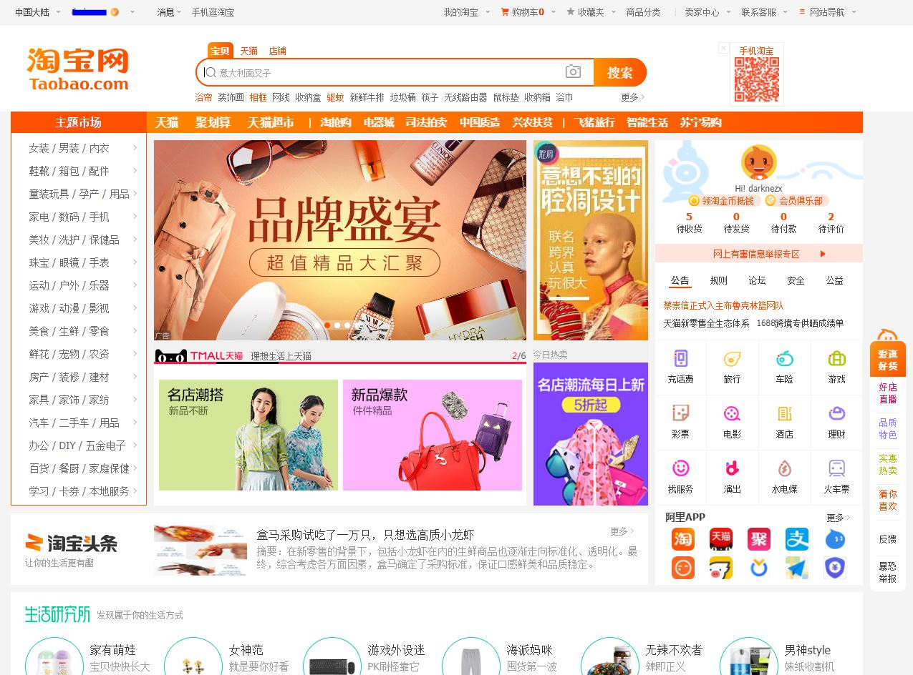 _It's no wonder Taobao scares people, the website user interface is incredibly messy._

## Is Shopping and Taobao Shipping Expensive?

It depends. Many things are cheap when compared to Singapore retail shops, especially home necessity items (e.g. cables, fans, flasks). Read [our previous article on why you should buy stuff from Taobao instead of Ikea or local furniture shops](https://btonomics.com/shopping/should-you-buy-furniture-from-taobao-or-ikea/).

But [prices have also increased now when compared to 2 years ago](https://btonomics.com/shopping/be-careful-taobao-isnt-that-cheap-anymore/). Things like dresses and clothes are sometimes comparable to local blog shop prices. So do your homework!

## What do I buy and shop on Taobao?

You can read our reviews for stuff we've bought like:

[table id=6 /]

---

## 5-Step Guide to Taobao Shopping

### **Step 1: Find your stuff.**

1. You need to get your keyword first. This is harder than it sounds.
2. Look for the inspiration and try to hazard a guess at the Chinese keywords _OR_ search using Chinese keywords generically _OR_ search using English keywords and check those listings to find the corresponding Chinese words _OR_ you can try using image search, which honestly isn't very good.
3. Sort by the amount of sales (select 销量 instead of 综合排序) - the default view 综合排序 almost never gives the best option in terms of prices, quality, and popularity. 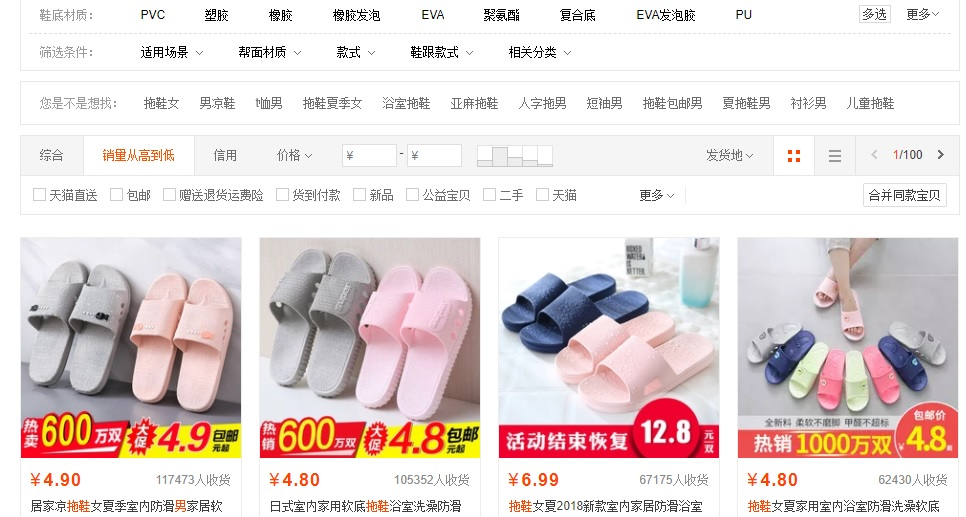_Screenshot_
4. Always go for the listing with the most good reviews, most reviews, most picture reviews - in that order. [There're many problems with fake Taobao reviews nowadays](https://www.channelnewsasia.com/news/cnainsider/army-fake-reviews-online-taobao-amazon-tripadvisor-sales-10448454), so you can never be too careful.
5. If there're many items with similar popularity, you'd want a) the more expensive one, b) the one with the better customer service, and c) the one with better bundle/quantity discounts.

### **Step 2: Ask more about the item.**

1. At this point, you should download [阿里旺旺](https://alimarket.taobao.com/markets/qnww/portal-group/ww/download) and talk to the seller. You usually click on a blue bubble beside the seller's name to activate 阿里旺旺, or a popup will emerge to ask you to either download the software or use the web interface. (Protip: the web interface sucks.) 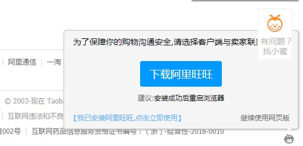 _Screenshot_
2. Ask how the seller will package the product for delivery, whether they can do wooden crates, add bubble wrap. Ask them more about the product. Even if you've no questions, ask them how fast the delivery is.
3. Sometimes sellers will say certain extras (like extra light bulks or adding wooden crates [打木架]) cost more and they need to amend the prices. That means they'll amend the prices after you 下单 (submitted the order and reached the Alipay screen where you need to key in your credit card details).

### **Step 3: Make your shopping as value for money as possible.**

1. This is the auntie step already. (For those non-aunties, you can skip this section. But if not, let's be super aunties and save even more money!)
2. Before you add your items to your shopping cart, ask yourself whether you've been shopping in a way that makes shipping efficient. The goal is always to get the best prices and quality from a few sellers.

    - By efficient we mean consolidating items in as few boxes as possible and making sure that you don't "waste" volumetric weight.
    - For example, there's no point buying a nail clipper from a seller, a cable from another seller, and a shoe horn from yet another one. The sellers will send you the stuff in 3 different boxes, each with tons of padding and a lot of empty space inside the box. You end up paying shipping for air from China to Singapore.
    - The solution is to buy from as few sellers as possible instead. Prices are usually very competitive so you won't lose much by buying from only a few sellers.
    - This is something that no one really tells you, but we realised it after spending tons of time learning how to ship on Taobao.
    - Of course, if there're no alternatives to get the best prices and quality then you should just buy from different sellers. Sometimes that happens.

3. If you want to expedite your shipping, take note of where the seller ships from (within China). If you need it asap, then try to find a seller who ships from around the same province/city as the shipper's warehouse. Otherwise, your parcel will take a few days to travel across China.
4. Don't add to your shopping cart (购物车) first! Copy and paste the URL and item title into a word document.

### **Step 4: Milk your Shopback cash back.**

1. [Go to Shopback](https://www.shopback.sg/referred-signup-bonus?raf=b5RC5A) (caveat: shameless referral link here) and [use the Chrome extension](https://chrome.google.com/webstore/detail/shopback-cashback-button/hjngckebbndpdeeakdgohmcdnecidcjk?hl=en) (no shameless link here). Remember to disable your Ad-Block/Ghostery/Disconnect plugins.
2. Sign in to your account on Shopback through the extension. But even if you don't it's quite idiot proof, nothing happens until you do.
3. Go to the product page for the item you want. Click the button that pops up: 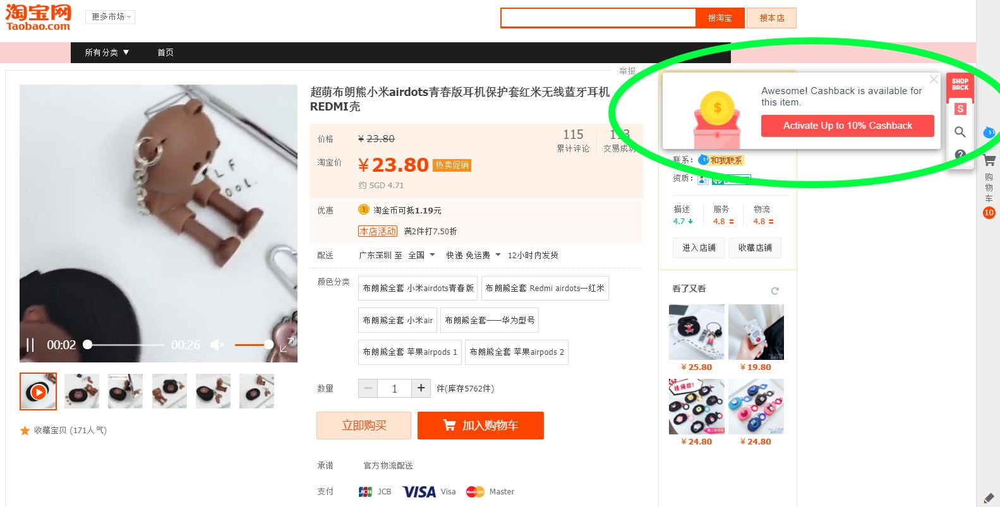_Screenshot_
4. If there's no cashback there's a pop up on the right that says this item doesn't have cashback.
5. Click the button and you'll see this: 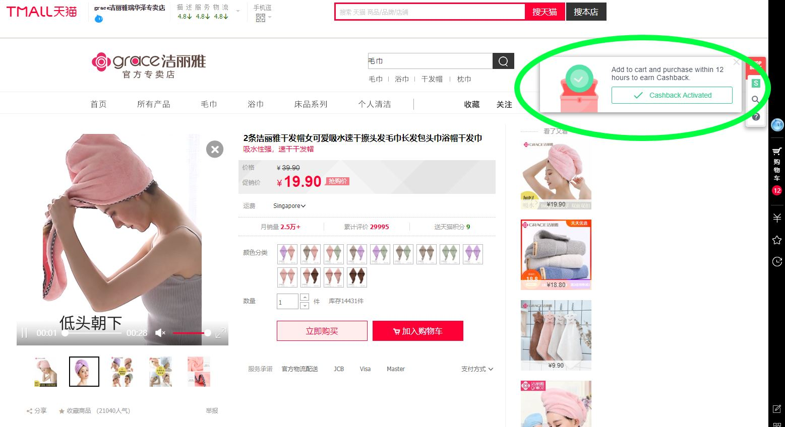 _Screenshot_
6. Add the item to the cart.
7. When you check your cart this should show: 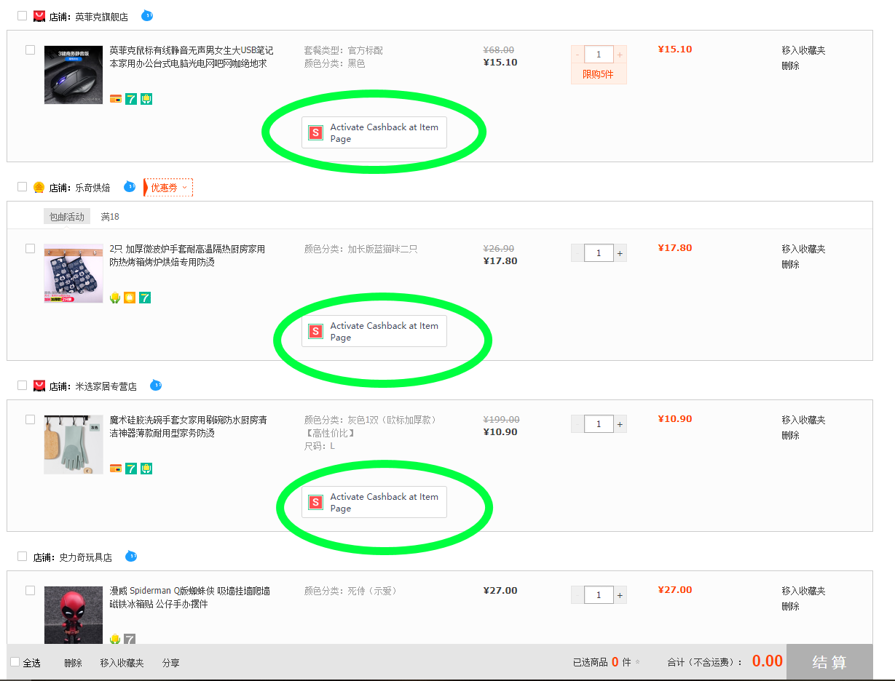_Screenshot_

8. If it's too tiring for you, or if the cash back seems damn little (often can be less than $1), always remember: you're $aving more money. $o don't give up. It'll all add up.

### **Step 5: It's time to pay and buy your stuff**

1. Go to the shopping cart and check out whether there're any coupons for your items. You can collect coupons under the 优惠券 drop-down menu. 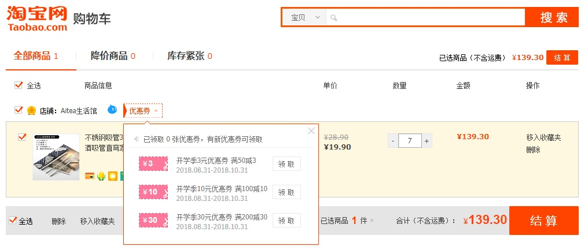
2. Make sure those with Shopback discounts show up like that: _Screenshot_
3. Those without cashback will still show no cashback.
4. Select your items and check out (结账) so you can go to the payment screen.
5. If you're using Taobao Global Direct or Taobao Consolidated Shipping, sometimes you'd get an error message at this stage that the item cannot ship out of China. For example if you want to buy a battery through ZTO, then the system won't let you proceed without deleting the item.
6. Select your desired shipper. 直送 means Taobao global direct shipping and 集运 refers to consolidated shipping via third-party shipping. We explain these options further below. To select something else just select 修改服务商. 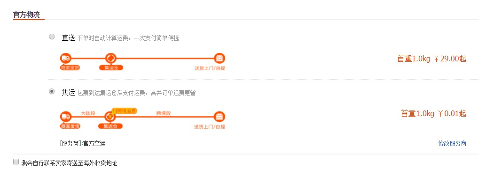 _Screenshot_
7. Check your China domestic postage fee (运送方式) and whether it's free. 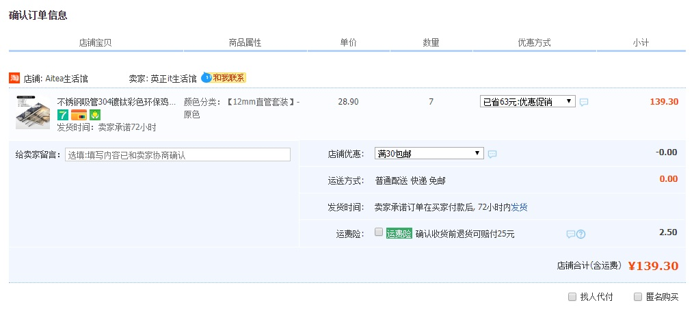_Confirmation_
8. Remember not to deselect the discounts under the 优惠方式 column or the 店铺优惠 drop-down box.
9. Remember to add in any relevant comments (e.g. design, colour, or size) in the 给买家留言 text box before you confirm the order. It's basically anything that your shipper requires you to insert.
10. Double-check your addresses before you click 下单 (place order).
11. Enter your payment details and pay!
12. If the seller says he/she needs to change the prices, then tell the seller to change the order accordingly before you pay. E.g. if they need to change the prices to add in the fees of adding a wooden crate. The seller will often ask you to 下单 and then let them know because they need you to do that before they can amend the final price. Then you go to your 已买到的淘宝, click pay and go through with payment normally.

Ok la, only 5 steps what. That wasn't too hard, eh?

---

## 6 Options for Taobao Shipping to Singapore

Don't forget there's a huge part after you finish shopping - you need to do Taobao shipping to Singapore. There are 6 choices. Don't use Taobao Global Direct Shipping or Seller's Shipping!

1. Taobao Global Direct Shipping
2. Taobao Consolidated Shipping (to Home) **[Recommended]**
3. Taobao Consolidated Shipping (to POPStation) **[Recommended]**
4. Third Party Shipping (Air) **[Recommended]**
5. Third Party Shipping (Sea) **[Recommended]**
6. Seller's Shipping

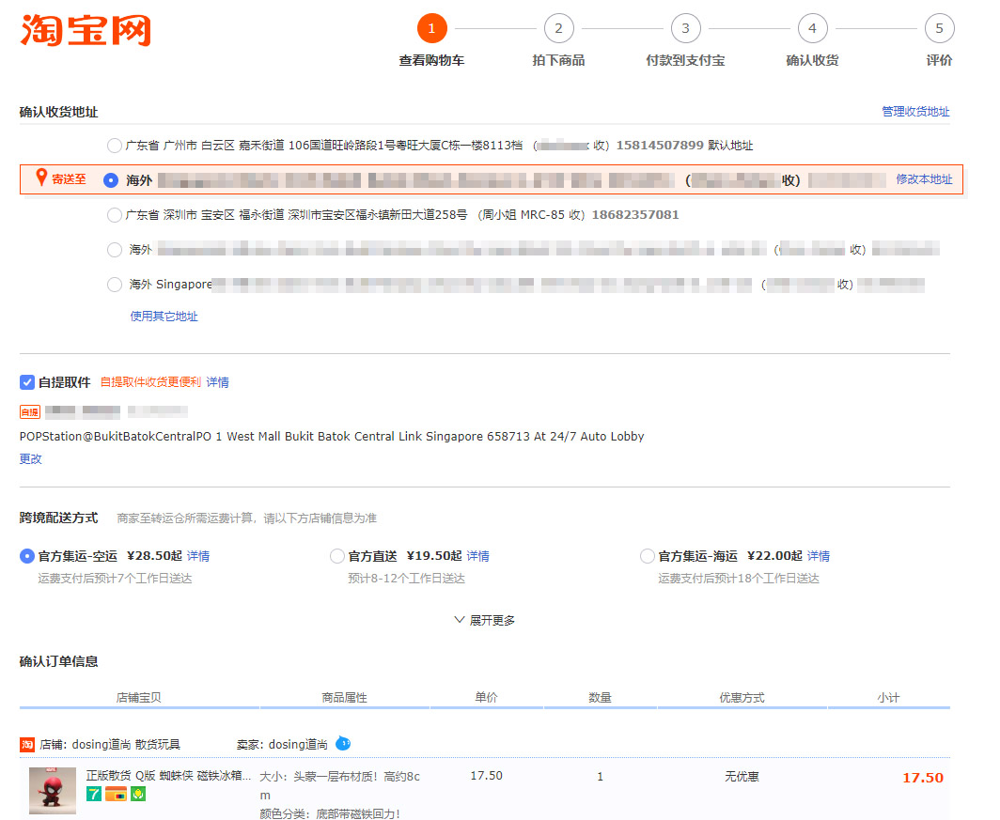 _Screen with shipping options after checking out your cart._

### Comparison of Options

| Shipping Option                            | Description                                                                                                        | Air/Sea | Cost       | Speed  | Convenience | Payment                       |
| ------------------------------------------ | ------------------------------------------------------------------------------------------------------------------ | ------- | ---------- | ------ | ----------- | ----------------------------- |
| Taobao Global Direct                       | The order you paid for is shipped out as one package to Singapore.                                                 | Air     | High       | High   | Low         | Taobao interface              |
| Taobao Consolidated Shipping to Home       | You can slowly consolidate your buys and then ship to your home in one go to Singapore.                            | Air     | Medium     | Medium | High        | Taobao interface              |
| Taobao Consolidated Shipping to POPStation | You can slowly consolidate your buys and then ship in one go to Singapore. Delivered to POPStation for collection. | Air     | Medium     | Medium | High        | Taobao interface              |
| Third Party Forwarder                      | You can slowly consolidate your buys at a China warehouse and then ship to your home in one go to Singapore.       | Air/Sea | Low-Medium | Medium | High        | Third party shipper's website |
| Seller's Shipping                          | Avoid this at all cost! This is the seller shipping to you direct and the price is usually insanely expensive.     | Air/Sea | Super High | -      | High        | Taobao interface              |

### Taobao Global Direct

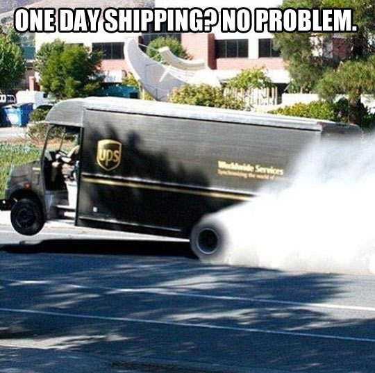 _Don't doubt the efficiency of Taobao._

The most efficient of all options.

| Pros                                                                                                      | Cons                                                                                                                                                                                                                                                                                                                |
| --------------------------------------------------------------------------------------------------------- | ------------------------------------------------------------------------------------------------------------------------------------------------------------------------------------------------------------------------------------------------------------------------------------------------------------------- |
| Delivers your order asap for that one order, within 5 days from warehouse.                                | Usually more expensive, sometimes much more (e.g. double).                                                                                                                                                                                                                                                          |
| Everything is seamless. Make one order, pay for your items, and wait for them to arrive at your home.     | Only get one shot at sending out your items, you make an order and that's it. If you find anything else you need to do a new shipment. But then you'd waste money, because the initial chargeable weight is always more expensive.                                                                                  |
| Pay GST only when your delivery order exceeds SGD 400.                                                    | Lack of communication. Taobao ever shipped our items without everything having arrived at the warehouse. One item was not sent out by the seller as he was waiting for us to verify (literally click confirm) order through 阿里旺旺; but Taobao shipped out the partial shipment because of their 5-day guarantee. |
| Not easy to contact Taobao if anything pops up, you'll need to do it at their hours, through the website. |                                                                                                                                                                                                                                                                                                                     |

### Taobao Consolidated Shipping to Home

Use Taobao's consolidated shipping for small and light items like clothes or charging cables. You can slowly shop over many days and ship them to Taobao's Cainiao warehouse, then ship them to Singapore in one go. Cainiao typically calculates the fees via volumetric or actual weight. Use the latter if the actual weight is much heavier than volumetric (e.g. dumbbells).

| Pros                                                                                                                                          | Cons                                                                                                                                                                                                                                                               |
| --------------------------------------------------------------------------------------------------------------------------------------------- | ------------------------------------------------------------------------------------------------------------------------------------------------------------------------------------------------------------------------------------------------------------------ |
| You can consolidate your items. The forwarder automatically tracks and handles the items at their warehouse.                                  | Cannot ship prohibited items like food, batteries, liquids, gases, knives, lights, and some plastics.                                                                                                                                                              |
| You pay GST only when it exceeds SGD 400.                                                                                                     | Strict limitation on how big the parcels can be, especially the length of the items and combined sizes.                                                                                                                                                            |
| The fees for air shipping are also typically the lowest, even lower than third party forwarders, probably because they handle things in bulk. | (If you're ever in doubt, just check with the customer service via the Taobao website before buying the item. It sucks to have your items rejected by the warehouse. And then you have to either throw the item away or pay more to ship them back to the seller.) |

### Taobao Consolidated Shipping to POPStation

The same as Taobao consolidated shipping to home, except you collect from POPStations. There're size limitations as per the POPStation limits:

| Type   | Size                             |
| :----- | :------------------------------- |
| Small  | 42cm (w) x 10cm (h) x 61cm (d)   |
| Medium | 42cm (w) x 23.5cm (h) x 61cm (d) |
| Large  | 42cm (w) x 37cm (h) x 61cm (d)   |

### Third Party Sea Shipping

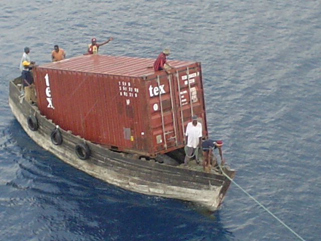 _That's probably why your sea shipments take an eternity to reach._

We'd recommend sea shipping by third-party forwarders for bulky and sensitive items. Third-party forwarders tend to be cheaper when it comes to sea shipping and they are more flexible. The forwarder calculates your fee based on the number of cubic meters you use up (1 x 1 x 1m). That's regardless of the actual weight, unless you sink the ship with something super heavy like Thor's hammer.

You can have a huge flat table which is long but flat, and still add more boxes on top of it in the ship. Which means you'd want to fill the space with heavy items. Same thing for prohibited items like batteries and knives because these can't go under air shipping.

[We found this guy promoting his services on HWZ forums, MRC](https://forums.hardwarezone.com.sg/mass-order-corner-251/try-us-if-you-buying-huge-furniture-bulky-items-china-5673360.html). His rates are the lowest we've seen. The speed of delivery for sea shipping is fine but much slower than air shipping. MRC usually shipped our stuff before we paid him, so that the sea shipping was already faster. We always texted him as and when we needed help as well. He was always able to advise us appropriately. **But he was not reliable after all ([we lost quite a bit of money](https://btonomics.com/shopping/taobao-missing-item-how-shipper-lost-parcels/)).** So we decided to stop using him.

There're many other alternatives like Sfinex, Oops, Peeka, or 86 Ocean Freight. You can google for some reviews. We have only used Sfinex before and they were pretty fast in shipping and very responsive over WeChat. Their prices were quite good as well. You can add the lady boss on QQ: 598844064, 阿里旺旺: sfinex_cs, or WeChat: sfinex.

#### Normal process

The whole process to get sea shipping from third-party forwarders is the same as the typical Ezbuy ship-for-me service but more complicated than Ezbuy buy-for-me:

1. You change your delivery address to the China warehouse address that the shipper gives you.
2. Add the marking that the shipper gives you in the description, if applicable. We use "请在所有包装或箱子上注明XXX,不然货仓可能会拒绝签收". Not all shippers require this.
3. To be safe, use 阿里旺旺 to tell the sellers to indicate the marking clearly. Your parcels won't automatically disappear if they don't have the marking, but the chance of it going missing is greater.
4. If you bought only single items, then get the delivery tracking numbers from the Taobao system, under the 已买到的淘宝 section.
5. If you bought multiple items from the seller, the seller might ship in more than one parcel to the warehouse. Use 阿里旺旺 to ask the seller for all the delivery tracking numbers. This part is _very important_. If they shipped 3 items to you in 3 boxes but you only tracked 1, you lose 2 of them. The seller will not refund you as it'll show that you received the item. The Taobao system usually shows only 1 item and we usually see at most 2 numbers. There's nothing worse than shipping chairs and receiving only the legs.
6. Track your orders in the Taobao system or courier companies' systems.
7. When everything is 签收 (signed for by the warehouse) in the system, you should fill in the details of your parcels either over email (like how MRC does it) or a web interface (like SFinex does it).
8. Fill up the details with the tracking numbers, shipping companies, costs of items, and short descriptions of the items. These are mainly for identifying your stuff and submitting info to the shipping company so they can pack your items.
9. Once done, MRC or the SFinex system will calculate the total fees, which will include the shipping fee, GST (which is applicable for all sea shipping), and insurance (if you opt for it).
10. Pay for it and everything's done. For a guide on using SFinex, you can [check out the section below](https://btonomics.com/shopping/how-to-buy-and-ship-from-taobao-to-singapore/#Air-Shipping-third-party-Sfinex).

 _Phew that was a long one._

### Third Party Air Shipping (Sfinex)

We've been using Sfinex for third-party air shipping as well. It's useful for large but light parcels, because there's an option to airship by normal weight. We usually select the 免抛 (i.e. ship by normal weight), so we don't have to worry about expensive volumetric weight fees. The 半抛 is usually more expensive because they take half volumetric weight and half normal weight.

**But do take note:** Sfinex doesn't prorate the weight, so they round up all weights. For example, 2.6kg will be charged as 3kg, meaning you are overcharged by 0.4kg.

The process for payment is more complicated:

1. You change your delivery address to the China warehouse address that Sfinex gives you in the members' area. 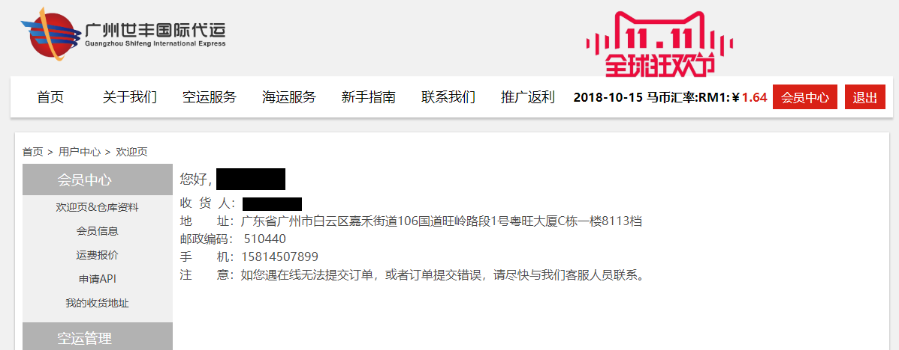 _Screenshot_
2. If you bought only single items, then get the delivery tracking numbers from the Taobao system, under the 已买到的淘宝 section.
3. If you bought multiple items from the seller, the seller might ship in more than one parcel to the warehouse. Use 阿里旺旺 to ask the seller for all the delivery tracking numbers. Remember, this part is _very important_.
4. Track your orders in the Taobao system or courier companies' systems.
5. When everything is 签收 (signed for by the warehouse) in the system, you should fill in the details of your parcels through Sfinex's web interface (courier company, delivery tracking no, brief description, number of boxes, and value of item). 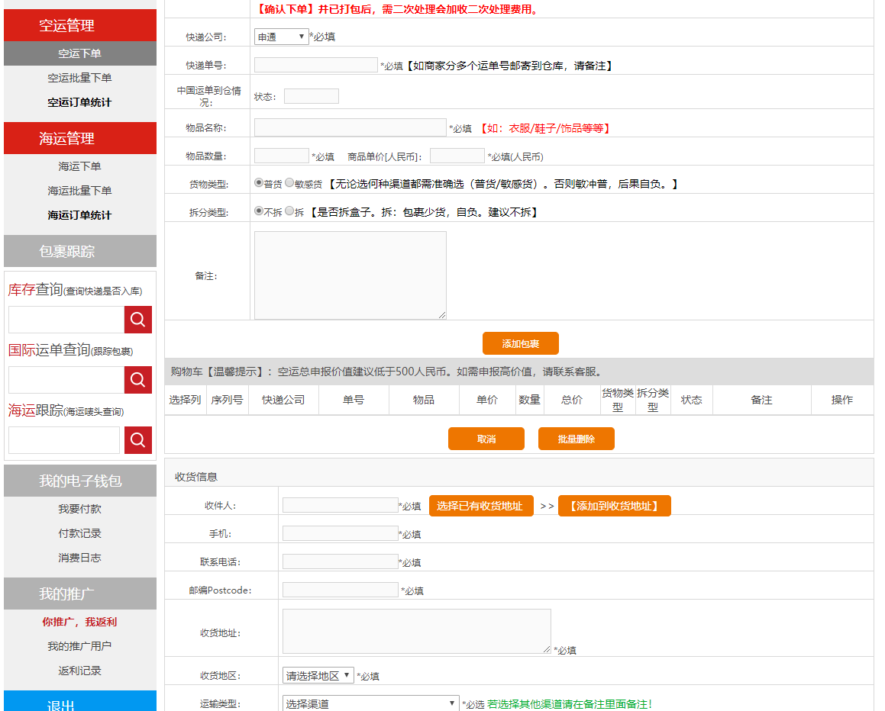 _Screenshot_
6. There're many types of shipping options. Select the desired one. If in doubt, select 新加坡免抛.
7. Once submitted, SFinex's system will calculate the shipping weight and fee. 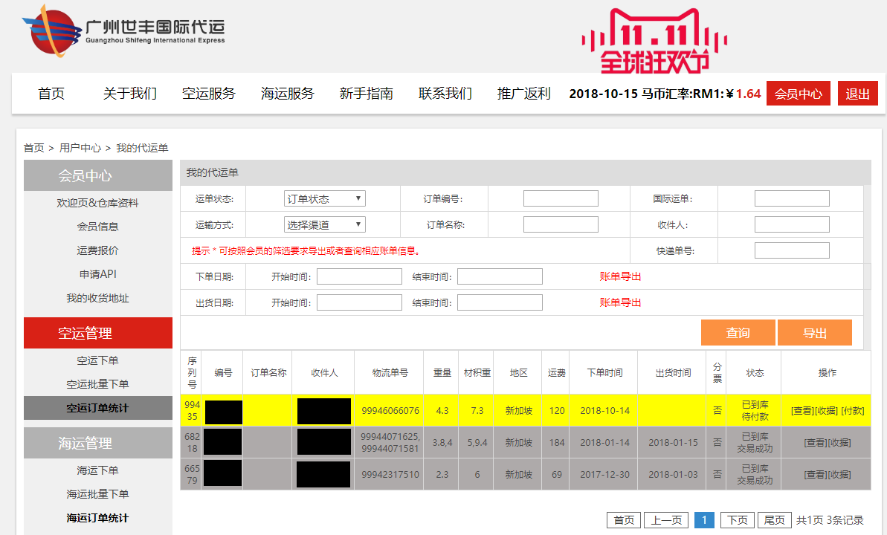 _Screenshot_
8. For SFinex, you can't pay via normal means because we don't have a China-issued credit card. So you pay via Taobao. SFinex will send you a link to a 1 yuan dummy item on Taobao, you'd just buy the quantities needed to pay for your shipping. E.g. if your fee is RMB 120, just buy 120 of this RMB 1 item. 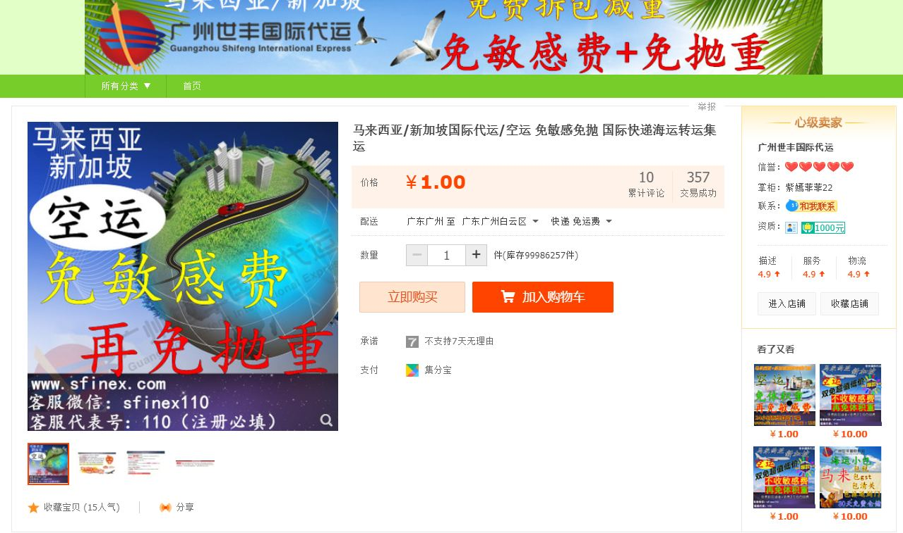 _Screenshot_
9. The next step is to submit a form (similar to Ezbuy) to say how much you paid, when you paid, and upload a screenshot of the payment. They'll verify it. What happens is you loaded your account with money, which can be used for payment. 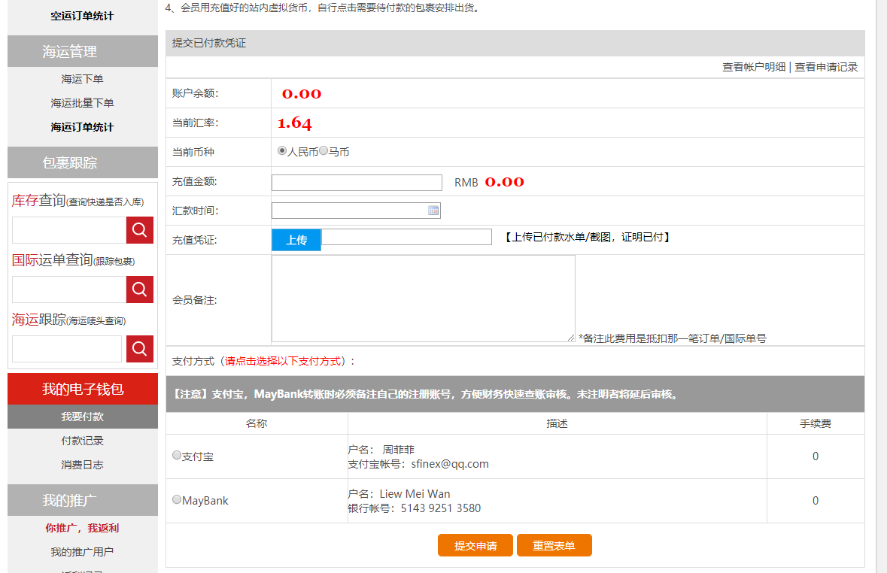 _Screenshot_
10. The final step is to go to the air shipment orders page and click "[付款]". This uses the money you loaded to pay for the shipment. (Ignore the part where it says 待付款, re-used the same screenshot)  _Screenshot_
11. When payment is verified and correct your stuff will be shipped out.

## Prices for Taobao Shipping to Singapore

We compared the fees from the main options (excluding buy-for-me services) for Taobao shipping to Singapore. So who's cheapest? In general, go for Taobao official air shipping forwarders if you want to ship small and light items and get it fast. If it's heavy items, you might want to try large sea shipping from SFinex, Cainiao, or MRC, although the first 2 is not very cheap. But try to break up your purchases even if you pay more for shipping, because you will lose less money if the shipper loses your items.

| Method                                       | Shipper                                                    | Price for initial weight                                                                    | Subsequent prices                                                           | Weight limitation                                  | Size limitation                                                                                                                                       | Speed of shipping | Recommended for                                                                                                      |
| -------------------------------------------- | ---------------------------------------------------------- | ------------------------------------------------------------------------------------------- | --------------------------------------------------------------------------- | -------------------------------------------------- | ----------------------------------------------------------------------------------------------------------------------------------------------------- | ----------------- | -------------------------------------------------------------------------------------------------------------------- |
| Air                                          | Taobao Global Direct                                       | Minimum ￥22, calculated at product page                                                    | ￥10.50/500g                                                                | 25kg                                               | Single side not more than 80cm, height+width+depth not more than 150cm.                                                                               | Fastest           | Small and light stuff like clothes, cables, mats                                                                     |
| Air                                          | Taobao Consolidated Shipping                               | ￥29 for 1kg                                                                                | ￥10.50/500g                                                                | 25kg                                               | Single side not more than 80cm, height+width+depth not more than 150cm.                                                                               | Fastest           | Small and light stuff like clothes, cables, mats                                                                     |
| Air                                          | Sfinex (actual weight shipping, no sensitive shipping fee) | ￥36 for 1kg                                                                                | Subsequent: ￥26 for 1.1-2 kg; ￥24 for 2.1-10kg; ￥23 for more than 10.1kg | 25kg (overweight charge, exact limitation unknown) | Single side not more than 120cm, 2 sides cannot exceed 70*70cm (e.g. 90*20*20cm can, 90*80\*20cm cannot). (oversize charge, exact limitation unknown) | Fast              | Large and light stuff like painting, shower curtain rod, plastic containers, or sensitive equipment like electronics |
| Sea shipping (by weight)                     | Cai Niao (less than 30kg)                                  | ￥22 for 1kg                                                                                | ￥7.40/1.0kg                                                                | 30kg                                               | Height+width+depth not more than 180cm, and voumetric weight not more than 30kg (height X width X dept/6000                                           | Slow              | Small stuff you can afford to wait for                                                                               |
| Sea shipping (by volume) (smaller than 1cbm) | Cai Niao (large sea shipping)                              | ￥230 for 0 to 0.5cbm.                                                                      | ￥4.60/0.01cbm                                                              | 500kg                                              | Height+width+depth not more than 5m                                                                                                                   | Slowest           | A lot of heavy or sensitive stuff like tables, chairs, cabinets                                                      |
| Sea shipping (by volume) (larger than 1cbm)  | Cai Niao (large sea shipping)                              | ￥4.60/0.01cbm                                                                              | -                                                                           | 500kg                                              | Height+width+depth not more than 5m                                                                                                                   | Slowest           | A lot of heavy or sensitive stuff like tables, chairs, cabinets                                                      |
| Sea shipping (by volume)                     | Sfinex                                                     | ￥399 (0.1 to 0.5 cbm), ￥580.0 (0.6 to 1cbm), ￥580.0/cbm (1 to 5cbm), ￥550.0/cbm (>5cbm) | -                                                                           | 500kg                                              | Single side not more than 200cm; Single item not more than 50kg (chargeable otherwise); 1cbm cannot exceed 500kg                                      | Slow              | A lot of heavy or sensitive stuff like tables, chairs, cabinets                                                      |
| Sea shipping (by volume)                     | MRC shipping                                               | $93 for 1cbm                                                                                | $9.30/0.1cbm                                                                | Depends                                            | Depends                                                                                                                                               | Slow              | A lot of heavy or sensitive stuff like tables, chairs, cabinets                                                      |

## Last-Mile Delivery to Your Home/POPStation

Last mile delivery refers to delivering your items to your doorstep, it's the last step for Taobao shipping to Singapore. Couriers will typically deliver any time when it is convenient for them. Some give you a call before they reach, especially if you only have a few small items. A few will text the day before to arrange a time.

Both of us are working during the day, so we usually just ask the courier to leave the parcel in the HDB riser beside our flat, and Whatsapp the photo to us. But this is not doable if you've a huge shipment. So just watch out if you're buying tons of stuff.

## More Tips and Tricks

Because we wanted to keep this article shorter, we wrote a separate guide on [Taobao tips and FAQs on shopping and shipping](https://btonomics.com/shopping/taobao-tips-faqs-shopping-shipping-taobao/). Some of the tips are already hinted at above. But it's useful to always ask whether you're making your Taobao shopping or shipping as effective and efficient as possible.

## Bad experiences

We have also suffered losses throughout our Taobao journey. There are also bad experiences for Taobao shipping to Singapore: [one shipper lost our whole parcel (Last Mile Delivery Pte Ltd)](https://btonomics.com/shopping/stop-shipping-from-taobao-not-worth-it/) and [another one lost a few items (MRC from Hardwarezone Forums)](https://btonomics.com/shopping/taobao-missing-item-how-shipper-lost-parcels/). Life does suck sometimes.

## **Too Long; Didn't Read**

**Use third party sea shipping for large furniture and things you can afford to wait. Go for Taobao's consolidated shipping to home for small and light items, or if you really need it fast. Use Oops/Peeka/Ezbuy Buy-for-Me services if your Chinese is D7-standard, but you'll need to pay more. Never use Taobao global direct or Cainiao sea shipping.**

## What's next?

_Did you find our guide useful for your Taobao shipping to Singapore? Let us know about your success in the comments below!_

_If you've encountered any problems, you can head over to our new [guide on Taobao tips and FAQs on shopping and shipping](https://btonomics.com/shopping/taobao-tips-faqs-shopping-shipping-taobao/)._

_We've also written guides on [buying Taobao lights](https://btonomics.com/shopping/how-to-buy-lights-from-taobao/), [buying Taobao taps](https://btonomics.com/shopping/how-to-choose-basins-and-taps-for-your-hdb-homes/), [review on our Taobao cabinet](https://btonomics.com/shopping/taobao-cabinet-review-not-cheap-quite-pretty-hard-install/), [review on Taobao ceiling fans](https://btonomics.com/shopping/taobao-ceiling-fan-review-noisy-sucks-but-pretty/). But that's not to say everything went well, here's [our rant about our experience with our shipper losing our stuff](https://btonomics.com/shopping/taobao-missing-item-how-shipper-lost-parcels/) that we mentioned above._
