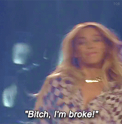
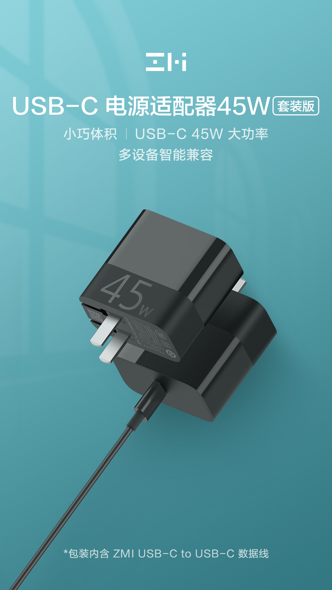
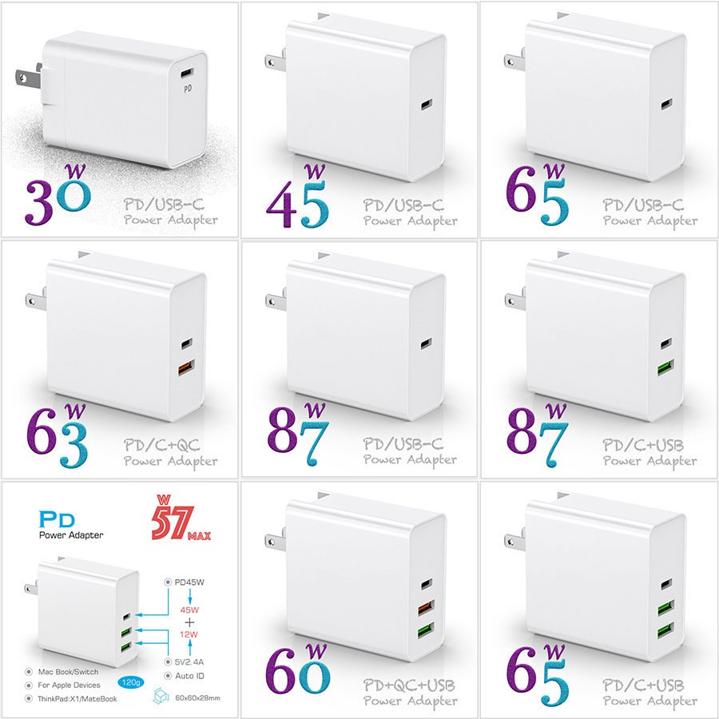
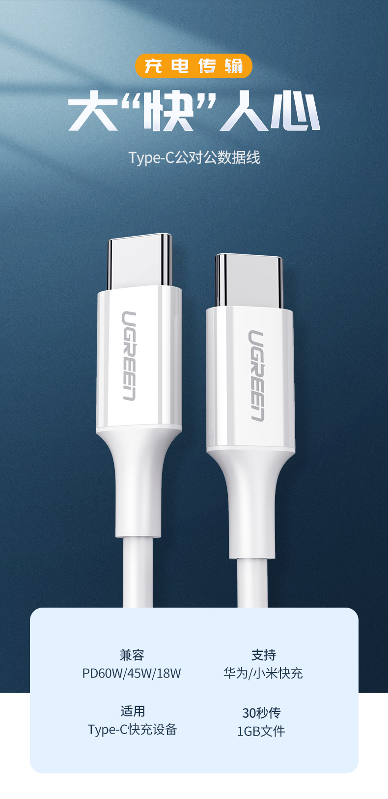
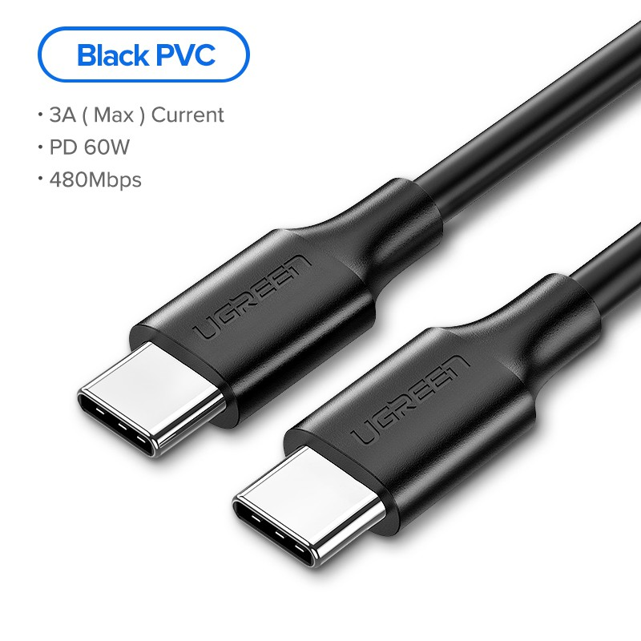
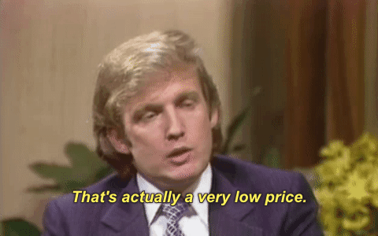

If you are thinking of buying and shipping from Taobao - STOP. Don't do it. We no longer recommend buying from Taobao for one simple reason. COVID-19 made shipping from Taobao or third-party forwarders very, very expensive. The Taobao vs Shopee comparison just got a lot fairer.

## Prices for Taobao Shipping Increased 20-40%

### Shipping Prices Increased

The cost of shipping has gone up at least 20-40% compared to the last few years. You can see this from 3 examples.

- _MRC’s_. In 2017 his services were around S$93 for 1cbm, which was
  super cheap. Fast forward to 2020, he is now charging S$160 for 1 cbm, which is an _increase of 72%_.
- _Sfinex_. They used to charge ￥36 for the first 1kg for sensitive
  stuff, now they charge ￥48\. It’s an _increase of 33%_ .
- _Ezbuy_. Ezbuy raised their currency conversion rate (RMB-SGD) and
  their economy shipping fees also increased to be about the same as Cainiao. Ezbuy didn't increase by that much
  though.

Others like Princess, Peeka, and Oops also raised their prices. With COVID-19 impacting all industries it's impossible to maintain their prices, so it's not like they're profiting either.

### Taobao Prices Increased

Prices on Taobao are creeping up as well. We wrote a post on this previously and the point still stands. [Taobao is not rock bottom in prices anymore.](https://btonomics.com/shopping/be-careful-taobao-isnt-that-cheap-anymore/) _Taobao is not rock bottom in prices anymore._

## Prices on Shopee are Very Competitive

Shopee's prices are very competitive. They've sales every other day, be it 11.11, 10.10, Christmas Sale, Electronics Madness, etc. Shopee gives out cashback coupons everyday, although you can only use it on stuff that have the cashback label. Many sellers on Taobao also sell on Shopee. Most importantly, Shopee items are generally available for free shipping. Even the stuff that ships from China comes with free shipping. Often times you can just buy 1 or 2 items and it comes to you for free. Now this is not truly free, because the sellers marked up the prices to account for shipping, but the shipping is almost always cheaper than what you can get when shipping via Taobao or third-party forwarders.

## Taobao vs Shopee Prices

### Comparison #1 - Laptop USB-C Charger and Cable

Take for example a laptop usb-c charger and cable.

#### [Zmi Taobao Official Store](https://detail.tmall.com/item.htm?spm=a1z0d.6639537.1997196601.15.6e9d748402b3el&id=626064487501) {' '} - About S$23

If we were to buy a Zmi charger+cable (which makes good quality OEM for Xiaomi) charger for ￥89, we'd still have to

- Pay for shipping thereafter, which could cost another S$4-5.
- Pay a slight 3% fee to use Alipay.
- Key in details for shipping (if shipped through third-party forwarders).
- Wait to process the item (if shipped through third-party forwarders).

 _Zmi charger and cable_

#### [Shopee Generic Charger](https://shopee.sg/product/122625627/6210380469) - About S$21

In comparison, we bought this charger from Shopee for S$20.59\. It's unbranded but appears legit. It reached us within 5 days. We also redeemed our existing Shopee coins, although that's not really a good indicator (because you should always consider deduct cashback from the item you earned it from). The best part is that if the item didn't reach us or arrived damaged, we can still request a refund or replacement. In contrast, by the time Taobao stuff reaches you it's too late, the buyer's guarantee would've expired, or you'd need to spend more money to ship that replacement item again.

 _Shopee Charger_

### Comparison #2 - UGreen USB-C Cables

#### [UGreen Taobao Official Store](https://detail.tmall.com/item.htm?id=563445734527&spm=a1z09.2.0.0.3b702e8dy7WQkn&_u=e2m1h1uh1ff4) {' '} - About S$6 to S$7, depending on how the cost averages out with your other items

 _A good cable for laptop charging._

#### [UGreen Shopee Official Store](https://shopee.sg/UGREEN-60W-USB-C-to-Type-C-Fast-Charge-Data-Cable-i.64922680.2189068994) {' '} - About S$7 to S$8 (depending on cashback vouchers you use)

(Can't be sure if they're the exact same cables, because the Shopee listing doesn't provide a lot of details. But they're at least very similar, with several laptops supported.)
 _Almost the same cable_

## Taobao vs Shopee: Shopee Gives Similar Prices for Much Less Hassle

We're not saying Shopee is always cheaper or better in quality. That's not true - our charger from Shopee is unbranded. But Taobao is no more the cheapest around. In fact, Shopee is cheaper for many items, especially when you only want to buy 1 or 2 pieces. 

## So, When Should You Buy From Shopee?

Buy from Shopee when:

- You want it faster.
- Taobao is not much cheaper.
- It's something more expensive and you need some guarantee for damaged items.
- You want to buy many items in small quantities and individually.
- It's an electronics part, because often you need to ship from Taobao via expensive sensitive shipping.
- You already do a lot of shopping on Shopee.
- You're already familiar and can get vouchers on Shopee.

After note: If you don't have a Shopee account then consider doing us a favour and using our [referral link ZACCZ222](https://shp.ee/gfgu543?smtt=0.0.10) to get $10.00 off your first purchase. Much appreciated!

༼ つ ◕*◕ ༽つ    ༼ つ ◕*◕ ༽つ    ༼ つ ◕*◕ ༽つ    ༼ つ ◕*◕ ༽つ
