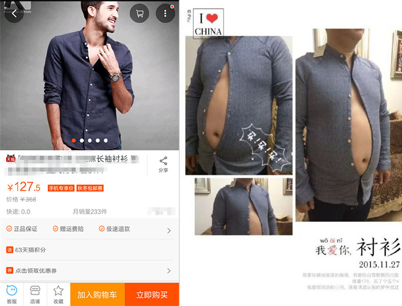

When you buy a house, naturally you'd find that "money no enough". The question on everyone's minds nowadays therefore is whether you should buy furniture from Taobao or Ikea. This guide helps you to break down this decision so you can learn from our experience.

## Buying from Ikea and other physical stores

_Let's go shopping, she said._

Ikea, Sungei Kadut, Gain City, and Big Box are probably the first places you should try furniture shopping if you don't know what you want. These were all very convenient places for us to access. Ikea is a good place to be at, in terms of getting ideas and looking for cheap stuff. They are also one of the pioneers locally in all things Scandinavian-themed and with clean designs.

One problem Ikea has is it doesn't really offer a convenient way to build up your house, as many things require assembly yourself, or pay a huge fee for assembly by their designated contractors. The quality for many of their stuff is problematic. For example, try not to buy their taps, roller blinds, and cheap wood furniture, because those have many complaints online about their poor quality. You rather spend a little more to get a lasting piece.

For us, we started shopping for furniture way before we collected the keys. We visited Ikea a couple of times to get ideas, but those weren't really serious in terms of getting measurements and making sure the spaces were accurate.

My advice if you are a new homeowner and wanting to start out, would be to start with Ikea, check out what interests you, and head to Gain City to see if there're any things that could be had for cheaper (unlikely).

**TL;DR - Ikea sells really cheap items with great designs, so you can't really go wrong with it. Start with them first. But don't buy cheap wooden stuff there.**

## Buying from other local stores

We tried many other local stores but didn't see the need to take pictures there - those places didn't have what we wanted.

We visited Sungei Kadut furniture stores like Scanteak, Star Living, Zen Tradition, Nova Furnishing, and some random smaller outlets. Those were quite alright, the designs were fine but nothing fantastic. We found their designs either very dated (_opiang_), sub par quality, not worth the prices, or just ugly. Go for Scanteak if you want dark wood pieces and Star Living if you need sofa options at a lower price.

Gain City also sells furniture at their Sungei Kadut mega store. You can try to get their appliances and furniture, but I wouldn't recommend it. Their stuff aren't cheap even though they claim to be. You can try their BTO group buys, but again, the value lies in their one shop service, not prices. (The group buy sessions are only good for the credit card rebates and vouchers if you spend in the thousands.)

Comfort Design Building is also decent, but their designs were lacking and some of their furniture felt like they weren't of great quality. But they still seem to be quite a good balance among price, design, and quality considerations.

Big Box was alright in terms of their quality of furniture as well, although their prices were very expensive. You'd think they're cheap, but they're not.

**TL;DR - Go to Gain City if you're feeling lazy. Otherwise, skip everything here, nothing worth looking at.**

## Buying from local online shops

We also checked out online stores like Castlery and Fortytwo. My advice is to skip both. We checked Castlery and went to their warehouse sale. The designs are decent, bordering more on an industrial look, but the prices are absolutely insane. For the same prices, you can get several pieces on Taobao or Ikea. The latter has a reputation for carrying items that are similar to Taobao and having the same issues with quality control. My sense is if you want to cut costs, just go direct to Taobao, and if you're keen on getting quality items, then pay more for furniture at physical stores where you can actually see the items before purchasing them.

There're also other options like Lazada, Qoo10, and Carousell for appliances. These are good for the electronics or devices that you need, like hoods, hobs, routers, storage, and heaters. For Lazada, [sign up for the Liveup trial to get that extra 5% rebates](https://member.lazada.sg/liveup/liveup-introduce/). If you use Qoo10, install the app to [collect your q-ticket and spin the roulette every day to build up your Q-money](https://www.qoo10.sg/gmkt.inc/Event/qchance.aspx), [buy $100 gift cards at $97 to get 3% off](https://www.qoo10.sg/gmkt.inc/MiniShop/?sell_cust_no=KC9nCHN%2BzgZ9NBgy0dPpVQ%3D%3D&global_yn=N), and wait for times when there're coupons and sales to really maximise those discounts. When it comes to Carousell, you can try to negotiate a lower price and buy something that's in warranty and in very good condition. But of course, [don't be a low EQ buyer and lowball sellers](https://forums.hardwarezone.com.sg/eat-drink-man-woman-16/many-carousell-users-just-have-damn-low-eq-5275284.html).

**TL;DR - Buy your electrical appliances, including fridges, machine machines, and water heaters online. Sign up for the Lazada Liveup trial if you can. You can save a ton provided you've the correct coupons/codes. Skip Castlery and FortyTwo unless you really want their stuff.**

## Buying from Taobao

_Taobao is a furniture shopping haven._ There're many ways to get stuff from there. I had to do a lot of homework and research. Before I started this journey I thought that I was going to use Ezbuy Prime and just ship everything to myself using the $2.99 flat shipping rate. Basically Ezbuy's Buy-For-Me service.

But we ended up not doing that, for two reasons. First, Ezbuy really dug itself into a hole when it got into a huge quarrel with Taobao. It was a fight it couldn't win. It ended up getting its service suspended. Second, it is not exactly cheap. Although they advertised the shipping as being only $2.99 under Ezbuy Prime, some forumers on HWZ rightfully pointed out that Ezbuy earned big on the currency exchange. Instead of a 4.8 exchange rate, they charged around 4.1, and they pocket the 0.7 difference. This works out to a hefty fee. That said, they did serve a purpose, mainly for people who wanted a fuss free experience and/or people who had too poor a command of Chinese to even shop online.

There're also other services like [Peeka](http://www.peeka.com.sg/), [Oops](https://www.oops.sg/), and [SGShop](https://www.sgshop.com/), but these are also broadly the same in concept. You pay more for the convenience of not having to buy the stuff yourself. In our opinion, avoid these to save money. And there are many people online who [rail against these services](https://forums.hardwarezone.com.sg/eat-drink-man-woman-16/ezbuy-trouble-5726361.html).

_You might end up like this guy shopping on Taobao ([source](https://www.duchinese.net/blog/18-buying-things-on-taobao))._

Taobao offers you a ton of designs, many designer replica/inspired pieces, at a very low price. Oftentimes, you can also find higher quality stuff there because the Chinese appear to be very into high quality wood. It also saves time going to physical shops to compare prices. Like I always tell PQ, the prices there are absolutely cut-throat and the sellers are very service-oriented, because anyone anywhere in China can offer a competing product that is identical in most ways. Taobao is as close to a free market as possible. If Chinese shoppers (who don't have as much purchasing power as you) decide to buy from more expensive sellers, you can be sure the product has its merits. If you go to Castlery or Scanteak, you can't really be sure whether they're ripping you off, because there's a lack of information.

But buying from Taobao requires a lot of spare time, commitment to saving money, and a risk-taking attitude to do this. There is a ton of products to choose from, which makes life very hard, because you're never sure whether what you're supposed to find. You can save a lot of money, but the cost is in time, effort, and risk. There's barely any warranty - if the item is broken/spoilt you need to ship it back and forth. Your stuff might get lost, [like what happened to us](https://btonomics.com/shopping/taobao-missing-item-how-shipper-lost-parcels/). [You also need a good command of Chinese to communicate with sellers](https://btonomics.com/shopping/taobao-tips-faqs-shopping-shipping-taobao/#cant-read-chinese) (unless you get a buy-for-me service).

## Too Long; Didn't Read

**Buy as much as you can from Taobao. But only if you've the time to spend, can write Chinese (or get a buy-for-me service like Oops), and don't mind imperfect items. Which describes most young couples doing up their first BTO home.**
