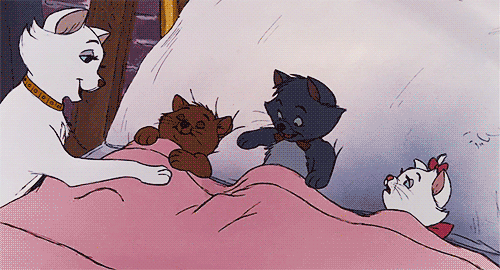
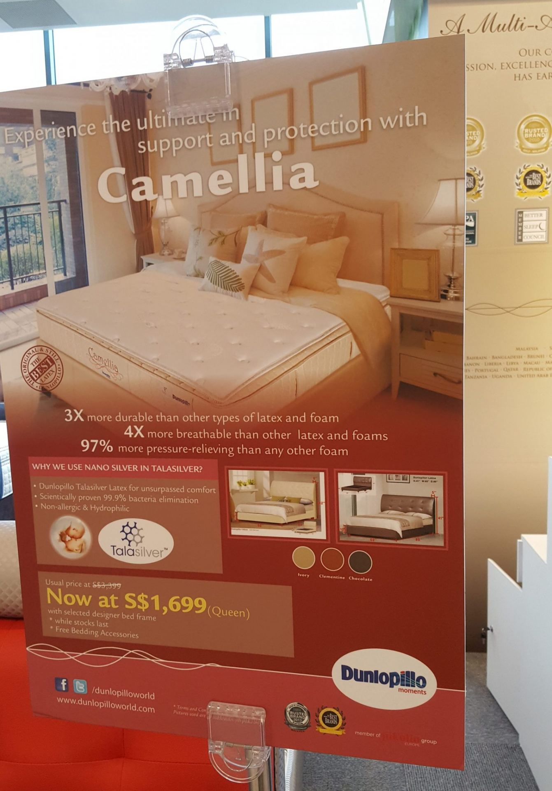
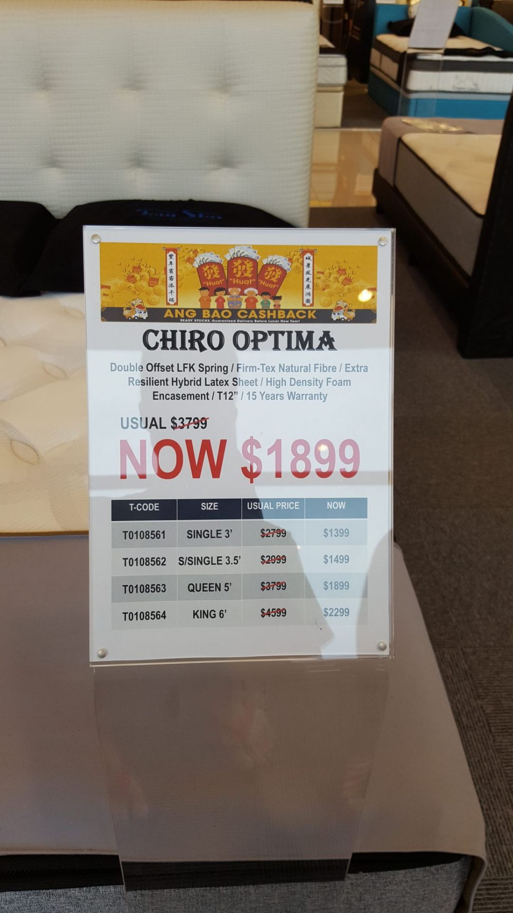
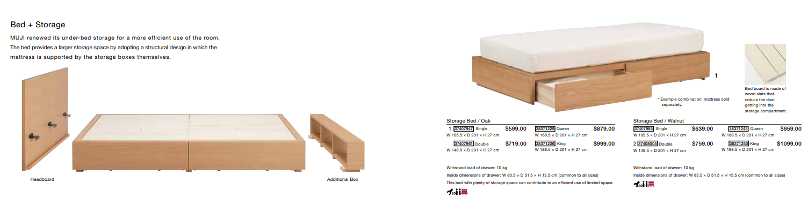

Many say the bed is the most important piece of furniture in the house because that's the one you spend the most time with. I don't disagree, but I think there needs to be a limit to how much you spend on it. I could always get a proper bed at a low cost, then replace it when it wears out. For us, cost was always going to be a huge consideration when we were buying our bed.

My current bed is one which I was very pleased with. It's a super single King Koil mattress that hasn't sagged since I first used it almost a decade ago. PQ uses a Sea Horse mattress that we bought 5 years or so ago. It has held up the entire time and remains one of our best buys.

---

## Mattress

### Traditional Brands

This process of buying a large and expensive bed is new for us. We did a lot of research to find out how people choose their beds. There're the standard brands like King Koil, Sealy, Tempur, Simmons, Slumberland, Dunlopillo, and Malaysian brand MyLatex. The prices vary. I have heard from friends and saw reviews online that prices for these branded mattresses can go past the SGD 5k to 7k mark. That is pretty crazy to be honest. We went to Gain City, Big Box, and smaller retail outlets at IMM to check out the beds. You can test the beds at physical stores, which is something you cannot replicate at online stores.

On the other price spectrum there were the cheaper brands, like Sea Horse and Inkagu. The Inkagu Shinju series is barely SGD 600-700, so it's definitely much more affordable. The Sea Horse is in a similar price range.

To be frank, we didn't really feel that much of a difference between expensive and inexpensive beds. I suspect most people are like that. The very basic difference we could tell, which are your firm and soft beds. Beds which were too hard were uncomfortable. We sank in those beds as they were too soft. That was a bother as well.

_This is probably the right amount of sinking in._

Apart from that, we couldn't really tell what made a SGD 5k bed that much better than a SGD 2k and 1k bed. I suspect beds provide very low marginal utility past the 1k+ mark. But of course that is quite personal and people with back issues and weight problems might have more to worry about. I have read somewhere that some brands do work for those with back injuries. We're both very light, at less than a combined 120kg, so I doubt we will have to worry about the bed sinking in any time soon.

There is also the marketing aspect. We saw many beds adding the 'chiro-' tag to their brand or mattress model, and presumably charging a premium. It's probably similar to your typical superfood marketing. It is unclear whether the manufacturer's claims actually exist beyond marketing slogan or brand name, or holds up to scrutiny.

### Online Brands

In recent years, the market seems to have seen many online brands that have popped up. I think the trend originated from the US, where there has apparently been a huge backlash against the large traditional mattress makers and their profit maximising ways. Locally, Noa sleep and Baton Sleep come to mind. (I chanced upon Haylee, but it was by accident and I don't think they've gained any traction.) They all seem to have the same type of Wordpress-inspired website designs, with the same types of reviews. The way they deliver mattresses are also identical. The mattress is always compressed and the air sucked out. They seem to advertise on the basis of cutting out the middle man and selling direct.

There are other online retailers like Hipvan and FortyTwo, but they seem more like furniture shops dabbling in mattresses rather than specialising in the area. I also saw someone sharing his experience buying a whole bed from Taobao. While I am a huge Taobao fan, frankly, that's not somewhere I'd want to go. I doubt Taobao sellers deliver their mattresses compressed, and if the mattress doesn't fit in the lift, few last mile delivery guys would carry the mattress up the stairs for you.

---

## Bed frame

We considered many options for the bed frame. Many beds come with free bed frames, but there are others which do not. For example, a Dunlopillo mattress we saw at Gain City came with a free bed frame that came in a faux leather finish. Honestly, most of these free frames look terrible and if you do opt for them you need to really be careful with the selection process to make sure the frame fits your theme.

_I don't think it'll light up any homeowners' eyes when they see this faux leather finish._

_I don't think this works either.._

We thought about getting a frame from Taobao or Ikea. But I realised that their frames are designed for larger mattresses that're standard in their home countries. For example, the Chinese size is 200 X 150cm, whereas the Singapore standard is 190 X 152cm. So those were out, unless we buy their beds. We didn't want that. We also considered Castlery and FortyTwo; the former was ridiculous in its pricing whereas the latter was lacking in its designs. There was also Muji, but theirs was also too expensive - the prices might look cheap in the catalogue but that's because they didn't add all the component parts like the headrest into the final cost. That sucks, because their stuff as usual is very nice.

_I thought it was very cheap, turns out that was only for the storage part ([source](https://www.muji.com/sg/img/pdf/2017Household_July.pdf))._

---

## Mattress scams?

To understand why you shouldn't pay a fortune for your bed, see this video:

<iframe
    src="https://www.youtube.com/embed/rvlA9UxGvSg"
    width="560"
    height="315"
    frameborder="0"
    allowfullscreen="allowfullscreen"
></iframe>

It's about the mattress industry in the US, but should definitely be applicable to the Singapore market as well.

## Choosing and buying our bed

We ended up choosing between the Inkagu and Baton Sleep. The prices were really attractive, especially the former. We eliminated the Inkagu immediately once we were at the showroom at IMM. The salesperson, who was an old uncle, was just not interested. I recall some of the pieces on display also weren't the Shinju mattresses we wanted to buy. I think it was the Asiana mattresses. So weird that they carried Picket and Rail stuff more than their own brand.

### Why Baton Sleep?

The Baton Sleep mattress we thought was pretty decent and we eventually bought it. KJ/QQ bought it and were pretty happy about it. That recommendation was key to our decision. We went down to Comfort Design building to have a look and feel the bed. We found the regular version too hard. It made sleeping quite painful for our backs after a while. We tried the hybrid version and it felt right.

Baton Sleep also has a money-back guarantee after delivery. This assures us that we won't be locked into using a terrible product. As icing on the cake, we were lucky to buy the bed when there was a SGD 100 Chinese New Year promotion.

The only drawback about the company seems to be the reviews. No images, just flat out a few liners each saying how wonderful the beds are. Either they make the world's best beds, or they only pick the best reviews to show. I also have my reservations about getting Xiaxue to be their brand ambassador. If I buy it, it definitely won't be because Xiaxue endorsed it. They should be asking me to be the ambassador instead haha!

_Make me ambassador._

HWZ seems to be negative about similar companies, especially Noa Sleep, but there doesn't seem to be negative reviews on Baton Sleep. Before buying, I emailed them asking _duh_ questions on VOC and delivery dates. They were prompt in their replies to say their beds are certified safe, as [they are accorded the Certipur-US certification](http://certipur.us/list-of-participating-companies/). They also said they allow free storage of up to three months, so that's good if your house is not ready like ours.

On the bed frame, we went with the storage bed option from Baton Sleep. It fits very nicely with our gray theme. The pricing was very competitive as well, probably due to it being fabric.

## The morning after

We just published our [honest review for our Baton Sleep bed and storage bed frame](https://btonomics.com/honest-reviews/baton-sleep-review-good-bed-value-money-bed-frame/), which have been pretty good and good value for money! But the installation kind of sucked though. It took them several rounds before they did it properly. If you're interested in Baton Sleep, or to a lesser extent Noa/Haylee you should definitely check our review out. The online retailers all seem to be very similar to one another. Our experience will probably help you out in one way or another.
