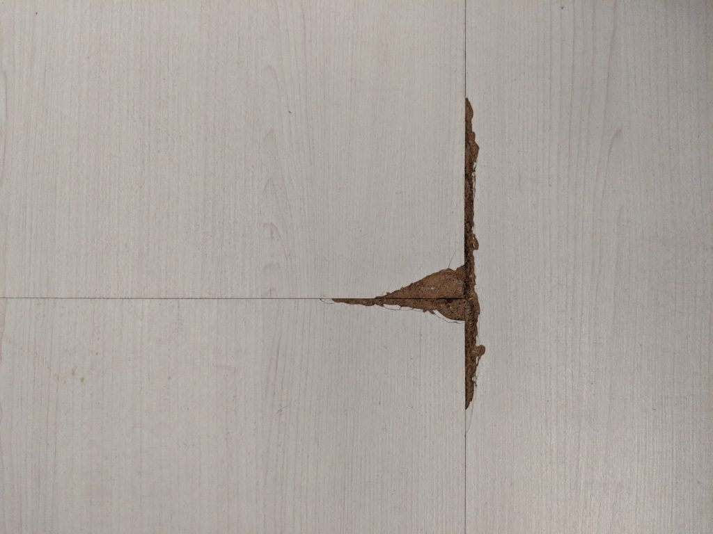

## Context

[After our decision to use the Luxurious Resilient Flooring from FloorXpert throughout](https://btonomics.com/shopping/choosing-vinyl-tile-laminate-or-cement-flooring-for-btos/), we had to get into the installation of vinyl flooring for our BTO.

## We should've read up more on flooring when we started out

When we started out we didn't know anything. We didn't know what we wanted or what we disliked. This was probably because flooring wasn't some sexy and important thing to us when we thought about our new home. We were just focused on getting a home. When it came to flooring, we only had a "oh HDB tiles ah quite shiny hor so cool" reaction when we went to new HDB BTO flats. You know, the beige tiles that comes with most flats.

  
_No, this is not the type of vinyl flooring we need..._

Because of our lack of knowledge, we initially found it difficult to choose how we wanted our floor to be done. This was the case during the HDB BTO flat selection process. In particular, the two of us didn't opt for the Optional Component Scheme (OCS) flooring from HDB because of a mistake. I didn't know that you could opt for some parts only and I really thought it was an all-or-nothing choice. When we went to meetings with IDs and contractors, we also weren't really sure about all the options available to us. We just went along with our gut feel most of the time.

On hindsight, we were lucky that we didn't really miss out much. It turns out that those who opted for flooring had many defects when it came to taking over the flat. Scratches, problems with the grout, uneven tiles, etc. The defects take a long time to resolve as well, which delays your renovation plans. So it probably was a blessing in disguise that we opted out of OCS and didn't take the flooring from HDB, since [we eventually still got the goodwill cement screeding by HDB](https://btonomics.com/renovation/having-hdb-do-cement-screeding-for-our-bto-home/). And by the time we evaluated the different proposals from the IDs, we already had a good idea what we wanted.

  
_We were as happy as him to dodge a bullet by not taking HDB tiles..._

In the end, we compiled the pros and cons of the four major flooring options common to BTOs. A disclaimer though, this was written with our preferences and biases in mind. Some may prefer stones or hardwood for their flooring. Those are very good options as well, they just were out of our budget, usage, and design preferences.

## Tiles

There're many different types of tiles. For BTOs, you're probably looking at 2 types - porcelain or ceramic. Of these two, you can further split it up into 4 kinds of tiles:

- Full Body Homogeneous Porcelain Tiles (whole tile has the same colour and texture)
- Half Body Homogeneous Porcelain Tiles (same colour and texture only halfway down)
- Glazed Porcelain Tiles (coating on the surface of the porcelain body digitally printed)
- Glazed Ceramic Tiles (coating on clay ceramic body).

  
_An example of homogeneous tiles in action ([source](https://alecbuchan.com/dream-kitchen-kitchen-design-trends-2018-19/))_

Without concerning ourselves with the small details, you typically get porcelain if you need something harder, splash a lot of water on it, or place heavy stuff. You get ceramic tiles if you need something cheaper and if it's going to be dry. Homogeneous tiles are very durable, so that's why most IDs or contractors will offer you that. And that's what most people will choose for BTOs.

### Advantages of homogeneous tiles

- **Great looks**. You get to have a huge variety of designs and they are pretty. It's not like the other options aren't pretty, but there are so many designs and textures you can play around with.
- **Durable**. Homogeneous tiles are quite durable and resistant to wear and tear. They are also relatively low maintenance and can be easily wiped.
- **Water resistant**. You should have no fear of puddles of water around.
- **Doesn't warp**. This also means the tiles don't warp like wood.
- **No Volatile Organic Chemicals (VOCs)**. Tiles generally don't come with VOCs, unless something is seriously wrong.

### Disadvantages of homogeneous tiles

- **Grouting**. This is probably chief to the concerns of many people. Grouting is the line in between tiles, and they can turn yellow/brown. It's a huge problem with tiles for many people because they tend to look dirty after a while. And it's not easy to clean it up, because sometimes the more you try to scrub it the worse it gets. But of course there're ways to clean that up, as shown below.
- **More expensive**. You'll need to pay for cement screeding as part of the cost of laying tiles.
- **Uncomfortable**. Can be cold, especially when you turn on the aircon. And because it's so durable it can be hard and not comfortable to walk on.
- **Difficult to install**. It's hard to install because you need a tiler to do it, and the durability of homogeneous tiles make it hard to handle as well. But it's not a huge problem, you still get someone to do it for you.
- **Tiles can crack**. Tiles can suddenly be ripped across your flooring. [There was a cold spell at the end of 2017 which might have caused HDB tiles to pop out or crack](https://www.channelnewsasia.com/news/singapore/floor-tiles-explode-at-hdb-flats-across-multiple-locations-in-9860662), so it's not like an impossible occurrence.
- **Difficult to replace**. And when tiles crack, you'll need to get a tiler to replace the broken ones, unlike vinyl flooring where you can 'plug and play'.

<iframe
    src="https://www.youtube.com/embed/orJVJKfPovE"
    width="560"
    height="315"
    frameborder="0"
    allowfullscreen="allowfullscreen"
></iframe>

## Vinyl flooring

Vinyl flooring is "artificial composite flooring" that's hardy. Unlike wood, concrete, marble, or granite, it doesn't occur naturally. Some people have claimed that vinyl flooring originally wasn't meant for use in homes, mainly for public areas where people walk in shoes, and apparently it's because vinyl emits some toxicity or harmful emissions.

In fact all polymers (including PVC) can leach harmful toxins if it is poorly made. And this not to say that only vinyl suffers from this, because as what we wrote below laminates can also have harmful emissions, since they are wood fibers pressed together using resins. Coating (like varnish) on hard wood is also susceptible.

The quality of vinyl is incorporated into its price. The cost varies from the typical cheap Chinese ones which can cost like SGD 3.50 psf, to expensive ones which cost SGD 6.20 psf, e.g. from Belgium-made [Luxurious Resilient Flooring (LURF)](http://www.floorxpert.com/vinyl-lurf/) from FloorXpert or the US-made [High End Resilient Flooring (HERF)](https://evorich.com.sg/products/indoor-flooring/evo-herf/) from Evorich. (**Note**: not referral links) IDs and contractors don't always explain these things when they offer you vinyl flooring, so there's a real need to ask and clarify.

  
_An example of vinyl flooring ([source](http://www.floorxpert.com/a-natural-choice/))_

It is not always the case where expensive = good. But in this case there is truth in this saying. It's very hard to buy cheap and good. If you're really hardcore you could even try to buy from Taobao, but what's the point?

### Advantages of vinyl flooring

- **Easy maintenance**. Vinyl flooring is low maintenance and hassle free. It's durable and can last 10 to 20 years, although that depends on the quality of the vinyl flooring itself. The good quality ones should last a damn long time. The proof is in how the high end suppliers can offer 2 decades worth of warranty. We got a shock when LURF flooring came with 20 years warranty.
- **Resistant to stains and scratches**. Higher end vinyl flooring typically has stain and scratch resistance, which can make your flooring last longer.
- **Waterproof**. It's also water proof unless your installer sucked so bad and messed up.
- **Doesn't warp**. This also means the vinyl doesn't warp like wood.
- **Comfortable**. Vinyl flooring doesn't get cold even when it's cold so it's very good for bedroom flooring. And it's softer for your feet than wood or tiles, especially because vinyl flooring can come with a padded underlay.
- **Cheaper**. Vinyl flooring, even premium ones, is less expensive than equivalent premium flooring like stones.
- **Good for overlay**. If you already have cement flooring (e.g. you got free/cheap cement screeding), vinyl flooring saves you money because you can just overlay on top of the cement floor.
- **Easy to install**. Vinyl flooring is easy to install, although this shouldn't be a top consideration because it's not like we're doing it ourselves anyway.

### Disadvantages of vinyl flooring

While vinyl flooring is low maintenance and highly durable, there are some disadvantages, mostly due to low quality vinyl products.

- **Can emit Volatile Organic Chemicals (VOCs)**. Vinyl flooring can sometimes emit VOCs, although the high quality ones are certified to have minimal emissions. VOCs can have an undesirable health impact.
- **Cannot recycle**. Vinyl flooring is non-biodegradable. For an environmentally conscious being of the world, it's quite bad to contribute to the plastic crisis.
- _[Disadvantages specific only to low quality vinyl flooring]_
    - _Chemical staining_. Some vinyl flooring could be discoloured if it is rubbed with rubber. But the chemical reaction doesn't happen in a short time and the rubber must stay in the same place for some time to effect.
    - _Yellowing_. Vinyl flooring might yellow over time. Getting hit with direct sunlight can 'fade' the material. Dirt can become stuck underneath a wax layer of the vinyl flooring, which can discolour the material.

## Laminate flooring

Laminate flooring is flooring that's made from composite wood pressed together. It typically looks quite like vinyl flooring, at least to us.

  
_An example of laminate flooring ([source](https://www.bestatflooring.co.uk/p/kronotex-robusto-rip-oak-d3075/))_

If you're confused about the differences between vinyl and laminate flooring, perhaps this video would best explain the differences. To a layperson though, just know that it's same same but vinyl is probably better.

<iframe
    src="https://www.youtube.com/embed/a10fW_ri9RM"
    width="560"
    height="315"
    frameborder="0"
    allowfullscreen="allowfullscreen"
></iframe>

### Advantages of laminate flooring

- **Nice wood grain**. It offers wood grained designs for flooring. Although it might look more artificial than hardwood, it can still give your room a wooden feel at a fraction of the cost.
- **Easy to install**. It's easier to install, relative to stones or hardwood.
- **Comfortable**. It's soft to walk on and doesn't get cold either.
- **Good for overlay**. Similar to vinyl, laminate flooring also saves you money because you can do an overlay on top of your existing floor.
- **Easy to install**. Laminate flooring is not hard to install. But again, it's not like you're going to bend over and start installing the laminate pieces piece by piece.

### Disadvantages of laminate flooring

- **Easily damaged by water**. Laminate flooring can't stand water or moisture, so you can't have pools of water lying around. That includes having wet feet when you come out of the showers, which sucks for guys because leg hair always traps the water in the showers only to trickle down when you're in the room.
- **Hard to clean**. It's hard to clean the floor well, because you can't use too much water.
- **Weak**. It's not very durable and can be chipped easily.
- **VOCs**. Some laminate flooring also emit VOCs or contain dangerous chemicals like urea formaldehyde. But it must be said many suppliers nowadays advertise their low emissions and how the laminate flooring doesn't contain formaldehyde.

## Cement flooring

When we began, I had an inclination towards cement flooring. Kind of like the floors in primary and secondary schools quite some time ago or Army camps. And it would be the cheapest, because it's just having adding a layer of epoxy to the cement screed, which we'd have for free from HDB.

  
_An example of concrete floor in a home ([source](https://www.pinterest.com/pin/209698926375749089/))_

But then we quickly cooled on that idea. There were just too many disadvantages.

### Disadvantages of cement flooring

- **Inconvenient to redo coating**. You need to redo the epoxy coating every few years. However, some say that's for industrial standards and for homes you can last 20 years with it.
- **Easily cracked and chipped**. Cement flooring chips or cracks easily after some usage. You can easily see this in schools and Army bunks which still have this. It'll be hard to fix once the cracks start appearing.
- **Uncomfortable**. Cement floors are quite cold to touch, which is fine if you are always warm or wearing shoes. But it might be a big problem if you believe the Chinese medicine school of thought that these floors transmit undesirable 寒气 into your body. And it's just not very comfortable to stand on, with it being so hard. If you drop your phone it will probably shatter immediately.
- **Moisture is a problem**. If improperly sealed on top and bottom surfaces, the cement might be penetrated by moisture. Stains will stay there.

## We chose vinyl flooring in the end

We never considered laminate flooring. I've had a bad experience with it in my current home. After some time there was a hole in the laminate floor, possibly because it was weakened by water, right around where one of the chair legs was always at. The hole eventually widened and the adjacent tiles also started peeling off. The material that was exposed felt like fibreboard and is soft to touch, which is what you'd expect from pressed wood. Overall, you'd find that laminate flooring is around the same price as vinyl flooring, which does not have many of these disadvantages while still retaining the same look.

  
_The hole in my room's laminate floor that peeled._

We briefly thought about going for cement flooring because it seemed like a low cost, fuss-free kind of flooring that suited us. But we soon ditched that idea. We really didn't look forward to redoing the epoxy coating every few years. In addition, we weren't very keen on having giant cracks and chips on the cement flooring. If your coating is not done well or if it wears off, sweeping and mopping is going to be hard. It seemed harder to maintain cement flooring the more we researched.

So it came to deciding between homogeneous tiles or vinyl flooring. There were two main concerns, safety and price. One big concern we had was VOC. We didn't want to opt for flooring that'd slowly kill us while we're in the house. Or worse, cause cancer or any other ailments. Another concern was the price. Homogeneous tiles (assuming the tiles are SGD 3.20 psf) are generally around double the price of high end vinyl flooring. It was a problem for our wallets if we paid double the price for tiles.

At the end of the day we went for vinyl flooring, i.e. LURF from FloorXpert, throughout the house. On the pricing, we already were quite satisfied, especially since we were able to get goodwill cement screeding from HDB. If we had to pay for screeding ourselves, the choice of vinyl would've been harder to make, since the cost of screeding is not included in the quote for vinyl flooring.

We also checked and LURF flooring has been [certified to have very low emissions](http://www.floorxpert.com/vinyl-lurf/balance/). Shao Jie only offered LURF anyway, but it's worth noting that many IDs and contractors do offer low quality vinyl products. In our opinion, these aren't worth it. We couldn't justify saving a thousand plus dollars but falling sick. At the end of the day we shouldn't be penny wise pound foolish by being a cheapskate and saving a few dollars, only to kill yourself with toxins. And that means where possible avoid Chinese (and even Korean) vinyl flooring.

After choosing vinyl flooring, [the next milestone was to install it](https://btonomics.com/renovation/installation-of-vinyl-flooring-for-our-bto/). If you want to skip that and go straight to our review, [you can do that and see why we think it's a pretty good value for money flooring](https://btonomics.com/honest-reviews/floor-xpert-lurf-review-great-value-money-after-sales-service/).

## **Too Long; Didn't Read**

**We chose vinyl flooring for our BTO - LURF from FloorXpert because it was affordable, safe, durable, waterproof, easy to maintain, and pretty.**
